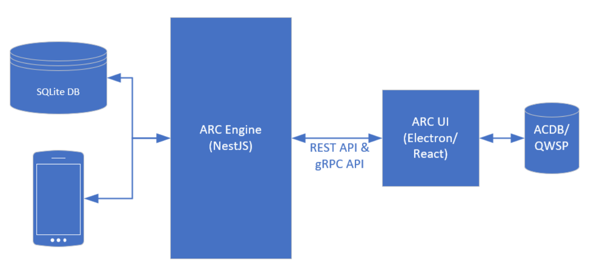
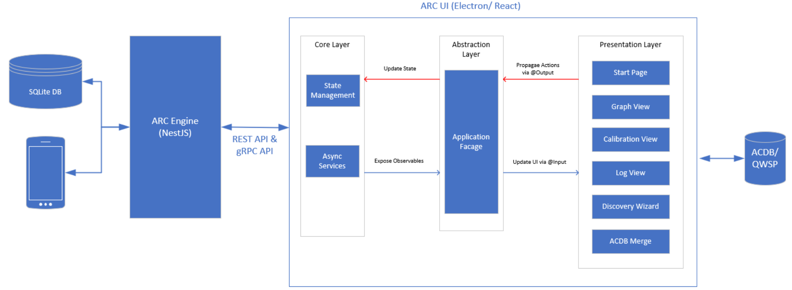
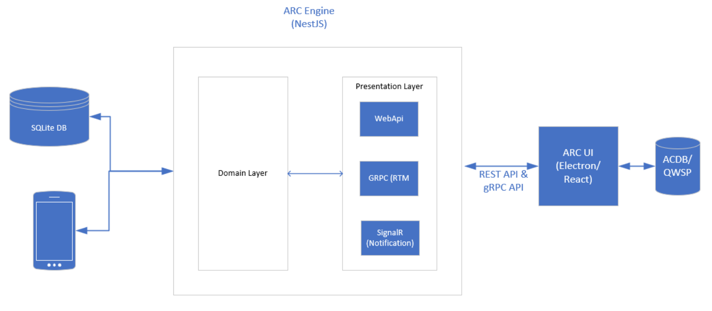

.. _arc_design:

AudioReach Creator Design
##################################################

.. contents::
   :local:
   :depth: 3

Introduction
-------------------

AudioReach Creator (ARC), also known as Qualcomm Audio Calibration Tool (QACT) for older version, is an open source and cross-platform software providing a user interface to audio design, software, and tuning engineers for composing, configuring, tuning, and storing audio graphs into audio calibration database (ACDB) for intended use cases.

Architecture
--------------------------------------
AudioReach Creator (ARC) architecture will contain two separate parts: UI (Frontend) and ARC Engine (Backend).  

	
   AudioReach Creator (ARC) High-Level Software Component View

ARC UI (Frontend)
^^^^^^^^^^^^^^^^^
Frontend will contain all the required user interfaces and will be developed using Electron and React.

	
   AudioReach Creator (ARC) High-Level Software Component View (Frontend)

Presentation Layer
""""""""""""""""""

- React components that handle UI and user interactions.
- Communicates only with the Facade.
- They receive data via @Input() and emit events via @Output().

Major UI Features
*****************

**Start Page:** Entry page of ARC application which will holds buttons to allow users to open file, connect to a device etc.

**Graph View:** After opening a file or connecting to a device, selected usecase's graphs will be displayed. User can modify and tune usecases in Graph View.

**Calibration View:** For a selected module, its calibration data can be tuned through Calibration View.

**Log View:** Will show all log messages for each UI operation.

**Discovery Wizard:** Will provide UI workflow to import definitions for modules and some meta information so that they can be used in usecases. For those modules which are already being used in some usecases, updated module definitions can be applied to usecases automatically through Discovery Wizard.

**ACDB Merge:** Will provide workflow to compare and merge data between ACDB files. This feature will be helpful for users to manage their files between different branches.

Facade Layer
"""""""""""""""""

- Acts as an intermediary between the presentation and state layers.
- Exposes observables and methods to the components.
- Dispatches actions or calls services to update the state.

State Layer
"""""""""""""""""

- Manages application state using a store (e.g., NgRx or a custom service).
- Handles API calls and updates state accordingly.
- Exposes state as observables.

ARC Engine (Backend)
^^^^^^^^^^^^^^^^^^^^

ARC Engine will work as a web server to provide all APIs for Frontend to access/update data from database. It will contain Presentation and Domain layers.

	
   AudioReach Creator (ARC) High-Level Software Component View (Backend)

Presentation Layer
""""""""""""""""""

- Provides web REST apis to handle http/https requests.
- Provides gRPC apis to communicate large size data in real time for high-performance and low-latency requirement (typically used for RTM).
- Provides notification mechanism with SignalR.

Domain Layer
"""""""""""""""""

- Provides services with core business logic and rules to query/update data from/to database.
