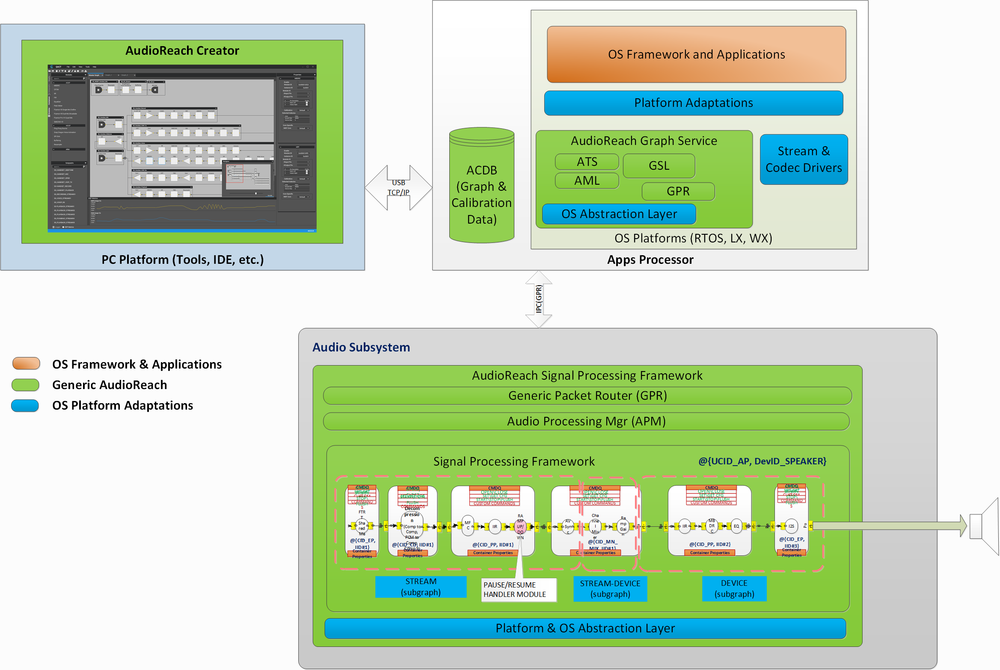

.. _arch_overview:

AudioReach Architecture Overview
##################################################

Guiding Principles
-------------------

Before drilling down into architecture overview, it is important to know the guiding principles which help shape AudioReach design and implementation

* Unified software and software interface leveraged across wide range of hardware and software platforms
* Configurability through data driven mechanisms which minimizes coding effort on the audio application developers
* Extensibility allowing developers plug in their differentiating components(secret sauce) into the framework for realization of use cases  
* Modularity allowing the same solution scale up or down to richer or limited processing environments
* Distributed processing across heterogenous cores, allowing efficient computational load management while abstracting specifies of processing location from the user

Architecture Walkthrough
--------------------------------------
AudioReach is comprised of platform independent and platform adaptation software spanning across host PC and embedded device. AudioReach Creator(ARC), also known as Qualcomm Audio Calibration Tool (QACT), is PC-based software providing GUI to audio system designer for composing, configuring, and storing audio graphs into audio calibration database(ACDB) for intended use cases. In addition to use cases design, tuning engineer can tune the audio processing blocks through ARC and store the calibration into the same ACDB on the embedded device.

On the embedded device, AudioReach offers audio platform software and AudioReach Engine (ARE). ARE comprises Signal Processing Framework (SPF) along with reference algorithms as depicted in the diagram below. Depending on the SoC design, audio platform software usually resides on application subsystem running high-level operating system such as Linux and ARE resides in audio DSP subsystem running RTOS. Audio platform software is consisted of a set of libraries referred as AudioReach graph services(ARGS) and platform adaptation layer.

On many OS platforms, there are already application ecosystem built up based on well-established APIs and audio/multimedia frameworks. In order to meet the ecosystem need, platform adaptation layer is made available to translates platform specific APIs and constructs then calls into graph service.

Graph service provides the service to establish/tear down/operate/exchange audio samples & calibration data with the audio graphs running on ARE. As previously described, ACDB contains the audio graph definition and calibration data. Graph service, upon receiving graph open request from the client, retrieves audio graph and calibration data with use case handle and calibration handle from ACDB and downloads the graph definition and corresponding calibration data to ARE via generic packet router(GPR) protocol over physical or soft data link. On the receiving end, ARE forms audio graph with processing modules according to the graph definition and processes audio data piped from source endpoint to sink endpoint of audio graph.

Note that graph service and ARE are designed to be cross-platform software, platform/OS abstraction layer for different OS platforms would have to be developed in order to provide execution environment for graph service and ARE to run on.

	
   AudioReach High-Level Software Component View

