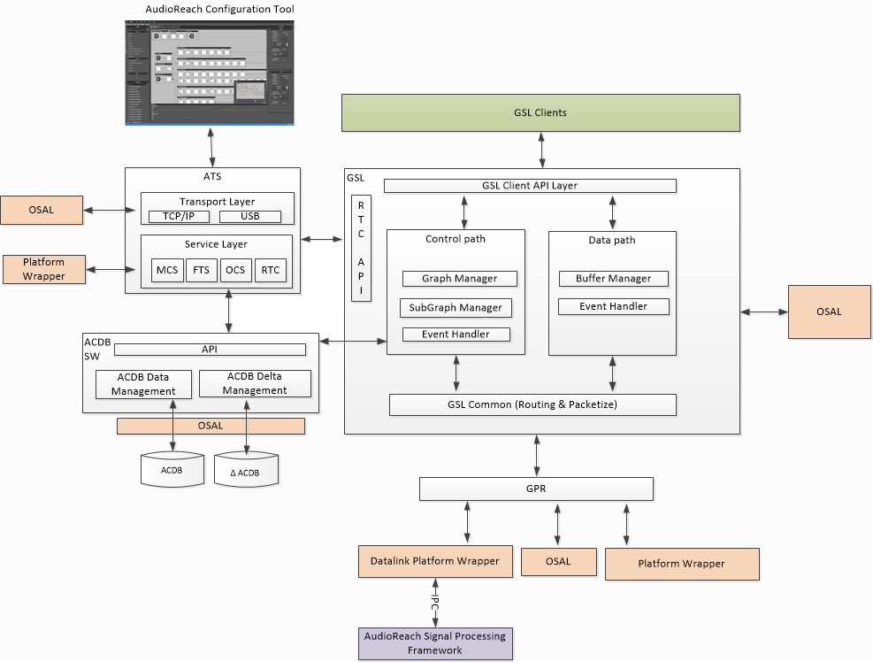

.. _args_design:

AudioReach Graph Services
##################################################

.. _args_introduction:

Introduction
------------

AudioReach graph services (ARGS) are a collection of cross-platform software libraries which together provide following services

Use Case Execution:

- Establish communication channel with AudioReach Engines (ARE)
- Set up and tear down audio graphs running on ARE for intended use cases
- Provide audio data interface to client to exchange audio data with ARE
- Provide control interface allowing client to apply control commands on intended modules in the audio graph
- Apply calibration on the audio graph

Development Workflow:
  
- Log audio samples or module-specific data at different tap point throughout the audio graph
- Perform real time tuning of audio processing modules running in ARE
- Download new calibration data to the device    
- Monitor system and module resource in real time
- Remote start of audio use case on device from ARC

Architecture
--------------

Overview
+++++++++++++++
AudioReach graph services, as depicted below, is consisted of four cross-platform software components: Graph Service Library(GSL), ACDB Manager Library(AML), Generic Packet Router(GPR), and Audio Tuning Service (ATS). These components invoke utilities and obtain platform specific information provided by OS abstraction layer (OSAL) and platform wrapper in order to operate on intended platform.

GSL serves as entry point for client to access functionalities provided by graph service and ARE. Through GSL APIs, client can initiate graph setup, exchange audio data, and operate on the audio graph running on ARE. GSL queries AML with GKV, CKV, and TKV which are passed by the client to retrieve graph definition, calibration, and tagged payload. Then, GSL packetizes retrieved data from AML and invokes GPR to send commands and receive response from ARE. If module running in DSP is capable of generating event such as key word detection, GSL would relay the detection event back to client.

Apart from providing service to client, ARGS also plays a critical role in audio system development workflow. Audio tuning service works as bridge between ARC on host PC and rest of audioreach software running on target. ATS dispatches commands from ARC to various service handlers which interfaces with rest of AudioReach software components to achieve development workflow use cases described in :ref:`args_introduction`. 
   

	
   AudioReach Graph Services Block Diagram
	   
Graph Service Library
+++++++++++++++++++++++

Functionalities
^^^^^^^^^^^^^^^^^

1. Loading and Initialization of  Sub-Graphs and Graphs via Graph Key Vector.
2. Graph setup and Dynamic handling of the sub-graphs within the graph
3. Data Command Management - Read/Write buffers
4. Control Command Management ; Handling Pause/Resume/Start/Stop etc.
5. Calibration (Set Config/Get Config) of the ARE Modules.

Compositions
^^^^^^^^^^^^^^^^

- API Layer: GSL API layer defines and exposes APIs to GSL Clients.  It provides API’s to query graph handle from use-case key vector information and also graph management etc.
  Full List of APIs are listed in :ref:`args_gsl_api`.
- Control path: this layer performs control operations on use-case graphs on ARE. Some of the GSL control operations include graph management, sub-graph management and event handling. Detailed
  explanation of these operations are described in next chapter on GSL structure.

  * Graph management layer: this layer is responsible to perform graph-level operations like open, close, etc on ARE. GSL graph management layer interfaces with AML to get graph definition, module
    configuration and calibration in binary blob format and sent to ARE via GPR/IPC. GSL graph management layer also maintains “state” information for each graph that is currently running on ARE.
  * Sub-Graph Management Layer: this layer is responsible to keep track of the sub-graphs from all use-case graphs that are opened on ARE. This layer implements reference counting mechanism for
    sub-graphs so that common sub-graphs across use-cases shall be handled correctly. In addition each subgraph maintains a list of child subgraphs it is connected to. 

- Data path: this layer is responsible to receive/send audio data buffers from/to its clients. GSL offers various modes for clients to transfer/receive audio data.
      
  * Blocking mode: In this mode, client is responsible for allocating the memory and providing it to GSL in the write/read calls. GSL will copy data from clients memory to its local buffer and indicate
    to client when the data has been copied. Blocking means gsl_write blocks until all the data sent by client has been consumed by GSL (i.e. copied to internal buffer). 
  * Non-blocking mode: This mode is very similar to blocking mode except gsl_write consumes as much data as possible and return immediately. Once there is enough space available in the internal buffer
    , GSL notifies client.
  * Shared memory mode: This mode is similar to blocking and non-blocking modes except GSL allocates memory and shares with client. 
  * Push-pull mode: 

- Event Handling: This layer is responsible to receive events from ARE. Depending on the event received, GSL either takes an action (consumed) within itself or propagates the event to its clients
  using callback functions. Example events are SSR (sub-system restart), EOS (end of stream), and etc.

- GSL Common: Provides APIs to form GPR packet to be routed to ARE.  The packetizer layer checks for routing ID and updates the destination domain in GPR packet such that it will be routed to
  different instance of ARE running on different subsystem.
    
ACDB Management Library
+++++++++++++++++++++++++++
AML provides both get/set APIs to retrieve and adjust data in the ACDB DATA files. It provides data abstractions and organization for how calibration data is to be consumed by its client, GSL.
On device, there are ACDB file and ACDB delta file. ACDB file stores baseline calibration data needed by GSL and ARE in compressed binary form. Delta file contains data set by GSL and ARC during run time.
These files are managed by corresponding file managers as part of AML.

Generic Package Router
+++++++++++++++++++++++
Refer to :ref:`gpr_overview` for high level overview of GPR. 

Audio Tuning Service
+++++++++++++++++++++++
When ARC is connected to device, ARC is considered in connected mode. Communication is established with ATS via supported transport layer such as TCP/IP. Upon receiving ARC commands, ATS routes the commands to responsible service modules:

- Online Calibration Service (OCS): The Online Calibration service allows ARC to operate portions of AML
- Real Time Calibration (RTC): This module will hold all implementations of RTC to get/set data from/to ARE through GSL RTC APIs
- Media controller Service (MCS): This module initiates use cases on-target for advanced tuning features
- File Transfer Service (FTS): This module allows ARC to transfer files such as ACDB file onto the connected device

ATS, beside depending on OSAL for OS related functionalities, relies on platform wrappers to provide platform specific utilities such as TCP/IP connection, playback/recording APIs. 

.. _args_osal:

Operating System Abstraction Layer
++++++++++++++++++++++++++++++++++++
In order to run AudioReach graph services on desired OS platform, OSAL implementation shall provide the following functionalities:

- Signal, Sleep, Thread, Mutex
- Timer 
- Heap allocator
- File IO
- Logging
- Memory operations
- String operations
- Shared memory allocator: There are SoCs/HW platforms which rely on shared memory as primary mechanism to exchange control & audio data between processor subsystems. Shared memory allocator should be implemented to utilize platform-specific APIs to allocate shared memory and provide to graph service components
- Service registry: On systems which ARE runs in assigned process domain, GSL relies on service registry to get notified up & down status of process domain which is hosting the ARE before handshaking with ARE or handling subsystem restart or process domain restart scenarios.
