.. _arspf_design:

AudioReach Engine
##################################################

.. contents::
   :local:
   :depth: 2
	   
Introduction
============

This page walks through the high-level software requirements and design
details of the AudioReach Engine (ARE) used in the context of
the AudioReach™ architecture. Refer to :ref:`arspf_acronym` for definition of acronyms used in this page\

Overview
========

High-level architecture
-----------------------

ARE follows client-server model where a server provides various
functionalities, like realizing audio use cases, per the client
requirements.

-  The server framework provides the methods to plug in and execute
   algorithms per the use case requirements.

-  The client framework acts as bridge between the high-level software
   stack (like middleware or application) and server framework.

-  The platform (hardware subsystem) and operating system (OS)
   abstraction help the framework to work on different processors and
   hardware architectures.

Below figure illustrates the high-level software architecture used in
typical audio embedded systems.

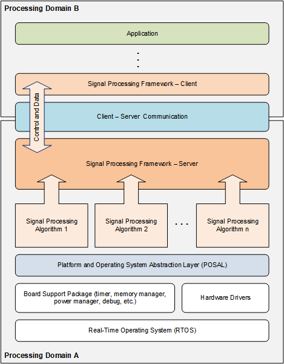

   High-level audio software architecture

Possible use cases
------------------

The ARE can be used in various audio and voice use cases. This section
includes, but is not limited to, the following high-level examples.
Detailed use cases are illustrated in `Use cases <#use-cases>`__ section.

Audio capture and recording
~~~~~~~~~~~~~~~~~~~~~~~~~~~

Audio capture involves the encoding of PCM data coming from a mic or any
real-time device (end-point).

Audio formats used for encoding are: PCM, AAC, WMA std, AMRWB, and so
on.

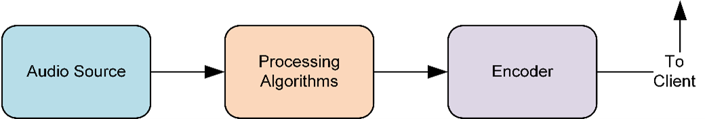

Audio renderer and playback
~~~~~~~~~~~~~~~~~~~~~~~~~~~

Audio playback involves the decoding of given audio data, and playing
the PCM on a speaker or any real-time device.

Typical audio formats used for decoding are: PCM, MP3, AAC, FLAC, ALAC,
AC3, EAC3, Vorbis, WMA std, WMA Pro, DTS, APE, and so on.

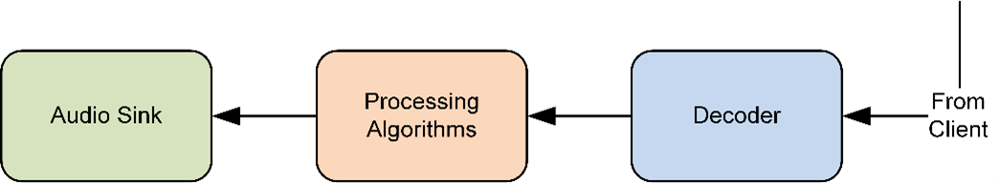

Voice over IP (VoIP)
~~~~~~~~~~~~~~~~~~~~

Voice over Internet Protocol (VoIP) involves both playback and record
paths simultaneously, and it is used for voice communication.

Encoder and decoders interact with the host processor application that
transmits and receives the data over IP during a conversation with the
far-end user.

Typical audio formats used for encoding and decoding are: PCM, AAC,
A-law, µ-law, and so on.

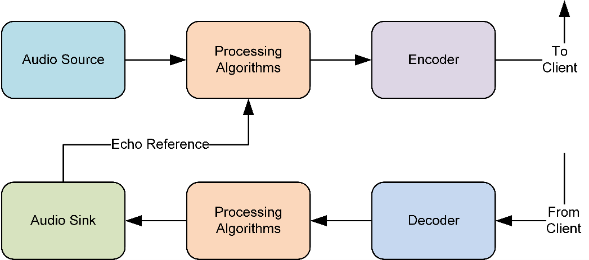

Audio transcoding
~~~~~~~~~~~~~~~~~

Audio transcoding involves converting one audio format to another. For
example, from MP3 to AAC.

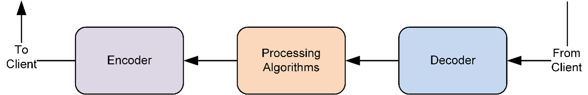

Audio loopback
~~~~~~~~~~~~~~

Audio loopback involves receiving the data from one audio source and
rendering it on an audio sink after optional processing.

An audio loopback is used in various scenarios like mixing the side tone
in CS voice call, a hands-free profile (HFP), a hearing aid, and so on.

Following are some loopback use cases, where audio must be routed from
one device to another device with some conversions.

-  PCM to compressed packetized. For example, PCM coming in from a
   device is encoded as DTS and packetized before transmitting to HDMI.

-  Compressed packetized to PCM. For example, data coming from HDMI is
   depacketized, decoded, and transmitted to a speaker for rendering.

-  Compressed packetized to compressed packetized with format
   conversion.

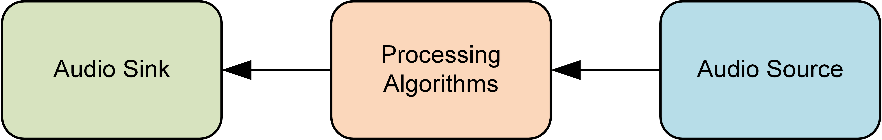

Audio detection
~~~~~~~~~~~~~~~

Audio detection involves receiving the data from an audio source,
processing it to improve the signal quality, detecting the intended
attribute or event, and informing the registered clients.

Audio detection is used in various scenarios like DTMF detection,
keyword detection, audio context detection, and so on.

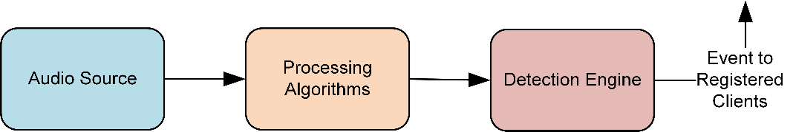

Framework requirements
======================

General
-------

-  Must be processor and platform agnostic.

-  Must be use case agnostic and data driven.

-  Must provide memory scalability options.

-  Must provide an option to customize the framework.

-  Must provide an option to support various performance modes.

-  Must allow use case-specific customizations.

-  Must support the unified interfaces to the modules (algorithms and
   functionality) to interact with the framework.

-  Must be scalable to support standalone use cases up to high-end
   concurrencies.

-  Should provide the options to dynamically load the processing modules
   and algorithms.

-  Must support multi-core and multi-Instance configurations to enable
   distributed audio processing.

Client interfaces
-----------------

-  Must support client-server communication in the same processor,
   across the processors, or across the processing domains.

-  Must provide the methods to manage shared memory across the client
   and server framework.

-  Must provide generalized interfaces (synchronous and asynchronous) to
   exchange commands, responses, and events between the client and the
   server framework.

-  Must provide the methods to set up, configure, start, stop, suspend,
   and tear down the use case graphs.

-  Must support run-time calibration and monitoring of the modules.

-  Must provide the methods to publish the framework and module
   capabilities, configurations, and calibration interfaces to enable
   the data driven use case design.

-  Should allow proxy clients to handle use case-specific
   customizations.

Processing chains, topologies, and graphs
-----------------------------------------

-  Must support linear processing graphs (where modules are connected
   sequentially one by one).

-  Should support non-linear processing graphs (where modules are
   connected as directed acyclic graphs).

-  Must support real time (RT) and non-real time (NRT) audio sources and
   sinks.

-  Must support *stream*-based processing graphs where each stream can
   contain multiple channels.

-  Should provide metadata propagation across the processing graphs.

-  Should support the processing modules that have different frame-size
   requirements.

-  Must support the option to run multiple instances of the sample
   module, and the ability to address individual instances of
   configuration or calibration.

-  Must support in-place buffering option for the processing modules in
   the use case graphs.

-  Must provide the methods to support data and control communication
   between the processing modules.

-  Should provide the support for graph-specific functionalities like
   pause, resume, and flush.

-  Should support the modules that take variable input numbers of
   samples and produce the variable numbers of output samples.

-  Should provide the methods to notify the client processor when the
   last sample of the playback stream is rendered out of the audio sink.

Media formats
-------------

-  Must support the fixed and floating point PCM data format.

-  Must support various standard compressed data formats and the generic
   (raw) compressed data format.

-  Must provide support for configuring the number of channels, bit
   width, sample width, and Q factor.

-  Must support the media format propagation across the processing
   modules in the use case.

Scheduling methods
------------------

-  Should support different scheduling modes and different data delivery
   mechanisms (buffer availability, timer scheduled trigger, timed
   packet delivery, deadline driven scheduling, and so on).

-  Should provide options to enable custom scheduling and trigger
   policies to handle complex scenarios.

Resource management
-------------------

-  Must provide the methods to manage the processing resources (memory
   management, processor cycles, band width, thread priorities, and so
   on) required for the use case graphs.

-  Should provide the methods to measure the processing requirements of
   both the framework and modules.

-  Should provide the ability to query the delay between required
   modules.

-  Must provide the scalable memory requirement options based on the use
   cases or capabilities.

Debugging
---------

-  Must provide the methods to log the diagnostic messages.

-  Must provide the option to log the audio data (PCM and compressed) at
   specified locations in the use case graphs.

-  Should support different debug levels (which can be featurizable) to
   debug complex timing issues, memory leaks, and so on.

ARE components
==============

High-level architecture of the ARE
----------------------------------

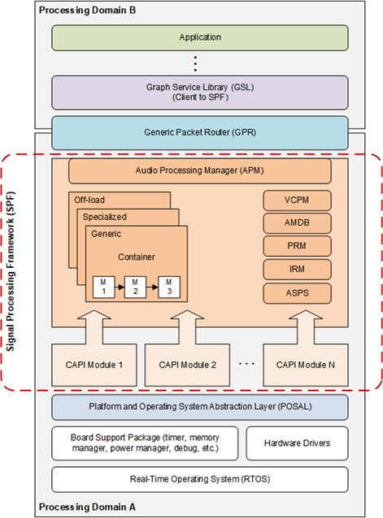

   ARE high-level architecture

Functional blocks
-----------------

This section provides a high-level overview of the functional blocks
used in the ARE.

Generic Packet Router (GPR)
~~~~~~~~~~~~~~~~~~~~~~~~~~~

The Generic Packet Router (GPR) provides the routing functionality for
audio message packets (control, data, events, responses) across the ARE
(server framework) and Graph Service Library (GSL; that is, the client
framework).

The GPR abstracts the platform-specific interprocessor communication
(IPC) transport and protocol layers.

Following figure represents the GPR header format, which consists of source
and destination addresses (domain and port), token (useful for
asynchronous communication to match the command and response), and
operation code (opcode).

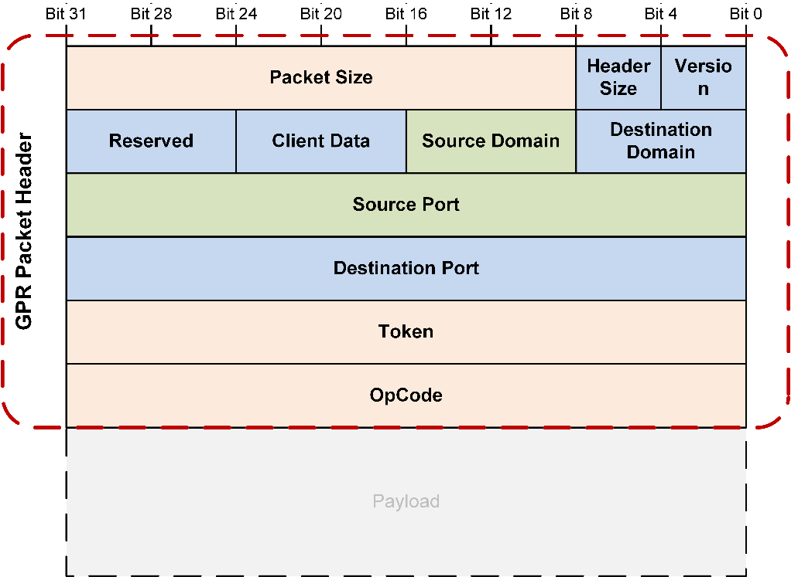

   GPR header format

Opcodes
^^^^^^^

All opcodes are to follow the GUID format.

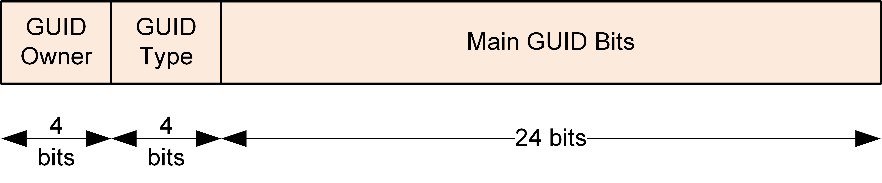

-  **Owner** – Indicates the owner of the GUID, that is, whether the
   GUID is defined by the ARE or your custom opcode.

-  **Type** – Indicates the specific purpose, for example, control
   command, control response, data command, data response, event, module
   identifier, format identifier, CAPI opcode, and so on.

-  **Bits** – Used to interpret the message type as an event or
   response, and to avoid sending the general response or
   acknowledgment.

Messaging between ARE and GSL
^^^^^^^^^^^^^^^^^^^^^^^^^^^^^

The ARE supports two types of messaging approaches for optimal system
performance: in-band and out-of-band messages.

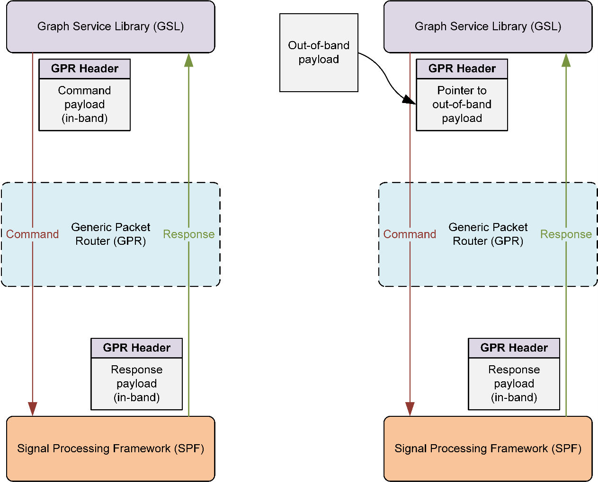

   In-band and out-of-band messaging methods

In-band messages
^^^^^^^^^^^^^^^^

-  Contain the actual payload/message as part of the GPR payload.

-  The GPR forwards the full packet (that is, GPR header + actual
   payload) across the process domains.

-  Potential memory copies are in intermediate layers between the
   framework server and client (hence the size limitation to reduce
   performance impacts).

-  Typically used for small payloads, such as <512 bytes
   (platform-specific configuration), like simple commands, responses,
   events, and so on.

Out of band messages
^^^^^^^^^^^^^^^^^^^^

-  Use separate shared memory to keep the actual payload/message.

-  The GPR forwards the packet with the address of the actual payload
   (that is, GPR address + address of the actual payload).

-  Allow the framework server and client to access the shared memory
   without any additional memory copies between them.

-  Typically used for larger payloads, such as >512 bytes
   (platform-specific configuration), like configuration, calibration,
   data buffers, and so on.

Modules
~~~~~~~

A module is an addressable *functionality* in the ARE.

-  A *module ID* is used to identify the functionality, and it is useful
   during module instantiation.

-  A *module instance ID* is used to identify the instance of the
   module. It is useful when receiving configuration and calibration
   information from the clients.

-  The module instance (a 32-bit instance ID) should register the
   callback functions with GPR for receiving messages directly from
   clients.

Two types of modules are used in the ARE: control modules and data
processing modules.

Control modules
^^^^^^^^^^^^^^^

Control modules provide the public interfaces to the clients (like GSL,
Codec Driver, and so on) to control the ARE resources and
functionalities (each module acts like service that provides specific
functionalities).

The Audio Processing Manager (APM), and Integrated Resource Monitor (IRM)
are a few examples of the control modules.
These modules are not represented in use case graphs.

Data processing modules
^^^^^^^^^^^^^^^^^^^^^^^

Data processing modules can be static or dynamic, and they are typically
wrapped with the Common Audio Processing Interface (CAPI). The CAPI
interface acts as the bridge between the framework and core module
functionality.

These modules can have zero or more input and output ports. Ports can be
control or data, and they are connected to one link at a time (implicit
mixing and splitting is not supported at these ports). Modules with zero
input and zero output ports are not supported.

Examples of data processing modules include decoders, encoders,
postprocessing modules, hardware or software end-points, DTMF generator
(source module), DTMF detection (sink module), echo canceller
(multi-port module), and so on.

For more details about the CAPI interface, see :ref:`capi_mod_dev_guide`.

Links and connections
~~~~~~~~~~~~~~~~~~~~~

Links and connections are used to connect the data processing modules to
create the use case graphs or chains. Originating and terminating points
of the link are represented by port.

Two types of links are used in the ARE: control links and data links.

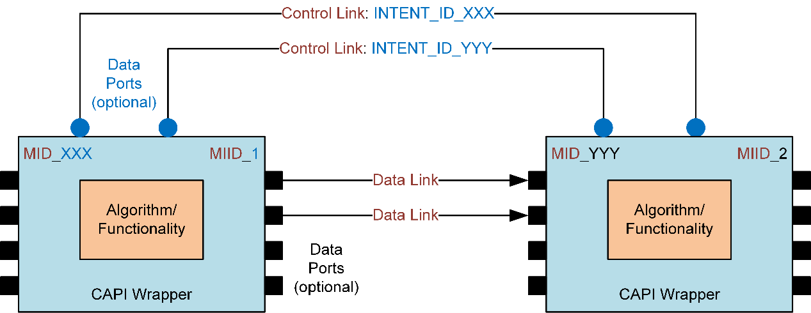

   CAPI-wrapped modules with control or data links

Control links
^^^^^^^^^^^^^

Control links are bi-directional, point-to-point, and dynamic (variable
in number) or static (fixed in number with a specific label on the
control port).

These links are optional and used in the places where two modules are
required to communicate with each other in a steady state without client
involvement. They are used for exchanging control messages or intents
(that are not required to be synchronous with the data) between the two
modules.

Data links
^^^^^^^^^^

Data links are unidirectional, point-to-point, dynamic (variable in
number, for example, input to the accumulator module can be variable),
or static (fixed in number with a specific label on the data port, for
example, an echo reference port can be marked explicitly).

These links are used for exchanging data messages (that need be
synchronous with data buffers or samples) between two modules. Each link
carries one stream of data that can contain multiple channels.

Data links are not present on the input side for source modules and the
output side for sink modules.

Graph and subgraph
~~~~~~~~~~~~~~~~~~

A *graph* is the interconnection of a list of data path modules (with
input and output ports) to achieve an end-to-end use case.

A *subgraph* is like a graph and is used to represent a section (to
control or manage a single unit) of the full graph.

-  Subgraph properties provide the necessary configuration for managing
   a subgraph. For example, performance mode (like low power, low
   latency, and so on.), use case scenario ID (to handle any use
   case-specific customizations), and so on.

-  ARE clients control the use cases at a subgraph granularity with the
   help of graph-specific commands like START, STOP, SUSPEND, FLUSH, and
   so on.

For specific use cases, graph and subgraph mean the same thing.

The ARE supports directed acyclic graphs (no feedback path) only.

Containers
~~~~~~~~~~

A *container* is a framework implementation that helps in executing a
group of data processing modules in the same software thread. Following figure
illustrates this concept.

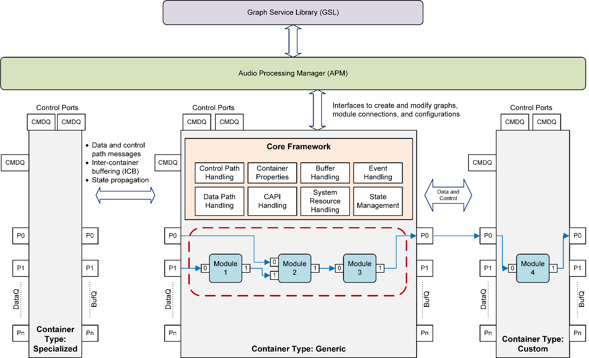

   Containers

-  Each container instance runs in its own software thread.

-  Container properties provide the necessary configuration for
   container creation and operation. For example, container type, stack
   size, heap ID, and so on.

-  A *Container Type* helps in identifying the specified container and
   instantiating it during the use case setup (that is, Graph OPEN).

-  A *Container Instance ID* is used to represent the instance of the
   container type, and it is used in the use case graph definition.

-  A use case can contain different instances of the same container type
   to distribute the processing modules in different software threads.

Based on the nature of the framework capabilities required by different
use case modules and product needs, there are three container types:

**Generic container**
~~~~~~~~~~~~~~~~~~~~~

-  Supports hardware end-point/signal triggered modules, shared memory
   end‑points, encoders, decoders, packetizers, depacketizer,
   converters, simple PP modules (including fractional resampling and
   rate matching)

-  Back-to-back fractional resampling or rate matching are not
   supported. But individually fractional resampling or rate matching is
   supported as long as module is connected to the external ports of the
   container through a non-buffering linear chain.

-  Priority (EC) sync, EC module and generic sync are supported starting
   2022.

-  Supports low power island

-  Optimized to run pure signal driven topology.

Threshold aggregation in generic container is as follows:

-  If there's only one module with threshold in the container, then that
   module's threshold is used.

-  When multiple threshold modules exist, the LCM (Least Common
   Multiple) is taken to be the threshold.

-  If no threshold module is present, then the subgraph performance-mode
   is used to determine the threshold where performance mode for low
   power corresponds to 5 ms and performance mode for low latency is 1
   ms.

-  For raw-compressed formats, the threshold in bytes is used as is.
   Container frame-size is determined by any PCM formats present in the
   other parts of the graph. If the container is solely on
   raw-compressed format, then frame size in time cannot be determined
   and the thread priority setting may not be correct (such scenarios
   occur rarely and have to be handled on a case-by-case basis)

**Example scenarios**

-  If perf-mode is 5 ms (low power) but an end-point module exists that
   raises the threshold to 1 ms, then the container threshold is 1 ms.

-  If there are two threshold modules in the container, one with a 2 ms
   threshold and one with a 5 ms threshold, then the container frame
   size is the LCM which is 10 ms.

-  If the subgraph perf-mode is 5 ms and there are no threshold modules,
   then the container frame size is 5 ms

**Specialized container**
~~~~~~~~~~~~~~~~~~~~~~~~~~

-  Mainly designed for PP modules, including complex modules like rate
   matching and multi-port modules such as EC, which need syncing
   requirements for multiple inputs. Fractional resampling is also
   supported.

-  Back-to-back fractional resampling, rate matching is supported.

-  End-point/signal triggered modules, shared memory end-points,
   encoders, decoders, packetizers, depacketizer, and converters are not
   supported.

-  Highly optimized for single input and single output (SISO) chain of simple PP modules:

-  Removal of disabled modules from topo chain.

-  Removal of sync+SAL from processing chain if only one active input
   (and limiter is disabled).

-  Container bypass if all modules are disabled.

-  Simpler steady state checks when there is no internal buffering in
   the container (compared to GC - which does this only for signal
   triggered cases).

-  Voice call has special sync requirements, which are supported only in
   SC, such as smart sync, voice proc triggers etc.

-  Doesn’t support low power island (LPI).

Threshold aggregation in a specialized container is as follows:

-  If there are multiple threshold modules, SC only supports modules
   whose thresholds are multiples of each other. If thresholds are not
   multiples, then it's an error. If this 'multiple-threshold' is
   smaller than the frame-size derived from subgraph perf-mode, then the
   closest multiple bigger than the perf-mode-frame-szie is used.
   Otherwise, the multiple is used as is.

**Example scenarios of threshold calculation**

-  If the subgraph perf-mode is low power (5 ms) and the only threshold
   module in the container raises threshold as 2 ms, then container
   frame size is 6 ms, which is the closest multiple of the
   module-threshold which is higher than the perf-mode-frame-size.

-  If the subgraph perf-mode is low power (5 ms) and two threshold
   modules are present in the container – one with 1 ms threshold and
   one raising 3 ms threshold, then the container frame size would be 6
   ms. This is the closest multiple of both modules' thresholds which is
   higher than the perf-mode-frame-size.

-  If the subgraph perf-mode is low power (5 ms) and there are no
   threshold modules, then the container frame size is 5 ms.

-  If there are two threshold modules in the container, one raising
   threshold as 2 ms and one raising as 3 ms, then it is an error and SC
   will not support that topology.

-  Special cases – For voice call stream-subgraph threshold of 20 ms is
   used and for audio playback stream-pp, 10 ms is the threshold.

**Off-load container**
~~~~~~~~~~~~~~~~~~~~~~~~~~

-  Supports reduction of the processing load on the local process domain
   by helping to off-load an intended module or a group of data
   processing modules to a different process domain. This is useful in
   distributed audio processing for effectively utilizing the available
   hardware resources across the different processors.

The container concept enables framework customization that allows you to
create a *custom container* if the reference containers do not support
the necessary capabilities with the specified performance. Such
customizations can be inter-operable with the reference containers if
container-to-container interfaces and behaviors are honored.

Containers help with the following:

-  Managing (setup, start, stop, teardown) the processing chains
   (topologies) with CAPI modules.

-  Managing the scheduling and trigger policies for the processing
   graphs inside the container.

-  Parallelizing the processing loads in multi-threaded systems.

-  Sharing the same stack memory across the modules running in that
   container.

-  Ensuring the appropriate resource requirements (heap, thread
   priorities, processor and other infrastructure clocks, and so on)
   required for the modules.

-  Managing the data buffering requirements with peer containers through
   inter-container buffering (ICB) and between the modules in the same
   container.

-  Hosting the necessary command queues to interact with the APM, peer
   containers, external clients, and internal modules for control
   messaging.

-  Hosting the data queues and buffer queues to exchange the data path
   messages (data buffers, metadata, end-of-stream (EOS), media format,
   and so on) with peer containers.

-  These queues are created by the containers when the graph is opened.

-  DataQ is created for every input port of the module that is at the
   container boundary.

-  BufferQ is created for every output port of the module that is at the
   container boundary.

-  Propagating the port (data and control) state information (start or
   stop) and nature of the data flow (real time or non-real time) with
   peer containers through the command queues. This information is
   useful for updating the scheduling policies at run-time.

Below figure provides an example dataflow and scheduling policies involved
in a simple use case with containers.

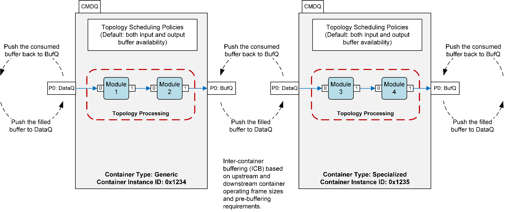

   Example dataflow across containers

When the use case is started with the default trigger policy:

1. The container triggers or calls its topology processing when both
   input buffers (filled with data from upstream) and output buffers
   (free buffers) are available.

2. During the topology processing, input data is propagated through the
   sequence of CAPI modules (per the use case graph definition) to the
   output buffer.

3. After consuming the input buffer completely, the data is pushed back
   to the upstream’ s output queue (BufferQ).

4. Once the output buffer is filled, the data is delivered to the
   downstream container input queue (DataQ).

5. These steps are repeated at each container that is driven by buffer
   availability.

The framework also allows the modules to override the default trigger
policies by using trigger policy framework extensions. For example, some
modules might want to be called whenever input or output buffer is
available (such as the buffering type of modules).

Audio Processing Manager (APM)
~~~~~~~~~~~~~~~~~~~~~~~~~~~~~~

The Audio Processing Manager (APM) is responsible for setting up and
managing the use case graphs in the ARE.

As illustrated in Figure: :ref:`audio_processing_module_image`, the APM provides generic public interfaces
to the GSL client for performing the following graph operations:

-  Set up and configure the container processing threads.

-  Set up the module’s graph within containers.

-  Configure and calibrate individual modules within each container.

-  Update the run-time graph, including adding and removing containers
   and modules from the graph.

-  Manage data path connections and disconnection across containers.

-  Provide run-time calibration of modules within a given container.

-  Provide shared memory mapping interfaces.

-  Provide path delay between two modules.

-  Provide the global framework reset functionality with help of
   CLOSE\_ALL command.

.. _audio_processing_module_image:

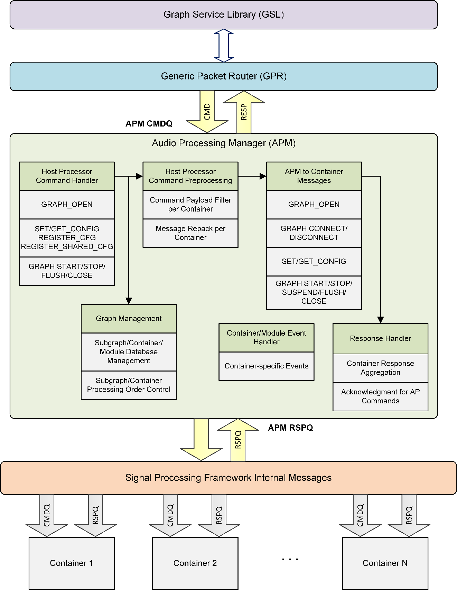

   Audio Processing Manager

The APM also handles the commands for controlling a subgraph’s state
machine:

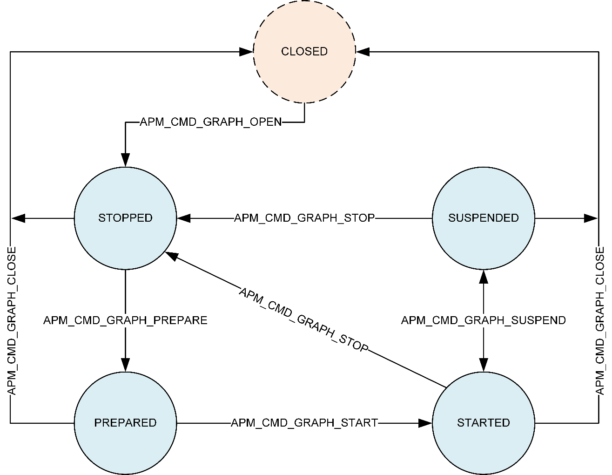

   APM state machine

**CLOSED**
~~~~~~~~~~

-  The logical/non-existent graph state before OPEN and after CLOSE.

**STOPPED**
~~~~~~~~~~~

-  The state after the graph is opened or transitioned from STARTED as
   part of STOP.

-  For a START-to-STOP transition, the module algorithmic state is
   reset, and the container internal data buffers are flushed.

-  Platform-specific resources (MIPS, bus bandwidth, and so on) are
   de-voted.

**PREPARED**
~~~~~~~~~~~~~

-  The media format is propagated through a module topology, if
   available.

-  The module applies input media format-dependent calibrations.

**STARTED**
~~~~~~~~~~~

-  Platform-specific resources (MIPS, bus bandwidth, and so on) are
   voted.

-  When applicable, data triggers, hardware end point, timer interrupts
   are enabled.

-  A subgraph is ready for handling the data flow.

**SUSPENDED**
~~~~~~~~~~~~~

-  Platform-specific resources (MIPS, bus bandwidth, and so on)
   de-voted.

-  The module algorithmic state and container internal data buffers are
   maintained and not flushed, unlike the STOP command.

In addition to handling commands from the host processor client, the APM
is also responsible for the following operations:

-  Depending on the type of command, interact with containers via the
   framework messaging APIs for sending these commands and handle
   responses from the containers.

-  For a given command, aggregate the container’s response for the
   message and send an aggregated acknowledgement back to the GSL.

-  For a given end-to-end graph, manage and coordinate with containers
   for use cases (such as rate matching) that involve control path data
   exchange between modules located across different containers.

This includes utilities for end-to-end container-module graph sorting
with respect to data flow direction from the data source to the sink,
graph search, and traversal routines.

Audio Module Data Base (AMDB)
~~~~~~~~~~~~~~~~~~~~~~~~~~~~~

The Audio Module database (AMDB) provides the database of CAPI-wrapped
modules (both static and dynamic modules) in the ARE.

.. _audio_module_data_base:

.. figure:: images/arspf/Image19.png
   :width: 4.27084in
   :height: 3.52084in
   :figclass: fig-center

   Audio Module Data Base

The AMDB is responsible for the following operations.

-  Provide the client (to GSL) interfaces to register or deregister
   custom modules and load or unload the dynamic modules at boot time or
   use case boundaries.

-  Interact with containers for instantiating and tearing down the
   module.

-  Use the platform-specific dynamic download utilities for downloading
   shared objects to the specified memory (DDR, low-power memory, and so
   on.).

-  Manage the reference counter so that a module will not be unloaded if
   it is being used by active use cases.

As shown in Figure: :ref:`audio_module_data_base`

**Built-in modules**
~~~~~~~~~~~~~~~~~~~~

-  Modules that are built with the ARE, both static and dynamic objects.

-  The AMDB uses the module database (module ID, entry point functions
   in autogenerated .c file) that is generated with the build system, so
   no separate registration or deregistration is required.

**Custom modules**
~~~~~~~~~~~~~~~~~~

-  Modules that are built as standalone dynamic objects instead of building with ARE

-  These modules and dynamic objects must be registered with the
   AudioReach calibration and configuration tool (ARC) using the custom module integration workflow, which in turn
   registers them with the AMDB in the ARE.

**Static Modules**
~~~~~~~~~~~~~~~~~~

-  Static modules are loaded at boot time along with the ARE.

**Dynamic Modules**
~~~~~~~~~~~~~~~~~~~

-  Depending on the memory and latency tradeoffs, dynamic modules can be
   loaded at boot time or at a use case boundary.

Integrated Resource Monitor (IRM)
~~~~~~~~~~~~~~~~~~~~~~~~~~~~~~~~~

The Integrated Resource Monitor (IRM) provides the profiling metrics for
different resources in the underlying platform.

The ARC platform displays resource metrics (MIPs, bandwidth, heap
usage, and so on) for system designers.

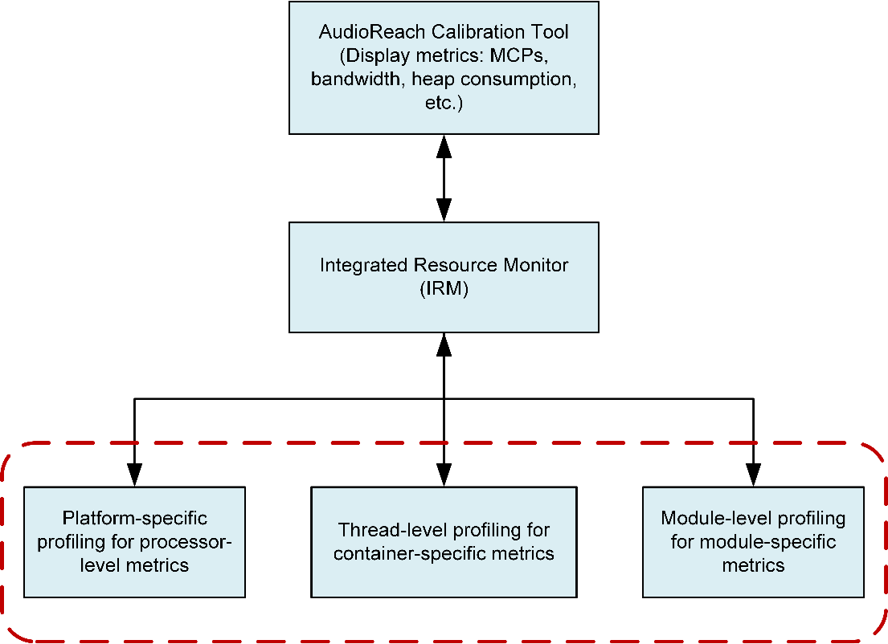

   Integrated Resource Monitor

Platform and OS Abstraction Layer
~~~~~~~~~~~~~~~~~~~~~~~~~~~~~~~~~

The platform and operating system abstraction layer (POSAL) provides the
necessary abstraction to the framework and makes it processor (hardware)
or platform (software) agnostic.

Some of the abstractions include, but are not limited to, the following:

-  Power management

-  MIPs/MCPs/MPPs and bandwidth voting to select processor and system
   bus clocks.

-  Latency voting which could control various performance modes

-  Custom power domains to achieve various power goals

-  Processor specific intrinsics to help with optimizations

-  Memory Management (different types of heap memories, shared memory
   mapping and so on)

-  Cache memory operations (clean, invalidate operations)

-  Conditional and atomic variables

-  Priority inheritance and recursive mutex, nmutex

-  Signals and Channels (enables to listen multiple signals)

-  Interrupts handling

-  Timers

-  Software threads (priority-based preemptive scheduling)

-  Platform specific thread priority data base

-  Data (PCM or Compressed) and message logging for diagnostic purposes

.. _spf_cal_config_mode:

Calibration and configuration
-----------------------------

Calibration and configuration comprise the control information provided
to the module at setup and runtime to control the module’s
functionality.

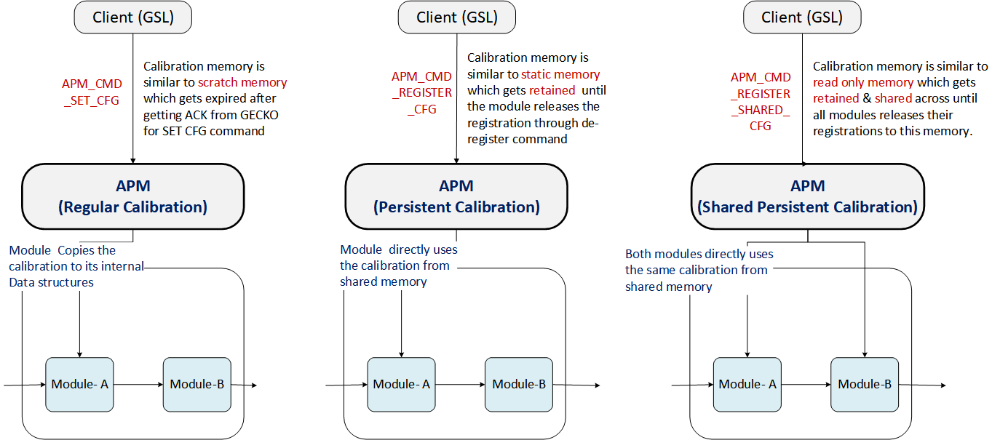

   Calibration modes

Following are the three types of calibration interfaces exposed by the
AudioReach Engine.

Regular and non-shared calibration
~~~~~~~~~~~~~~~~~~~~~~~~~~~~~~~~~~

Steps:

1. The client provides the calibration memory to the module.

2. The module copies the calibration data to internal buffers and provides the response to the client.

3. The client frees the shared buffer.

Overheads:

-  Additional memory (internal buffer) and buffer copy overhead.

-  Hence, we recommend small calibration sizes.

The ARE supports both in-band and out-of-band calibration methods.

Persistent and shared calibration
~~~~~~~~~~~~~~~~~~~~~~~~~~~~~~~~~

Steps:

1. The client provides the calibration memory to the module through an
   out-of-band payload.

2. The module uses the client-shared memory directly without copying the
   calibration data to internal buffers, and it provides the response to
   the client.

3. If the use case is active, the client preserves the shared memory
   that is being used by the module.

4. The client frees the shared buffer once the use case is closed.

Memory usage and processing cycles are optimal because no copy is
involved.

Persistent calibration memory acts like read-write (RW) from the module
instance perspective. We recommend this approach for large calibration
and configuration blocks (like machine learning models).

Only out-of-band calibration is supported.

Shared-persistent or global-shared calibration
~~~~~~~~~~~~~~~~~~~~~~~~~~~~~~~~~~~~~~~~~~~~~~

This approach is like persistent calibration. However, in this case, the
same data is shared to multiple modules, which can help to save more
memory.

Shared persistent calibration memory acts like read-only (RO) from the
module’s perspective. It is typically used for large calibration or
configuration blocks where the same data can be shared across multiple
module instances (such as resampler coefficients).

Only out-of-band calibration is supported.

Multi-instance and multi-core
-----------------------------

The ARE enables multi-core and multi-instance system configurations with
the help of Master and Satellite architecture. These capabilities help
in distributing audio processing loads across the processors to achieve
functional and performance goals.

Multi-Instance configuration
~~~~~~~~~~~~~~~~~~~~~~~~~~~~

Use multi-instance configuration for running disjointed and complete use
cases in different process domains.

To route a specific use case to a specific process domain, the use case
designer must provide the hint (through a routing ID). The GSL uses the
routing information and interacts with that process domain ARE (also
called the *master framework*) to realize the use case.

An example scenario is a system where multiple processors are used for
different power profiles:

-  Always ON use cases are routed to a low power processor

-  Another high-power use case is routed to another processor

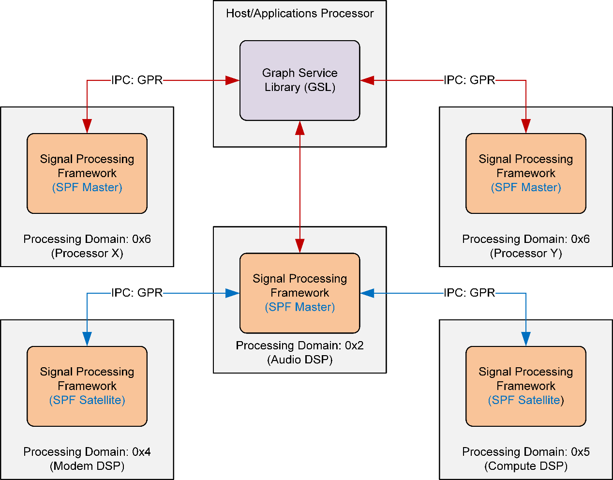

   ARE in multi-core and multi-instance configuration

Multi-core configuration
~~~~~~~~~~~~~~~~~~~~~~~~

Use multi-core configuration to distribute a given use case across
multiple process domains. Like a star topology, each off-load graph
originates and terminates with the master ARE.

To avoid additional complexities with data or control synchronization
and subsystem re-start mechanisms, there is no communication across the
satellites.

-  The use case designer must provide the hint (by selecting the
   appropriate process domain) for the modules that are to be off-loaded
   and distributed.

-  The GSL provides this use case information to the ARE (Master), which
   in turn interacts with the required satellite frameworks to realize
   the use case.

-  Distributed processing helps utilize the processing resources
   effectively in the system at the cost of potential latency or power
   increase. Hence the control of selecting the use cases and modules
   given to the use case designer (with the help of ARC).

.. _playback_with_offload_module_use_case_designer_view:

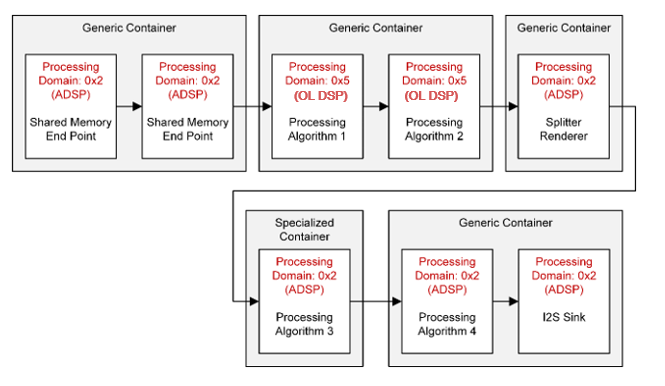

   Playback with off-load modules – Use case designer’s view

Both ARE-Master and ARE-Satellite support most of the capabilities
across the process domains, excluding any platform-specific capabilities
or modules.

-  Figure: :ref:`playback_with_offload_module_use_case_designer_view` shows the simple playback use case using off-load
   container to off-load couple of modules into another processor.

-  Figure: :ref:`playback_with_offload_modules_implementation_view` represents its implementation view.

   -  Off-load container with shared memory end points inserted in the
      graph to route the data between master and satellite process domains
      for the given off-load use case.

   -  This additional hop across the process domains can increase
      additional latency due to inter process communication overheads and
      additional buffering between the off-load container and satellite
      containers to enable the parallel processing.

.. _playback_with_offload_modules_implementation_view:

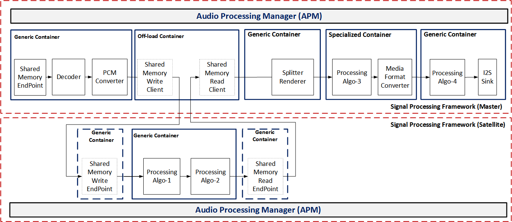

   Playback with off-load modules – ARE implementation view

The off-load container is inter-operable with other reference
containers. It helps to propagate the metadata, end-of-stream (EOS),
media format, and state (START, STOP, SUSPEND) information across the
off-loading modules.

Customizations
==============

Custom module
-------------

The custom module development workflow involves the following high-level steps:

1. Start custom algorithm using standard industrial tool such as Matlab and optimize the algorithm
   for intended processor architecture

2. Develop the Common Audio Processor Interface (CAPI) wrapper for the
   custom algorithm. For examples and detailed instructions, see the :ref:`capi_mod_dev_guide`

3. Develop an API header file consisting of Module ID and configuration
   parameters related to the custom algorithm.

4. Generate an API XML file by running the h2xml conversion tool on the API
   header file. The XML file provides the necessary information about configuration
   interfaces, supported containers, stack size, and any other policies
   that are required for the AudioReach configuration tool (ARC platform).

5. Compile the CAPI-wrapped module as a built-in module as part of ARE image
   or standalone shared object.

6. Import the custom module into the ARC platform through a module
   discovery workflow, and create use case graphs by placing the module
   in the appropriate container and subgraphs.

7. Calibrate or configure the module together with an end-to-end use
   case, and store the data in the file system (through the ACDB file
   provided by the ARC platform).

8. Launch the end-to-end use case from the application, which in turn
   uses the use case graph and calibration information from the ACDB
   file and provides them to the ARE to realize the use case.

Custom container
----------------

The custom container development workflow involves the following steps:

1. The custom container must use the internal messaging APIs defined
   between the APM and containers to set up, configure, start, stop,
   suspend, and tear down the graph.

2. The custom container must use inter-container messaging to make it
   inter-operable with other reference containers.

3. Develop the custom container per the above guidelines, with specified
   scheduling policies and performance requirements.

4. Update the supported module headers with this new custom container.

5. Update the internal container data base tables with entry point
   functions so the APM can create the container during use case setup.

6. Update the APM API header file with the new container type, and
   regenerate the API XML file (using the h2xml tool).

7. Import the API XML files into the ARC platform to see the new
   container and supported modules for creating use case graphs.

Use cases
=========

This section lists some common use cases that are realized using
AudioReach. **NOTE:** This is not an exhaustive list.

Playback
--------

The playback use case is the most common audio use case and it involves
decoding, postprocessing, and rendering. AudioReach software is
data-driven and doesn’t assume anything about the graph shape or its
contents as that is up to the designer, but the following diagram serves
as an example.

The graph is divided into 3 subgraphs: stream, device PP, and global
device. This structure aligns with how audio playback is controlled in a
handset product. The global device subgraph gets data from low power
streams as well as low latency audio streams + voice call. The device PP
subgraph does device specific processing, e.g., multi-band DRC. The
stream subgraph contains decoder, stream-specific processing and
audio‑video synchronization control. During device switch, e.g., from
handset to headset, the device subgraph can be swapped with another
variant.

The following diagram also shows 5 stages of processing. Various stages
help in achieving pipelined processing, thus distributing the load on
multiple threads. These stages are designated as containers, each of
which runs in its own software thread. Typically in a low power
configuration, all containers run at 5 ms frame size whereas the codec
DMA sink container runs at 1 ms frame size. Any frame size ≥ 1 ms is
allowed.

The first container involves receiving data from the client through a
write shared memory end point, getting the data decoded (any decoder
such as AAC or MP33 can replace the PCM decoder), and followed by PCM
conversion, such as bit-width conversion to deinterleaved format for
subsequent processing.

The second stage contains stream-specific processing such as volume
control, media format conversion, e.g., sample rate conversion. Data
logging can be placed at any place in the graph for debugging purposes.
The soft-pause module helps ramp up or down during pause or resume.

The splitter renderer can split the stream synchronously on multiple
devices (if needed), and also computes session-time for AV sync.

Device postprocessing is where multiple concurrent streams can be mixed
and further postprocessed. Before mixing using simple accumulator and
limiter, the inputs are synchronized using a sync module. In the global
device SG, further mixing is possible (with low latency audio) and
ultimately, the data is rendered through the codec DMA sink module.

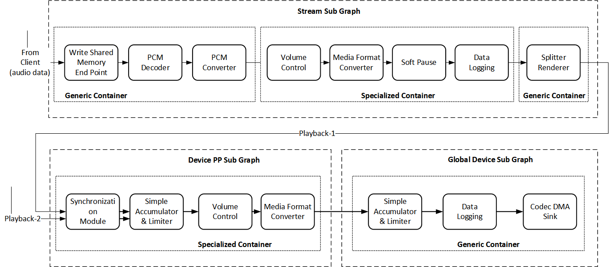

Capture
-------

The following capture path contains 3 subgraphs and 4 containers. The
data from the hardware received through the codec DMA source is passed
through several stages of processing and is ultimately read by HLOS
through a read shared memory end-point.

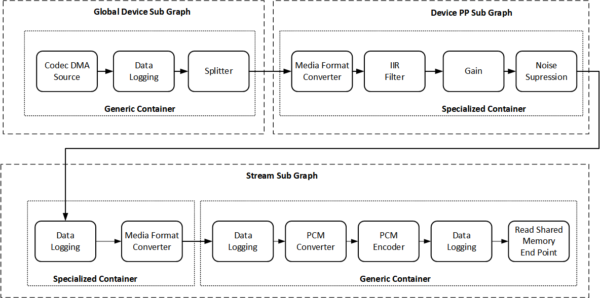

Use cases with source and sink modules
--------------------------------------

The following example graphs contain source (DTMF generator) and sink
(DTMF detector) modules.

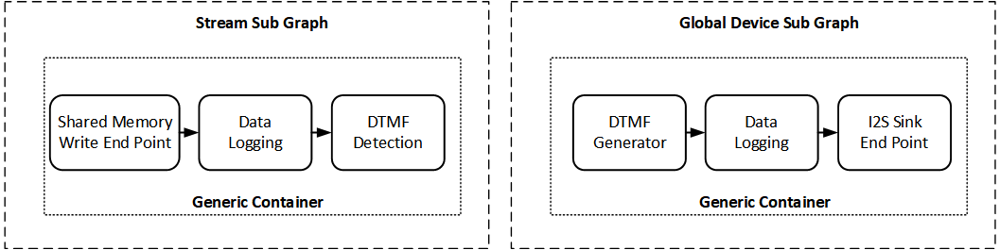

Hands free profile (HFP)
------------------------

The following HFP graph contains 2 loopbacks between hardware source to
hardware sink. There’s also a feedback path for EC. The top graph is the
mic path on the local device being sent to Bluetooth (connected through
I2S). The botton graph is the speaker path where BT data coming from I2S
is rendered on the codec DMA sink.

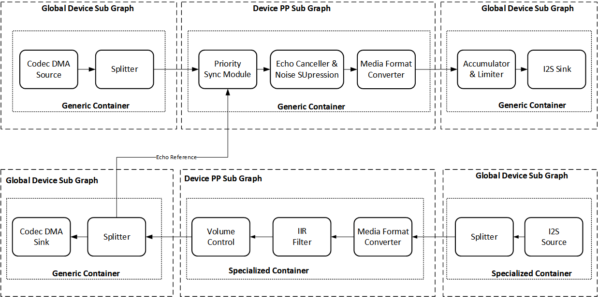

Voice activation
----------------

The voice activation use case involves receiving mic data and running it
through a voice activation module after preprocessing for noise. The
history buffer stores large amounts of pre-roll data (> 1 sec). This
data is released to second stages running on the client whenever a
keyword is detected by the voice activation engine. The 2 modules
communicate through the control link. This graph consists of real-time
as well as non-real-time processing.

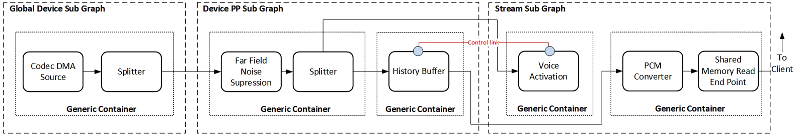

Graph designer FAQ
==================

Use case graphs must satisfy both functional and performance
requirements simultaneously. Graph designers typically focus on
functionality and don’t realize the importance of proper graph shapes on
performance. An improper graph can consume extra cycle overheads or
consume additional memory. This chapter describes aspects related to
graph drawing. More information is available in :ref:`capi_mod_dev_guide`.

How many subgraphs to draw?
---------------------------

A graph for a given use case consists of one or more subgraphs. Signal
Processing Framework (ARE) is agnostic to subgraphs. Subgraphs are drawn
based on how a client wants to control the graphs, e.g., a device-switch
use case demands stream vs. device subgraphs.

How many containers should I use?
---------------------------------

Containers like GC and SC are data processing threads (a custom
container may have multiple data processing threads, but this guidance
only considers GC and SC). Data processing threads typically run
periodically based on their frame duration, e.g., the end‑point may run
every millisecond, device PP may run every 5 ms, or a decoder may run
every 21.33 ms (1024 samples at 48k), so one reason to use different
containers is to handle difference in frame durations.

Even for a given frame duration, you may want to use different
containers for the purpose of load balancing. This is true especially
with Hexagon processor which supports multiple hardware threads. Having
multiple containers helps in utilizing the hardware threads
concurrently, completing the job faster and allowing longer sleep
durations between frames.

Signal triggered modules are interrupt or timer driven. Currently only
one signal triggered module is supported by one container. Further, some
modules are supported only in certain container types, e.g., encoders
are supported only in GC.

Using lot of containers can increase memory requirement due to stacks,
instance memory, and buffer memories. For every stage of a container,
double buffering is typically added. This might increase data path
latency. More containers also means more MIPS used on overheads.

Occasionally, subgraph boundaries may influence the number of containers
needed, e.g., an ultra low latency (ULL) stream being rendered on 2
devices: handset and speaker. It’s possible to have ULL stream SG in an
end-point container in a standalone use case. However, if there are 2
end-points using different containers if we host stream-SG in device
containers, then during device switch the stream will also be torn down;
since this is not acceptable, we need to put stream-SG in its own
container.

For very low frame sizes (≤ 1 ms), cycle overheads might be lowered when
there are no subgraph boundaries within a container. To elaborate
consider graph, [{A->B}->{C->D}], in this graph square brackets denote
container boundaries. Flower brackets denote subgraph boundaries, and
A,B,C, and D are module instances. There are subgraphs within the
container. However, in this graph: {[A->B->C->D]} there are no subgraph
boundaries within a container. This graph {[A->B]->[C->D]}, also doesn’t
have a subgraph boundary within a container.

Should I use SC or GC?
----------------------

Some modules are supported only in GC and some may be only available in
SC. The h2xml of the module specifies the supported container type.

The generic container can satisfy most requirements, except:

-  Power optimizations for chain of PP modules in mobile use cases

-  Special synchronization requirements, such as smart sync for voice
   calls

-  Back-to-back rate matching or fractional resampling modules, i.e.,
   sample slip > MFC doing fractional resampling

If you have only PP modules (including sync, SAL, splitter, EC, filters,
effects etc), using SC is recommended. GC support for PP modules is to
be exercised mainly when those modules have to work alongside other
modules which are supported only in GC.

How can I improve efficiency?
-----------------------------

Memory, MIPS (overheads), and latency are some KPIs that cannot be
improved unless efficient graphs are used. Some general guidelines are:

-  Keep the optimum number of containers

-  Some graphs have additional containers that don’t serve any purpose.
   Combine containers if possible and if that’s more optimal

-  Remove unnecessary modules

-  Each module in a graph adds an overhead (MIPS or memory) by its
   presence

-  Even disabled modules may cause additional overhead

-  Question the need for every module in the graph

-  Remove any unnecessary connections between modules

-  Reduce media format conversions by trying to reorder the modules

-  Lower the frame duration, increase the MIPS overhead.

-  Keep only necessary modules at lower frame sizes. Use longer frame
   sizes if delay is not a concern

-  Signal triggered containers are generally more optimal in terms of
   MIPS, because scheduling policies used in signal triggered containers

-  Use ARC Online mode to confirm that only the modules intended for a
   use case are running when your use case runs. Sometimes HLOS might
   launch background graphs which may not be desired. Use the ARC IRM
   tool to measure MIPS and memory at various levels (overall processor,
   use case, or module level)

More module specific guidelines can be referenced from :ref:`capi_mod_dev_guide`

.. _arspf_acronym:

Acronyms and terms
==================
                  

+-------------------+---------------------------------------------------+
| Acronym or term   | Definition                                        |
+===================+===================================================+
| ACDB              | Audio Calibration Data Base                       |
+-------------------+---------------------------------------------------+
| AMDB              | Audio Module Data Base                            |
+-------------------+---------------------------------------------------+
| APM               | Audio Processing Manager                          |
+-------------------+---------------------------------------------------+
| CAPI              | Common Audio Processor Interface                  |
+-------------------+---------------------------------------------------+
| GC                | Generic Container                                 |
+-------------------+---------------------------------------------------+
| GSL               | Graph Service Library                             |
+-------------------+---------------------------------------------------+
| ICB               | Inter-container buffering                         |
+-------------------+---------------------------------------------------+
| IPC               | Interprocessor communication                      |
+-------------------+---------------------------------------------------+
| IRM               | Integrated Resource Monitor                       |
+-------------------+---------------------------------------------------+
| NRT               | Non-Real Time                                     |
+-------------------+---------------------------------------------------+
| OLC               | Off-load Container                                |
+-------------------+---------------------------------------------------+
| Opcode            | Operation code                                    |
+-------------------+---------------------------------------------------+
| POSAL             | Platform and Operating System Abstraction Layer   |
+-------------------+---------------------------------------------------+
| RAT               | Rate Adaptive Timer                               |
+-------------------+---------------------------------------------------+
| RT                | Real Time                                         |
+-------------------+---------------------------------------------------+
| RTOS              | Real Time Operating System                        |
+-------------------+---------------------------------------------------+
| SC                | Specialized Container                             |
+-------------------+---------------------------------------------------+
| SDK               | Software development kit                          |
+-------------------+---------------------------------------------------+
| ARE               | AudioReach Engine                                 |
+-------------------+---------------------------------------------------+
| ARC               | AudioReach Creator                                |
+-------------------+---------------------------------------------------+
| SPF               | Signal Processing Framework                       |
+-------------------+---------------------------------------------------+
| VoIP              | Voice over IP                                     |
+-------------------+---------------------------------------------------+
