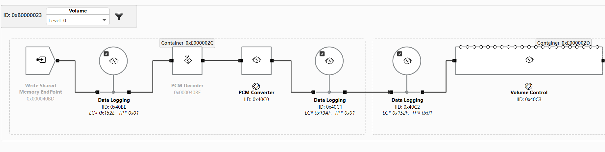
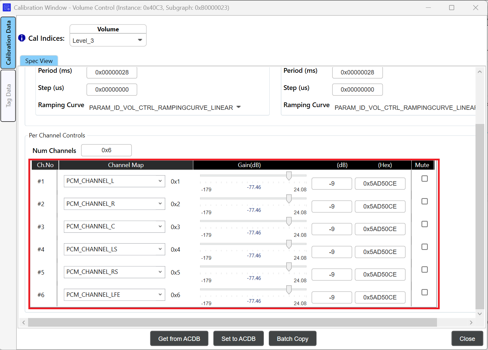
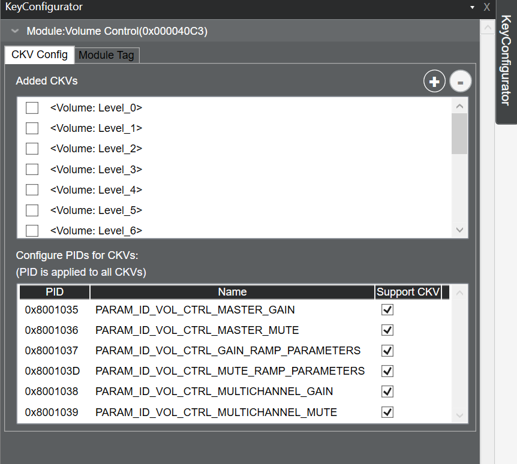
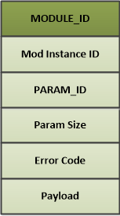
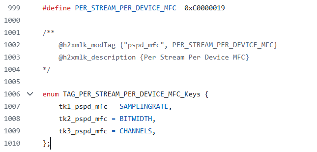
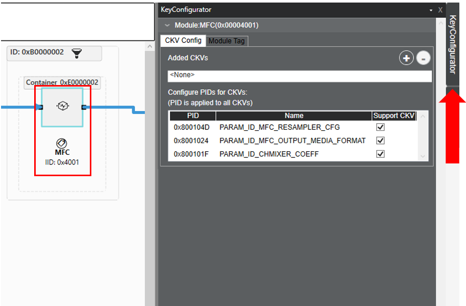
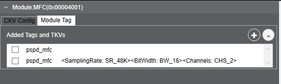
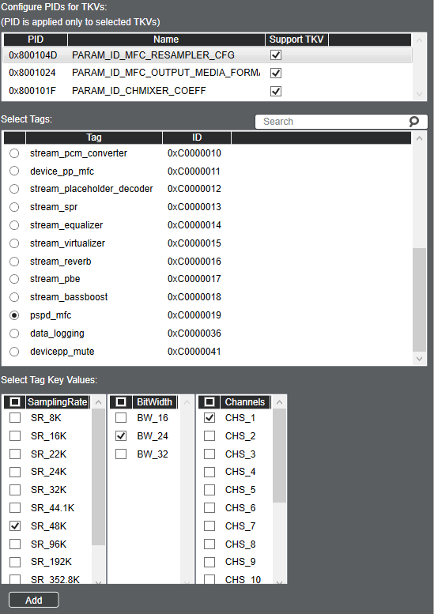

.. _design_concept:

AudioReach Concepts and Terminology
###################################

.. contents::
   :local:
   :depth: 2

Introduction
============

Design and implementation of AudioReach software revolves around following core concepts and associated terminology. Before developing audio applications using AudioReach, it is important for developers to comprehend these concepts:

 - Audio graphs
 - Key vectors
 - Module identification and configuration
 - Use case to audio graph mapping
 - Use case to calibration data mapping 
 - Data driven through H2XML

This document will be referring to the AudioReach Engine (or ARE), which is the signal processing framework for AudioReach. For more information on AudioReach Engine, please refer to the :ref:`arspf_design` page.

Use Case to Audio Graph Mapping
===============================

In AudioReach, use cases are represented as audio graphs containing a series of interconnected audio modules from source end point(s) to sink end point(s). 
The following sections will discuss the different components of audio graphs in AudioReach and how to configure various aspects of an audio use case, as well as how these concepts are presented in AudioReach Creator.

Graphs
-------

* A **graph** is a logical representation of a group of one or more sub-graphs connected together in-order to realize a specific use-case. Data moves across this graph to realize the use-case.

   * The simplest graph could be one subgraph consisting of a single module.
* **Subgraphs** are a logical abstraction for a group of modules that are connected and manipulated as a single entity. They are used to independently control portions of a graph when switching between use cases.

   * The purpose of dividing a use case into subgraphs is to make graph management easier. It is not always necessary to change all modules in a graph when the use case changes or when a device switch happens. Subgraphs enable an update to apply to only a part of the graph.
   * Using subgraphs reduces the number of entries required to complete a full device tuning for all use cases.
* **Modules** are independent blocks in the DSP or software that accomplish some aspect of a use case. They are the smallest independent processing unit within the signal processing framework. In AudioReach, every function from endpoint to endpoint is represented as a module. Some examples of modules include hardware sources and sinks, software memory endpoints, and audio processing such as filtering, and data logging and metering.
* **Containers** are a unique concept of AudioReach Engine. They allow a system designer to group and execute audio processing modules together in a single software thread.

More detailed information about each of the concepts above can be found in the :ref:`arspf_design` page.

The figure below illustrates key constructs and composition of a typical audio playback use case graph consisting of multiple subgraphs. Inside each subgraph, there are multiple modules, all assigned with unique IDs (instance id), which can be grouped into one or multiple containers. Please note that container may not be associated with only one subgraph.

.. _example_audiopb_graph:

.. figure:: images/concept/graph_concept.png
   :figclass: fig-center
   :scale: 75 %
   
   Example Audio Playback Graph

Breaking an audio graph into subgraphs enables the audio system designer to group audio processing modules into higher-level constructs such as stream-leg and device-leg. Then, the designer can develop middleware layer to 
manage the audio use case and the sink/source endpoint in the form of stream and device. Endpoints can be a hardware base, such as I2S, or a software base, such as shared memory for exchanging audio sample between client 
and AudioReach Engine. During a state transition, such as switching the audio output to a different sink endpoint, the middleware layer only needs to tear down device-leg subgraph while retaining stream-leg subgraph. 
Then, the use case can resume by instantiating another device-leg subgraph for new sink endpoint and reattaching it to the stream-leg subgraph to form a new full graph.

Keys and Values
-------------------
A **key** is an abstract entity containing several values that uniquely identify some aspect of an audio use case.

A **key vector** (KV) is a general term used to describe a set of key-values. Each KV may
contain one or more key-value pairs. By using different KVs, multiple use cases and
calibrations can be achieved. In AudioReach, there are three kinds of KVs:

* **Graph key vector (GKV)** – Defines a use case. Key-values are applied to subgraphs within the use case. The graph or system designer associates a set of unique <keys> and <values> when creating a sub-graph from the ARC UI canvas.
* **Tag Key Vector (TKV)** – Also known as a Module Tag. Applied to individual modules that require parameter control at runtime. Each module tag may contain one or more keys, and these keys may be applied on a per-module basis in the form of a TKV.
* **Calibration key vector (CKV)** – Define various calibrations within a single use case (for example, sample rate or volume dependency). Key-Values are applied to individual modules.

**Key-value pairs** are the individual keys and associated values in the key vector. For example, sound device can be a key and the value can be headphone, speaker, or other sound device.

The full list of keys and values enabled in AudioReach can be found in the **Audio Calibration Database** (or ACDB) in the file `kvh2xml.h <https://github.com/AudioReach/audioreach-conf/blob/master/linux/kvh2xml.h>`_.

Graph Key Vector (GKV)
----------------------
A **GKV**, also known as a use case ID, is a vector of key-value pairs that uniquely identify
a whole graph. The key-value pairs are used to select a unique combination of
subgraphs to realize the full use case.

GKV example
~~~~~~~~~~~

Below is an example set of GKVs for a Low-Latency playback graph:

* [StreamRx: PCM_LL_Playback] [DeviceRX: Speaker] [Instance: Instance_1] [DevicePP_Rx: Audio_MBDRC]

The GKVs are managed by the PAL layer (audioreach-pal) at runtime. When a new stream is opened, the requested stream type will be sent to the pal_stream_open
API. These stream types are mapped to the StreamRx key values. So when opening the new stream, PAL will assign the next available
instance of the desired stream type and map the correct instance key and value. The same is true for the Device type as well. For example, if the caller of pal_stream_open specifies the output 
device as "Speaker", PAL will map this to the corresponding Speaker GKV.

Note that changing the key value does not automatically change the topology. When
making customizations, care must be taken to ensure that key values match their
respective subgraph topologies.
Together, these four key-values make up the full GKV which is addressed from the
driver-side perspective.
However, from the system designer perspective, these key-values can be assigned
flexibly to subgraphs. Each subgraph has a SGKV that always consists of one or more of
the graph key-values. This allows the system designer to achieve potentially complex
subgraph configurations from a simple set of graph key-values.

Use Case to Calibration Data Mapping
====================================

Once a graph is loaded on ARE, the next step is to push the corresponding calibration for all the modules in the graph so modules can produce desired acoustic output for intended use cases.
Mapping of calibration data to use case is done by querying ACDB with the calibration handle in the form of key-vector (CKV) as depicted in figure - :ref:`example_audiopb_graph`. 

Typically, calibration data being applied is highly dependent on runtime parameters such as sample-rate, bitwidth, channels, gains, and etc. Hence, it is likely system designer would use these run-time parameters as keys. 

Calibration Key Vector (CKV)
----------------------------
A **CKV** is assigned at a per-module level to realize specific calibrations for a use case.
Calibration keys enable multiple calibrations within a single subgraph. Each module in
the subgraph may be dependent on none, some, or all available CKVs depending on the
system designer’s choice. The system designer may also choose to include or exclude
groups of module parameters from CKV dependency.
For example, a use case may require different module tunings for different sample rates.
Using CKVs, the user can specify which modules and module parameters are samplerate dependent or agnostic. This simplifies the total number of calibration entries and
reduces unnecessary copying between calibrations.

When assigning multiple CKVs to a module, the number of calibration entries is n*m,
where n and m are the number of values used for each key. For example, if one key had
4 values, and another had 6 values, the total number of calibration entries would be 24 if
both were assigned to a single module.

CKV example
~~~~~~~~~~~
Consider the Device subgraph from the Low Latency playback use case (note: this is the Low Latency playback graph that is used for the RB3 Gen2 device).

The CKVs used in this subgraph are visible as drop-down menus in the top bar of the
subgraph.

By selecting CKVs from the drop-down menus, the system designer or tuning engineer
may recall a specific calibration for the entire subgraph. This can affect multiple modules at a time or only one module.
In this case, setting a volume level will change the calibration for the Volume Control module. 
Selecting the volume level will change the gain value for all channels.  For example, setting the volume calibration to
"Level_3" will increase the gain value by a specified amount in the Volume Control module, as seen in the below image:

CKVs can be viewed or modified by using the Key Configurator. 

Parameters may be copied from one calibration to another using the batch copy
function.

Module Identification and Configuration
=======================================

A usecase may require enable/disable/configure certain capability at runtime e.g controllable audio effects: equalizer, volume, and echo cancellation. This capability can be supported by one or multiple modules in the audio graph. 
Different algorithm developers can develop modules supporting same capability but different configuration parameters. Audio system designer may select one module over the other for his/her product. 

Since the module implementing this capability may be different across different subgraphs and software does not want to be hard coded to work with fixed set of modules, a mechanism to identify and configure these modules in a generic way is needed. 
AudioReach architecture refers generic identification and configuration mechanism as "tagging". 

Tag Key Vector (TKV)
---------------------

A module tag, or **TKV**, is an identifier set on a module to identify and set runtime controllable
parameters.

For example, an audio application may need to support turning echo cancellation on or off during run-time. To do this, the audio system designer can define a tag "echo cancellation", and keys "ON" and "OFF". 
Then, this tag-key pair can be used on the EC module in the graph.

Then, when the echo cancellation needs to be enabled/disabled/configured, the software fetches the tagged module info and configuration parameters from the Audio Calibration Database by passing the tag and key. 
This allows the software to address and package the configuration to desired module running on AudioReach Engine in a generic fashion during run-time.

In AudioReach architecture, commands and events exchanged with ARE are always packaged as depicted in the figure below.

   Module Parameter Structure

This capability can be supported by one or multiple modules in the audio graph. Additionally, different algorithm developers can develop modules supporting the same capabilities but with different configuration parameters.

Each module tag may contain one or more keys, and these keys may be applied on a per-module basis as a TKV. Multiple TKVs may be applied to a module for different states.
Other module tags may not have key(s) associated. In this case, only the tag is applied to a module.

TKV example
~~~~~~~~~~~

Consider the Media Format Converter (or MFC) module, which is used to convert the media format of audio streams. 
During an audio playback use case, the MFC can convert the media format of the audio clip to a configuration that is supported by the 
device endpoint. For example, if an output stream has a 44.1K sample rate, but the backend device is configured to 48K, the MFC will
convert the output stream to 48K to match the output device. This is accomplished through the use of the tag pspd_mfc, which contains keys for sampling rate, bit width, and channels. 
The source code that configures this tag can be found in the `configure_mfc <https://github.com/AudioReach/audioreach-graphmgr/blob/5a78c5df2b45db3c5f024fffb12a9a83a61af4ff/plugins/tinyalsa/test/agmplay.c#L455>`_ 
function in the AGM test application agmplay.c. The definition of this tag is listed in the kvh2xml.h file below:

TKVs can be assigned to modules through the "Key Configurator" tab in AudioReach Creator. To view:

1. On the top bar, select "View" and then "Key Configurator." A Key Configurator tab will appear on the right 

2. Select a module in the graph view.

3. Select the Key Configurator Tab on the right.

   
4. Select the Module Tag tab. The currently assigned tags for the module can be seen on the top (if empty, there are no tags assigned to the module):

Each group of module parameters, (called parameter ID (PID)) may be controlled by
module tags. In the above example, the pspd_mfc tag is assigned with three TKVs: Sampling Rate, Bit Width, and Channels. 
In the Module Tag tab, the user can add a new
tag with an additional set of supported TKVs by selecting "Start Graph Modification", then selecting the plus button in the top right of the Module Tag tab.

Below shows an example of how to add a new pspd_mfc tag index, with updated sample rate, bit width, and channel values:

Once the tag values are added in the Key Configurator window, the new parameter values can be set for each module tag entry. Close the Key Configurator and
double-click on the module in the Graph View to open the Calibration Window.

Click Tag Data in the left sidebar to reveal the module tag calibration. Then click the Tag Indices drop-down to set parameters for each tag index. The newly added tag values can be seen here.
Now, tag indices can be selected based on the desired output media format.

.. figure:: images/concept/mfc_calibration_window.png
   :figclass: fig-left

Data Exchange Modes
-------------------

There are different modes which calibration/configuration data can be applied on targeted module(s).
Choice of mode is based on whether module has the mode implemented in consideration of size of configuration data, available memory to hold the calibration data, or memory access requirement (Read-Only, Read-Write). 
Refer to :ref:`spf_cal_config_mode` to learn more about data change modes. Note that GSL does not support shared-persistent calibration at time of writing.

Data Driven through H2XML
=========================
H2XML (Header to XML) is a generic tool for generating XML files from annotated C header files. Grammar and syntax of the annotations are similar to Doxygen. 
H2XML plays big part in enabling data-driven workflow. For example, audio algorithm developers can generate metadata (in form of XML files) of their processing module from module header files using H2XML and 
import generated XML file into ACDB via ARC tool to incorporate and configure audio processing module in use case graph design.
