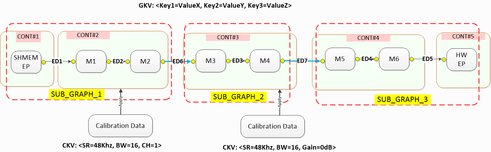

AudioReach Concept and Terminology
=====================================

.. contents::
   :local:
   :depth: 2

Introduction
----------------

Design and implementation of AudioReach software revolves around following core concepts and associated terminology. Before developing audio applications using AudioReach, it is important for developers to comprehend these concepts.

 - Audio graph
 - Use case to audio graph mapping
 - Use case to calibration data mapping 
 - Module identification and configuration
 - Data driven through H2XML

Audio Graph
-----------------------------

Concept
++++++++

Figure below illustrates key constructs and composition of a typical audio playback use case graph consisting of multiple sub-graphs. Inside each sub-graph, there are multiple modules, all assigned with unique IDs (instance id), which can be grouped into one or multiple containers. Please note that container may not be associated with only one sub-graph. 

Breaking audio graph into sub-graphs enables audio system designer group audio processing modules into higher-level constructs such as stream-leg and device-leg. Then, designer can develop middleware layer to manage audio use case and sink/source endpoint in form of stream and device. Endpoint can be hardware base such as I2S and software base such as shared memory for exchanging audio sample between client and AudioReach Engine. During state transition such as switching audio output to different sink endpoint, middleware layer only needs to tear down device-leg sub-graph while retaining stream-leg sub-graph. Then, resume the use case by instantiating another device-leg subgraph for new sink endpoint and reattach to stream-leg subgraph to form new full graph.

.. _example_audiopb_graph:

	
   Example Audio Playback Graph

Constructs
++++++++++

This section provides high-level description of audio graph constructs. More detail information of each construct can be found in :ref:`arspf_design`.

**Module:** is the smallest independent processing unit within signal
processing framework.

**Sub-graph**: is a logical abstraction for a group of modules that are
connected and manipulated as a single entity.

**Graph**: is a logical interpretation of a group of one or more
sub-graphs connected together in-order to realize a specific use-case.
Data moves across this graph to realize the use-case.
The simplest graph could be one sub-graph consisting of a single module.

**Container**: is a unique concept of AudioReach Engine.
It allows system designer to group and execute audio processing modules together
in single software thread

Use Case to Audio Graph Mapping
--------------------------------

Concept
++++++++

Refer to :ref:`arch_overview`. Audio graph definitions are stored in ACDB. During use case setup time, audio graph definition is retrieved from ACDB with use case handle passed by the client which is in form of key vector. In the figure - :ref:`example_audiopb_graph`, GKV is consisted of 3 key-value pairs in this example. What attributes to be used as keys to form key vector depends on platform requirement. For example, sound device can be used as key with potential value such as headphone and speaker.

Once audio graph definition is retrieved by looking up ACDB with GKV, graph definition is pushed down to ARE by ARGS.

Constructs
++++++++++

This section provides high-level description of constructs involved in use case to audio graph mapping. More detail information of each construct can be found in :ref:`args_design`.

**Use Case**: An audio use case is a graph of modules from source end point(s) to sink end point(s) that satisfies the product defined use case.

**Key value pair**: is the individual key and associated values in the key vector. For example, sound device can be a key and value can be headphone, speaker, or other sound device.

**Key Vector**: Uniquely identify graph or subgraph through a set of key value pairs.

**Graph Key Vector**: A unique identifier to retrieve the Graph. A KV ( key vector) is represented by a set of multiple key value pairs. The graph or system designer associates a set of unique <keys> and <values> when creating a sub-graph from the ARC UI canvas.

Use Case to Calibration Data Mapping
-------------------------------------

Concept
++++++++++++

Once a graph is loaded on ARE, the next step is to push the corresponding calibration for all the modules in the graph so modules can produce desired acoustic output for intended use cases.
Mapping of calibration data to use case is by querying ACDB with calibration handle in form of key-vector (CKV) as depicted in figure - :ref:`example_audiopb_graph`. 

Typically, calibration data being applied is highly dependent on runtime parameters such as sample-rate, bitwidth, channels, gains, and etc. Hence, it is likely system designer would use these run-time parameters as keys. 

Constructs
++++++++++++

This section provides high-level description of constructs involved in use case to calibration mapping. More detail information of each construct can be found in :ref:`args_design`.

**Key value pair**: is the individual key and associated values in the key vector. For example, sample rate can be a key with values such as 8Khz, 16Khz, 48Khz.

**Key Vector**: Uniquely identify calibration data through a set of key value pairs.

**Calibration Key Vector**: A unique identifier to retrieve the calibration data. A KV (key vector) is represented by a set of multiple key value pairs. The graph or system designer associates a set of unique <keys> and <values> when storing calibration from the ARC.

Module Identification and Configuration
-----------------------------------------

Concept
+++++++++

A usecase may require enable/disable/configure certain capability at runtime e.g controllable audio effects: equalizer, volume, and echo cancellation. The capability can be supported by one or multiple modules in the audio graph. Different algorithm developers can develop modules supporting same capability but different configuration parameters. Audio system designer may select one module over the other for his/her product. 

Since the module implementing this capability may be different across different subgraphs and software does not want to be hard coded to work with fixed set of modules, a mechanism to identify and configure these modules in a generic way is needed. AudioReach architecture refers generic identification and configuration mechanism as "tagging". Audio system designer tags the module in the graph with identifier(tag ID) and defines keys to represent different configuration of given module through ARC and save into ACDB. For example, an audio application needs to support turning on/off echo cancellation at run-time. Audio system designer defines tag as "echo cancellation" and keys as ON and OFF. Then, tag the EC module in the graph with the tag "echo cancellation" and map key - ON/OFF to module specific parameters and values

When the capability needs to enable/disable/configured, software fetches tagged module info and configuration parameters from ACDB by passing tag and key. So software, at run-time, can address and package the configuration to desired module running on ARE in generic fashion.

Constructs
++++++++++++

**Tag & Tag Key Vector**: Tag is an identifier set on a module to identify/set runtime controllable params of one or more modules. Use case may require updating configuration of one or more modules in a graph to enable/disable/configure certain capability of a module at runtime. e.g. echo cancellation, and equalizer

**Module Parameter Structure**: In AudioReach architecture, commands and events exchanged with ARE are always packaged as depicted in the figure below

.. figure:: images/module_structure.png
   :figclass: fig-center

   Module Parameter Structure

Data Exchange Modes
++++++++++++++++++++

There are different modes which calibration/configuration data can be applied on targeted module(s). Choice of mode is based on whether module has the mode implemented in consideration of size of configuration data, available memory to hold the calibration data, or memory access requirement (Read-Only, Read-Write). Refer to :ref:`spf_cal_config_mode` to learn more about data change modes. Note that GSL does not support shared-persistent calibration at time of writing.

Data Driven through H2XML
-------------------------
H2XML (Header to XML) is a generic tool for generating XML files from annotated C header files. Grammar and syntax of the annotations are similar to Doxygen. H2XML plays big part in enabling data-driven workflow. For example, audio algorithm developers can generate metadata (in form of XML files) of their processing module from module header files using H2XML and import generated XML file into ACDB via ARC tool to incorporate and configure audio processing module in use case graph design.
