.. _gpr_design:
	
Generic Packet Router
#####################

.. contents::
   :local:
   :depth: 2

Introduction
============

Purpose
-------

This document describes the Generic Packet Router (GPR) API, which
is intended to help developers understand and use the GPR to access
or publish new services. Readers are assumed to be developers with
some familiarity in packet-based and message-based protocols.
This document provides the public interfaces necessary to use the
features provided by the GPR API. A functional overview and
information on leveraging the interface functionality are also
provided.

.. _gpr_overview:

Functional Overview
===================

This chapter provides an overview of the GPR infrastructure and
protocol.

GPR Infrastructure
------------------

The GPR infrastructure provides a common set of APIs across
different platforms, software layers, and processor domains to
enable them to communicate using asynchronous messages. The
infrastructure is a memory optimized, platform agnostic layer.
The following figure illustrates an example of the GPR
infrastructure on different processor domains such as the
Application domain, DSP domain, and so on. The GPR can also be used
on different platforms such as the Arm processor and Windows
operating system. Refer to  `GPR infrastructure on different processing domains <#id30>`__

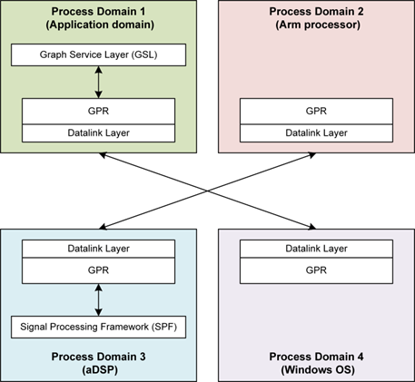

   GPR infrastructure on different processing domains

The AudioReach Engine (ARE) provides the necessary
framework to realize audio and voice use cases with various
algorithm and framework modules (see :ref:`arspf_design`). The
Graph Service Layer (GSL) serves as the client and interacts with
the ARE to provide use case configuration and calibration.
The GPR is responsible for routing messages and commands between the
ARE and GSL processing domains in the AudioReach framework. It
achieves this remote communication by abstracting out the underlying
Interprocessor communication (IPC) data link layers. Essentially,
the GPR does two types of routing:

-  Local routing – Communication within the same processor domain.

-  Remote routing – Communication between different processor domains.
   The GPR interfaces with the data link layer to achieve this remote
   routing.

GPR Software Layering
^^^^^^^^^^^^^^^^^^^^^

The GPR infrastructure is categorized into three layers: core layer,
data link layer, and platform layer. Below figure
illustrates this simplified model.

.. _gpr_layering_model:

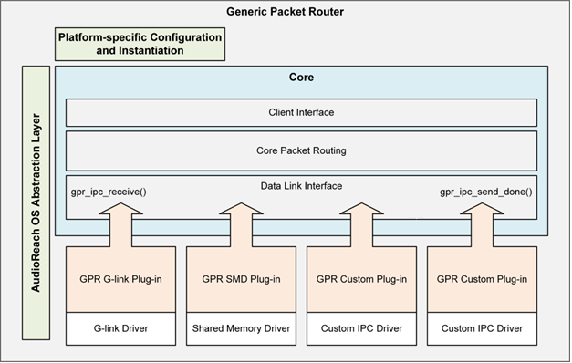

   GPR layering model

Core Layer
^^^^^^^^^^

The core layer implements the core GPR functionality and can be
further classified into the following functional blocks.

-  Client interface

   -  Implements the core GPR APIs such as send packets, allocate
      packets, and so on that are used by all clients.

-  Packet routing layer

   -  Implements the GPR packet queues.

   -  Is responsible for local routing, which refers to packets that are
      transmitted within the same processor domain.

-  Data link interface

   -  Is the GPR’s interface with the data link layer.

   -  Implements the GPR callback functions that are shared with every
      data link layer.

   -  Functions are called *GPR-to-IPC* callback functions and are
      essential to enable remote routing (see Section
      :ref:`gpr_to_ipc_callback_functions`).

Data Link Layer
^^^^^^^^^^^^^^^

    The GPR data link layer is responsible for remote routing, which is
    the routing between different processor domains. Every data link
    implementation has two parts:

-  Core data link layer

   -  Contains the actual implementation of the data link transport
      layer APIs and functionality that facilitates remote routing.

   -  Examples of data link layers include the Generic Link (G-link)
      and the Shared Memory Driver (SMD).

-  GPR data link plug-in

   -  Wrapper to the core data link layer.

   -  Implements the IPC-to-GPR callback functions (see Section
      :ref:`ipc_to_gpr_virtual_function_wrapper`) that are shared
      with the GPR data link interface during initialization.

    Each domain can support multiple data link or transport mechanisms.
    As illustrated by `Fig: GPR layering model <#_gpr_layering_model>`__, any custom data link
    implementation can be plugged in to the GPR. As long as both
    processor domains implement the same data link layer, they can
    establish communication through it. At any time, the GPR supports
    only one data link between two given process domains.

Platform layer
^^^^^^^^^^^^^^

The platform layer comprises all the platform
specific-implementations and enables the GPR to be platform
agnostic. It has two components:

-  Platform-specific configuration wrappers

   -  Enable each platform to instantiate the GPR with platform-specific
      configuration (see Section
      :ref:`platform_specific_configuration_wrappers`).

-  Common Operating System Abstraction Layer (OSAL)

   -  GPR core layer uses this layer as well as the GPR data link
      plug-in layers.

API Messaging Model
-------------------

Asynchronous Messaging Design
^^^^^^^^^^^^^^^^^^^^^^^^^^^^^

The GPR infrastructure follows an asynchronous messaging design that
can deliver unidirectional messages quickly and support messaging in
the interrupt context.

Message Structure
^^^^^^^^^^^^^^^^^

The GPR infrastructure defines the GPR message send function, the
message receive callback function, and the message structure. The
current GPR protocol uses 4-byte aligned, little-endian messages.
Any unrecognized messages will cause the GPR send message function
to return an error. The sender is expected to free undelivered
messages and gracefully handle return errors.
**NOTE:** Messages and packets are used interchangeably in the GPR
infrastructure.

GPR Protocol
------------

The GPR protocol is a core messaging protocol that runs on top of
the GPR infrastructure and includes the following features:

-  Provides a standard, real-time capable messaging protocol between
   client applications and software layers.

-  Is a lightweight layer that has minimum protocol overhead.

-  Is platform-agnostic.

-  Requires the underlying data and transport layers to guarantee serial
   delivery.

-  Assumes that clients and subsystems will recover from undelivered or
   late transactions.

.. _packet_details:

Packet Details
^^^^^^^^^^^^^^^^^

Below figure illustrates the GPR message/packet
structure (`gpr\_packet\_t <#struct-gpr-packet-t>`__), where the
numbers at the top indicate the bit positions. The following
sections provide more details.

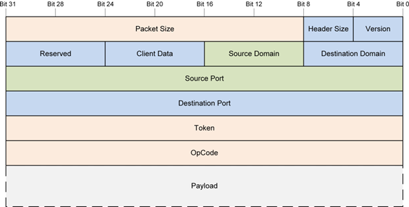

   GPR packet data structure with all fields

Size and Version Fields
^^^^^^^^^^^^^^^^^^^^^^^

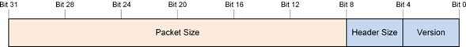

The following table shows the information for these fields.

+--------------------+--------------------------+---------------------------------------------------------------------------------------------------------------------------------------+
|     **Subfield**   |     **Number of bits**   |     **Description**                                                                                                                   |
+====================+==========================+=======================================================================================================================================+
|     Version        |     4                    |     Defines the layout of the packet structure.                                                                                       |
|                    |                          |                                                                                                                                       |
|                    |                          |     Unless otherwise indicated, packet versions are assumed to be backward-compatible to the core format (first five header words).   |
+--------------------+--------------------------+---------------------------------------------------------------------------------------------------------------------------------------+
|     Header Size    |     4                    |     Number of 32-bit header words starting from the beginning of                                                                      |
|                    |                          |                                                                                                                                       |
|                    |                          |     the packet.                                                                                                                       |
+--------------------+--------------------------+---------------------------------------------------------------------------------------------------------------------------------------+
|     Packet Size    |     24                   |     Total packet size in bytes, including both the header and                                                                         |
|                    |                          |                                                                                                                                       |
|                    |                          |     payload data.                                                                                                                     |
+--------------------+--------------------------+---------------------------------------------------------------------------------------------------------------------------------------+

.. _source_and_destination_domain_fields:

Source and Destination Domain Fields
^^^^^^^^^^^^^^^^^^^^^^^^^^^^^^^^^^^^

The GPR messaging protocol uses a domain ID to define the host
process, processor, or target, and it uses a service ID to define
the services or modules that live within the host.
Every domain must have a dedicated local GPR instance. All messages
must flow through their local GPR instances. The GPR dispatches
messages locally or remotely according to each message’s destination
domain value.
Below figure illustrates two domains, each with its
own GPR instance.

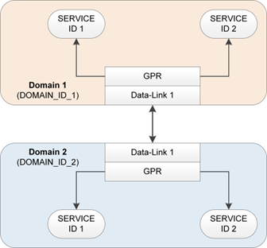

   Example of interprocess communication

The following figure illustrates the destination domain field, which
represents a processor or off-target location that contains the GPR
to which the packet is sent.

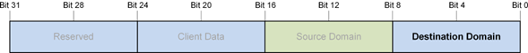

The following figure illustrates the source domain field, which
represents a processor or off-target location that contains the GPR
from which the packet is sent.

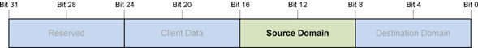

Client Data Field
^^^^^^^^^^^^^^^^^

The client data field is used for client-specific needs. By default,
this field must be set to 0 when unused.
The following figure illustrates the field, in which 4 bits are open
for use by the client and 4 bits are reserved and are set to 0.

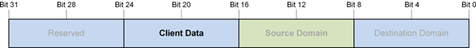

Reserved Field
^^^^^^^^^^^^^^

The reserved field must always be set to 0.

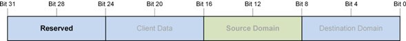

.. _source_and_destination_port_fields:

Source and Destination Port Fields
^^^^^^^^^^^^^^^^^^^^^^^^^^^^^^^^^^

The source port field represents a unique (within a given domain) ID
that can be used to identify a service or module in the source
domain. It is interpreted as the service ID of the source service or
module instance.
**NOTE:** The terms *port* and *service ID* can be used
interchangeably.

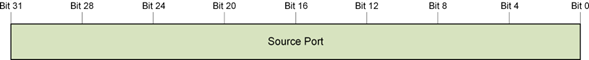

The destination port field represents the unique (within a domain)
ID that can be used to identify a service or module in the
destination domain. It is interpreted as the service ID of the
destination service or the module instance ID of the destination
module.

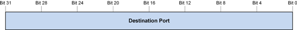

Token Field
^^^^^^^^^^^

The token field no subfields. It is a transaction identifier, a
sequence number, or any value that allows a client to identify which
command is completed after receiving a command response message. The
token field must be set to 0 when unused.

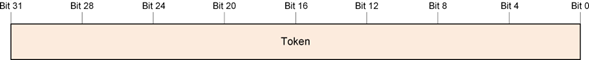

.. _opcode_field:

Opcode Field
^^^^^^^^^^^^

The opcode is a GUID value that is used when selecting the operation
and defining the payload structure. The operation selects the
function call, and the payload contains the function arguments.

.. figure:: images/gpr/Image13.png
   :width: 6.13667in
   :height: 0.62500in
   :figclass: fig-center

Payload Field
^^^^^^^^^^^^^

The payload field has no subfields. It contains the arguments to the
function call specified in the opcode field (defined in section
:ref:`opcode_field`).

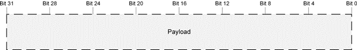

General Operations
------------------

Addressing Scheme
^^^^^^^^^^^^^^^^^

The source or destination for a given GPR packet is identified by a
32-bit service ID (see section
:ref:`source_and_destination_port_fields`) and the 8-bit
processor domain to which the service belongs (see Section
:ref:`packet_details`).
For a given service, the service ID must be unique within the
domain. All services within a domain have the same domain ID.

Registration
^^^^^^^^^^^^

To send or receive packets, each service or module must first
register with the GPR. Registration can be done at any time by
calling the
`gpr\_cmd\_register() <#static-uint32-t-gpr-cmd-register-uint32-t-src-port-gpr-callback-fn-t-void-callback-data>`__
function to register the packet callback function of the service.
Each instance of the GPR maintains a database that stores this
service ID information along with the corresponding callback
function and callback argument (if non-NULL) upon registration.
Every time a new service registers, an entry is added to the
database.
All entries in the database can be identified by their unique
service IDs.

Deregistration
^^^^^^^^^^^^^^

During a power-down sequence, services or modules must deregister
from the GPR by calling
`gpr\_cmd\_deregister() <#static-uint32-t-gpr-cmd-deregister-uint32-t-src-port>`__.
Each registered service ID is to be deregistered only once.

Send Messages
^^^^^^^^^^^^^

Services or modules use
`gpr\_cmd\_async\_send() <#static-uint32-t-gpr-cmd-async-send-gpr-packet-t-packet>`__
to send messages in the form of packets through the GPR service.
Callers must check the return result of
`gpr\_cmd\_async\_send() <#static-uint32-t-gpr-cmd-async-send-gpr-packet-t-packet>`__
for failures, free the packet when the send function fails, and,
when necessary, perform error recovery.
The low-level
`gpr\_cmd\_async\_send() <#static-uint32-t-gpr-cmd-async-send-gpr-packet-t-packet>`__
function leaves packet allocation and error management to the
caller. Utility APIs are available to make working with
`gpr\_cmd\_async\_send() <#static-uint32-t-gpr-cmd-async-send-gpr-packet-t-packet>`__
easier. These functions are not mandatory. The caller can use any
utility library to help with packet allocation and error management.

Receive Messages
^^^^^^^^^^^^^^^^

Services can start receiving messages immediately after registering
with the GPR service. The registered packet callback routine is
assumed to run in the ISR context. All the restrictions in the ISR
context apply to the packet callback routine.
Messages serviced in the ISR context have the highest priority
possible. Any time-consuming operations must be queued to the thread
context for further processing in the appropriate thread priority
level.
You cannot call blocking routines in the dispatch context. Blocking
will cause system instability and performance problems.

Routing
=======

Routing refers to the GPR’s ability to send and receive data packets
to and from clients or other GPR instances. Depending on the source
and destination domain IDs, the GPR must do either local or remote
routing.
Below figure illustrates the difference between
local and remote routing, which is explained in the following
sections.

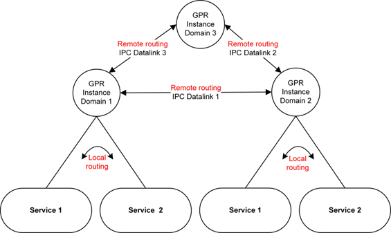

   Local and remote routing through GPR

Local Routing
-------------

Local routing refers to the transmission of packets within the same
domain.
The GPR determines a given routing to be local if the source domain
ID and destination domain ID are the same. In this case, the GPR
simply searches its database to retrieve the callback function based
on the unique destination service ID. After the callback function is
retrieved, the destination service’s callback routine is invoked and
the packet is sent.
Below figure illustrates the call flow between two
service on the same domain. Both services must first register their
callback functions with the GPR, and then they can exchange
messages.

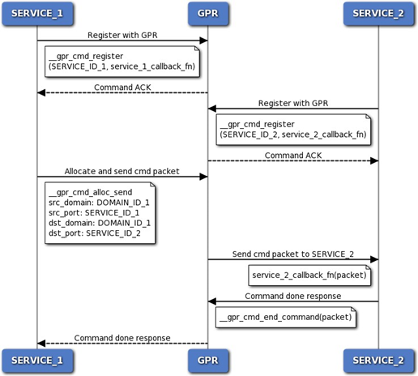

   Local routing call flow between two services on same domain

Remote Routing
--------------

Remote routing refers to the transmission of packets between
different domains or processors. The GPR and IPC data link layers
interact and exchange GPR-IPC callback functions during
initialization (see Sections
:ref:`gpr_to_ipc_callback_functions` and
:ref:`ipc_to_gpr_virtual_function_wrapper`.) These callback
functions are then invoked at runtime to enable remote routing.
`Fig: Remote routing call flow <#_remote_routing_call_flow>`__ below illustrates the call flow for remote
routing. Services on each domain must register with their respective
GPR instances.
Following is the process for sending packets to remote processors:

1. The GPR allocates a packet and calls the data link layer’s send()
   function, which is stored in the
   `ipc\_to\_gpr\_vtbl\_t <#struct-ipc-to-gpr-vtbl-t>`__ virtual
   function table (vtable).

    This vtable invokes the data link layer to send the packet.

2. After the data link layer finishes transmitting the packet, it calls
   the GPR’s send\_done() function, which is stored in the
   `gpr\_to\_ipc\_vtbl\_t <#struct-gpr-to-ipc-vtbl-t>`__ virtual
   function table.

    This vtable invokes the GPR’s free() function to free the GPR
    packet.

Following is the process for remote processors to receive packets:

1. The data link layer copies the contents of the remote GPR packet into
   one of its packets.

2. Then it calls the GPR’s receive() function, which is stored in the
   `gpr\_to\_ipc\_vtbl\_t <#struct-gpr-to-ipc-vtbl-t>`__ virtual
   function table.
   This vtable invokes the GPR’s receive() function to transmit the
   packet to its destination.

3. After the GPR finishes transmitting the packet, it calls the data
   link layer’s receive\_done() function, which is stored in
   `ipc\_to\_gpr\_vtbl\_t <#struct-ipc-to-gpr-vtbl-t>`__.
   This vtable invokes the data link layer’s free() function to free
   the packet.

.. _remote_routing_call_flow:

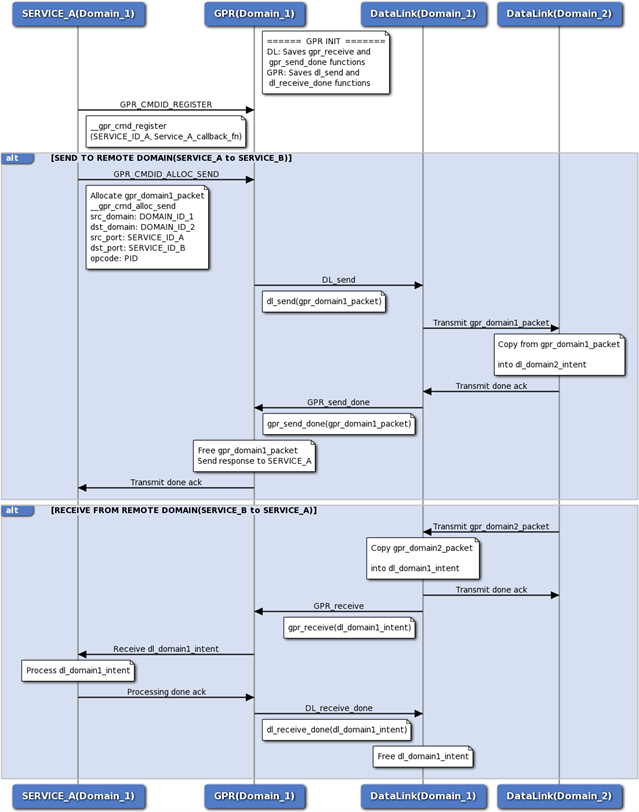

   Remote routing call flow between GPR and IPC data link layer

GPR Infrastructure Interfaces
=============================

.. _gpr_contants_and_macros:

GPR Constants and Macros
-------------------------

\ **GPR Core Export Macros**

-  #define `GPR\_INTERNAL <#define-gpr-internal-extern-c>`__ extern "C"

-  #define `GPR\_EXTERNAL <#define-gpr-external-extern-c>`__ extern "C"

\ **GPR Domain IDs**

A domain ID is to a unique ID that identifies a process, a
processor, or an off-target location that houses GPR. The transport
mechanism between the published domains can vary.
Domain IDs are directly used as port indices to access GPR routing
arrays. Hence they have to always have values starting from 0 such
as 0,1,2,3 and not Globally Unique IDs (GUIDS).

-  #define `GPR\_IDS\_DOMAIN\_ID\_INVALID\_V <#define-gpr-ids-domain-id-invalid-v-0>`__ 0

-  #define
   `GPR\_IDS\_DOMAIN\_ID\_MODEM\_V <#define-gpr-ids-domain-id-modem-v-1>`__
   1

-  #define
   `GPR\_IDS\_DOMAIN\_ID\_ADSP\_V <#define-gpr-ids-domain-id-adsp-v-2>`__
   2

-  #define `GPR\_IDS\_DOMAIN\_ID\_APPS\_V <#define-gpr-ids-domain-id-apps-v-3>`__ 3

-  #define
   `GPR\_IDS\_DOMAIN\_ID\_SDSP\_V <#define-gpr-ids-domain-id-sdsp-v-4>`__
   4

-  #define
   `GPR\_IDS\_DOMAIN\_ID\_CDSP\_V <#define-gpr-ids-domain-id-cdsp-v-5>`__
   5

-  #define
   `GPR\_PL\_MAX\_DOMAIN\_ID\_V <#define-gpr-pl-max-domain-id-v>`__

-  #define
   `GPR\_PL\_NUM\_TOTAL\_DOMAINS\_V <#define-gpr-pl-num-total-domains-v>`__

\ **GPR Packet Definitions**

-  #define `GPR\_PKT\_VERSION\_V <#define-gpr-pkt-version-v>`__

-  #define `GPR\_PKT\_INIT\_PORT\_V <#define-gpr-pkt-init-port-v>`__

-  #define
   `GPR\_PKT\_INIT\_RESERVED\_V <#define-gpr-pkt-init-reserved-v>`__

-  #define
   `GPR\_PKT\_INIT\_DOMAIN\_ID\_V <#define-gpr-pkt-init-domain-id-v>`__

-  #define
   `GPR\_PKT\_HEADER\_WORD\_SIZE\_V <#define-gpr-pkt-header-word-size-v>`__

-  #define
   `GPR\_PKT\_HEADER\_BYTE\_SIZE\_V <#define-gpr-pkt-header-byte-size-v>`__

-  #define `GPR\_UNDEFINED\_ID\_V <#define-gpr-undefined-id-v>`__

-  #define
   `GPR\_PKT\_INIT\_CLIENT\_DATA\_V <#define-gpr-ids-domain-id-apps-v-3>`__

-  #define
   `GPR\_PKT\_VERSION\_MASK <#define-gpr-pkt-version-mask-0x0000000f>`__
   ( 0x0000000F )

-  #define `GPR\_PKT\_VERSION\_SHFT <#define-gpr-pkt-version-shft-0>`__
   ( 0 )

-  #define
   `GPR\_PKT\_HEADER\_SIZE\_MASK <#define-gpr-pkt-header-size-mask-0x000000f0>`__
   ( 0x000000F0 )

-  #define
   `GPR\_PKT\_HEADER\_SIZE\_SHFT <#define-gpr-pkt-header-size-shft-4>`__
   ( 4 )

-  #define
   `GPR\_PKT\_RESERVED\_MASK <#define-gpr-pkt-reserved-mask-0xfff00000>`__
   ( 0xFFF00000 )

-  #define
   `GPR\_PKT\_RESERVED\_SHFT <#define-gpr-pkt-init-client-data-v>`__ (
   20 )

-  #define
   `GPR\_PKT\_PACKET\_SIZE\_MASK <#define-gpr-pkt-packet-size-mask-0xffffff00>`__
   ( 0xFFFFFF00 )

-  #define
   `GPR\_PKT\_PACKET\_SIZE\_SHFT <#define-gpr-pkt-packet-size-shft-8>`__
   ( 8 )

-  #define `GPR\_GET\_BITMASK <#define-gpr-get-bitmask-mask-shift-value>`__\ (mask, shift, value)

-  #define `GPR\_SET\_BITMASK <#define-gpr-set-bitmask-mask-shift-value>`__\ (mask, shift, value)

-  #define `GPR\_GET\_FIELD <#define-gpr-get-field-field-value>`__\ (field, value)

-  #define
   `GPR\_SET\_FIELD <#define-gpr-pkt-init-client-data-v>`__\ (field,
   value)

-  #define `GPR\_PTR\_END\_OF <#define-gpr-ptr-end-of-base-ptr-offset>`__\ (base\_ptr, offset)

-  #define
   `GPR\_PKT\_GET\_PACKET\_BYTE\_SIZE <#define-gpr-pkt-get-packet-byte-size-header>`__\ (header)

-  #define
   `GPR\_PKT\_GET\_HEADER\_BYTE\_SIZE <#define-gpr-ptr-end-of-base-ptr-offset>`__\ (header)

-  #define
   `GPR\_PKT\_GET\_PAYLOAD\_BYTE\_SIZE <#define-gpr-pkt-get-payload-byte-size-header>`__\ (header)

-  #define `GPR\_PKT\_GET\_PAYLOAD <#define-gpr-pkt-get-payload-type-packet-ptr>`__\ (type,
   packet\_ptr)

Define Documentation
--------------------

#define GPR\_INTERNAL extern "C"
^^^^^^^^^^^^^^^^^^^^^^^^^^^^^^^^

Export macro that indicates a function is internal to the GPR.

#define GPR\_EXTERNAL extern "C"
^^^^^^^^^^^^^^^^^^^^^^^^^^^^^^^^

Export macro that indicates an external function, which is intended
for client use.

#define GPR\_IDS\_DOMAIN\_ID\_INVALID\_V 0
^^^^^^^^^^^^^^^^^^^^^^^^^^^^^^^^^^^^^^^^^^

Invalid domain.

#define GPR\_IDS\_DOMAIN\_ID\_MODEM\_V 1
^^^^^^^^^^^^^^^^^^^^^^^^^^^^^^^^^^^^^^^^

Modem DSP (mDSP) domain.

#define GPR\_IDS\_DOMAIN\_ID\_ADSP\_V 2
^^^^^^^^^^^^^^^^^^^^^^^^^^^^^^^^^^^^^^^

Audio DSP (aDSP) domain.

#define GPR\_IDS\_DOMAIN\_ID\_APPS\_V 3
^^^^^^^^^^^^^^^^^^^^^^^^^^^^^^^^^^^^^^^

Applications domain.

#define GPR\_IDS\_DOMAIN\_ID\_SDSP\_V 4
^^^^^^^^^^^^^^^^^^^^^^^^^^^^^^^^^^^^^^^

Sensors DSP (sDSP) domain.

#define GPR\_IDS\_DOMAIN\_ID\_CDSP\_V 5
^^^^^^^^^^^^^^^^^^^^^^^^^^^^^^^^^^^^^^^

Compute DSP (cDSP) domain.

#define GPR\_PL\_MAX\_DOMAIN\_ID\_V
^^^^^^^^^^^^^^^^^^^^^^^^^^^^^^^^^^^

Highest domain ID.

#define GPR\_PL\_NUM\_TOTAL\_DOMAINS\_V
^^^^^^^^^^^^^^^^^^^^^^^^^^^^^^^^^^^^^^^

Total number of domains.

#define GPR\_PKT\_VERSION\_V
^^^^^^^^^^^^^^^^^^^^^^^^^^^^

Defines the layout of the packet structure.

#define GPR\_PKT\_INIT\_PORT\_V
^^^^^^^^^^^^^^^^^^^^^^^^^^^^^^^

Uninitialized port value.

#define GPR\_PKT\_INIT\_RESERVED\_V
^^^^^^^^^^^^^^^^^^^^^^^^^^^^^^^^^^^

Uninitialized reserved field value.

#define GPR\_PKT\_INIT\_DOMAIN\_ID\_V
^^^^^^^^^^^^^^^^^^^^^^^^^^^^^^^^^^^^^

Uninitialized domain ID value.

#define GPR\_PKT\_HEADER\_WORD\_SIZE\_V
^^^^^^^^^^^^^^^^^^^^^^^^^^^^^^^^^^^^^^^

Header size in number of 32-bit words.

#define GPR\_PKT\_HEADER\_BYTE\_SIZE\_V
^^^^^^^^^^^^^^^^^^^^^^^^^^^^^^^^^^^^^^^

Header size in number of bytes.

#define GPR\_UNDEFINED\_ID\_V
^^^^^^^^^^^^^^^^^^^^^^^^^^^^^

Undefined value where a valid GUID is expected.

#define GPR\_PKT\_INIT\_CLIENT\_DATA\_V
^^^^^^^^^^^^^^^^^^^^^^^^^^^^^^^^^^^^^^^

Uninitialized client data value.

#define GPR\_PKT\_VERSION\_MASK ( 0x0000000F )
^^^^^^^^^^^^^^^^^^^^^^^^^^^^^^^^^^^^^^^^^^^^^^

Bitmask of the version field.

#define GPR\_PKT\_VERSION\_SHFT ( 0 )
^^^^^^^^^^^^^^^^^^^^^^^^^^^^^^^^^^^^^

Bit shift of the version field.

#define GPR\_PKT\_HEADER\_SIZE\_MASK ( 0x000000F0 )
^^^^^^^^^^^^^^^^^^^^^^^^^^^^^^^^^^^^^^^^^^^^^^^^^^^

Bitmask of the header size field.

#define GPR\_PKT\_HEADER\_SIZE\_SHFT ( 4 )
^^^^^^^^^^^^^^^^^^^^^^^^^^^^^^^^^^^^^^^^^^

Bit shift of the header size field.

#define GPR\_PKT\_RESERVED\_MASK ( 0xFFF00000 )
^^^^^^^^^^^^^^^^^^^^^^^^^^^^^^^^^^^^^^^^^^^^^^^

Bitmask of the reserved field. Includes four reserved bits from the
client data field.

#define GPR\_PKT\_RESERVED\_SHFT ( 20 )
^^^^^^^^^^^^^^^^^^^^^^^^^^^^^^^^^^^^^^^

Bit shift of the reserved field.

#define GPR\_PKT\_PACKET\_SIZE\_MASK ( 0xFFFFFF00 )
^^^^^^^^^^^^^^^^^^^^^^^^^^^^^^^^^^^^^^^^^^^^^^^^^^^

Bitmask of the packet size field.

#define GPR\_PKT\_PACKET\_SIZE\_SHFT ( 8 )
^^^^^^^^^^^^^^^^^^^^^^^^^^^^^^^^^^^^^^^^^^

Bit shift of the packet size field.

#define GPR\_GET\_BITMASK( *mask, shift, value* )
^^^^^^^^^^^^^^^^^^^^^^^^^^^^^^^^^^^^^^^^^^^^^^^^^^^

Gets the value of a field, including the specified mask and shift.

#define GPR\_SET\_BITMASK( *mask, shift, value* )
^^^^^^^^^^^^^^^^^^^^^^^^^^^^^^^^^^^^^^^^^^^^^^^^^^^

Sets a value in a field, including the specified mask and shift.

#define GPR\_GET\_FIELD( *field, value* )
^^^^^^^^^^^^^^^^^^^^^^^^^^^^^^^^^^^^^^^^^^^^^^^^^^^

Gets the value of a field.

#define GPR\_SET\_FIELD( *field, value* )
^^^^^^^^^^^^^^^^^^^^^^^^^^^^^^^^^^^^^^^^^^^^^^^^^^^

Sets a value in a field.

#define GPR\_PTR\_END\_OF( *base\_ptr, offset* )
^^^^^^^^^^^^^^^^^^^^^^^^^^^^^^^^^^^^^^^^^^^^^^^^^^^

Returns an 8-bit aligned pointer to a base address pointer plus an
offset in bytes.

#define GPR\_PKT\_GET\_PACKET\_BYTE\_SIZE( *header* )
^^^^^^^^^^^^^^^^^^^^^^^^^^^^^^^^^^^^^^^^^^^^^^^^^^^^^

Given the packet header, returns the packet’s current size in bytes.
The current packet byte size is the sum of the base packet structure
and the used portion of the payload.

#define GPR\_PKT\_GET\_HEADER\_BYTE\_SIZE( *header* )
^^^^^^^^^^^^^^^^^^^^^^^^^^^^^^^^^^^^^^^^^^^^^^^^^^^^^

Given the packet header, returns the header’s current size in bytes.

#define GPR\_PKT\_GET\_PAYLOAD\_BYTE\_SIZE( *header* )
^^^^^^^^^^^^^^^^^^^^^^^^^^^^^^^^^^^^^^^^^^^^^^^^^^^^^^

Given the packet header, returns the payload’s current size in
bytes.
The current payload byte size is the difference between the packet
size and the header size.

#define GPR\_PKT\_GET\_PAYLOAD( *type, packet\_ptr* )
^^^^^^^^^^^^^^^^^^^^^^^^^^^^^^^^^^^^^^^^^^^^^^^^^^^^^^

Given the packet, returns a pointer to the beginning of the packet’s
payload.

.. _gpr_status_and_error_codes:

GPR Status and Error Codes
==========================

Define Documentation
--------------------

#define AR\_EOK (0)
^^^^^^^^^^^^^^^^^^^^^^^^^^^^^^^^^^^^^^^^^^^^^^^^^^^^^^

Success. The operation completed with no errors.

#define AR\_EFAILED (1)
^^^^^^^^^^^^^^^^^^^^^^^

General failure.

#define AR\_EBADPARAM (2)
^^^^^^^^^^^^^^^^^^^^^^^^^

Bad operation parameter.

#define AR\_EUNSUPPORTED (3)
^^^^^^^^^^^^^^^^^^^^^^^^^^^^

Unsupported routine or operation.

#define AR\_EVERSION (4)
^^^^^^^^^^^^^^^^^^^^^^^^

Unsupported version.

#define AR\_EUNEXPECTED (5)
^^^^^^^^^^^^^^^^^^^^^^^^^^^

Unexpected problem encountered.

#define AR\_EPANIC (6)
^^^^^^^^^^^^^^^^^^^^^^

Unhandled problem occurred.

#define AR\_ENORESOURCE (7)
^^^^^^^^^^^^^^^^^^^^^^^^^^^

Unable to allocate resource.

#define AR\_EHANDLE (8)
^^^^^^^^^^^^^^^^^^^^^^^

Invalid handle.

#define AR\_EALREADY (9)
^^^^^^^^^^^^^^^^^^^^^^^^

Operation is already processed.

#define AR\_ENOTREADY (10)
^^^^^^^^^^^^^^^^^^^^^^^^^^

Operation is not ready to be processed.

#define AR\_EPENDING (11)
^^^^^^^^^^^^^^^^^^^^^^^^^

Operation is pending completion.

#define AR\_EBUSY (12)
^^^^^^^^^^^^^^^^^^^^^^

Operation cannot be accepted or processed.

#define AR\_EABORTED (13)
^^^^^^^^^^^^^^^^^^^^^^^^^

Operation was aborted due to an error.

#define AR\_ECONTINUE (14)
^^^^^^^^^^^^^^^^^^^^^^^^^^

Operation requests an intervention to complete.

#define AR\_EIMMEDIATE (15)
^^^^^^^^^^^^^^^^^^^^^^^^^^^

Operation requests an immediate intervention to complete.

#define AR\_ENOTIMPL (16)
^^^^^^^^^^^^^^^^^^^^^^^^^

Operation was not implemented.

#define AR\_ENEEDMORE (17)
^^^^^^^^^^^^^^^^^^^^^^^^^^

Operation needs more data or resources.

#define AR\_ENOMEMORY (18)
^^^^^^^^^^^^^^^^^^^^^^^^^^

Operation does not have memory.

#define AR\_ENOTEXIST (19)
^^^^^^^^^^^^^^^^^^^^^^^^^^

Item does not exist.

#define AR\_ETERMINATED (20)
^^^^^^^^^^^^^^^^^^^^^^^^^^^^

Operation is finished.

#define AR\_ETIMEOUT (21)
^^^^^^^^^^^^^^^^^^^^^^^^^

Operation timeout.

#define AR\_SUCCEEDED( *x* )
^^^^^^^^^^^^^^^^^^^^^^^^^^^^

Macro that checks whether a result is a success.

#define AR\_FAILED( *x* )
^^^^^^^^^^^^^^^^^^^^^^^^^

Macro that checks whether a result is a failure.

GPR Core Packet Structure
=========================

Data Structure Documentation
----------------------------

struct gpr\_packet\_t
^^^^^^^^^^^^^^^^^^^^^

Core header structure necessary to route a packet from a source to a
destination.

+-----------------+---------------------+----------------------------------------------------------------------------------------------------------------------------------------------------+
|     **Type**    |     **Parameter**   |     **Description**                                                                                                                                |
+=================+=====================+====================================================================================================================================================+
|     uint32\_t   | header              | Contains the following subfield information for the header field.                                                                                  |
|                 |                     |                                                                                                                                                    |
|                 |                     | **version**                                                                                                                                        |
|                 |                     |                                                                                                                                                    |
|                 |                     | -  Bits 3 to 0 (four bits).                                                                                                                        |
|                 |                     |                                                                                                                                                    |
|                 |                     | -  Defines the layout of the packet structure.                                                                                                     |
|                 |                     |                                                                                                                                                    |
|                 |                     | **header\_size**                                                                                                                                   |
|                 |                     |                                                                                                                                                    |
|                 |                     | -  Bits 7 to 4 (four bits).                                                                                                                        |
|                 |                     |                                                                                                                                                    |
|                 |                     | -  The header size is the number of 32-bit header words starting. from the beginning of the packet.                                                |
|                 |                     |                                                                                                                                                    |
|                 |                     | **packet\_size**                                                                                                                                   |
|                 |                     |                                                                                                                                                    |
|                 |                     | -  Bits 31 to 8 (twenty-four bits).                                                                                                                |
|                 |                     |                                                                                                                                                    |
|                 |                     | -  The total packet size in bytes.                                                                                                                 |
|                 |                     |                                                                                                                                                    |
|                 |                     | -  The total packet size includes both the header and payload size.                                                                                |
+-----------------+---------------------+----------------------------------------------------------------------------------------------------------------------------------------------------+
|     uint8\_t    | dst\_domain\_id     | Domain ID of the destination where the packet is to be delivered.                                                                                  |
|                 |                     |                                                                                                                                                    |
|                 |                     | -  Bits 0 to 7 (eight bits).                                                                                                                       |
|                 |                     |                                                                                                                                                    |
|                 |                     | -  The domain ID refers to a process, a processor, or an off-target location that houses GPR.                                                      |
|                 |                     |                                                                                                                                                    |
|                 |                     | -  The transport layer used may differ depending on the physical link between domains.                                                             |
|                 |                     |                                                                                                                                                    |
|                 |                     | -  All domain ID values are reserved by GPR.                                                                                                       |
+-----------------+---------------------+----------------------------------------------------------------------------------------------------------------------------------------------------+
|     uint8\_t    | src\_domain\_id     | Domain ID of the source from where the packet came.                                                                                                |
|                 |                     |                                                                                                                                                    |
|                 |                     | -  Bits 8 to 15 (eight bits).                                                                                                                      |
|                 |                     |                                                                                                                                                    |
|                 |                     | -  The domain ID refers to a process, a processor, or an off-target location that houses GPR.                                                      |
|                 |                     |                                                                                                                                                    |
|                 |                     | -  The transport layer used may differ depending on the physical link between domains.                                                             |
|                 |                     |                                                                                                                                                    |
|                 |                     | -  All domain ID values are reserved by the GPR.                                                                                                   |
+-----------------+---------------------+----------------------------------------------------------------------------------------------------------------------------------------------------+
|     uint8\_t    | client\_data        | Used for client-specific needs.                                                                                                                    |
|                 |                     |                                                                                                                                                    |
|                 |                     | -  Bits 16 to 23 (eight bits).                                                                                                                     |
|                 |                     |                                                                                                                                                    |
|                 |                     | -  4 bits for use by client.                                                                                                                       |
|                 |                     |                                                                                                                                                    |
|                 |                     | -  4 bits are reserved and to be set to 0.                                                                                                         |
|                 |                     |                                                                                                                                                    |
|                 |                     | -  Default value to be set to 0.                                                                                                                   |
+-----------------+---------------------+----------------------------------------------------------------------------------------------------------------------------------------------------+
|     uint8\_t    | reserved            | Reserved field.                                                                                                                                    |
|                 |                     |                                                                                                                                                    |
|                 |                     | -  Bits 24 to 31 (eight bits).                                                                                                                     |
|                 |                     |                                                                                                                                                    |
|                 |                     | -  Set the value to 0.                                                                                                                             |
+-----------------+---------------------+----------------------------------------------------------------------------------------------------------------------------------------------------+
|     uint32\_t   | src\_port           | Unique ID of the service from where the packet came.                                                                                               |
|                 |                     |                                                                                                                                                    |
|                 |                     | -  Bits 31 to 0 (thirty-two bits).                                                                                                                 |
|                 |                     |                                                                                                                                                    |
|                 |                     | -  The src\_port refers to the ID that the sender service registers with the GPR. This ID must be unique to the service within a given domain.     |
|                 |                     |                                                                                                                                                    |
|                 |                     | -  Service refers to any functional block, such as a module, that is required to send or receive packets through the GPR.                          |
+-----------------+---------------------+----------------------------------------------------------------------------------------------------------------------------------------------------+
|     uint32\_t   | dst\_port           | Unique ID of the service where the packet is to be delivered.                                                                                      |
|                 |                     |                                                                                                                                                    |
|                 |                     | -  Bits 31 to 0 (thirty-two bits).                                                                                                                 |
|                 |                     |                                                                                                                                                    |
|                 |                     | -  The dst\_port refers to the ID that the receiver service registers with the GPR. This ID must be unique to the service within a given domain.   |
|                 |                     |                                                                                                                                                    |
|                 |                     | -  Service refers to any functional block, fsuch as a module, that is required to send or receive packets through the GPR.                         |
+-----------------+---------------------+----------------------------------------------------------------------------------------------------------------------------------------------------+
|     uint32\_t   | token               | Client transaction ID provided by the sender.                                                                                                      |
|                 |                     |                                                                                                                                                    |
|                 |                     | Bits 31 to 0 (thirty-two bits).                                                                                                                    |
+-----------------+---------------------+----------------------------------------------------------------------------------------------------------------------------------------------------+
|     uint32\_t   | opcode              | Defines both the action and the payload structure.                                                                                                 |
|                 |                     |                                                                                                                                                    |
|                 |                     | **Supported values:**                                                                                                                              |
|                 |                     |                                                                                                                                                    |
|                 |                     | -  Bits 31 to 0 (thirty-two bits).                                                                                                                 |
|                 |                     |                                                                                                                                                    |
|                 |                     | -  This operation code is a Globally Unique ID (GUID) and must be a valid value.                                                                   |
+-----------------+---------------------+----------------------------------------------------------------------------------------------------------------------------------------------------+

Callback Function Prototype
===========================

Typedef Documentation
---------------------

typedef uint32\_t(gpr\_callback\_fn\_t)(gpr\_packet\_t ∗packet, void callback\_data)
^^^^^^^^^^^^^^^^^^^^^^^^^^^^^^^^^^^^^^^^^^^^^^^^^^^^^^^^^^^^^^^^^^^^^^^^^^^^^^^^^^^^

Prototype of a packet callback function.

**Associated data types**

    `gpr\_packet\_t <#struct-gpr-packet-t>`__

**Parameters**

+----------+------------------------+---------------------------------------------------------------+
|     in   |     *packet*           | Pointer to the incoming packet. The packet is guaranteed to   |
|          |                        |                                                               |
|          |                        | have a non-NULL value.                                        |
+==========+========================+===============================================================+
|     in   |     *callback\_data*   | Client-supplied data pointer that the service provided at     |
|          |                        |                                                               |
|          |                        | registration time.                                            |
+----------+------------------------+---------------------------------------------------------------+

**Returns**

    `AR\_EOK <#define-ar-eok-0>`__ – When successful, indicates that the
    callee has taken ownership of the packet. Otherwise, an error (see
    :ref:`gpr_status_and_error_codes`) – The packet ownership is
    returned to the caller.

GPR Core Routines
===================

Function Documentation
----------------------

GPR\_EXTERNAL uint32\_t gpr\_init ( void )
^^^^^^^^^^^^^^^^^^^^^^^^^^^^^^^^^^^^^^^^^^

    Performs external initialization of the GPR infrastructure.

    Each supported domain calls this function once during system
    bring-up or during runtime to initialize the GPR infrastructure for
    that domain. The GPR infrastructure must be initialized before any
    other GPR APIs can be called.

**Returns**

    `AR\_EOK <#define-ar-eok-0>`__ – When successful.

**Dependencies**

    None.

**Code example**

.. code:: C

    #include "gpr_api.h"

    int32_t rc = gpr_init();
    if ( rc )
    {
        printf( "Could not initialize the GPR infrastructure" );
    }

GPR\_EXTERNAL uint32\_t gpr\_deinit ( void )
^^^^^^^^^^^^^^^^^^^^^^^^^^^^^^^^^^^^^^^^^^^^

Performs external deinitialization of the GPR infrastructure.
Each supported domain calls this function once during system
shutdown or during runtime to deinitialize the GPR infrastructure
for that domain. No functions except for
`gpr\_init() <#gpr-external-uint32-t-gpr-init-void>`__ can be called
after the GPR infrastructure is deinitialized.

**Returns**

`AR\_EOK <#define-ar-eok-0>`__ – When successful.

**Dependencies**

None.

**Code example**

.. code:: C

    #include "gpr_api.h"

    int32_t rc = gpr_deinit();
    if ( rc )
    {
        printf( "Could not deinitialize the GPR infrastructure" );
    }

GPR\_EXTERNAL uint32\_t gpr\_drv\_init ( void )
^^^^^^^^^^^^^^^^^^^^^^^^^^^^^^^^^^^^^^^^^^^^^^^

Called from `gpr\_init() <#gpr-external-uint32-t-gpr-init-void>`__
to initialize the GPR infrastructure.
This function is defined in each platform wrapper( see Section
:ref:`platform_specific_configuration_wrappers`) and further
calls `gpr\_drv\_internal\_init() <#gpr-external-uint32-t-gpr-drv-internal-init-struct-ipc-dl-t-gpr-ipc-dl-table-uint32-t-num-domains-uint32-t-default-domain-id-uint32-t-buf-size-1-uint32-t-num-packets-1-uint32-t-buf-size-2-uint32-t-num-packets-2>`__ to perform GPR
internal initialization.

**Returns**

`AR\_EOK <#define-ar-eok-0>`__ – When successful.

**Dependencies**

None.

GPR\_INTERNAL uint32\_t gpr\_drv\_deinit ( void )
^^^^^^^^^^^^^^^^^^^^^^^^^^^^^^^^^^^^^^^^^^^^^^^^^

Called from
`gpr\_deinit() <#gpr-external-uint32-t-gpr-deinit-void>`__ to
deinitialize the GPR infrastructure.

**Returns**

`AR\_EOK <#define-ar-eok-0>`__ – When successful.

**Dependencies**

None.

GPR Fundamental Controls
========================

Register a Service
------------------

Function Documentation
^^^^^^^^^^^^^^^^^^^^^^

static uint32\_t gpr\_cmd\_register ( uint32\_t *src\_port,* gpr\_callback\_fn\_t, void * callback\_data)
~~~~~~~~~~~~~~~~~~~~~~~~~~~~~~~~~~~~~~~~~~~~~~~~~~~~~~~~~~~~~~~~~~~~~~~~~~~~~~~~~~~~~~~~~~~~~~~~~~~~~~~~~

Registers a service, by its unique service ID, with the GPR.

**Associated data types**

gpr\_callback\_fn\_t 

**Parameters**

+----------+------------------------+----------------------------------------------------------------+
|     in   |     *src\_port*        | Unique ID (within a domain) of the service to be registered.   |
+==========+========================+================================================================+
|     in   |     *callback\_fn*     | Callback function of the service to be registered.             |
+----------+------------------------+----------------------------------------------------------------+
|     in   |     *callback\_data*   | Pointer to the client-supplied data pointer for the callback   |
|          |                        |                                                                |
|          |                        | function.                                                      |
+----------+------------------------+----------------------------------------------------------------+

**Detailed description**

    Services call this command once during system bring-up or runtime to
    register their presence with the GPR.

    A service is any functional block, such as a module, that is
    required to send or receive GPR packets. Services must be registered
    with the GPR before they can send or receive any messages.

**Returns**

    `AR\_EOK <#define-ar-eok-0>`__ – When successful.

    `AR\_EALREADY <#define-ar-ealready-9>`__ – Service has already been
    registered.

**Dependencies**

    GPR initialization must be completed via
    `gpr\_init() <#gpr-external-uint32-t-gpr-init-void>`__.

**Code example**

.. code:: C

    #include "gpr_api_inline.h"

    //Example of a test client service (with service ID GPR_TESTCLIENT_SERVICE_ID)
    //trying to register with GPR.
    uint32_t service_callback_fn(gpr_packet_t *packet, void *callback_data);
    void * callback_data = NULL;

    int main ( void )
    {
      int32_t rc = __gpr_cmd_register(GPR_TESTCLIENT_SERVICE_ID,
                                      callback_fn,
                                      callback_data);
      if ( rc )
      {
        printf( "Could not register the test client service with GPR" );
      }
      return 0;
    }

    //Example of a callback function for a service. It is invoked by GPR
    //every time a message is sent or received, to or from that service.
    static int32_t service_callback_fn( gpr_packet_t* packet,
                                        void* callback_data )
    {
       // Accept command by replying to the sender that the message is accepted.
       // The usage is optional.
       __gpr_cmd_accept_command( packet );

       switch ( packet->opcode )
       {
         case TEST_CLIENT_CMD_FUNCTION:
         {
           // Handle accordingly based on operation code and send response to
           // the sender that command is completed.
           __gpr_cmd_end_command( packet, AR_EOK );
           break;
         }
         case TEST_CLIENT_RSP_FUNCTION:
         {
           // Notify command completion.
           // Response may contain payload, free the packet after handling.
           __gpr_cmd_free( packet );
           break;
          }
         case GPR_IBASIC_RSP_RESULT:
         {
           // Notify command completion, response contains the error status.
           __gpr_cmd_free( packet );
           break;
         }
         default:
         {
           // Free unsupported events and command responses.
           __gpr_cmd_free( packet );
           break;
         }
       }
       return AR_EOK;
       // AR_EOK tells the caller that the packet was consumed (freed).
    }

Deregister a Service
--------------------

Function Documentation
^^^^^^^^^^^^^^^^^^^^^^

static uint32\_t gpr\_cmd\_deregister ( uint32\_t src\_port )
~~~~~~~~~~~~~~~~~~~~~~~~~~~~~~~~~~~~~~~~~~~~~~~~~~~~~~~~~~~~~

Deregisters a service from the GPR.

**Parameters**

+----------+-------------------+-----------------------------+
|     in   |     *src\_port*   | Unique ID of the service.   |
+----------+-------------------+-----------------------------+

**Detailed description**

    Services call this function once during system teardown or runtime
    to deregister their presence from the GPR.

**Returns**

    `AR\_EOK <#define-ar-eok-0>`__ – When successful.

**Dependencies**

    GPR initialization must be completed via
    `gpr\_init() <#gpr-external-uint32-t-gpr-init-void>`__.

**Code example**

.. code:: C

    #include "gpr_api_inline.h"

    //Example of a test client service (with service ID GPR_TESTCLIENT_SERVICE_ID)
    //trying to deregister from GPR.
    uint32_t callback_fn(gpr_packet_t *packet, void *callback_data);
    void * callback_data = NULL;

    int32_t rc = __gpr_cmd_register(GPR_TESTCLIENT_SERVICE_ID,
                                    callback_fn,
                                    callback_data);
    if ( rc )
    {
      printf( "Could not register the client service with GPR" );
    }
    ...
    rc =  __gpr_cmd_deregister(GPR_TESTCLIENT_SERVICE_ID);
    if ( rc )
    {
      printf( "Could not deregister the client service from GPR" );
    }

Query for Registered Service
----------------------------

Function Documentation
^^^^^^^^^^^^^^^^^^^^^^

\ **static uint32\_t** **gpr\_cmd\_is\_registered ( uint32\_t port, bool\_t *is\_registered)**

Called by the framework to check whether a service is registered
with the GPR.

**Parameters**

+-----------+------------------------+--------------------------------------------------------------------+
|     in    |     *port*             | Unique ID of the service.                                          |
+===========+========================+====================================================================+
|     out   |     *is\_registered*   | Pointer to the client-supplied flag that returns TRUE if service   |
|           |                        |                                                                    |
|           |                        | is registered and FALSE if the service is not registered.          |
+-----------+------------------------+--------------------------------------------------------------------+

**Returns**

`AR\_EOK <#define-ar-eok-0>`__.

**Dependencies**

GPR initialization must be completed via
`gpr\_init() <#gpr-external-uint32-t-gpr-init-void>`__.

**Code example**

.. code:: C

    #include "gpr_api_inline.h"

    //Example to check if test client service (with service ID GPR_TESTCLIENT_SERVICE_ID)
    // is registered with GPR.
    bool_t is_registered = FALSE;
    __gpr_cmd_is_registered(GPR_TESTCLIENT_SERVICE_ID, &is_registered);
    if(TRUE == is_registered)
    {
      printf( "Client service registered with GPR" );
    }
    else
    {
      printf( "Client service not registered with GPR" );
    }

Query for Local or Host Domain
------------------------------

Function Documentation
^^^^^^^^^^^^^^^^^^^^^^

static uint32\_t gpr\_cmd\_get\_host\_domain\_id (uint32\_t \*host\_domain\_id)
~~~~~~~~~~~~~~~~~~~~~~~~~~~~~~~~~~~~~~~~~~~~~~~~~~~~~~~~~~~~~~~~~~~~~~~~~~~~~~~

Queries the GPR to get the local or host domain ID.

**Parameters**

+-----------+--------------------------+----------------------------------------+
|     out   |     *host\_domain\_id*   | Pointer to the GPR’s host domain ID.   |
+-----------+--------------------------+----------------------------------------+

**Returns**

`AR\_EOK <#define-ar-eok-0>`__ always.- Returns the host domain ID

**Dependencies**

GPR initialization must be completed via
`gpr\_init() <#gpr-external-uint32-t-gpr-init-void>`__.

**Code example**

.. code:: C

    #include "gpr_api_inline.h"

    uint32_t host_domain_id;
    __gpr_cmd_host_domain_id( &host_domain_id );
    printf( "GPR is in domain ID: %d ", host_domain_id );

Query for Packet Pool Information
---------------------------------

Function Documentation
^^^^^^^^^^^^^^^^^^^^^^

static uint32\_t gpr\_cmd\_get\_gpr\_packet\_info (gpr\_cmd\_gpr\_packet\_pool\_info\_t \*args)
~~~~~~~~~~~~~~~~~~~~~~~~~~~~~~~~~~~~~~~~~~~~~~~~~~~~~~~~~~~~~~~~~~~~~~~~~~~~~~~~~~~~~~~~~~~~~~~

Queries for the GPR’s packet pool information.

**Associated data types** 

    gpr\_cmd\_gpr\_packet\_pool\_info\_t

**Parameters**

+-----------+--------------+------------------------------------------------------------------+
|     out   |     *args*   | Pointer to the packet pool information, such as the number and   |
|           |              |                                                                  |
|           |              | sizes of the packets.                                            |
+-----------+--------------+------------------------------------------------------------------+

**Detailed description**

This function returns following information:

-  Minimum and maximum sizes (in bytes) of the packets allocated by the
   GPR.

-  Maximum number of each packet.

The number of packets does not translate to the packets that are
currently available. The number is the total or maximum number of
packets allocated during initialization.
Clients can use this information to decide whether to send inband or
out-of-band commands.

**Returns**

`AR\_EOK <#define-ar-eok-0>`__ – Returns the GPR packet pool
information.

**Dependencies**

GPR initialization must be completed via
`gpr\_init() <#gpr-external-uint32-t-gpr-init-void>`__.

**Code example**

.. code:: C

    #include "gpr_api_inline.h"

    gpr_cmd_gpr_packet_pool_info_t packet_info;
    __gpr_cmd_get_gpr_packet_info( &packet_info );

    printf( "GPR packet pool information:
             Bytes in minimum-sized gpr packet: %d,
             Number of minimum-sized gpr packets allocated at initialization: %d,
             Bytes in maximum-sized gpr packet: %d,
             Number of maximum-sized gpr packets allocated at initialization: %d ",
             packet_info.bytes_per_min_size_packet,
             packet_info.num_min_size_packets,
             packet_info.bytes_per_max_size_packet,
             packet_info.num_max_size_packets);

struct gpr\_cmd\_gpr\_packet\_pool\_info\_t
^^^^^^^^^^^^^^^^^^^^^^^^^^^^^^^^^^^^^^^^^^^

Contains the packet pool information for
`gpr\_cmd\_get\_gpr\_packet\_info() <#static-uint32-t-gpr-cmd-get-gpr-packet-info-gpr-cmd-gpr-packet-pool-info-t-args>`__.

+-----------------+---------------------+----------------------------------------------------------------------+
|     **Type**    |     **Parameter**   |     **Description**                                                  |
+=================+=====================+======================================================================+
|     uint32\_t   | bytes\_per\_min-    | Minimum size (in bytes) of a GPR packet.                             |
|                 |                     |                                                                      |
|                 | \_size\_packet      |                                                                      |
+-----------------+---------------------+----------------------------------------------------------------------+
|     uint32\_t   | num\_min\_size-     | Number of packets of the minimum size allocated at initialization.   |
|                 |                     |                                                                      |
|                 | \_packets           |                                                                      |
+-----------------+---------------------+----------------------------------------------------------------------+
|     uint32\_t   | bytes\_per\_max-    | Maximum size (in bytes) of a GPR packet.                             |
|                 |                     |                                                                      |
|                 | \_size\_packet      |                                                                      |
+-----------------+---------------------+----------------------------------------------------------------------+
|     uint32\_t   | num\_max\_size-     | Number of packets of the maximum size allocated at initialization.   |
|                 |                     |                                                                      |
|                 | \_packets           |                                                                      |
+-----------------+---------------------+----------------------------------------------------------------------+

Send an Asynchronous Message
----------------------------

Function Documentation
^^^^^^^^^^^^^^^^^^^^^^

static uint32\_t gpr\_cmd\_async\_send (gpr\_packet\_t *packet* )
~~~~~~~~~~~~~~~~~~~~~~~~~~~~~~~~~~~~~~~~~~~~~~~~~~~~~~~~~~~~~~~~~

Sends an asynchronous message to other services.

**Associated data types**

    `gpr\_packet\_t <#struct-gpr-packet-t>`__

**Parameters**

+----------+----------------+--------------------------------------------+
|     in   |     *packet*   | Pointer to the packet (message) to send.   |
+----------+----------------+--------------------------------------------+

**Detailed description**

This function provides the caller with low-level control over the
sending process. For general use, consider using a simplified helper
function, such as
`gpr\_cmd\_alloc\_send() <#static-uint32-t-gpr-cmd-alloc-send-gpr-cmd-alloc-send-t-args>`__.
Before calling this function, use
`gpr\_cmd\_alloc() <#static-uint32-t-gpr-cmd-alloc-uint32-t-alloc-size-gpr-packet-t-ret-packet>`__ or
`gpr\_cmd\_alloc\_ext() <#static-uint32-t-gpr-cmd-alloc-ext-gpr-cmd-alloc-ext-t-args>`__
to allocate free messages for sending. If delivery fails, the caller
can try to resend the messages or abort and free messages.

**Notes**

The sender must always anticipate failures, even when this function
returns no errors. The
`GPR\_IBASIC\_RSP\_RESULT <#define-gpr-ibasic-rsp-result-0x02001005>`__
response messages are to be checked for any error statuses that are
returned.
The sender can locally abort any remotely pending operations by
implementing timeouts. The sender must still expect and handle
receipt of response messages for those aborted operations.

**Returns**

 `AR\_EOK <#define-ar-eok-0>`__ – When successful.

**Dependencies**

GPR initialization must be completed via
`gpr\_init() <#gpr-external-uint32-t-gpr-init-void>`__.
The source and destination services must be registered with the GPR.

**Code example**

.. code:: C

    #include "gpr_api_inline.h"

    int32_t rc;
    gpr_packet_t* packet_ptr;
    uint32_t payload_size;
    uint32_t packet_size;

    //Example of a payload structure that needs to be populated and sent.
    test_client_cmd_function_t payload;
    payload_size = sizeof( test_client_cmd_function_t );
    packet_size = payload_size + GPR_PKT_HEADER_WORD_SIZE_V;

    // Allocate a free packet.
    rc = __gpr_cmd_alloc( payload_size, &packet );
    if ( rc )
    {
       return AR_ENORESOURCE;
    }

    // Fill in the packet details.
    packet->header GPR_SET_FIELD(GPR_PKT_VERSION, GPR_PKT_VERSION_V) |
                   GPR_SET_FIELD(GPR_PKT_HEADER_SIZE, GPR_PKT_HEADER_WORD_SIZE_V) |
                   GPR_SET_FIELD(GPR_PKT_PACKET_SIZE, packet_size);
    packet->dst_domain = GPR_CLIENT_SERVICE_DOMAIN_ID_DESTINATION;
    packet->src_domain = GPR_CLIENT_SERVICE_DOMAIN_ID_SOURCE;
    packet->dst_port = GPR_CLIENT_SERVICE_PORT_ID_DESTINATION;
    packet->src_port = GPR_CLIENT_SERVICE_PORT_ID_SOURCE;
    packet->token = 0x12345678;
    packet->opcode = TEST_CLIENT_CMD_FUNCTION;

    // Fill in the payload.
    payload.param1 = 1;
    payload.param2 = 2;
    memscpy( GPR_PKT_GET_PAYLOAD( void, packet ), payload_size, payload, payload_size );

    // Send the packet.
    rc = __gpr_cmd_async_send( packet_ptr );
    if ( rc )
    {
      // Free the packet when delivery fails.
      ( void ) __gpr_cmd_free( packet_ptr );
      return rc;
    }

Allocate a Free Message for Delivery
------------------------------------

Function Documentation
^^^^^^^^^^^^^^^^^^^^^^

static uint32\_t gpr\_cmd\_alloc ( uint32\_t alloc\_size, gpr\_packet\_t \*\*ret\_packet)
~~~~~~~~~~~~~~~~~~~~~~~~~~~~~~~~~~~~~~~~~~~~~~~~~~~~~~~~~~~~~~~~~~~~~~~~~~~~~~~~~~~~~~~~~

Allocates a free message for delivery.

**Associated data types**

    `gpr\_packet\_t <#struct-gpr-packet-t>`__

**Parameters**

+-----------+---------------------+-------------------------------------------------------------------+
|     in    |     *alloc\_size*   | Amount of memory (in bytes) required for allocation.              |
+===========+=====================+===================================================================+
|     out   |     *ret\_packet*   | Double pointer to the allocated packet that is returned by this   |
|           |                     |                                                                   |
|           |                     | function.                                                         |
+-----------+---------------------+-------------------------------------------------------------------+

**Detailed description**

This function allocates a packet from the GPR’s free packet queue.
It provides the caller with low-level control over the allocation
process.
For general use, consider using a simplified helper function, such
as
`gpr\_cmd\_alloc\_ext() <#static-uint32-t-gpr-cmd-alloc-ext-gpr-cmd-alloc-ext-t-args>`__.
**Returns**
`AR\_EOK <#define-ar-eok-0>`__ – When successful.

**Dependencies**

GPR initialization must be completed via
`gpr\_init() <#gpr-external-uint32-t-gpr-init-void>`__.

**Code example**

See the code example for
`gpr\_cmd\_async\_send() <#static-uint32-t-gpr-cmd-async-send-gpr-packet-t-packet>`__.

Free a Packet from a Queue
--------------------------

Function Documentation
^^^^^^^^^^^^^^^^^^^^^^

static uint32\_t gpr\_cmd\_free ( gpr\_packet\_t \*packet)
~~~~~~~~~~~~~~~~~~~~~~~~~~~~~~~~~~~~~~~~~~~~~~~~~~~~~~~~~~~

Frees a specified GPR packet and returns it to the owner.

**Associated data types**

`gpr\_packet\_t <#struct-gpr-packet-t>`__

**Parameters**

+----------+----------------+------------------------------------------+
|     in   |     *packet*   | Pointer to the GPR packet to be freed.   |
+----------+----------------+------------------------------------------+

**Returns**

`AR\_EOK <#define-ar-eok-0>`__ – When successful.

**Dependencies**

GPR initialization must be completed via
`gpr\_init() <#gpr-external-uint32-t-gpr-init-void>`__.

**Code example**

See the code example for
`gpr\_cmd\_async\_send() <#static-uint32-t-gpr-cmd-async-send-gpr-packet-t-packet>`__.

GPR Utility Controls
====================

Allocate Part of a Message
--------------------------

Function Documentation
^^^^^^^^^^^^^^^^^^^^^^

static uint32\_t gpr\_cmd\_alloc\_ext (gpr\_cmd\_alloc\_ext\_t \*args )
~~~~~~~~~~~~~~~~~~~~~~~~~~~~~~~~~~~~~~~~~~~~~~~~~~~~~~~~~~~~~~~~~~~~~~~

Allocates a formatted free packet for delivery.

**Associated data types**

 `gpr\_cmd\_alloc\_ext\_t <#struct-gpr-cmd-alloc-ext-t>`__

**Parameters**

+----------+--------------+-------------------------------------------------------------------+
|     in   |     *args*   | Pointer to the allocated packet information, such as domain and   |
|          |              |                                                                   |
|          |              | port IDs, token and opcode values, and payload size.              |
+----------+--------------+-------------------------------------------------------------------+

**Detailed description**

This helper function partially creates a packet for delivery. It
performs the packet allocation and initialization, but the packet
payload is dependent on the caller to fill in.
This two-step process allows the caller to avoid multiple memscpy()
operations on the packet payload.

**Returns**

`AR\_EOK <#define-ar-eok-0>`__ – When successful.

**Dependencies**

GPR initialization must be completed via
`gpr\_init() <#gpr-external-uint32-t-gpr-init-void>`__.
The source and destination services must be registered with the GPR.

**Code example**

.. code:: C

    #include "gpr_api_inline.h"

    int32_t rc;
    gpr_packet_t* packet_ptr;
    uint32_t payload_size;

    //Example payload required to be sent.
    test_client_cmd_function_t * payload;

    gpr_cmd_alloc_ext_t alloc_args;
    alloc_args.src_domain_id = GPR_CLIENT_SERVICE_DOMAIN_ID_SOURCE;
    alloc_args.src_port = GPR_CLIENT_SERVICE_PORT_ID_SOURCE;
    alloc_args.dst_domain_id = GPR_CLIENT_SERVICE_DOMAIN_ID_DESTINATION;
    alloc_args.dst_port = GPR_CLIENT_SERVICE_PORT_ID_DESTINATION;
    alloc_args.token = 0x12345678;
    alloc_args.opcode = TEST_CLIENT_CMD_FUNCTION;
    alloc_args.payload_size = sizeof( test_client_cmd_function_t );
    alloc_args.ret_packet = &packet_ptr;

    // Allocate memory for the packet.
    rc = __gpr_cmd_alloc_ext(alloc_args);
    if ( rc )
    {
       printf( "Packet allocation failed" );
       return AR_EFAILED;
    }

    // Fill in the payload.
    payload = GPR_PKT_GET_PAYLOAD( test_client_cmd_function_t, packet_ptr );
    payload->param1 = 1;
    payload->param2 = 2;

    // Send the packet.
    rc = __gpr_cmd_async_send( packet_ptr );
    if ( rc )
    {
       printf( "Could not send the packet.\n" );
    }

struct gpr\_cmd\_alloc\_ext\_t
^^^^^^^^^^^^^^^^^^^^^^^^^^^^^^

Contains the allocated packet information for `gpr\_cmd\_alloc\_ext() <#static-uint32-t-gpr-cmd-alloc-ext-gpr-cmd-alloc-ext-t-args>`__.

+----------------------------------------------------+---------------------+-----------------------------------------------------------------------+
|     **Type**                                       |     **Parameter**   |     **Description**                                                   |
+====================================================+=====================+=======================================================================+
|     uint8\_t                                       | src\_domain\_id     | Domain ID of the sender service.                                      |
+----------------------------------------------------+---------------------+-----------------------------------------------------------------------+
|     uint32\_t                                      | src\_port           | Registered unique ID of the sender service.                           |
+----------------------------------------------------+---------------------+-----------------------------------------------------------------------+
|     uint8\_t                                       | dst\_domain\_id     | Domain ID of the receiver service.                                    |
+----------------------------------------------------+---------------------+-----------------------------------------------------------------------+
|     uint32\_t                                      | dst\_port           | Registered unique ID of the receiver service.                         |
+----------------------------------------------------+---------------------+-----------------------------------------------------------------------+
|     uint8\_t                                       | client\_data        | Reserved for use by client.                                           |
+----------------------------------------------------+---------------------+-----------------------------------------------------------------------+
|     uint32\_t                                      | token               | Value attached by the sender to determine when command messages       |
|                                                    |                     |                                                                       |
|                                                    |                     | are processed by the receiver after they receive response messages.   |
+----------------------------------------------------+---------------------+-----------------------------------------------------------------------+
|     uint32\_t                                      | opcode              | Defines both the action and the payload structure to the receiver.    |
+----------------------------------------------------+---------------------+-----------------------------------------------------------------------+
|     uint32\_t                                      | payload\_size       | Actual number of bytes required for the payload.                      |
+----------------------------------------------------+---------------------+-----------------------------------------------------------------------+
|     `gpr\_packet\_t <#struct-gpr-packet-t>`__ ∗∗   | ret\_packet         | Double pointer to the formatted packet returned by the function.      |
+----------------------------------------------------+---------------------+-----------------------------------------------------------------------+

Allocate and Send a Message
===========================

Function Documentation
----------------------

static uint32\_t gpr\_cmd\_alloc\_send (gpr\_cmd\_alloc\_send\_t args )
^^^^^^^^^^^^^^^^^^^^^^^^^^^^^^^^^^^^^^^^^^^^^^^^^^^^^^^^^^^^^^^^^^^^^^^

Allocates and sends a formatted free packet.

**Associated data types**

`gpr\_cmd\_alloc\_send\_t <#struct-gpr-cmd-alloc-send-t>`__

**Parameters**

+----------+--------------+-------------------------------------------------------------------+
|     in   |     *args*   | Pointer to the allocated packet information, such as domain and   |
|          |              |                                                                   |
|          |              | port IDs, token and opcode values, and payload size.              |
+----------+--------------+-------------------------------------------------------------------+

**Detailed description**

This helper function fully creates the packet, and it performs the
packet allocation and initialization. The caller supplies the packet
payload as an input if you do not want to it use up front. For
comparison, see
`gpr\_cmd\_async\_send() <#static-uint32-t-gpr-cmd-async-send-gpr-packet-t-packet>`__.

**Returns**

`AR\_EOK <#define-ar-eok-0>`__ – When successful.

**Dependencies**

GPR initialization must be completed via
`gpr\_init() <#gpr-external-uint32-t-gpr-init-void>`__.
The source and destination services must be registered with the GPR.

**Code example**

.. code:: C

    #include "gpr_api_inline.h"

    int32_t rc;
    gpr_packet_t* packet_ptr;
    uint32_t payload_size;

    //Example payload required to be sent.
    test_client_cmd_function_t payload;

    // Fill in the payload.
    payload.param1 = 1;
    payload.param2 = 2;

    gpr_cmd_alloc_send_t alloc_send_args;
    alloc_send_args.src_domain_id = GPR_CLIENT_SERVICE_DOMAIN_ID_SOURCE;
    alloc_send_args.src_port = GPR_CLIENT_SERVICE_PORT_ID_SOURCE;
    alloc_send_args.dst_domain_id = GPR_CLIENT_SERVICE_DOMAIN_ID_DESTINATION;
    alloc_send_args.dst_port = GPR_CLIENT_SERVICE_PORT_ID_DESTINATION;
    alloc_send_args.token = 0x12345678;
    alloc_send_args.opcode = TEST_CLIENT_CMD_FUNCTION;
    alloc_send_args.payload_size = sizeof( test_client_cmd_function_t );
    alloc_send_args.payload = &payload;

    // Create and send packet.
    rc = __gpr_cmd_alloc_send(alloc_send_args);
    if ( rc )
    {
       printf( "Packet allocation and send failed" );
       return AR_EFAILED;
    }

struct gpr\_cmd\_alloc\_send\_t
^^^^^^^^^^^^^^^^^^^^^^^^^^^^^^^

Contains the allocated packet information for `gpr\_cmd\_alloc\_send() <#static-uint32-t-gpr-cmd-alloc-send-gpr-cmd-alloc-send-t-args>`__.

+-----------------+---------------------+--------------------------------------------------------------------------------+
|     **Type**    |     **Parameter**   |     **Description**                                                            |
+=================+=====================+================================================================================+
|     uint8\_t    | src\_domain\_id     | Domain ID of the sender service.                                               |
+-----------------+---------------------+--------------------------------------------------------------------------------+
|     uint32\_t   | src\_port           | Registered unique ID of the sender service.                                    |
+-----------------+---------------------+--------------------------------------------------------------------------------+
|     uint8\_t    | dst\_domain\_id     | Domain ID of the receiver service.                                             |
+-----------------+---------------------+--------------------------------------------------------------------------------+
|     uint32\_t   | dst\_port           | Registered unique ID of the receiver service.                                  |
+-----------------+---------------------+--------------------------------------------------------------------------------+
|     uint8\_t    | client\_data        | Reserved for use by the client.                                                |
+-----------------+---------------------+--------------------------------------------------------------------------------+
|     uint32\_t   | token               | Value attached by the sender to determine when command messages                |
|                 |                     |                                                                                |
|                 |                     | have been processed by the receiver after having received response messages.   |
+-----------------+---------------------+--------------------------------------------------------------------------------+
|     uint32\_t   | opcode              | Operation code defines both the action and the payload structure to            |
|                 |                     |                                                                                |
|                 |                     | the receiver.                                                                  |
+-----------------+---------------------+--------------------------------------------------------------------------------+
|     uint32\_t   | payload\_size       | Actual number of bytes needed for the payload.                                 |
+-----------------+---------------------+--------------------------------------------------------------------------------+
|     void ∗      | payload             | Pointer to the payload to send.                                                |
+-----------------+---------------------+--------------------------------------------------------------------------------+

Accept a Command Message
========================

Function Documentation
----------------------

static uint32\_t gpr\_cmd\_accept\_command (gpr\_packet\_t \*packet)
^^^^^^^^^^^^^^^^^^^^^^^^^^^^^^^^^^^^^^^^^^^^^^^^^^^^^^^^^^^^^^^^^^^^

Accepts a command packet by replying with a
`GPR\_IBASIC\_EVT\_ACCEPTED <#define-gpr-ibasic-evt-accepted-0x02001006>`__
message to the sender.

**Associated data types**

`gpr\_packet\_t <#struct-gpr-packet-t>`__

**Parameters**

+----------+----------------+-------------------------------------------------+
|     in   |     *packet*   | Pointer to the command packet to be accepted.   |
+----------+----------------+-------------------------------------------------+

**Detailed description**

The required routing information is extracted from the specified
packet.
The same procedure can be performed manually by swapping the source
and destination fields, and then inserting a
GPR\_IBASIC\_EVT\_ACCEPTED payload.

**Returns**

`AR\_EOK <#define-ar-eok-0>`__ – When successful.

**Dependencies**

GPR initialization must be completed via
`gpr\_init() <#gpr-external-uint32-t-gpr-init-void>`__.
The source and destination services must be registered with the GPR.

**Code example**

See the code example for
`gpr\_cmd\_register() <#static-uint32-t-gpr-cmd-register-uint32-t-src-port-gpr-callback-fn-t-void-callback-data>`__.

Send a Command Response
=======================

Function Documentation
----------------------

static uint32\_t gpr\_cmd\_end\_command ( gpr\_packet\_t \*packet, uint32\_t status )
^^^^^^^^^^^^^^^^^^^^^^^^^^^^^^^^^^^^^^^^^^^^^^^^^^^^^^^^^^^^^^^^^^^^^^^^^^^^^^^^^^^^^^^

Completes a command message by replying with a
`GPR\_IBASIC\_RSP\_RESULT <#define-gpr-ibasic-rsp-result-0x02001005>`__
command response message to the sender. The indicated packet is then
freed.

**Associated data types**

`gpr\_packet\_t <#struct-gpr-packet-t>`__

**Parameters**

+----------+----------------+------------------------------------------------------------+
|     in   |     *packet*   | Pointer to the command message to complete.                |
+==========+================+============================================================+
|     in   |     *status*   | Completion or error status to respond to the client (see   |
|          |                |                                                            |
|          |                | Section :ref:`gpr_status_and_error_codes`).                |
+----------+----------------+------------------------------------------------------------+

**Detailed description**

This function both sends an GPR\_IBASIC\_RSP\_RESULT command
response back to the sender and frees the specified command packet.
The required routing information is extracted from the command
packet.
The same procedure can be done manually by swapping the source and
destination fields and then inserting an
`GPR\_IBASIC\_RSP\_RESULT <#define-gpr-ibasic-rsp-result-0x02001005>`__
command response payload.

**Returns**

`AR\_EOK <#define-ar-eok-0>`__ – When successful.
`AR\_EBADPARAM <#define-ar-ebadparam-2>`__ – When the input
parameter is invalid. The packet to be delivered is not freed.

**Dependencies**

GPR initialization must be completed via
`gpr\_init() <#gpr-external-uint32-t-gpr-init-void>`__.
The source and destination services must be registered with the GPR.

**Code example**

See the code example for
`gpr\_cmd\_register() <#static-uint32-t-gpr-cmd-register-uint32-t-src-port-gpr-callback-fn-t-void-callback-data>`__.

GPR Standard Response Opcodes
-----------------------------

Define Documentation
^^^^^^^^^^^^^^^^^^^^

#define GPR\_IBASIC\_RSP\_RESULT ( 0x02001005 )
^^^^^^^^^^^^^^^^^^^^^^^^^^^^^^^^^^^^^^^^^^^^^^^^^

Response message opcode that indicates a command has completed. All
services and clients must handle this response opcode.

**Payload (gpr\_ibasic\_rsp\_result\_t)**

+-----------------+---------------------+--------------------------------------------------------------------------+
|     **Type**    |     **Parameter**   |     **Description**                                                      |
+=================+=====================+==========================================================================+
|     uint32\_t   | opcode              | Command operation code that completed.                                   |
+-----------------+---------------------+--------------------------------------------------------------------------+
|     uint32\_t   | status              | Completion status (see Section :ref:`gpr_status_and_error_codes`).       |
+-----------------+---------------------+--------------------------------------------------------------------------+

#define GPR\_IBASIC\_EVT\_ACCEPTED ( 0x02001006 )
^^^^^^^^^^^^^^^^^^^^^^^^^^^^^^^^^^^^^^^^^^^^^^^^^

Standard message opcode that indicates a command was accepted.
The generation and processing of this event is optional. Clients
that do not understand this event must drop it by freeing the
received packet.

**Payload (gpr\_ibasic\_evt\_accepted\_t)**

+-----------------+---------------------+----------------------------------------------------+
|     **Type**    |     **Parameter**   |     **Description**                                |
+=================+=====================+====================================================+
|     uint32\_t   | opcode              | Operation code of the command that was accepted.   |
+-----------------+---------------------+----------------------------------------------------+

IPC Interfaces
===================

.. _gpr_to_ipc_callback_functions:

GPR-to-IPC Callback Functions
-----------------------------

To enable remote communication, both the GPR and IPC data link
layers must implement and exchange callback functions during
initialization.

Data Structure Documentation
^^^^^^^^^^^^^^^^^^^^^^^^^^^^

struct gpr\_to\_ipc\_vtbl\_t
^^^^^^^^^^^^^^^^^^^^^^^^^^^^

Table of callback functions exposed by the GPR to the IPC data link
layers. The GPR sends this table to the data link layers during data
link layer initialization.

**Data Fields**

-  uint32\_t(∗ `receive <#-bookmark202>`__ )(void ∗buf, uint32\_t
   length)

-  uint32\_t(∗ `send\_done <#-bookmark203>`__ )(void ∗buf, uint32\_t
   length)

**Field Documentation**

\ **uint32\_t(* gpr\_to\_ipc\_vtbl\_t::receive)(void* buf, uint32\_t length)**

Prototype of the receive() callback function for the GPR.

**Parameters**

+----------+----------------+--------------------------+
|     in   |     *buf*      | Pointer to the packet.   |
+==========+================+==========================+
|     in   |     *length*   | Size of the packet.      |
+----------+----------------+--------------------------+

**Detailed description**

When the data link layer receives a packet, it calls this GPR
function to handle and route the packet to its final destination.

**Returns**

`AR\_EOK <#define-ar-eok-0>`__ – When successful.

**Dependencies**

None.

\ **uint32\_t(*gpr\_to\_ipc\_vtbl\_t::send\_done)(void *buf, uint32\_t length)**

Prototype of the send\_done() callback function for the GPR.

**Parameters**

+----------+----------------+--------------------------+
|     in   |     *buf*      | Pointer to the packet.   |
+==========+================+==========================+
|     in   |     *length*   | Size of the packet.      |
+----------+----------------+--------------------------+

**Detailed description**

When the data link layer finishes sending a packet, it uses this
function to signal the GPR to free the packet.

**Returns**

`AR\_EOK <#define-ar-eok-0>`__ – When successful.

**Dependencies**

None.

.. _ipc_to_gpr_virtual_function_wrapper:

IPC-to-GPR Virtual Function Wrapper
-----------------------------------

To enable remote communication, both the GPR and IPC data link
layers must implement and exchange callback functions during
initialization time.

Data Structure Documentation
^^^^^^^^^^^^^^^^^^^^^^^^^^^^

struct ipc\_to\_gpr\_vtbl\_t
^^^^^^^^^^^^^^^^^^^^^^^^^^^^

Table of functions exposed by data link layers to the GPR. The
functions must be populated by every data link layer when
`gpr\_init() <#gpr-external-uint32-t-gpr-init-void>`__ calls for
data link layer initialization.

**Data Fields**

-  uint32\_t(∗ `send <#-bookmark207>`__ )(uint32\_t domain\_id, void
   ∗buf, uint32\_t length)

-  uint32\_t(∗ `receive\_done <#-bookmark208>`__ )(uint32\_t domain\_id,
   void ∗buf)

**Field Documentation**

\ **uint32\_t(*ipc\_to\_gpr\_vtbl\_t::send)(uint32\_t domain\_id, void *buf, uint32\_t length)**

Prototype of the send() function for a data link layer.

**Parameters**

+----------+--------------------+---------------------------------------------------+
|     in   |     *domain\_id*   | ID of the domain to which packet is being sent.   |
+==========+====================+===================================================+
|     in   |     *buf*          | Pointer to the packet.                            |
+----------+--------------------+---------------------------------------------------+
|     in   |     *length*       | Size of the packet.                               |
+----------+--------------------+---------------------------------------------------+

**Detailed description**

When the GPR sends a packet to a destination domain, it calls this
function of the corresponding data link layer.

**Returns**

 `AR\_EOK <#define-ar-eok-0>`__ – When successful.

**Dependencies**

None.

**uint32\_t(*ipc\_to\_gpr\_vtbl\_t::receive\_done)(uint32\_t domain\_id, void *buf)**

Prototype of the receive\_done() function for a data link layer.

**Parameters**

+----------+--------------------+------------------------------------------------+
|     in   |     *domain\_id*   | ID of the domain from which packet was sent.   |
+==========+====================+================================================+
|     in   |     *buf*          | Pointer to the packet.                         |
+----------+--------------------+------------------------------------------------+

**Detailed description**

When the GPR finishes processing a packet it received from the data
link layer, it returns the packet to the data link layer for it to
free the buffer.

**Returns**

`AR\_EOK <#define-ar-eok-0>`__ – When successful.

**Dependencies**

None.

.. _ipc_data_link_function_prototypes:

IPC Data Link Function Prototypes
---------------------------------

A data link layer is used for two-way communication between a given
source domain and a destination domain. The source domain can set up
communication with multiple destination domains through different
data link layers.
This section outlines the function prototypes used for
initialization and de-initialization of any data link layer.

Typedef Documentation
^^^^^^^^^^^^^^^^^^^^^

typedef uint32\_t(∗ ipc\_dl\_init\_fn\_t)(uint32\_t src\_domain\_id, uint32\_t dest\_domain\_id, const gpr\_to\_ipc\_vtbl\_t \*p\_gpr\_to\_ipc\_vtbl, ipc\_to\_gpr\_vtbl\_t \*\*pp\_ipc\_to\_gpr\_vtbl)
^^^^^^^^^^^^^^^^^^^^^^^^^^^^^^^^^^^^^^^^^^^^^^^^^^^^^^^^^^^^^^^^^^^^^^^^^^^^^^^^^^^^^^^^^^^^^^^^^^^^^^^^^^^^^^^^^^^^^^^^^^^^^^^^^^^^^^^^^^^^^^^^^^^^^^^^^^^^^^^^^^^^^^^^^^^^^^^^^^^^^^^^^^^^^^^^^^^^^^^

Initializes a data link or IPC layer that communicates between two
domains.

**Associated data types**

    `gpr\_to\_ipc\_vtbl\_t <#struct-gpr-to-ipc-vtbl-t>`__
    `ipc\_to\_gpr\_vtbl\_t <#struct-ipc-to-gpr-vtbl-t>`__

**Parameters**

+-----------+--------------------------------+----------------------------------------------------------------------+
|     in    |     *src\_domain\_id*          | Domain ID of the source.                                             |
+===========+================================+======================================================================+
|     in    |     *dest\_domain\_id*         | Domain ID of the destination with which the given                    |
|           |                                |                                                                      |
|           |                                | src\_domain\_id is to establish communication.                       |
+-----------+--------------------------------+----------------------------------------------------------------------+
|     in    |     *p\_gpr\_to\_ipc\_vtbl*    | Pointer to the function table that contains the callback functions   |
|           |                                |                                                                      |
|           |                                | the GPR provides to each IPC data link layer during initialization.  |
|           |                                |                                                                      |
|           |                                | This function table argument is defined as a constant because the    |
|           |                                |                                                                      |
|           |                                | same GPR callback functions are sent to each data link layer.        |
+-----------+--------------------------------+----------------------------------------------------------------------+
|     out   |     *pp\_ipc\_to\_gpr\_vtbl*   | Double pointer to the function table that contains the functions     |
|           |                                |                                                                      |
|           |                                | each IPC data link layer provides to the GPR. It is populated by     |
|           |                                |                                                                      |
|           |                                | each data link during initialization.                                |
+-----------+--------------------------------+----------------------------------------------------------------------+

**Detailed description**

This function is called for each data link layer during GPR
initialization. It sets up all the necessary function handlers to
receive and send packets in the GPR and data link layers.
The GPR registers callback functions to each data link layer, and in
turn, a data link layer registers its callback functions with the
GPR.

**Returns**

`AR\_EOK <#define-ar-eok-0>`__ – When successful.

**Dependencies**

None.

**Code example**

.. code:: C

    #include "ipc_dl_api.h"

    //Example of initializing a datalink layer to communicate between
    // two domains - ADSP and APPS.

    //Datalink layer entry point function.
    GPR_EXTERNAL uint32_t ipc_datalink_init(uint32_t                 src_domain_id,
                                            uint32_t                 dest_domain_id,
                                            const gpr_to_ipc_vtbl_t *p_gpr_to_ipc_vtbl,
                                            ipc_to_gpr_vtbl_t **   pp_ipc_to_gpr_vtbl);

    //Functions are defined in gpr.
    static gpr_to_ipc_vtbl_t gpr_to_datalink_vtbl = {gpr_receive,
                                                     gpr_send_done,
                                                    };

    //Functions are defined inside the datalink layer and to be populated and
    //sent back to gpr in the ipc_datalink_init function.
    static ipc_to_gpr_vtbl_t datalink_layer_to_gpr_vtbl = {datalink_send,
                                                           datalink_receive_done,
                                                          };

    int main()
    {
       uint32_t src_domain_id = GPR_IDS_DOMAIN_ID_ADSP_V;
       uin32_t dest_domain_id = GPR_IDS_DOMAIN_ID_APPS_V;

       rc = ipc_datalink_init(src_domain_id,
                              dest_domain_id,
                              &gpr_to_datalink_vtbl,
                              &datalink_layer_to_gpr_vtbl);
       if (rc)
       {
          AR_MSG(DBG_ERROR_PRIO, "Initialization failed for destination domain id %lu", dest_domain_id);
       }
       return rc;
     }

typedef uint32\_t(∗ ipc\_dl\_deinit\_fn\_t)(uint32\_t src\_domain\_id, uint32\_t dest\_domain\_id)
^^^^^^^^^^^^^^^^^^^^^^^^^^^^^^^^^^^^^^^^^^^^^^^^^^^^^^^^^^^^^^^^^^^^^^^^^^^^^^^^^^^^^^^^^^^^^^^^^^

Deinitializes a data link or IPC layer that was set up to
communicate between two domains.

**Parameters**

+----------+--------------------------+---------------------------------------------------------------+
|     in   |     *src\_domain\_id*    | Domain ID of the source.                                      |
+==========+==========================+===============================================================+
|     in   |     *dest\_domain\_id*   | Domain ID of the destination with which the src\_domain\_id   |
|          |                          |                                                               |
|          |                          | must close communication.                                     |
+----------+--------------------------+---------------------------------------------------------------+

**Detailed description**

This function is called for each data link layer during GPR
deinitialization.

**Returns**

`AR\_EOK <#define-ar-eok-0>`__ – When successful.

**Dependencies**

None.

**Code example**

.. code:: C

    #include "ipc_dl_api.h"

    //Example of deinitializing a datalink layer to close communication between
    //two domains - ADSP and APPS.

    GPR_EXTERNAL uint32_t ipc_datalink_deinit (uint32_t src_domain_id,
                                               uint32_t dest_domain_id);

    int main()
    {
       uint32_t src_domain_id = GPR_IDS_DOMAIN_ID_ADSP_V;
       uin32_t dest_domain_id = GPR_IDS_DOMAIN_ID_APPS_V;

       rc = ipc_datalink_deinit(src_domain_id,dest_domain_id);
       if (rc)
       {
          AR_MSG(DBG_ERROR_PRIO, "Deinitialization failed for destination domain id %lu", dest_domain_id);
       }
       return rc;
    }

GPR Functions for Local Routing
-------------------------------

GPR functions used for local routing, which is routing between two
services on the same domain, should also follow IPC data link
function prototype (see Section
:ref:`ipc_data_link_function_prototypes`).

Function Documentation
^^^^^^^^^^^^^^^^^^^^^^

GPR\_EXTERNAL uint32\_t ipc\_dl\_local\_init ( uint32\_t src\_domain\_id, uint32\_t dest\_domain\_id, const gpr\_to\_ipc\_vtbl\_t \*p\_gpr\_to\_ipc\_vtbl, ipc\_to\_gpr\_vtbl\_t \*\*pp\_ipc\_to\_gpr\_vtbl )
~~~~~~~~~~~~~~~~~~~~~~~~~~~~~~~~~~~~~~~~~~~~~~~~~~~~~~~~~~~~~~~~~~~~~~~~~~~~~~~~~~~~~~~~~~~~~~~~~~~~~~~~~~~~~~~~~~~~~~~~~~~~~~~~~~~~~~~~~~~~~~~~~~~~~~~~~~~~~~~~~~~~~~~~~~~~~~~~~~~~~~~~~~~~~~~~~~~~~~~~~~~~~~~~~~~~

Performs initialization of the GPR functionality used for local
routing of packets.

**Associated data types**

    `gpr\_to\_ipc\_vtbl\_t <#struct-gpr-to-ipc-vtbl-t>`__
    `ipc\_to\_gpr\_vtbl\_t <#struct-ipc-to-gpr-vtbl-t>`__

**Parameters**

+----------+--------------------------------+------------------------------------------------------------+
|     in   |     *src\_domain\_id*          | Domain ID for the source.                                  |
+==========+================================+============================================================+
|     in   |     *dest\_domain\_id*         | Domain ID for the destination.                             |
+----------+--------------------------------+------------------------------------------------------------+
|     in   |     *p\_gpr\_to\_ipc\_vtbl*    | Pointer to the GPR-to-IPC virtual function table.          |
+----------+--------------------------------+------------------------------------------------------------+
|     in   |     *pp\_ipc\_to\_gpr\_vtbl*   | Double pointer to the IPC-to-GPR virtual function table.   |
+----------+--------------------------------+------------------------------------------------------------+

**Detailed description**

This function is of type
`ipc\_dl\_init\_fn\_t() <#typedef-uint32-t-ipc-dl-init-fn-t-uint32-t-src-domain-id-uint32-t-dest-domain-id-const-gpr-to-ipc-vtbl-t-p-gpr-to-ipc-vtbl-ipc-to-gpr-vtbl-t-pp-ipc-to-gpr-vtbl>`__.
It sets up the GPR for transferring and receiving packets within the
same domain or processor, when there is no need for a data link
layer.
This function must be specified as the initialization function for
the local or host domain in the array of type
`ipc\_dl\_t <#struct-ipc-dl-t>`__ in the platform-specific
configuration wrappers (see Section
:ref:`platform_specific_configuration_wrappers`).

**Returns**

`AR\_EOK <#define-ar-eok-0>`__ – When successful.

**Dependencies**

None.

**Code example**

 See the code example for
 `gpr\_drv\_internal\_init() <#gpr-external-uint32-t-gpr-drv-internal-init-struct-ipc-dl-t-gpr-ipc-dl-table-uint32-t-num-domains-uint32-t-default-domain-id-uint32-t-buf-size-1-uint32-t-num-packets-1-uint32-t-buf-size-2-uint32-t-num-packets-2>`__.

\ **GPR\_EXTERNAL uint32\_t ipc\_dl\_local\_deinit ( uint32\_t src\_domain\_id, uint32\_t dest\_domain\_id )**

Performs deinitialization of the GPR functionality used for local routing of packets.

**Parameters**

+----------+--------------------------+----------------------------------+
|     in   |     *src\_domain\_id*    | Domain ID for the source.        |
+==========+==========================+==================================+
|     in   |     *dest\_domain\_id*   | Domain ID for the destination.   |
+----------+--------------------------+----------------------------------+

**Detailed description**

This function is of type
`ipc\_dl\_deinit\_fn\_t() <#typedef-uint32-t-ipc-dl-deinit-fn-t-uint32-t-src-domain-id-uint32-t-dest-domain-id>`__.
It deinitializes the GPR for transferring and receiving packets
within the same domain or processor.
This function must be specified as the initialization function for
the local or host domain in the array of type
`ipc\_dl\_t <#struct-ipc-dl-t>`__ in the platform-specific
configuration wrappers (see Section
:ref:`platform_specific_configuration_wrappers`).

**Returns**

`AR\_EOK <#define-ar-eok-0>`__ – When successful.

**Dependencies**

None.

**Code example**

See the code example for
`gpr\_drv\_internal\_init() <#gpr-external-uint32-t-gpr-drv-internal-init-struct-ipc-dl-t-gpr-ipc-dl-table-uint32-t-num-domains-uint32-t-default-domain-id-uint32-t-buf-size-1-uint32-t-num-packets-1-uint32-t-buf-size-2-uint32-t-num-packets-2>`__.

.. _platform_specific_configuration_wrappers:

Platform-specific Configuration Wrappers
----------------------------------------

The platform-specific configuration wrappers allow each platform to
provide specific configuration and perform GPR instantiation with
this configuration. GPR instantiation is done by calling
`gpr\_drv\_internal\_init() <#gpr-external-uint32-t-gpr-drv-internal-init-struct-ipc-dl-t-gpr-ipc-dl-table-uint32-t-num-domains-uint32-t-default-domain-id-uint32-t-buf-size-1-uint32-t-num-packets-1-uint32-t-buf-size-2-uint32-t-num-packets-2>`__.
The platform wrapper provides control over the following aspects.

-  Number and size of GPR packets to be allocated by the GPR instance on
   this platform. The GPR currently supports creation and maintenance of
   two such packet pools.

-  Domains with which the current platform or domain wants to establish
   communication with and the corresponding data link layer to be used.

-  This information is provided through the gpr\_ipc\_dl\_table (see
   `gpr\_drv\_internal\_init() <#gpr-external-uint32-t-gpr-drv-internal-init-struct-ipc-dl-t-gpr-ipc-dl-table-uint32-t-num-domains-uint32-t-default-domain-id-uint32-t-buf-size-1-uint32-t-num-packets-1-uint32-t-buf-size-2-uint32-t-num-packets-2>`__), which has multiple
   entries, each of type `ipc\_dl\_t <#struct-ipc-dl-t>`__.

-  The gpr\_ipc\_dl\_table has as many entries as the domain IDs with
   which the given processor is to establish communication.

-  The maximum size of the table is the maximum number of processor
   domains that are present.

Data Structure Documentation
^^^^^^^^^^^^^^^^^^^^^^^^^^^^

struct ipc\_dl\_t
~~~~~~~~~~~~~~~~~~~

Contains the domain ID to which communication is to be established
through a specified IPC data link layer. This structure includes the
corresponding data link initialization and deinitialization
functions to be called.

+-------------------------------------------------------------------------------------------------------------------------------------------------------------------------------------------------+---------------------+---------------------------------------------------------+
|     **Type**                                                                                                                                                                                    |     **Parameter**   |     **Description**                                     |
+=================================================================================================================================================================================================+=====================+=========================================================+
|     uint16\_t                                                                                                                                                                                   | domain\_id          | Domain ID to establish communication with.              |
+-------------------------------------------------------------------------------------------------------------------------------------------------------------------------------------------------+---------------------+---------------------------------------------------------+
|     `ipc\_dl\_init\_fn\_t <#typedef-uint32-t-ipc-dl-init-fn-t-uint32-t-src-domain-id-uint32-t-dest-domain-id-const-gpr-to-ipc-vtbl-t-p-gpr-to-ipc-vtbl-ipc-to-gpr-vtbl-t-pp-ipc-to-gpr-vtbl>`__ | init\_fn            | Initialization function in the IPC data link layer.     |
+-------------------------------------------------------------------------------------------------------------------------------------------------------------------------------------------------+---------------------+---------------------------------------------------------+
|     `ipc\_dl\_deinit\_fn\_t <#typedef-uint32-t-ipc-dl-deinit-fn-t-uint32-t-src-domain-id-uint32-t-dest-domain-id>`__                                                                            | deinit\_fn          | Deinitialization function in the IPC data link layer.   |
+-------------------------------------------------------------------------------------------------------------------------------------------------------------------------------------------------+---------------------+---------------------------------------------------------+

Function Documentation
^^^^^^^^^^^^^^^^^^^^^^

.. _gpr_drv_internal_init:

GPR\_EXTERNAL uint32\_t gpr\_drv\_internal\_init ( struct ipc\_dl\_t gpr\_ipc\_dl\_table[ ], uint32\_t num\_domains, uint32\_t default\_domain\_id, uint32\_t buf\_size\_1, uint32\_t num\_packets\_1, uint32\_t buf\_size\_2, uint32\_t num\_packets\_2 )
~~~~~~~~~~~~~~~~~~~~~~~~~~~~~~~~~~~~~~~~~~~~~~~~~~~~~~~~~~~~~~~~~~~~~~~~~~~~~~~~~~~~~~~~~~~~~~~~~~~~~~~~~~~~~~~~~~~~~~~~~~~~~~~~~~~~~~~~~~~~~~~~~~~~~~~~~~~~~~~~~~~~~~~~~~~~~~~~~~~~~~~~~~~~~~~~~~~~~~~~~~~~~~~~~~~~~~~~~~~~~~~~~~~~~~~~~~~~~~~~~~~~~~~~~~~

Performs internal initialization of the GPR infrastructure.

**Associated data types**

    `ipc\_dl\_t <#struct-ipc-dl-t>`__

**Parameters**

+----------+-----------------------------+---------------------------------------------------------------------+
|     in   |     *gpr\_ipc\_dl\_table*   | Array of domain IDs to which communication is to be                 |
|          |                             |                                                                     |
|          |                             | established.                                                        |
+==========+=============================+=====================================================================+
|     in   |     *num\_domains*          | Number of domain IDs in the array.                                  |
+----------+-----------------------------+---------------------------------------------------------------------+
|     in   |     *default\_domain\_id*   | Host domain ID.                                                     |
+----------+-----------------------------+---------------------------------------------------------------------+
|     in   |     *buf\_size\_1*          | Size (in bytes) of each packet to be created in the first packet    |
|          |                             |                                                                     |
|          |                             | pool.                                                               |
+----------+-----------------------------+---------------------------------------------------------------------+
|     in   |     *num\_packets\_1*       | Number of packets of size buf\_size\_1 to be created.               |
+----------+-----------------------------+---------------------------------------------------------------------+
|     in   |     *buf\_size\_2*          | Size (in bytes) of each packet to be created in the second packet   |
|          |                             |                                                                     |
|          |                             | pool.                                                               |
+----------+-----------------------------+---------------------------------------------------------------------+
|     in   |     *num\_packets\_2*       | Number of packets of size buf\_size\_2 to be created.               |
+----------+-----------------------------+---------------------------------------------------------------------+

**Detailed description**

This function must be called from all platform wrappers to perform
GPR internal initialization, which sets up the entire GPR
functionality.

**Returns**

`AR\_EOK <#define-ar-eok-0>`__ – When successful.

**Dependencies**

None.

**Code example**

.. code:: C

    //Example platform wrapper for GPR in ADSP domain.

    #include "ipc_dl_api.h"
    #include "gpr_api_i.h"
    #include "gpr_glink.h"
    #include "gpr_custom_dl.h"

    GPR_EXTERNAL uint32_t ipc_dl_local_init(uint32_t                 src_domain_id,
                                            uint32_t                 dest_domain_id,
                                            const gpr_to_ipc_vtbl_t *p_gpr_to_ipc_vtbl,
                                            ipc_to_gpr_vtbl_t **   pp_ipc_to_gpr_vtbl);

    GPR_EXTERNAL uint32_t ipc_dl_local_deinit(uint32_t src_domain_id, uint32_t dest_domain_id);

    GPR_EXTERNAL uint32_t ipc_dl_glink_init(uint32_t                src_domain_id,
                                            uint32_t                 dest_domain_id,
                                            const gpr_to_ipc_vtbl_t *p_gpr_to_ipc_vtbl,
                                            ipc_to_gpr_vtbl_t **   pp_ipc_to_gpr_vtbl);

    GPR_EXTERNAL uint32_t ipc_dl_glink_deinit(uint32_t src_domain_id,
                                               uint32_t dest_domain_id);

    GPR_EXTERNAL uint32_t ipc_dl_custom_init(uint32_t                src_domain_id,
                                            uint32_t                 dest_domain_id,
                                            const gpr_to_ipc_vtbl_t *p_gpr_to_ipc_vtbl,
                                            ipc_to_gpr_vtbl_t **   pp_ipc_to_gpr_vtbl);

    GPR_EXTERNAL uint32_t ipc_dl_custom_deinit(uint32_t src_domain_id,
                                               uint32_t dest_domain_id);

    //This example creates the following gpr packet pools:
    // 100 packets of size 512 bytes and 4 packets of size 4096 bytes.
    #define GPR_NUM_PACKETS_1 ( 100 )
    #define GPR_DRV_BYTES_PER_PACKET_1 ( 512 )
    #define GPR_NUM_PACKETS_2 ( 4 )
    #define GPR_DRV_BYTES_PER_PACKET_2 ( 4096 )

    //In this example, ADSP wants to open communication with MODEM domain(through custom datalink layer),
    //with APPS domain (through glink datalink layer) as well as
    //set up local transmission of packets within the same domain.

    //Thus the GPR IPC table has four entries, two for each domain and one for the local domain
    //containing initialization, deinitialization functions for each of their datalink layers.
    static struct ipc_dl_t  gpr_adsp_ipc_dl_table[GPR_PL_NUM_TOTAL_DOMAINS_V]= {
             {GPR_IDS_DOMAIN_ID_MODEM_V, ipc_dl_custom_init, ipc_dl_custom_deinit},
             {GPR_IDS_DOMAIN_ID_ADSP_V, ipc_dl_local_init, ipc_dl_local_deinit},
             {GPR_IDS_DOMAIN_ID_APPS_V, ipc_dl_glink_init, ipc_dl_glink_deinit}};

    GPR_EXTERNAL uint32_t gpr_drv_init(void)
    {
       uint32_t rc;
       uint32_t num_domains = sizeof(gpr_adsp_ipc_dl_table) / sizeof(ipc_dl_t);

       rc = gpr_drv_internal_init(gpr_adsp_ipc_dl_table,
                                  num_domains,
                                  GPR_IDS_DOMAIN_ID_ADSP_V, //host_domain_id
                                  GPR_NUM_PACKETS_1,
                                  GPR_DRV_BYTES_PER_PACKET_1,
                                  GPR_NUM_PACKETS_2,
                                  GPR_DRV_BYTES_PER_PACKET_2);

       if ( rc )
       {
          printf( "Could not initialize the GPR infrastructure and datalink layers");
       }
       return rc;
    }

Custom Implementations
======================

Customize the GPR protocol by following the basic guidelines
outlined in this chapter. Custom implementations include adding a
custom domain ID, a custom platform wrapper, or a custom data link
layer.

.. _gpr_custom_platform_wrapper:

Custom Platform Wrapper
-----------------------

A custom platform wrapper allows control of the following:

-  The number of packets and size of packets the GPR is to allocate.

-  Which domains a given domain is to open communication with.

-  Which corresponding data link or transport layers the given domain is
   to use for communication. Thus, platform wrappers vary depending on
   the host domain or platform (see Section
   :ref:`platform_specific_configuration_wrappers`).

    You can also have multiple custom wrappers for the same domain,
    depending on which chipset or use case the GPR must be initialized
    for. The wrapper is picked up by the underlying build system at
    compile time.

.. _gpr_custom_domain_id:

Custom Domain ID
----------------

Add a custom or new domain ID by expanding the list of existing
domain IDs in the API file, gpr\_domain\_ids.h (see Section
:ref:`gpr_contants_and_macros`). Update the GPR\_PL\_MAX\_DOMAIN\_ID\_V and
GPR\_PL\_NUM\_TOTAL\_DOMAINS\_V macros to reflect the new maximum
domain ID and the total number of domain IDs respectively.
Following are two updates that are required to ensure packet
transmission to and from this custom domain.

For GPR on a Custom Domain or Processor
^^^^^^^^^^^^^^^^^^^^^^^^^^^^^^^^^^^^^^^

Add a new platform wrapper file that specifies the GPR packet pool
information and the IPC data link function table, depending on which
processing domains the host domain is to communicate with.
In the IPC data link function table, the entry that corresponds to
the custom domain must include the local GPR routing initialization
and deinitialization functions.

**Code example of a GPR platform wrapper in a custom domain**

.. code:: C

   // Example platform wrapper for GPR in Custom domain.

   #include "ipc_dl_api.h"
   #include "gpr_api_i.h"
   #include "gpr_glink.h"
   #include "gpr_custom_dl.h"

   //Custom domain ID
   #define GPR_IDS_DOMAIN_ID_CUSTOM_V (0x7)

   GPR_EXTERNAL uint32_t ipc_dl_local_init(uint32_t src_domain_id,
                                           uint32_t  dest_domain_id,
                                           const gpr_to_ipc_vtbl_t *p_gpr_to_ipc_vtbl,
                                           ipc_to_gpr_vtbl_t **pp_ipc_to_gpr_vtbl);

   GPR_EXTERNAL uint32_t ipc_dl_local_deinit(uint32_t src_domain_id,
                                             uint32_t dest_domain_id);

   GPR_EXTERNAL uint32_t ipc_dl_glink_init(uint32_t src_domain_id,
                                           uint32_t  dest_domain_id,
                                           const gpr_to_ipc_vtbl_t *p_gpr_to_ipc_vtbl,
                                           ipc_to_gpr_vtbl_t **pp_ipc_to_gpr_vtbl);

   GPR_EXTERNAL uint32_t ipc_dl_glink_deinit(uint32_t src_domain_id,
                                             uint32_t dest_domain_id);

   GPR_EXTERNAL uint32_t ipc_dl_custom_init(uint32_t src_domain_id,
                                             uint32_t  dest_domain_id,
                                             const gpr_to_ipc_vtbl_t *p_gpr_to_ipc_vtbl,
                                             ipc_to_gpr_vtbl_t   **pp_ipc_to_gpr_vtbl);

   GPR_EXTERNAL uint32_t ipc_dl_custom_deinit(uint32_t src_domain_id,
                                               uint32_t dest_domain_id);

   // Custom domain wants to create 50 gpr packets of size 256 bytes and 4 packets of size 4096 bytes.
   #define GPR_NUM_PACKETS_1 ( 50 )
   #define GPR_DRV_BYTES_PER_PACKET_1 ( 256 )
   #define GPR_NUM_PACKETS_2 ( 4 )
   #define GPR_DRV_BYTES_PER_PACKET_2 ( 4096 )

   /* In this example, Custom Domain wants to open communication with ADSP domain (through Glink
   datalink layer), open communication with MODEM domain(through custom datalink layer) as well
   as set up local transmission of packets within the same domain.
   The GPR IPC table has three entries, two for each of the remote domains and one for the local
   domain. Each entry contains initialization, deinitialization functions for each of their
   datalink layers. */

   static struct ipc_dl_t gpr_custom_domain_ipc_dl_table[GPR_PL_NUM_TOTAL_DOMAINS_V]= {
      {GPR_IDS_DOMAIN_ID_ADSP_V, ipc_dl_glink_init, ipc_dl_glink_deinit},
      {GPR_IDS_DOMAIN_ID_MODEM_V, ipc_dl_custom_init, ipc_dl_custom_deinit},
      {GPR_IDS_DOMAIN_ID_CUSTOM_V, ipc_dl_local_init, ipc_dl_local_deinit}
   };

   GPR_EXTERNAL uint32_t gpr_drv_init(void)
   {
      uint32_t rc;
      uint32_t num_domains = sizeof(gpr_custom_domain_ipc_dl_table)/ sizeof(ipc_dl_t);

      rc = gpr_drv_internal_init(gpr_custom_domain_ipc_dl_table,
                                 num_domains,
                                 GPR_IDS_DOMAIN_ID_CUSTOM_V,
                                 GPR_NUM_PACKETS_1,
                                 GPR_DRV_BYTES_PER_PACKET_1,
                                 GPR_NUM_PACKETS_2,
                                 GPR_DRV_BYTES_PER_PACKET_2);
      if ( rc )
      {
         printf( "Could not initialize the GPR infrastructure on Custom" );
      }
      return rc;
   }

For GPR on Another Domain or Processor
^^^^^^^^^^^^^^^^^^^^^^^^^^^^^^^^^^^^^^

Update the platform wrapper for all other domains that are to
communicate with the custom domain. Add an entry for this custom
domain to the existing IPC data link function table. This entry is
of type ipc\_dl\_t, and it specifies the custom domain ID along with
the IPC data link layer initialization and deinitialization
functions.

**Code example of a GPR platform wrapper on another domain opening a
link to the custom domain**

.. code:: C

   // Example platform wrapper for GPR in ADSP domain.

   #include "ipc_dl_api.h"
   #include "gpr_api_i.h"
   #include "gpr_glink.h"

   GPR_EXTERNAL uint32_t ipc_dl_local_init(uint32_t src_domain_id,
                                           uint32_t dest_domain_id,
                                           const gpr_to_ipc_vtbl_t *p_gpr_to_ipc_vtbl,
                                           ipc_to_gpr_vtbl_t **pp_ipc_to_gpr_vtbl);

   GPR_EXTERNAL uint32_t ipc_dl_local_deinit(uint32_t src_domain_id,
                                             uint32_t dest_domain_id);

   GPR_EXTERNAL uint32_t ipc_dl_glink_init(uint32_t src_domain_id,
                                           uint32_t  dest_domain_id,
                                           const gpr_to_ipc_vtbl_t *p_gpr_to_ipc_vtbl,
                                           ipc_to_gpr_vtbl_t **pp_ipc_to_gpr_vtbl);

   GPR_EXTERNAL uint32_t ipc_dl_glink_deinit(uint32_t src_domain_id,
                                             uint32_t dest_domain_id);

   // ADSP domain wants to create 100 GPR packets of size 512 bytes and 4 packets of size 4096 bytes.

   #define GPR_NUM_PACKETS_1 ( 100 )
   #define GPR_DRV_BYTES_PER_PACKET_1 ( 512 )
   #define GPR_NUM_PACKETS_2 ( 4 )
   #define GPR_DRV_BYTES_PER_PACKET_2 ( 4096 )

   /* In this example,
   ADSP domain wants to open communication with Custom domain (through Glink datalink layer)
   as well as set up local transmission of packets within the same domain.
   The GPR IPC table has three entries, two for each of the remote domains and one for the
   local domain. Each entry contains initialization, deinitialization functions for each of
   their datalink layers. */

   static struct ipc_dl_t gpr_adsp_domain_ipc_dl_table[GPR_PL_NUM_TOTAL_DOMAINS_V]= {
      {GPR_IDS_DOMAIN_ID_ADSP_V, ipc_dl_local_init, ipc_dl_local_deinit},
      {GPR_IDS_DOMAIN_ID_CUSTOM_V, ipc_dl_glink_init, ipc_dl_glink_deinit}
   };

   GPR_EXTERNAL uint32_t gpr_drv_init(void)
   {
      uint32_t rc;
      uint32_t num_domains = sizeof(gpr_adsp_domain_ipc_dl_table)/ sizeof(ipc_dl_t);

      rc = gpr_drv_internal_init(gpr_adsp_domain_ipc_dl_table,
                                 num_domains,
                                 GPR_IDS_DOMAIN_ID_ADSP_V,
                                 GPR_NUM_PACKETS_1,
                                 GPR_DRV_BYTES_PER_PACKET_1,
                                 GPR_NUM_PACKETS_2,
                                 GPR_DRV_BYTES_PER_PACKET_2);

      if ( rc )
      {
         printf( "Could not initialize the GPR infrastructure on ADSP" );
      }
      return rc;
   }

.. _gpr_custom_ipc_data_link:

Custom IPC Data Link or Transport Layer
---------------------------------------

To communicate through custom data link layers, the GPR on both
domains is to implement a custom IPC data link as follows:

1. Implement IPC data link initialization and deinitialization
   functions.

2. Add these functions to the corresponding entries in the IPC data link
   function table in the platform wrapper.

3. Implement the IPC data link-to-GPR callback functions (ipc\_dl\_t)
   and share them with the GPR. This step includes the receive\_done()
   and send() functions.

4. Store the GPR-to-IPC data link callback functions (ipc\_dl\_t) in the
   data link layer during initialization.

This step includes the receive() and send\_done() functions.

**Code example of platform wrapper using custom data link layer**

.. code:: C

   // Example platform wrapper for GPR in ADSP domain.

   #include "ipc_dl_api.h"
   #include "gpr_api_i.h"
   #include "gpr_glink.h"
   #include "gpr_custom_datalink.h"

   GPR_EXTERNAL uint32_t ipc_dl_local_init(uint32_t src_domain_id,
                                           uint32_t  dest_domain_id,
                                           const gpr_to_ipc_vtbl_t *p_gpr_to_ipc_vtbl,
                                           ipc_to_gpr_vtbl_t **pp_ipc_to_gpr_vtbl);

   GPR_EXTERNAL uint32_t ipc_dl_local_deinit(uint32_t src_domain_id,
                                             uint32_t dest_domain_id);

   //Custom datalink initialization and deintialization functions
   GPR_EXTERNAL uint32_t ipc_custom_datalink_init(uint32_t src_domain_id,
                                                  uint32_t  dest_domain_id,
                                                  const gpr_to_ipc_vtbl_t *p_gpr_to_ipc_vtbl,
                                                  ipc_to_gpr_vtbl_t **pp_ipc_to_gpr_vtbl);

   GPR_EXTERNAL uint32_t ipc_custom_datalink_deinit(uint32_t src_domain_id,
                                                    uint32_t dest_domain_id);

   GPR_EXTERNAL uint32_t ipc_dl_glink_init(uint32_t src_domain_id,
                                           uint32_t  dest_domain_id,
                                           const gpr_to_ipc_vtbl_t *p_gpr_to_ipc_vtbl,
                                           ipc_to_gpr_vtbl_t **pp_ipc_to_gpr_vtbl);

   GPR_EXTERNAL uint32_t ipc_dl_glink_deinit(uint32_t src_domain_id,
                                             uint32_t dest_domain_id);

   // ADSP wants to create 100 gpr packets of size 512 bytes and 4 packets of size 4096 bytes.
   #define GPR_NUM_PACKETS_1 ( 100 )
   #define GPR_DRV_BYTES_PER_PACKET_1 ( 512 )
   #define GPR_NUM_PACKETS_2 ( 4 )
   #define GPR_DRV_BYTES_PER_PACKET_2 ( 4096 )

   /* In this example, ADSP Domain wants to open communication with APPS domain (through Glink),
   open communication with MODEM domain(through custom datalink layer) as well as set up local
   transmission of packets within the same domain.
   The GPR IPC table has three entries, two for each of the remote domains and one for the local
   domain. Each entry contains initialization, deinitialization functions for each of their
   datalink layers. */

   static struct ipc_dl_t gpr_adsp_domain_ipc_dl_table[GPR_PL_NUM_TOTAL_DOMAINS_V]= {
      {GPR_IDS_DOMAIN_ID_ADSP_V, ipc_dl_local_init, ipc_dl_local_deinit},
      {GPR_IDS_DOMAIN_ID_MODEM_V, ipc_custom_datalink_init, ipc_custom_datalink_deinit},
      {GPR_IDS_DOMAIN_ID_APPS_V, ipc_dl_glink_init, ipc_dl_glink_deinit}
   };

   GPR_EXTERNAL uint32_t gpr_drv_init(void)
   {
      uint32_t rc;
      uint32_t num_domains = sizeof(gpr_adsp_domain_ipc_dl_table)/ sizeof(ipc_dl_t);

      rc = gpr_drv_internal_init(gpr_adsp_domain_ipc_dl_table,
                                 num_domains,
                                 GPR_IDS_DOMAIN_ID_ADSP_V,
                                 GPR_NUM_PACKETS_1,
                                 GPR_DRV_BYTES_PER_PACKET_1,
                                 GPR_NUM_PACKETS_2,
                                 GPR_DRV_BYTES_PER_PACKET_2);

      if ( rc )
      {
         printf( "Could not initialize the GPR infrastructure on ADSP" );
      }
      return rc;
   }

Acronyms and Terms
==================

+---------------------------+------------------------------------------+
|     **Acronym or term**   |     **Definition**                       |
+===========================+==========================================+
|     API                   |     Application programming interface    |
+---------------------------+------------------------------------------+
|     APPS                  |     Applications                         |
+---------------------------+------------------------------------------+
|     G-link                |     Generic link                         |
+---------------------------+------------------------------------------+
|     GPR                   |     Generic Packet Router                |
+---------------------------+------------------------------------------+
|     GSL                   |     Graph Service Layer                  |
+---------------------------+------------------------------------------+
|     GUID                  |     Globally unique identifier           |
+---------------------------+------------------------------------------+
|     IPC                   |     Interprocessor communication         |
+---------------------------+------------------------------------------+
|     OSAL                  |     Operating System Abstraction Layer   |
+---------------------------+------------------------------------------+
|     SMD                   |     Shared Memory Driver                 |
+---------------------------+------------------------------------------+
|     ARE                   |     AudioReach Engine                    |
+---------------------------+------------------------------------------+
|     SPF                   |     Signal Processing Framework          |
+---------------------------+------------------------------------------+
