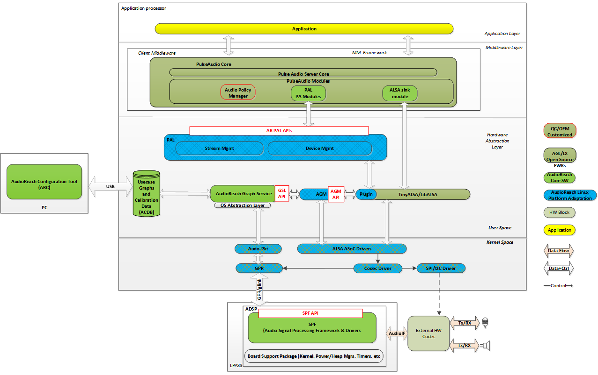
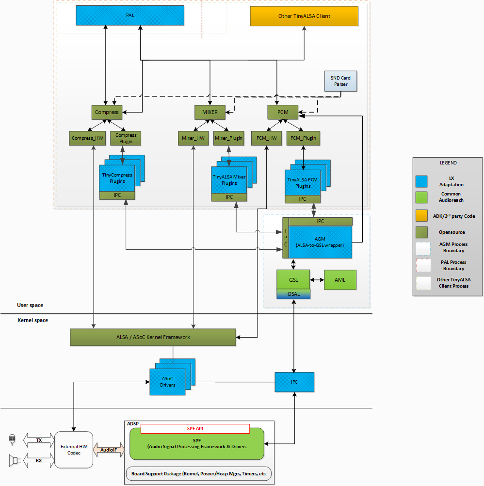
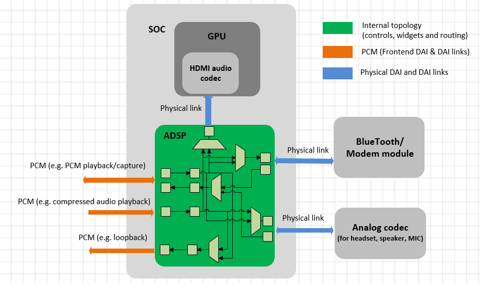
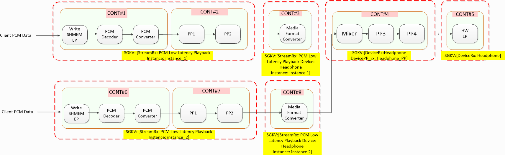
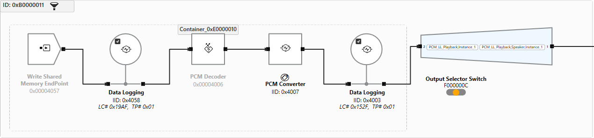
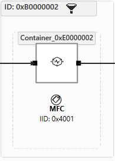
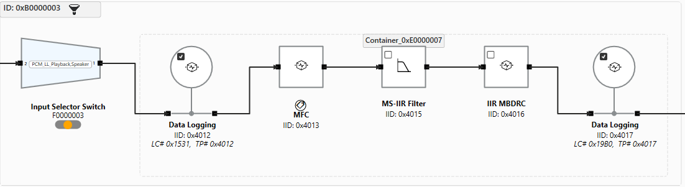
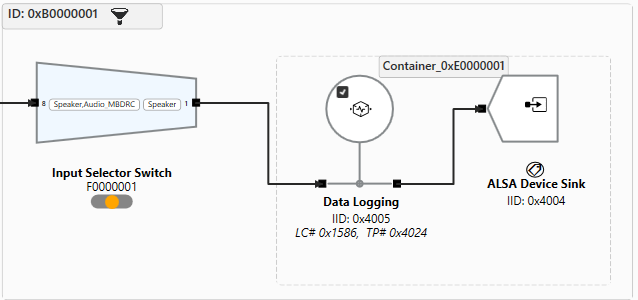
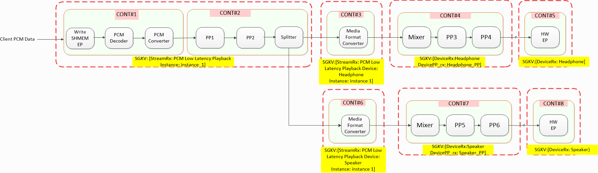
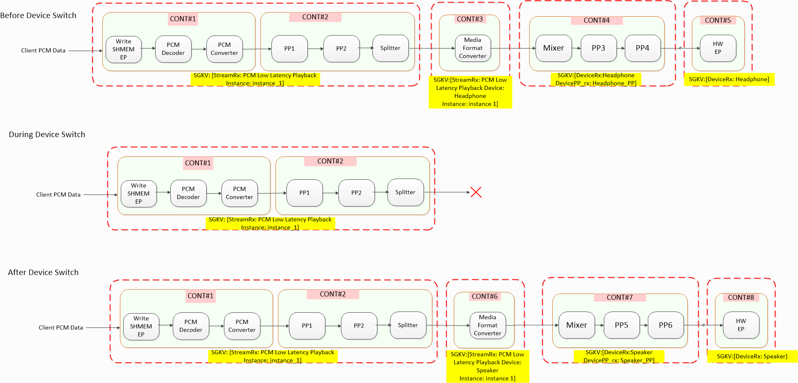

.. _lx_plugin_arch:

Linux Plug-in Architecture
##################################################

Architecture
-----------------

Overview
+++++++++++++++++

AudioReach plug-in architecture for Linux is designed to enable genuine AudioReach development workflow and provide same richness of features AR has to offer. At the same time, plug-in architecture must be able to interoperate with well-established Linux audio frameworks and APIs in order to serve broad Linux ecosystem need. Particularly, ALSA support is available on most, if not all, of Linux-based platform
ubiquitously. Many applications and middleware have been developed to run on top of ALSA. Though plug-in architecture would not utilize kernel ALSA framework for DSP configuration, ALSA interface would
still be supported through plug-in approach. At the same time, plug-in architecture would still interface with kernel ALSA/ASoC framework for configuration of audio peripherals e.g mixed signal CODEC given many peripheral drivers have been developed as ASoC CODEC compliant drivers. 

At high level, plug-in architecture can be seen consisting of five major pieces as depicted in figure below. First piece is a set of AudioReach kernel drivers responsible for establishing connection with
AudioReach engine in audio DSP through IPC driver and provide user-space interface to channel commands and events exchanged between user-space and ARE. Second piece is Linux implementation of OSAL providing OS services
to Audioreach Graph Services(ARGS). OSAL interfaces with AR kernel drivers in order to communicate with ARE in audio DSP. Third piece is a set of software modules which plug into tinyalsa, alsa lib and tinycompress libraries and
translate ALSA commands and constructs to ARGS commands and constructs for audio graph setup and configuration in the audio DSP. Fourth piece is Platform Adaptation Layer(PAL) which alleviates clients from managing low level use cases setup and sound devices configuration with GKV/CKV/TKV and invoking ALSA APIs. At last, fifth piece is adaptation layer to enable well-known audio middleware, such as PulseAudio, gain access to services exposed by PAL. At the same time, path which PulseAudio interfaces with ALSA library can still be supported with configuration data abstracted into Use Case Manager(UCM) file.

	
   Linux Plug-in Architecture Diagram

Building Blocks
+++++++++++++++++++++

	
   TinyALSA Plug-in Architecture Diagram

**PAL and other Applications**

PAL and other Applications are clients which interface to TinyALSA
APIs. These modules run it's own process context as shown in the
diagram.

**PCM, Mixer, Compress**

PCM, Mixer and Compress blocks are the enhanced TinyALSA and
TinyCompress libraries with plugin support.

**SND Card Parser**

Parses card-defs.xml which contains definition of virtual cards and
devices. It is used by tinyalsa to create virtual mixer controls and
to get plugin library name associated with card/device. Card-defs.xml
contains details of different PCM/Compress nodes such as device id
and properties such as playback/record and session_mode.

Sample card-defs.xml entry:

.. code-block:: XML

	<card>
		<id>100</id>
		<name>qcm6490virtualsndcard</name>
		<pcm-device>
			<id>100</id>
			<name>PCM100</name>
			<pcm_plugin>
				<so-name>libagm_pcm_plugin.so</so-name>
			</pcm_plugin>
			<props>
				<playback>1</playback>
				<capture>0</capture>
			</props>
		</pcm-device>

		<pcm-device>
			<id>101</id>
			<name>PCM101</name>
			<pcm_plugin>
				<so-name>libagm_pcm_plugin.so</so-name>
			</pcm_plugin>
			<props>
				<playback>0</playback>
				<capture>1</capture>
			</props>
		</pcm-device>

		<mixer>
			<id>1</id>
			<name>agm_mixer</name>
			<mixer_plugin>
				<so-name>libagm_mixer_plugin.so</so-name>
			</mixer_plugin>
		</mixer>
	</card>

**PCM HW, Mixer HW, Compress HW**

PCM HW, Mixer HW and Compress HW blocks are the TinyALSA modules which
implement all ops to interface with established ALSA kernel ops and
interacts with Kernel ALSA drivers.

**PCM Plugin, Mixer Plugin, Compress Plugin**

PCM Plugin, Mixer Plugin and Compress Plugin blocks register callbacks
for all pcm, mixers and compressed ops to PCM, Mixer and Compress core
fwk module. These modules load the plugin .so and call plugin\_init
function. and routes all pcm / mixer calls from application to plugin
specific implementation.

**TinyALSA PCM Plugin, TinyALSA Mixer Plugin, TinyALSA Compress
Plugin**

PCM , Mixer and Compress TinyALSA Plugins are TinyALSA plugins which
route all pcm, mixer and compress calls from application to plugin
specific implementation.

**Audio Graph Manager(AGM)**

AGM provides apis for mixer plugins, PCM and Compressed apis to setup
audio usecases. It runs as an audio service ( by
platform specific means such as init script) so it can cater multiple
tinyALSA clients.

**GSL**

GSL is the graph service library which is responsible for loading and
initialization of sub-graphs and graphs via Graph Key Vector, Graph
setup and Dynamic handling of the sub-graphs within the graph, Data
Command Management - Read/Write buffer and Calibration (Set Config/Get
Config) of the ARE Modules.

**AML**

ACDB Management library also known as ACDB SW provides get/set APIs to retrieve and
adjust data in the ACDB DATA files. Provides data abstractions and
organization for how calibration data is to be consumed by the Audio
Driver and it’s components.

**IPC**

GSL communicates over Generic Packet Router(GPR) protocol to communicate
messages with ARE. Since ARE runs on a different subsystem, GSL has
to communicate over a IPC layer. This IPC is implemented as a device
node which is opened by userspace Linux datalink layer.

**ASoC Drivers**

ASoC drivers are the ALSA compatible drivers which together form sound card with PCM devices
enumerated from ASoC dai links. Plug-in architecture bypasses ALSA framework for audio graph
setup/configuration in audio DSP and data interface. These dai links are meant to provide access
to hardware resources managed in the kernel like GPIOs, clocks and mixed signal CODEC.

.. _ar_alsa_hld:

AudioReach Realization through ALSA 
---------------------------------------------

ALSA dynamic PCM framework provides the ability to dynamically connect PCM front-end to
physical dai links as shown below. In the following example either or
both of PCM playback and compressed playback front end session can be
connected to either or both of Bluetooth and Analog codec physical link
by configuring the published mixer controls, widgets, routes, and etc.

	
   ARE Graph to ASoC DPCM Concept Diagram

AudioReach plug-in architecture for Linux gets the inspiration from ALSA DPCM framework to model audio graph in form of front-end and back-end.
Front-end PCM or compress ALSA devices can be connected to any of physical links often referred as back-ends. The details on
how the front ends and back ends are enumerated are covered in detail in the AGM and TinyALSA Plugin documentation.

In Audioreach plug-in architecture, audio graph is organized into following segments for both playback and recording generally. At the same
time, system designer can add additional subgraph type if deemed necessary for product

-  Stream: this segment provides data write/read interface, performs decoding/encoding if data is compressed.

-  Stream Post/Pre-Processing(PP): this segment contains stream-based processing modules e.g equalizer

-  Per Stream Per Device(PSPD): this segment is meant to contain module converting stream media format to device media format

-  Device-PP: this segment consists of PP modules for sound device tuning. For example, DRC processing is important for speaker device

-  Device: hardware endpoint such as I2S port

These segments are referred to sub-graphs in AudioReach terminology.
The front-end generally represents stream and stream PP subgraphs while back-end represents the
PSPD, device-PP, device sub-graphs. In plugin architecture, byte-based mixer controls associated with
front-end and back-end for clients to assign GKV and CKV as required metadata setup before starting PCM
device and device switch.

Once a front-end is connected to back-end through routing mixer control, full GKV is formed by concatenating
the subgraph GKVs and CKVs assigned through mixer controls. Upon opening of front-end PCM or compress device, AGM
invokes GSL API with concatenated GKV and CKV to set up the graph in ARE and apply calibration. At the same time, AGM opens
kernel pcm device corresponding to connected back-ends in order to kick off audio peripheral setup. 
This mechanism serves as fundamental design for constructing AudioReach graphs through ALSA and enable full audio path including
SoC and audio peripherals.

Guidelines for assigning key vectors to sub-graphs
---------------------------------------------------

Based on the design described in previous section, the metadata(i.e the GKV and CKV) for FE and BE can be
specified on three segments. One metadata mixer control is associated with each segment.

-  Stream - includes KVs for Stream, Stream PP subgraphs. The same KVs
   can be used to specify Stream and Stream PP.

-  Device - includes KVs for HW EP related subgraphs or optionally can
   also include Device PP subgraphs.

-  Stream Device - includes any subgraph in b/w stream and device
   subgraphs. eg Device pp, PSPD,

Sample Graph Design for Plug-in Architecture
-------------------------------------------------

Multi-Streams to Single-Device(MSSD) Playback
+++++++++++++++++++++++++++++++++++++++++++++++

Graph Overview
^^^^^^^^^^^^^^^^^^

	
   Sample Audio Graph for MSSD Scenario

Figure depicts the reference design of audio graph for MSSD playback scenario. In this example, stream sub-graph and stream-PP sub graph are consolidated into just stream sub-graph. Stream subgraph consists of write shared memory endpoint, PCM decoder, PCM converter. Client passes PCM samples to write shared memory endpoint. PCM converter is put in place to convert PCM samples to format supported by the stream-specific post-processing modules if conversion is necessary. Output of stream subgraph is fed into stream-device subgraph which consists of media format converter(MFC). MFC is put in place to convert stream-leg PCM to device-leg PCM format. After conversion, output of stream-device sub-graph is fed into device PP subgraph for device-specific post-processing. Note that mixer is placed at the beginning of subgraph to mix input streams. Output of device PP subgraph is then feed into device subgraph containing hardware endpoint module such as I2S driver for eventual rendering out of SoC.

The reference playback graphs for Linux platforms typically consists of the following subgraphs:

1. **Stream** – The software interface between the DSP and high-level operating system.
2. **Stream-PP** – Contains postprocessing (PP) modules specific to a stream (for example, bass boost, reverb, etc.)
3. **Stream-Device** – Consists of any per stream per device modules such as sample rate/media format conversion
4. **Device-PP** – Contains PP modules specific to a hardware device (common examples include IIR Filter, MBDRC, etc.)
5. **Device** – The hardware endpoint, most often a mic or a speaker.

An Rx (audio output) use case will follow this order (Stream -> Device), while a Tx (audio input) use case will be
reversed (Device -> Stream).
By default, GKVs are defined for Stream, StreamPP, Device, and DevicePP. StreamDevice subgraphs do not have a unique GKV, but instead use a combination of Stream
and Device GKVs.

Please note that it is not necessary for every graph to have a Stream-PP, Stream-Device, or Device-PP subgraph.
Most commonly, subgraphs are only defined once for each Stream or Device, and
different calibrations are realized with the PP subgraphs.

Key Vector Design
^^^^^^^^^^^^^^^^^^^^^^

+--------------------------+--------------------------------------------+
| **Sub-graph**            | **Keys**                                   |
+==========================+============================================+
| Stream                   | | Key = StreamRx - type of playback        |
|                          | | Key = Instance - instance of Playback    |
+--------------------------+--------------------------------------------+
| Stream Device            | | Key = StreamRx - type of playback        |
|                          | | Key = Device - logical sound device      |
+--------------------------+--------------------------------------------+
| Device PP                | | Key = Device - logical sound device      |
|                          | | Key = DevicePP_rx - name of device PP set|
+--------------------------+--------------------------------------------+
| Device                   | | Key = Device - logical sound device      |
+--------------------------+--------------------------------------------+

+-----------------------------+------------------------------------------+
| **MetaData Grouping**       | **KV**                                   |
+=============================+==========================================+
| Stream1 Metadata            | StreamRX1 KVs                            |
+-----------------------------+------------------------------------------+
| Stream2 Metadata            | StreamRX2 KVs                            |
+-----------------------------+------------------------------------------+
| Device Metadata             | DeviceRX KVs                             |
+-----------------------------+------------------------------------------+
| Stream1 + Device Metadata   | StreamRX1DeviceRX KVs, DeviceRX PP KVs   |
+-----------------------------+------------------------------------------+
| Stream2 + Device Metadata   | StreamRX2DeviceRX KVs, DeviceRX PP KVs   |
+-----------------------------+------------------------------------------+

Below is a breakdown of a Low Latency playback graph from the RB3 Gen2 ACDB file:

StreamRX Subgraph:

Stream-Device Subgraph:

Device PP Subgraph:

Device Subgraph:

**GKV**

GKV1: <StreamRX1 KVs, StreamRX2 PP KVs, StreamRX1DeviceRX KVs, DeviceRX
PP KVs, DeviceRX KVs>

GKV2: <StreamRX2 KVs, StreamRX2 PP KVs, StreamRX2DeviceRX KVs, DeviceRX
PP KVs, DeviceRX KVs>

Single-Stream to Multi-Device(SSMD) Playback
++++++++++++++++++++++++++++++++++++++++++++++

Graph Overview
^^^^^^^^^^^^^^^^^^
Figure depicts the reference design of audio graph for SSMD playback scenario. In essence, stream sub-graph is nearly identical to MSSD scenario except that additional splitter is added to end of stream subgraph so output can be routed to both stream-device sub-graphs for headphone and speaker respectively. Then, there are device PP and device sub-graphs for headphone and speaker respectively.

	
   Sample Audio Graph for SSMD Scenario

Key Vector Design
^^^^^^^^^^^^^^^^^^^^^^

Sub-graphs key vector design is the same as MSSD scenario.

+-----------------------------+------------------------------------------+
| **MetaData Grouping**       | **KV**                                   |
+=============================+==========================================+
| Stream Metadata             | StreamRX1 KVs                            |
+-----------------------------+------------------------------------------+
| Device1 Metadata            | DeviceRX1 KVs                            |
+-----------------------------+------------------------------------------+
| Device2 Metadata            | DeviceRX2 KVs                            |
+-----------------------------+------------------------------------------+
| Stream + Device Metadata    | StreamRXDeviceRX1 KVs, DeviceRX1 PP KVs  |
+-----------------------------+------------------------------------------+
| Stream + Device Metadata    | StreamRXDeviceRX2 KVs, DeviceRX2 PP KVs  |
+-----------------------------+------------------------------------------+

**GKV**

GKV1: <StreamRX KVs, StreamRX PP KVs, StreamRXDeviceRX1 KVs, DeviceRX1
PP KVs, DeviceRX1 KVs>

GKV2: <StreamRX KVs, StreamRX PP KVs, StreamRXDeviceRX2 KVs, DeviceRX2
PP KVs, DeviceRX2 KVs>

Device Switch
++++++++++++++++++++++++++

Device switch describes the scenario when audio output is routed from one sound device to another sound device due to external event e.g end-user unplug headphone. In plug-in architecture, the mechanism is
tearing down device leg of audio graph and instantiate new device-leg sub-graphs to form new full audio graph. Figure below illustrates device switch from headphone to speaker. During device switch,
Stream-Device, Device PP, Device for headphone are teared down and new sub-graphs of same types for speakers are instantiated.

	
   Device Switch Example

Guide to Setup Use Case through ALSA
-----------------------------------------

Setup Sequence
++++++++++++++++++++++++++++++++++++++++++

#. Issue mixer control to set up routing inside audio peripheral
#. Issue mixer control to set media format of back-end
#. Issue mixer control to set meta data for device sub-graph
#. Issue mixer control to set meta data for Stream and Stream PP sub-graphs
#. Issue mixer control to set meta data for PSPD and Device PP sub-graphs
#. Issue mixer control to connect front-end to back-end
#. Invoke tinyalsa APIs to kick off use case

| pcm\_open()
| pcm\_prepare()
| pcm\_start()
| pcm\_write()/pcm\_read()
|

Shutdown Sequence
++++++++++++++++++++

| pcm_stop()
| pcm_close()
|
| Issue mixer control to disconnect front-end to back-end
|

Mixer Control and Payload
++++++++++++++++++++++++++++++++++++++++++

- Set backend pcm configuration::

     tinymix '<back-end name> rate ch fmt' <sample rate> <channel count> <PCM format enum value> <data format>

- Connect/Disconnect front-end to back-end::
   
     tinymix 'PCM<#> connect' <back-end name>
     tinymix 'PCM<#> disconnect' <back-end name>

- Configure device meta data::
   
    tinymix '<back-end name> metadata' <meta byte payload>
    
- Configure stream and stream PP subgraphs meta data::

    tinymix 'PCM<#> control' Zero
    tinymix 'PCM<#> metadata' <meta byte payload>

- Configure stream device and device PP subgraphs meta data::

    tinymix 'PCM<#> control' <back-end name>
    tinymix 'PCM<#> metadata' <meta byte payload>

- <PCM format enum value>: This value is derived from ALSA asound.h SNDRV_PCM_FORMAT

- <back-end name>: this string is derived from agm parsing /proc/asound/pcm to obtain all available hardware endpoint back-ends
  available on given board  
    
- <meta byte payload>: agm_meta_data_gsl structure in below code snippet depicts the format of payload. Passing of sub-graph KVs and sub-graph CKV have been described previously. Along with GKV and CKV, there is portion of payload for passing property IDs. Currently, it is used only for aiding the device switch use case.

.. code:: C

   /**
    * Key Vector
    */
   struct agm_key_vector_gsl {
       size_t num_kvs;                 /**< number of key value pairs */
       struct agm_key_value *kv;       /**< array of key value pairs */
   };
   struct sg_prop {
       uint32_t prop_id;
       uint32_t num_values;
       uint32_t *values;
   };

   /**
     * Metadata Key Vectors
     */
   struct agm_meta_data_gsl {
       /**
        * Used to lookup the calibration data
        */
       struct agm_key_vector_gsl gkv;

       /**
       * Used to lookup the calibration data
       */
       struct agm_key_vector_gsl ckv;
       /**
       * Used to lookup the property ids
       */
       struct sg_prop sg_props;
   };

Sample Mixer control setup for Usecases.
++++++++++++++++++++++++++++++++++++++++++++++

Playback SSSD
------------------------

**Setup Sequence**

**'CODEC\_DMA-LPAIF\_WSA-RX-0 rate ch fmt' 48000 2 2(PCM\_16) 1(FIXED\_POINT)**

**'CODEC\_DMA-LPAIF\_WSA-RX-0 metadata' bytes** //bytes representing KV
for device/optionally devicePP

| **'PCM100 control' Zero** // sets the switch to indicate that further
  mixer control configuration is for stream
| **'PCM100 metadata' bytes** //bytes representing KV for stream,
  streamPP

| **'PCM100 control' CODEC\_DMA-LPAIF\_WSA-RX-0** // sets the control to
  indicate that further mixer control configuration is for graph
  configuration b/w stream and device.
| **'PCM100 metadata' bytes** //bytes representing KV for
  StreamDevice(PSPD), DevicePP subgraphs

**'PCM100 getTaggedInfo' bytes** // to retrieve module tags, mid, iid
information for the GKV configured for PCM100
and CODEC\_DMA-LPAIF\_WSA-RX-0

| **'PCM100 control' Zero** // sets the switch to indicate that further
  mixer control configuration is for stream
| **'PCM100 setParam' bytes** //representing the configuration of modules
  in the stream graph

| **'PCM100 control' CODEC\_DMA-LPAIF\_WSA-RX-0** // sets the control to
  indicate that further mixer control configuration is for graph
  configuration b/w stream and device.
| **'PCM100 setParam' bytes** //bytes representing the configuration of
  modules StreamDevice(PSPD), DevicePP subgraphs

**'PCM100 connect'CODEC\_DMA-LPAIF\_WSA-RX-0** // connects PCM100 to
CODEC\_DMA-LPAIF\_WSA-RX-0 AIF (front end to back end connection)

| **pcm\_open()**
| **pcm\_prepare()**
| **pcm\_start()**
| **pcm\_write()/pcm\_read()**

**Teardown Sequence**

**pcm\_stop()**

**pcm\_close()**

**'PCM100 disconnect' CODEC\_DMA-LPAIF\_WSA-RX-0 //** connects PCM100
to CODEC\_DMA-LPAIF\_WSA-RX-0 AIF (front end to back end connection)

5.2. Playback SSMD
+++++++++++++++++++++++++

| **'CODEC\_DMA-LPAIF\_WSA-RX-0 metadata' bytes** //bytes representing
  KV for device/optionally devicePP
| **'PCM100 metadata' bytes** //bytes representing KV for stream,
  streamPP

| **'PCM100 control' CODEC\_DMA-LPAIF\_WSA-RX-0**// sets the control to
  indicate that further mixer control configuration is for graph
  configuration b/w stream and device.
| **'PCM100 metadata' bytes** //bytes representing KV for
  StreamDevice(PSPD), DevicePP subgraphs

**'PCM100 getTaggedInfo' bytes** // to retrieve module tags, mid, iid
information for a specific GKV

| **'CODEC\_DMA-LPAIF\_WSA-RX-0 rate ch fmt' 48000 2 2(PCM\_16) 1(FIXED\_POINT)**
| **'PCM100 control' Zero** // sets the control to indicate that further
  mixer control configuration is for graph configuration b/w stream and
  device.
| **'PCM100 setParam' bytes** //representing the configuration of
  modules in the stream graph

| **'PCM100 control' CODEC\_DMA-LPAIF\_WSA-RX-0** // sets the control to
  indicate that further mixer control configuration is for graph
  configuration b/w stream and device.
| **'PCM100 setParam' bytes** //bytes representing the configuration of
  modules StreamDevice(PSPD), DevicePP subgraphs

**'PCM100 connect' CODEC\_DMA-LPAIF\_WSA-RX-0** // connects PCM100 to
CODEC\_DMA-LPAIF\_WSA-RX-0 AIF

| **pcm\_open()**
| **pcm\_prepare()**
| **pcm\_start()**
| **pcm\_write()/pcm\_read()**

| **'CODEC\_DMA-LPAIF\_WSA-RX-1 metadata' bytes** //bytes representing
  KV for device/optionally devicePP
| **'PCM100 control' CODEC\_DMA-LPAIF\_WSA-RX-1**// sets the control to
  indicate that further mixer control configuration is for graph
  configuration b/w stream and device.

**'PCM100 metadata' bytes** //bytes representing KV for
StreamDevice(PSPD), DevicePP subgraphs

**'PCM100 getTaggedInfo' bytes** // to retrieve module tags, mid, iid
information for a specific GKV

| **'CODEC\_DMA-LPAIF\_WSA-RX-1 rate ch fmt' 96000 4 2(PCM\_16) 1(FIXED\_POINT)**
| **'PCM100 control' CODEC\_DMA-LPAIF\_WSA-RX-1** // sets the control to
  indicate that further mixer control configuration is for graph
  configuration b/w stream and device.

**'PCM100 setParam' bytes** //bytes representing the configuration of
modules StreamDevice(PSPD), DevicePP subgraphs

**'PCM100 connect' CODEC\_DMA-LPAIF\_WSA-RX-1** // connects PCM100 to
**CODEC\_DMA-LPAIF\_WSA-RX-1** AIF

5.3. Playback MSSD
+++++++++++++++++++++++++++

| **'SLIM\_0\_RX metadata' bytes** //bytes representing KV for
  device/optionally devicePP
| **'PCM100 metadata' bytes** //bytes representing KV for stream,
  streamPP

| **'PCM100 control' SLIM\_0\_RX**// sets the control to indicate that
  further mixer control configuration is for graph configuration b/w
  stream and device.
| **'PCM100 metadata' bytes** //bytes representing KV for
  StreamDevice(PSPD), DevicePP subgraphs

**'PCM100 getTaggedInfo' bytes** // to retrieve module tags, mid, iid
information for a specific GKV

| **'SLIM\_0\_RX rate ch fmt' 48000, 2, 2(PCM\_16) 1(FIXED\_POINT)**
| **'PCM100 control' Zero** // sets the control to indicate that further
  mixer control configuration is for graph configuration b/w stream and
  device.
| **'PCM100 setParam' bytes** //representing the configuration of
  modules in the stream graph

| **'PCM100 control' SLIM\_0\_RX** // sets the control to indicate that
  further mixer control configuration is for graph configuration b/w
  stream and device.
| **'PCM100 setParam' bytes** //bytes representing the configuration of
  modules StreamDevice(PSPD), DevicePP subgraphs

**'PCM100 connect' SLIM\_0\_RX** // connects PCM100 to SLIM\_0\_RX AIF

| **pcm\_open()**
| **pcm\_prepare()**
| **pcm\_start()**
| **pcm\_write()/pcm\_read()**

**'PCM101 metadata' bytes** //bytes representing KV for stream, streamPP

| **'PCM101 control' SLIM\_0\_RX**// sets the control to indicate that
  further mixer control configuration is for graph configuration b/w
  stream and device.
| **'PCM101 metadata' bytes** //bytes representing KV for
  StreamDevice(PSPD), DevicePP subgraphs

**'PCM101 getTaggedInfo' bytes** // to retrieve module tags, mid, iid
information for a specific GKV

| **'PCM101 control' Zero** // sets the control to indicate that further
  mixer control configuration is for graph configuration b/w stream and
  device.
| **'PCM101 setParam' bytes** //representing the configuration of
  modules in the stream graph

| **'PCM101 control' SLIM\_0\_RX** // sets the control to indicate that
  further mixer control configuration is for graph configuration b/w
  stream and device.
| **'PCM101 setParam' bytes** //bytes representing the configuration of
  modules StreamDevice(PSPD), DevicePP subgraphs

**'PCM101 connect' SLIM\_0\_RX** // connects PCM101 to SLIM\_0\_RX AIF

| **pcm\_open()**
| **pcm\_prepare()**
| **pcm\_start()**
| **pcm\_write()/pcm\_read()**

