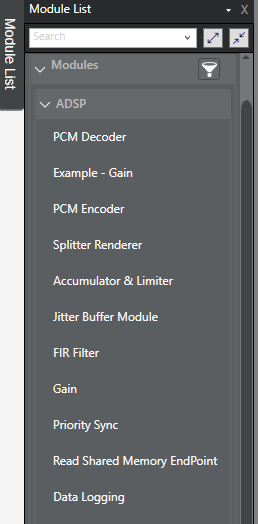
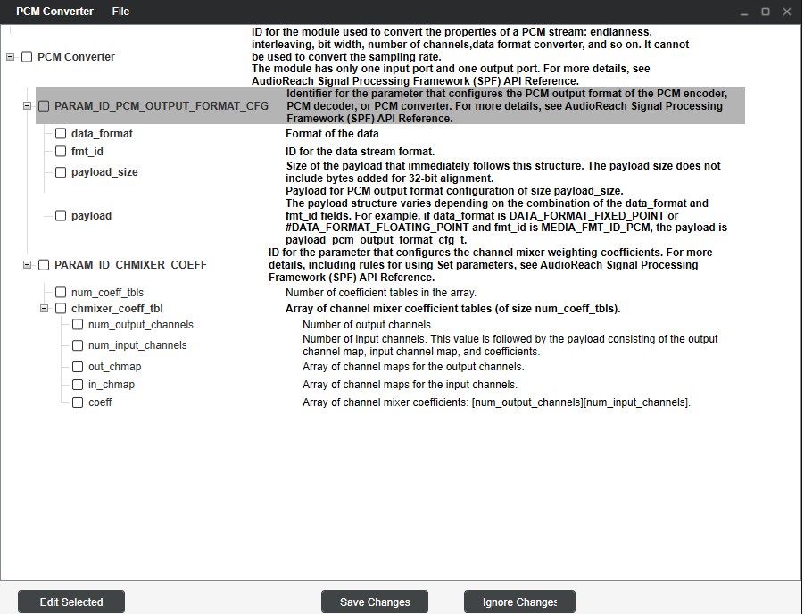

.. _available_modules:

Available Audio Modules
=======================

This page provides a quick overview of all the current available audio algorithms, or modules, on AudioReach. These have been validated on Raspberry Pi 4. All algorithms are stored under audioreach-engine/modules.

More information about the configurable parameters and capabilities of these modules can be found in AudioReach Creator. On the top bar, find View -> Module List. The list of modules will appear on the left. (Please note that not all modules available in the Module List have been added to the opensource project).

Then on the top of the screen, press "Start Graph Modification". Drag any module into the ARC workspace, and then double click to view the Calibration Window. On the top, press Configure. Then a window will pop up with module information, configurable variables, and so on. 

Below is a list of all the modules that are currently available in the opensource project:

PCM Converter
-------------
* The PCM converter is stored under the "cmn/pcm_mf_cnv" folder. It is used to convert the properites of a PCM stream, such as the endianness, interleaving, bit width, number of channels, data format converter, etc.
* The PCM converter, MFC, PCM decoder, and PCM encoder are compiled together. However, they can be used as separate modules in AudioReach creator.
* PCM converter also has a few dependencies: IIR resampler, dynamic (or FIR) resampler, and channel mixer. Both resamplers included in AudioReach are included as binaries, but in the future, we are looking into incorporating an opensource resampler into PCM converter.

SAL (Simple accumulator limiter)
--------------------------------
* The SAL can be used to mix concurrent PCM streams. Its module name in ARC is "Accumulator & Limiter", and it is located under "cmn/simple_accumulator_limiter"
* The SAL is dependent on limiter

PCM decoder/encoder
-------------------
* The PCM decoder and encoder modules are under the "modules/audio" folder, but they are compiled in the PCM converter build file. However, they are separate modules in ARC.

MFC
---
* MFC is compiled as a part of PCM converter, but the source code for MFC is not available. You can, however, use MFC as a standalone module in ARC.
* MFC has many configurable properties in ARC. It allows you to change the resampler type, channel mixer coefficients, and output media format (sample rate, bit_width, and number of channels).

Bass Boost
----------
* The bass boost module is located under the "processing" folder. It is used to increase the bass for audio clips.
* Bass boost is dependent on limiter, DRC, and MSIIR modules.

Channel Mixer
-------------
* Channel mixer is located under the "processing" folder. It will upmix or downmix channels based on the configured coefficients.

FIR filter
----------
* FIR stands for "Finite Impulse Response" tuning filter module. It supports multi-channel filtering. It can be found under the "processing/filters" folder.

Multi Stage IIR Filter
----------------------
* This is a multiple channel tuning filter module, also known as MSIIR. It can be found under the "processing/filters" folder, and in ARC it is called the "MS-IIR Filter" module.

IIR_MBDRC
---------
* MBDRC stands for multiband dynamic range control module. It is dependent on DRC and limiter, and it can be found under "processing/gain_control". It is included as a binary.
* IIR_MBDRC has several capabilities in real time calibration mode, such as setting the gain, compressing/expanding, and configuring the limiter.

Limiter
-------
* Limiter is found under "processing/gain_control". It cannot be used as a standalone module in ARC. However, it is a dependency for other modules, such as SAL and IIR_MBDRC.

Popless Equalizer
-----------------
* Popless Equalizer is a basic tuning and equalizing module. It can be found under "processing/Popless Equalizer".
* It is dependent on the MSIIR module.

Dynamic resampler
-----------------
* The dynamic resampler is under "processing/resamplers". It can be used to convert PCM stream to any arbitrary sample rate. Currently, dynamic resampler is only available as a binary.
* Dynamic resampler does not have a standalone module in ARC, but it is a dependency for other modules, such as PCM converter.

IIR resampler
-------------
* IIR resampler is a basic SW resampler that uses some special techniques to make it more efficient. It is only available as a binary.
* IIR resampler also does not have a standalone module in ARC.

Shoebox
-------
* The shoebox module reduces reverb effects in a cubical room. It is found under the "processing/shoebox_reverb" folder, and it is included as a binary.
* Shoebox and reverb are two different modules in ARC; however, they share the same source code.
* Several variables can be set to optimize the shoebox module, such as the room size, the material that the room is made out of, and more.

Reverb
------
* The reverb module can be found under "processing/shoebox_reverb". It is included as a binary.
* The reverb module is similar to shoebox, but it has presets for the type of environment (such as arena, city, hallway, etc.).

Virtualizer
-----------
* Virtualizer module is found under "processing/Virtualizer". It is included as a binary.
* It is dependent on MSIIR and limiter.
* Virtualizer is used for surround sound.

Gain
----
* The gain module can be found under "processing/volume_control". It is used to increase and decrease the volume of streams.
* The layout for both Gain and Soft volume modules is a little bit different. The build file for gain can be found under "processing/volume_control/capi/gain/build". However, the source code for both gain and soft volume modules is under "volume_control/lib".

Soft volume
-----------
* The soft_vol build file is under "volume_control/capi/soft_vol/build", and the source code is under "volume_control/lib".
*  In ARC, the soft volume module is named "Volume Control".
* Soft volume allows basic volume controls, such as gain and mute. It can be used to change the volume for each individual channel, or there is an option for "master gain" that will set the gain for all channels at once.

