.. _capi_mod_dev_guide:

CAPI Module Development Guide
##################################################

Introduction
===================

Purpose
--------------------

This document describes Common Audio Processor
Interface (CAPI) which is the interface between the AudioReach™
AudioReach Engine (ARE) and the audio signal processing
algorithms (such as pre/postprocessing, encoders, and decoders).

Functional Overview
===================

Audio signal processing can be broadly categorized as follows:

-  Audio processing

-  Encoder

-  Decoder

For example, for audio recording, the mic data is first processed
with a high pass filter (HPF) to remove low frequencies such as AC
noise, followed by a multi-band filter to compensate for microphone
nonlinearities, followed by an Echo Canceller and Noise Suppression
(ECNS) algorithm, and so on. The data is finally encoded and stored
in a file. Similarly, in audio playback, data from a file or network
is decoded, postprocessed using effects/filters, and rendered.
Each filter, effect, and ECNS are referred to as *modules*. A series
of such modules forms a *graph*. Use the ARC to draw
graphs and associate them with high-level use cases.
Typically, the core library of such algorithms is developed
separately. To run the algorithms in the ARE, a CAPI wrapper is
written. CAPI abstracts the algorithms for the framework. A
CAPI-wrapped algorithm/functionality is referred to as a *CAPI
module* or simply as a module. In the ARE, modules are hosted by
*containers*, which provide the execution environment for the
modules.

Following is a typical folder structure for a module:

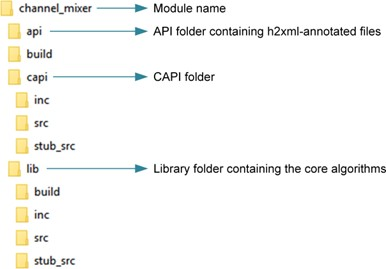

   Typical folder structure for a module

Module
------

A module’s interface includes the following:

-  Data ports

   -  Input and output ports, where each port can support multiple
      channels

   -  Zero to many input or output ports

   -  Along with data, metadata is also transmitted through these ports

-  Optional control ports for module-to-module communication

-  Interface (CAPI) with the framework (container)

   -  Properties, events, and extensions (which in turn contain
      parameters and events)

-  Interface with clients (HLOS or ARC platform)

   -  Parameters and events (annotated with h2xml tags)

**NOTE:** 
The h2xml tags are entered in the interface header file of the module. These tags are used to generate an XML file from the header file for importing the module into the ARC platform. For more information, see the ARC documentation.

In the framework, the containers assume that the entire CAPI module runs in the same thread as the container. If the module uses multithreading, it is the CAPI module’s responsibility to handle synchronization (for example, having set\_param() done on the module in the main thread can cause corruption).

The following figure shows the interface view of a module.

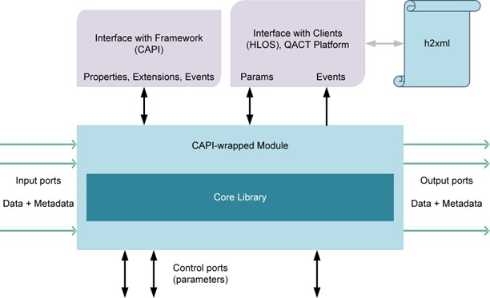

   Interface view of a module

Types of Modules
----------------

-  Single input-single output (SISO) modules:

   -  Pre/postprocessing (PP) modules – PP algorithms such as filters,
      equalizers, sample rate converters, echo cancelers, and so on

   -  Encoders such as the AAC encoder

   -  Decoders such as the AAC decoder

   -  Packetizers such as the IEC 61937 packetizer

   -  Depacketizers such as the IEC 61937 depacketizer

   -  Converters such as the EAC3 format-to-AC3 format converter

-  Source modules – Zero data input modules such as DMA source, DTMF
   generator, and so on.

-  Sink modules – Zero data output modules such as DMA sink, DTMF
   detector, and so on.

-  Multiple input-multiple output (MIMO) modules such as the
   multi-write, multi-reader buffer, or the ECNS algorithm with
   microphone and playback reference inputs as well as separate EC
   output and NS output

-  Multiple input-single output (MISO) modules such as a mixer, EC with
   only one output, and so on.

-  Single input-multiple output (SIMO) modules such as a splitter

A *single-port module* refers to either a SISO module or a source
module with one output or a sink module with one input.

A *multi-port module* refers to all non-single-port modules. The
framework assumes no knowledge of routing inside multi-port modules.
A two-input (A and B), two-output (C and D) module can have any
possible data routing as shown in the following figure. Currently,
modules must have at least one input or output port, as illustrated
in the following figure.

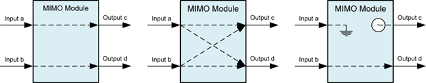

   Input and output ports for a module

Sample-based PP modules are PP modules that take N samples and
process/return the same number of samples in a process call (for
example, filters, equalizers). Fractional resampling modules or rate
matching do not belong to this category.
Simple PP modules are SISO PP modules. Includes all sample-based and
sample rate converters including fractional resampling, rate
matchers, and so on. *Simple* does not indicate that the algorithm
implemented in the module is trivial. It only means that the
framework interaction is simple.

Life Cycle of a CAPI
--------------------

The following figure shows the life cycle of a CAPI. Highlighted
functions are used during run time. Except initialize and end, all
other functions can be called multiple times.

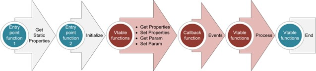

   Life cycle of a CAPI

CAPI has two static functions:

-  `capi\_get\_static\_properties\_f() <#typedef-capi-err-t-capi-get-static-properties-f-capi-proplist-t-init-set-proplist-capi-proplist-t-static-proplist>`__
   – Used to query properties such as memory required by the module,
   stack size, required extensions, and so on.

-  `capi\_init\_f() <#typedef-capi-err-t-capi-init-f-capi-t-pif-capi-proplist-t-init-set-proplist>`__
   – Called to initialize the instance of the module.

CAPI has the following dynamic functions handled through virtual function tables (vtables):

-  `capi\_vtbl\_t::process() <#capi-err-t-capi-vtbl-t-process-capi-t-pif-capi-stream-data-t-input-capi-stream-data-t-output>`__

-  `capi\_vtbl\_t::end() <#capi-err-t-capi-vtbl-t-end-capi-t-pif>`__

-  `capi\_vtbl\_t::set\_param() <#capi-err-t-capi-vtbl-t-set-param-capi-t-pif-uint32-t-param-id-const-capi-port-info-t-port-info-ptr-capi-buf-t-params-ptr>`__

-  `capi\_vtbl\_t::get\_param() <#capi-err-t-capi-vtbl-t-get-param-capi-t-pif-uint32-t-param-id-const-capi-port-info-t-port-info-ptr-capi-buf-t-params-ptr>`__

-  `capi\_vtbl\_t::set\_properties() <#capi-err-t-capi-vtbl-t-set-properties-capi-t-pif-capi-proplist-t-proplist-ptr>`__

-  `capi\_vtbl\_t::get\_properties() <#capi-err-t-capi-vtbl-t-get-properties-capi-t-pif-capi-proplist-t-proplist-ptr>`__

The vtable get\_properties(), set\_properties(), get\_param(),
set\_param(), and process() functions are used multiple times during
the module’s life. The
`capi\_get\_static\_properties\_f() <#typedef-capi-err-t-capi-get-static-properties-f-capi-proplist-t-init-set-proplist-capi-proplist-t-static-proplist>`__
function can be called multiple times. The
`capi\_init\_f() <#typedef-capi-err-t-capi-init-f-capi-t-pif-capi-proplist-t-init-set-proplist>`__
and end() functions are called only once. CAPI can also raise events
using the callback function provided by framework during
`capi\_init\_f() <#typedef-capi-err-t-capi-init-f-capi-t-pif-capi-proplist-t-init-set-proplist>`__.

Following is an example of the life cycle of a CAPI.

1. The framework queries for memory required by the module by using `capi\_get\_static\_properties\_f() <#typedef-capi-err-t-capi-get-static-properties-f-capi-proplist-t-init-set-proplist-capi-proplist-t-static-proplist>`__ with the `CAPI\_INIT\_MEMORY\_REQUIREMENT <#_bookmark232>`__ property ID.

2. The framework queries other static properties such as:

   -  Stack size (`CAPI\_STACK\_SIZE <#_bookmark233>`__)

   -  In-place processing capability
      (`CAPI\_IS\_INPLACE <#_bookmark235>`__)

   -  Data buffering requirement
      (`CAPI\_REQUIRES\_DATA\_BUFFERING <#_bookmark236>`__)

   -  Supported interface extensions
      (`CAPI\_INTERFACE\_EXTENSIONS <#_bookmark239>`__)

   -  Required framework extensions
      (`CAPI\_NUM\_NEEDED\_FRAMEWORK\_EXTENSIONS <#_bookmark237>`__,
      `CAPI\_NEEDED\_FRAMEWORK\_EXTENSIONS <#_bookmark238>`__)

   -  Supported interface extensions
      (`CAPI\_INTERFACE\_EXTENSIONS <#_bookmark239>`__)

   More properties will be added in future.

   Queries can be performed for one or multiple properties at the time
   depending on framework implementation. Typically, one property is
   queried when the framework needs to know the return error code per
   property.

3. The framework allocates memory and calls `capi\_init\_f() <#typedef-capi-err-t-capi-init-f-capi-t-pif-capi-proplist-t-init-set-proplist>`__ on the CAPI.

   -  Now other properties are passed, such as the event callback
      function (`CAPI\_EVENT\_CALLBACK\_INFO <#_bookmark244>`__
      , the heap ID to be used for any
      runtime memory allocations (`CAPI\_HEAP\_ID <#_bookmark246>`__),
      and so on. The same set of properties are also passed in
      `capi\_get\_static\_properties\_f() <#typedef-capi-err-t-capi-get-static-properties-f-capi-proplist-t-init-set-proplist-capi-proplist-t-static-proplist>`__.

   -  CAPI returns the vtable.

    Although the framework allocates memory before calling
    `capi\_init\_f() <#typedef-capi-err-t-capi-init-f-capi-t-pif-capi-proplist-t-init-set-proplist>`__
    on the module, be aware that modules are free to call malloc later,
    depending on the requirements. The framework performs initial memory
    allocation to host the instance structure.

4. More setting and getting of properties and events can happen after `capi\_init\_f() <#typedef-capi-err-t-capi-init-f-capi-t-pif-capi-proplist-t-init-set-proplist>`__ until the end of CAPI:

   -  Framework and interface extension-related properties.

   -  The `capi\_vtbl\_t::set\_properties() <#capi-err-t-capi-vtbl-t-set-properties-capi-t-pif-capi-proplist-t-proplist-ptr>`__ call for media format `CAPI\_INPUT\_MEDIA\_FORMAT\_V2 <#_bookmark251>`__.
      A module can raise an output media format event if the output media format changes (`CAPI\_EVENT\_OUTPUT\_MEDIA\_FORMAT\_UPDATED\_V2 <#_bookmark341>`__).

   -  Buffering-related properties such as `CAPI\_PORT\_DATA\_THRESHOLD <#_bookmark262>`__ or `CAPI\_EVENT\_PORT\_DATA\_THRESHOLD\_CHANGE <#_bookmark336>`__.

   -  Events such as KPPS (`CAPI\_EVENT\_KPPS <#_bookmark329>`__), bandwidth (`CAPI\_EVENT\_BANDWIDTH <#_bookmark330>`__), algorithmic delay (`CAPI\_EVENT\_ALGORITHMIC\_DELAY <#_bookmark334>`__), process state (`CAPI\_EVENT\_PROCESS\_STATE <#_bookmark333>`__), and so on.

5. The `capi\_vtbl\_t::set\_param() <#capi-err-t-capi-vtbl-t-set-param-capi-t-pif-uint32-t-param-id-const-capi-port-info-t-port-info-ptr-capi-buf-t-params-ptr>`__ and `capi\_vtbl\_t::get\_param() <#capi-err-t-capi-vtbl-t-get-param-capi-t-pif-uint32-t-param-id-const-capi-port-info-t-port-info-ptr-capi-buf-t-params-ptr>`__ functions can also be called at any time after `capi\_init\_f() <#typedef-capi-err-t-capi-init-f-capi-t-pif-capi-proplist-t-init-set-proplist>`__ until `capi\_vtbl\_t::end() <#capi-err-t-capi-vtbl-t-end-capi-t-pif>`__.

6. The `capi\_vtbl\_t::process() <#capi-err-t-capi-vtbl-t-process-capi-t-pif-capi-stream-data-t-input-capi-stream-data-t-output>`__ function is called at runtime to process data.

7. Finally, the `capi\_vtbl\_t::end() <#capi-err-t-capi-vtbl-t-end-capi-t-pif>`__ function is called to destroy the CAPI module.

The following table describes the differences between properties and parameters.

+-------------------------------------------------------------------------------------------------------------------------------------------------------------------+----------------------------------------------------------------------------------------------------------------------------------------------------------------------+
|     **Property**                                                                                                                                                  |     **Parameter**                                                                                                                                                    |
+===================================================================================================================================================================+======================================================================================================================================================================+
|     Defined by the core CAPI interface                                                                                                                            |     Defined by the modules or CAPI framework and                                                                                                                     |
|                                                                                                                                                                   |                                                                                                                                                                      |
|                                                                                                                                                                   |     interface extensions                                                                                                                                             |
+-------------------------------------------------------------------------------------------------------------------------------------------------------------------+----------------------------------------------------------------------------------------------------------------------------------------------------------------------+
|     Applicable to all modules                                                                                                                                     |     Applicable only to the modules that define the                                                                                                                   |
|                                                                                                                                                                   |                                                                                                                                                                      |
|                                                                                                                                                                   |     parameter or support the extension                                                                                                                               |
+-------------------------------------------------------------------------------------------------------------------------------------------------------------------+----------------------------------------------------------------------------------------------------------------------------------------------------------------------+
|     Defines framework-module interaction                                                                                                                          |     Typically, calibration- and configuration-related                                                                                                                |
+-------------------------------------------------------------------------------------------------------------------------------------------------------------------+----------------------------------------------------------------------------------------------------------------------------------------------------------------------+
|     Module developers cannot add properties                                                                                                                       |     Module developers can add parameters                                                                                                                             |
+-------------------------------------------------------------------------------------------------------------------------------------------------------------------+----------------------------------------------------------------------------------------------------------------------------------------------------------------------+
|     Following functions are used:                                                                                                                                 |     Following functions are used:                                                                                                                                    |
|                                                                                                                                                                   |                                                                                                                                                                      |
|     `capi\_get\_static\_properties\_f() <#typedef-capi-err-t-capi-get-static-properties-f-capi-proplist-t-init-set-proplist-capi-proplist-t-static-proplist>`__,  |     `capi\_vtbl\_t::get\_param() <#capi-err-t-capi-vtbl-t-get-param-capi-t-pif-uint32-t-param-id-const-capi-port-info-t-port-info-ptr-capi-buf-t-params-ptr>`__ and  |
|                                                                                                                                                                   |                                                                                                                                                                      |
|     `capi\_vtbl\_t::get\_properties() <#capi-err-t-capi-vtbl-t-get-properties-capi-t-pif-capi-proplist-t-proplist-ptr>`__,                                        |     `capi\_vtbl\_t::set\_param() <#capi-err-t-capi-vtbl-t-set-param-capi-t-pif-uint32-t-param-id-const-capi-port-info-t-port-info-ptr-capi-buf-t-params-ptr>`__      |
|                                                                                                                                                                   |                                                                                                                                                                      |
|     `capi\_vtbl\_t::set\_properties() <#capi-err-t-capi-vtbl-t-set-properties-capi-t-pif-capi-proplist-t-proplist-ptr>`__                                         |                                                                                                                                                                      |
+-------------------------------------------------------------------------------------------------------------------------------------------------------------------+----------------------------------------------------------------------------------------------------------------------------------------------------------------------+

Entry Point Functions
---------------------

The CAPI entry point functions are
`capi\_get\_static\_properties\_f() <#typedef-capi-err-t-capi-get-static-properties-f-capi-proplist-t-init-set-proplist-capi-proplist-t-static-proplist>`__
and
`capi\_init\_f() <#typedef-capi-err-t-capi-init-f-capi-t-pif-capi-proplist-t-init-set-proplist>`__.

The
`capi\_init\_f() <#typedef-capi-err-t-capi-init-f-capi-t-pif-capi-proplist-t-init-set-proplist>`__
function takes in a list of properties that can be used for
initialization of the module. The framework can use this list to set
the properties whose values are known during initialization, and the
module can use these properties to optimize its initialization
sequence. For example, the module can use the properties to
determine the size of some internal memory allocations, preventing
the need for freeing and reallocating the memory later.

The
`capi\_get\_static\_properties\_f() <#typedef-capi-err-t-capi-get-static-properties-f-capi-proplist-t-init-set-proplist-capi-proplist-t-static-proplist>`__
function also takes in a list of
`capi\_init\_f() <#typedef-capi-err-t-capi-init-f-capi-t-pif-capi-proplist-t-init-set-proplist>`__
properties. The framework sends exactly the same properties as those
being sent for the
`capi\_init\_f() <#typedef-capi-err-t-capi-init-f-capi-t-pif-capi-proplist-t-init-set-proplist>`__
function. Thus, the module can correctly calculate the object size
that it returns.

Returning any error from
`capi\_init\_f() <#typedef-capi-err-t-capi-init-f-capi-t-pif-capi-proplist-t-init-set-proplist>`__
indicates that the module was not initialized. Therefore, a return
should only be done if the module cannot proceed because of an
error.
The module should return `CAPI\_EOK <#define-capi-eok-0>`__ if an
unsupported property is set during
`capi\_init\_f() <#typedef-capi-err-t-capi-init-f-capi-t-pif-capi-proplist-t-init-set-proplist>`__.
If the module returns an error from
`capi\_init\_f() <#typedef-capi-err-t-capi-init-f-capi-t-pif-capi-proplist-t-init-set-proplist>`__,
it must ensure that all cleanup is performed because
`capi\_vtbl\_t::end() <#capi-err-t-capi-vtbl-t-end-capi-t-pif>`__
will not be called.
Any static property can also be queried in
`capi\_vtbl\_t::get\_properties() <#capi-err-t-capi-vtbl-t-get-properties-capi-t-pif-capi-proplist-t-proplist-ptr>`__.
Modules must use common implementation for both get\_properties and
`capi\_get\_static\_properties\_f() <#typedef-capi-err-t-capi-get-static-properties-f-capi-proplist-t-init-set-proplist-capi-proplist-t-static-proplist>`__.
Static properties cannot rely on the instance memory of the CAPI.

Error Codes
-----------

The error codes returned by CAPI functions are interpreted as bit
fields. Multiple bits can be set at one time to indicate various
errors.
The `CAPI\_SET\_ERROR <#_bookmark224>`__ helper macro can be used to
set a bit in the error code, and the
`CAPI\_IS\_ERROR\_CODE\_SET <#_bookmark226>`__ helper macro can be
used to check if a particular bit is set in the error code.

Errors While Setting and Getting Properties
~~~~~~~~~~~~~~~~~~~~~~~~~~~~~~~~~~~~~~~~~~~

Functions that use the
`capi\_proplist\_t <#struct-capi-proplist-t>`__ structure can be
used to set or get multiple property values at one time. Errors that
occur when setting or getting a property from the list must be
handled in the following way:

-  If the property is not supported by the module, the
   `CAPI\_EUNSUPPORTED <#define-capi-eunsupported-uint32-t-1-2>`__ flag
   must be set in the error code and the actual\_data\_len field for
   that property must be set to zero.

-  The rest of the properties must still be processed (rather than
   exiting when an unsupported property is encountered).

Extensions
----------

CAPI provides a mechanism for extending the functionality of the
interface. The additional functionality is provided via framework
and interface extensions.

These extensions are typically defined using header files that are
included both by the module and the framework. Each extension is
identified with a globally unique identifier (GUID). The header file
then describes the behavior of the framework and module that use the
extensions. Any set parameter IDs, payloads, properties, events,
constant definitions, and function declarations required for an
extension are also present in the header file.

Framework Extensions
~~~~~~~~~~~~~~~~~~~~

The framework uses
`capi\_get\_static\_properties\_f() <#typedef-capi-err-t-capi-get-static-properties-f-capi-proplist-t-init-set-proplist-capi-proplist-t-static-proplist>`__
to query a module for the list of extensions that the framework
requires.

If the framework supports these extensions, it can create the module
and proceed. If not, the framework must send an error. Thus,
framework extensions are not optional.

Interface Extensions
~~~~~~~~~~~~~~~~~~~~

The framework uses
`capi\_get\_static\_properties\_f() <#typedef-capi-err-t-capi-get-static-properties-f-capi-proplist-t-init-set-proplist-capi-proplist-t-static-proplist>`__
to send a list of interface extensions that it supports to the
module. The module can then set flags to indicate the interface
extensions it is to use from this list.

If an interface extension is required by the module to operate, it
can send an error at this point. The framework then inspects the
list of interface extensions chosen by the module and, if it is
acceptable, creates the module. Thus, interface extensions are
optional.

An optional structure can be included with each interface extension
to negotiate more fine-grained support. The structure must be
defined in the interface extension header file.

Differences Between Framework and Interface Extensions
~~~~~~~~~~~~~~~~~~~~~~~~~~~~~~~~~~~~~~~~~~~~~~~~~~~~~~

+--------------------------------------------------------+-------------------------------------------------------+
|     **Framework extension**                            |     **Interface extension**                           |
+========================================================+=======================================================+
|     Defines a behavior that the module requires the    |     Can define a behavior for the framework, module,  |
|                                                        |                                                       |
|     framework to support.                              |     or both.                                          |
+--------------------------------------------------------+-------------------------------------------------------+
|     If a module requires a framework extension, it     |     Support can be negotiated between the framework   |
|                                                        |                                                       |
|     cannot operate if the framework does not support   |     and the module. After negotiation, the framework  |
|                                                        |                                                       |
|     the framework extension.                           |     and module can determine if an acceptable         |
|                                                        |                                                       |
|                                                        |     configuration is possible.                        |
+--------------------------------------------------------+-------------------------------------------------------+
|     A framework extension is either supported by the   |     An optional structure can be used to negotiate    |
|                                                        |                                                       |
|     framework or not; there is no way to indicate      |     more fine-grained capabilities.                   |
|                                                        |                                                       |
|     partial support.                                   |                                                       |
+--------------------------------------------------------+-------------------------------------------------------+

Other Requirements
------------------

-  All functions must be re-entrant. This means that multiple instances
   of the library are able to run simultaneously without any conflict.
   All states are stored in the instance structure that is passed as the
   first argument to all functions.

-  The pointer to the vtable of CAPI is required to be the first element
   in a CAPI structure.

-  We recommend size checks in get and set parameters, and NULL checks
   for stream data and buffers in process functions.

Module Integration
===================

Workflow
--------------------

Below figure illustrates the module integration
workflow. Module ID and parameter IDs must use GUIDs. Each customer
is allotted a range from which to choose these IDs.

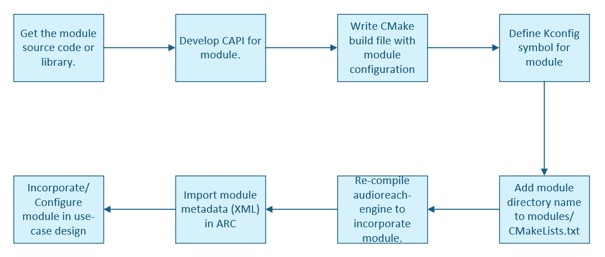

   Module integration workflow

Refer to `README <https://github.com/Audioreach/audioreach-engine?tab=readme-ov-file#adding-new-module>`__ for more details.

Naming Convention for Entry Point Functions
-------------------------------------------

You must define functions that follow the signature of the
`capi\_get\_static\_properties\_f() <#typedef-capi-err-t-capi-get-static-properties-f-capi-proplist-t-init-set-proplist-capi-proplist-t-static-proplist>`__
and
`capi\_init\_f() <#typedef-capi-err-t-capi-init-f-capi-t-pif-capi-proplist-t-init-set-proplist>`__
definitions. Use these functions as entry point functions to create
an instance of the module using following naming convention:

-  Your `capi\_get\_static\_properties\_f() <#typedef-capi-err-t-capi-get-static-properties-f-capi-proplist-t-init-set-proplist-capi-proplist-t-static-proplist>`__  function variant must be named as follows: *<*\ tag\ *>*\ \_get\_static\_properties\_f(), where *<*\ tag\ *>* can be any string as long as the function name remains a valid C function name.

-  Your `capi\_init\_f() <#typedef-capi-err-t-capi-init-f-capi-t-pif-capi-proplist-t-init-set-proplist>`__ function variant must be named as follows: *<*\ tag\ *>*\ \_init, where *<*\ tag\ *>* must be the same string that is used as the tag in the name of the `capi\_get\_static\_properties\_f() <#typedef-capi-err-t-capi-get-static-properties-f-capi-proplist-t-init-set-proplist-capi-proplist-t-static-proplist>`__   function variant.

An example of a valid *<*\ tag\ *>* is volume\_control. With this tag, the function names are volume\_control\_get\_static\_properties\_f() and volume\_control\_init().

The *<*\ tag\ *>* used for naming the entry point functions is used to register the module with the Audio Module Data Base (AMDB) in the ARE.

Functional Description
=======================

.. _media_format:

Media Format
--------------------

The ARE handles a wide variety of media including fixed point PCM
data, raw compressed data (such as AAC bit stream), and so on. For
PCM data, additional attributes such as sampling rate and number
channels are encapsulated in the media format.

-  Media format contains:

   -  Data format – Fixed point, packetized (such as IEC61937),
      raw-compressed

   -  For PCM or packetized data – Sample rate, channels, channel map,
      bit width, and so on

   -  Format ID for all data formats – Identifies whether data is PCM,
      AAC, MP3, and so on

-  ARE has no knowledge of the output format of the module. Modules must
   implement the query
   (`capi\_vtbl\_t::get\_properties() <#capi-err-t-capi-vtbl-t-get-properties-capi-t-pif-capi-proplist-t-proplist-ptr>`__)
   and event.

-  Typically, before a
   `capi\_vtbl\_t::process() <#capi-err-t-capi-vtbl-t-process-capi-t-pif-capi-stream-data-t-input-capi-stream-data-t-output>`__
   call is made, the ARE sets the valid input media format, and the
   module must have raised the output media format (if not queried by
   the ARE).

-  `CAPI\_INPUT\_MEDIA\_FORMAT\_V2 <#_bookmark251>`__ – Used by the ARE
   to set the media format on an input data port. Data sent in a
   `capi\_vtbl\_t::process() <#capi-err-t-capi-vtbl-t-process-capi-t-pif-capi-stream-data-t-input-capi-stream-data-t-output>`__
   call follows this media format. The ARE never uses this media format
   for
   `capi\_vtbl\_t::get\_properties() <#capi-err-t-capi-vtbl-t-get-properties-capi-t-pif-capi-proplist-t-proplist-ptr>`__.
   Modules must ensure that the media format they receive is supported
   (for example, some modules may not support 24-bit data or fractional
   sample rates).

-  `CAPI\_OUTPUT\_MEDIA\_FORMAT\_V2 <#_bookmark267>`__ – Used by the ARE
   to query the media format on an output data port. Data output by the
   module in the
   `capi\_vtbl\_t::process() <#capi-err-t-capi-vtbl-t-process-capi-t-pif-capi-stream-data-t-input-capi-stream-data-t-output>`__
   call follows this media format. It is never used for
   `capi\_vtbl\_t::set\_properties <#capi-err-t-capi-vtbl-t-set-properties-capi-t-pif-capi-proplist-t-proplist-ptr>`__.
   The ARE provides the buffers in a process() call per the media format
   the module outputs.

-  `CAPI\_EVENT\_OUTPUT\_MEDIA\_FORMAT\_UPDATED\_V2 <#_bookmark341>`__ –
   Used by a module to raise a media format event on an output data
   port.

We recommend using the v2 media format properties and events. The difference between v1 and v2 is that v1 supports a maximum of only 16 channels, whereas v2 supports an unlimited number of channels.

The following table provides a summary of which functions are used for media formats.

+------------------------+---------------------------+---------------------------+-----------------+
|     **Media format**   |     **get\_property()**   |     **set\_property()**   |     **Event**   |
+========================+===========================+===========================+=================+
|     Input              |     No                    |     Yes                   |     No          |
+------------------------+---------------------------+---------------------------+-----------------+
|     Output             |     Yes                   |     No                    |     Yes         |
+------------------------+---------------------------+---------------------------+-----------------+

Typically, single-port modules are not informed of new connections
because they do not implement
`INTF\_EXTN\_DATA\_PORT\_OPERATION <#define-intf-extn-data-port-operation-0x0a001023>`__.
The module is assumed to raise the media format, and then the port
is disconnected and reconnected. The module has no knowledge of
this. However, because port memories are recreated in the ARE,
previous media format information is lost. To know the media format,
the containers can query the media format from the modules.
Therefore, in the ARE, it is important to support both queries and
events for media formats.

Fixed Point
~~~~~~~~~~~

A bits\_per\_sample field determines the word size
(`capi\_standard\_data\_format\_t <#struct-capi-standard-data-format-t>`__
and
`capi\_standard\_data\_format\_v2\_t <#struct-capi-standard-data-format-v2-t>`__).

Although bits\_per\_sample determines the word size, the actual
sample might be of equal or smaller width, which is determined by
the bit width. The bit width can be inferred from the Q factor. If
the Q factor is Q27, it stands for 24-bit data in 32-bit word.

However, to explicitly know the bit width, the PCM framework
extension
(`FWK\_EXTN\_PCM\_PARAM\_ID\_MEDIA\_FORMAT\_EXTN <#define-fwk-extn-pcm-param-id-media-format-extn-0x0a001001>`__)
must be used.

Interleaving
^^^^^^^^^^^^

In interleaved and deinterleaved packed cases, the
`capi\_vtbl\_t::process() <#capi-err-t-capi-vtbl-t-process-capi-t-pif-capi-stream-data-t-input-capi-stream-data-t-output>`__
call contains only one buffer per stream. In the deinterleaved
unpacked case, the process() call contains one buffer per channel
per stream. The following figure illustrates PCM interleaving and
deinterleaving.

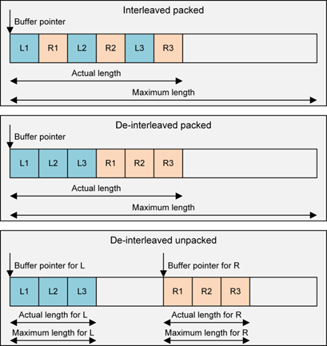

   Interleaving and de-interleaving for PCM

Channel Map or Channel Type
^^^^^^^^^^^^^^^^^^^^^^^^^^^

During playback, audio channels are routed to different speakers.
Each speaker has a designated location (for example, left, right,
center, and LFE). When different channels are processed and routed
in software, the speaker must identify the data to which a channel
is routed. Similarly, in the multichannel recording use case, mic
data can contain noise reference vs. primary signal.

Each channel has a channel type or map associated with it. With this
concept, there is no need to have a fixed order of channels in a
buffer. For example, the left channel is not required to be at first
position and the right channel at the second position. It is
sufficient to denote each position by channel type.

For example, some decoders might provide output in this order: L, R,
LFE, C, Ls, Rs. Others might provide output in this order: L, R, C,
LFE, Ls, Rs (C and LFE are reversed). If LFE is to be processed with
different filter coefficients, tuning a parameter on such a filter
will indicate the coefficient for each channel or a group of
channels.

Currently defined channel types mainly indicate speaker names. For
the mic path or for more speaker names, use custom channel maps
(like PCM\_CUSTOM\_CHANNEL\_MAP\_1). The system designer can assign
meaning based on product requirement.

Floating Point
~~~~~~~~~~~~~~

The `CAPI\_FLOATING\_POINT <#_bookmark187>`__ data format is used
for floating point data.

Raw Compressed
~~~~~~~~~~~~~~

The `CAPI\_RAW\_COMPRESSED <#_bookmark188>`__ data format is used for encoded data (for example, input of a decoder or output of an encoder).

Packetized Formats
~~~~~~~~~~~~~~~~~~

CAPI supports various packetized formats such as IEC 61397, IEC 60958 nonlinear, DSD DOP, compressed-over-PCM (COP), and generic compressed. These formats also follow `capi\_standard\_data\_format\_t <#struct-capi-standard-data-format-t>`__ or 
`capi\_standard\_data\_format\_v2\_t <#struct-capi-standard-data-format-v2-t>`__ because the data looks like fixed point.

Deinterleaved Raw Compressed
~~~~~~~~~~~~~~~~~~~~~~~~~~~~

The `CAPI\_DEINTERLEAVED\_RAW\_COMPRESSED <#_bookmark190>`__ data
format is used to send different channels of encoded data in
separate buffers if required, e.g. left channel on one buffer and
right on another. This helps downstream modules handle left and
right channels separately.

Buffering
---------

Buffering is dictated through
`CAPI\_REQUIRES\_DATA\_BUFFERING <#_bookmark236>`__,
`CAPI\_PORT\_DATA\_THRESHOLD <#_bookmark262>`__, and
`CAPI\_EVENT\_PORT\_DATA\_THRESHOLD\_CHANGE <#_bookmark336>`__.
A threshold is basically the buffer size in bytes per data port.
Examples:

-  A module that can process any amount of data should return threshold
   as 1 byte.

-  A fixed frame size module with 10 ms frame duration. At 48K, 2
   channels, 2 bits per sample: 10 ∗ 48 ∗ 2 ∗ 2 = 1920 bytes threshold.

-  A fixed frame size module with 1024 sample frame width. At 48K, 2
   channels, 2 bits per sample: 1024 ∗ 2 ∗ 2 = 4096 bytes threshold.

-  A decoder with a maximum input frame size of 8192 bytes.

Both input and output ports can have their own thresholds. For example:

-  Encoder input can be 2048 bytes and output can be 256 bytes.

-  A fixed frame size module with a 10 ms threshold at the input media
   format (48K, 2 channels, 2 bits per sample) and output media format
   (48K, 6 channels, 2 bits per sample) has an input threshold of 1920
   and an output threshold of 11520 bytes.

Different ports of a multiport module can have their own thresholds. For example:

-  An EC module with 5 ms frame duration can have 16K, 2 channels, 2
   bits per sample mic data and 48K, 2 channels, 2 bits per sample
   playback reference. Thus, the first input has a threshold of 320
   bytes and the second input has a threshold of 960 bytes.

Typically, the worst-case frame size for decoders is the input and
output threshold. Unless data is processed, decoders cannot know the
required size and, to read data, a buffer is required.
A greater than 1 threshold can ensure that minimum samples (bytes)
are present in the input, and minimize the empty space available in
the output when `capi\_vtbl\_t::process() <#capi-err-t-capi-vtbl-t-process-capi-t-pif-capi-stream-data-t-input-capi-stream-data-t-output>`__ is called (depending on the `CAPI\_REQUIRES\_DATA\_BUFFERING <#_bookmark236>`__ flag).

+-----------------------------------+--------------------------+------------------------------------------------------------------+---------------------------------------------------------------------------------+
|     **Requires data buffering**   |     **Port threshold**   |     **Typical modules**                                          |     **Framework behavior**                                                      |
+===================================+==========================+==================================================================+=================================================================================+
|     FALSE                         |     1                    |     Sample-based PP modules (N sample input produces N sample    |     For PCM, the ARE ensures that when any  input is provided, the output has   |
|                                   |                          |                                                                  |                                                                                 |
|                                   |                          |     output)                                                      |     sufficient space for that many samples of output.                           |
+-----------------------------------+--------------------------+------------------------------------------------------------------+---------------------------------------------------------------------------------+
|     FALSE                         |     > 1                  |     Encoders and fixed frame  size modules (EC that may have     |     For PCM, assuming N is the input threshold and M is the output threshold,   |
|                                   |                          |                                                                  |                                                                                 |
|                                   |                          |     fixed frame size such as 10 ms)                              |     the ARE ensures that when a module process is called, N samples are present |
|                                   |                          |                                                                  |                                                                                 |
|                                   |                          |                                                                  |     in the input, and M sample amount of space is available in the output.      |
+-----------------------------------+--------------------------+------------------------------------------------------------------+---------------------------------------------------------------------------------+
|     TRUE                          |     1                    |     Resamplers (fractional), rate matching, buffering modules    |     The ARE can call the process function with any amount of input.             |
|                                   |                          |                                                                  |                                                                                 |
|                                   |                          |                                                                  |     However, there are extensions available that can optimize the calls.        |
+-----------------------------------+--------------------------+------------------------------------------------------------------+---------------------------------------------------------------------------------+
|     TRUE                          |     > 1                  |     Decoders, packetizers, depacketizers, and possibly encoders  |     The ARE can call the process function                                       |
|                                   |                          |                                                                  |                                                                                 |
|                                   |                          |                                                                  |     with any amount of input.                                                   |
+-----------------------------------+--------------------------+------------------------------------------------------------------+---------------------------------------------------------------------------------+

When the `CAPI\_REQUIRES\_DATA\_BUFFERING <#_bookmark236>`__ flag is
FALSE, the same buffer can be reused for multiple modules because no
partial data will be left in those buffers after calling
`capi\_vtbl\_t::process() <#capi-err-t-capi-vtbl-t-process-capi-t-pif-capi-stream-data-t-input-capi-stream-data-t-output>`__
on the module.
Setting the CAPI\_REQUIRES\_DATA\_BUFFERING flag involves an extra
cost, so only use it when absolutely necessary.

Non-buffered Data Flow Model
~~~~~~~~~~~~~~~~~~~~~~~~~~~~

In the non-buffered data flow model, the
`CAPI\_REQUIRES\_DATA\_BUFFERING <#_bookmark236>`__ flag is set to
FALSE. The non-buffered data flow model is as follows:

-  The framework must ensure that it provides the same number of samples
   on every input port of the module. For compressed data, the same
   number of bytes must be provided on every input port.

-  The number of output samples provided on every output port of the
   module must be the same as the number of input samples. For
   compressed data, the number of bytes on every port must be the same
   as the number of input bytes. The framework code must ensure that
   there is enough space in the output buffer.

-  The module must be able to handle any number of input samples (or
   input bytes in the case of compressed data).

This model incurs low overhead, so use it whenever possible. You can
also use this model for modules that perform processing in fixed
blocks of data (frames).

Buffered Data Flow Model
~~~~~~~~~~~~~~~~~~~~~~~~

In the buffered data flow model, the
`CAPI\_REQUIRES\_DATA\_BUFFERING <#_bookmark236>`__ flag is set to
TRUE. The buffered data flow model is as follows:

-  The module must define a threshold in terms of the number of bytes
   for every input and output port.

This threshold for any port may be queried by the framework at any
time using the `CAPI\_PORT\_DATA\_THRESHOLD <#_bookmark262>`__
property. If the threshold changes, the module must raise the
`CAPI\_EVENT\_PORT\_DATA\_THRESHOLD\_CHANGE <#_bookmark336>`__ event
for each port on which the threshold changed.

-  For input ports, the threshold indicates the minimum amount of data
   needed to guarantee that processing can be done. For example,
   consider an input buffer with 100 bytes of data and a threshold of 25
   bytes.

   -  If the module consumes more than 75 bytes, the amount of remaining
      data in the input buffer will be less than its threshold.

   -  When this occurs, the module can stop further processing and
      return from
      `capi\_vtbl\_t::process() <#capi-err-t-capi-vtbl-t-process-capi-t-pif-capi-stream-data-t-input-capi-stream-data-t-output>`__.

It is possible for the module to perform processing with a lesser
amount of data. For example, if the module performs decoding of
compressed data, this value is the worst-case compressed frame size.
The module can to perform decoding with lesser data if the actual
compressed frame size is smaller. In this case, it can continue
processing.

-  For output ports, the threshold indicates the minimum amount of free
   space required to guarantee that processing can be done.

For example, consider an output buffer with a maximum size of 100
bytes and a threshold of 25 bytes. If the module produces more than
75 bytes of data, the remaining free space in the output buffer will
be less than the threshold. When this happens, the module can stop
further processing and return from the `capi\_vtbl\_t::process() <#capi-err-t-capi-vtbl-t-process-capi-t-pif-capi-stream-data-t-input-capi-stream-data-t-output>`__.

-  The framework can provide input and output buffers of any size when calling `capi\_vtbl\_t::process() <#capi-err-t-capi-vtbl-t-process-capi-t-pif-capi-stream-data-t-input-capi-stream-data-t-output>`__.

-  When the `capi\_vtbl\_t::process() <#capi-err-t-capi-vtbl-t-process-capi-t-pif-capi-stream-data-t-input-capi-stream-data-t-output>`__
   call returns:

   -  The module must have consumed enough data so the amount of valid
      data remaining in at least one input port is less than the
      threshold for that port.

   -  OR, the module must have produced enough data so the amount of
      free space remaining in at least one output port is less than the
      threshold for that port.

Following are examples of thresholds that can be provided:

-  Decoders:

   -  Input threshold = the worst-case compressed frame size

   -  Output threshold = the size of one uncompressed frame

-  Encoders:

   -  Input threshold = the size of one uncompressed frame

   -  Output threshold = the worst-case compressed frame size

-  Sample rate converter that can work on an arbitrary number of
   samples:

   -  Input threshold = 1

   -  Output threshold = 1

This model incurs high overhead, so use it only when necessary.

Debugging
---------

For debugging purposes, two properties are added in the ARE:

**CAPI\_MODULE\_INSTANCE\_ID**
Each module in a graph has a unique instance ID. This module
instance ID is assigned by the ARC platform and is provided to the
modules through this property at or immediately after `capi\_init\_f() <#typedef-capi-err-t-capi-init-f-capi-t-pif-capi-proplist-t-init-set-proplist>`__. The module ID is also provided here, although module ID-based logic
should not be introduced.

**CAPI\_LOGGING\_INFO** Contains the log ID and a mask.
The log ID is unique to the module instance, and it contains bits
for identifying the container where the module runs. We recommend
that modules print debug messages with the log ID.
The mask identifies the 6 bits left for the module (this might
change in the future; hence, the mask provided must be used). When
EOS or some other discontinuity occurs, modules might increment
these 6 bits. If a module does file logging with the log ID as the
file name suffix, every discontinuity will generate a new file.

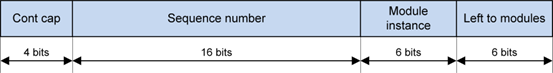

   Bit mask for the log ID

Data Ports
----------

There are different types of data ports:

-  Labeled ports or static data ports – The module declares the port
   IDs. For example, an EC module can label ports as mic input (*near
   end* in a voice call) and playback reference input (*far end* in a
   voice call).

-  Dynamic ports – The ARC platform assigns the port IDs externally.
   For example, a mixer can support multiple inputs.

The following limits apply to the number of ports:

-  Module implementation might limit the maximum number of ports it can
   support, or it might support an infinite number of ports.

-  When a module is placed in a graph, and depending on the maximum
   number of concurrencies, there is a maximum number of ports.

-  Depending on actual active concurrencies, there is a specific number
   of ports.

The maximum number of ports possible in a given instance of a module
is communicated through `CAPI\_PORT\_NUM\_INFO <#_bookmark245>`__,
which is useful for memory allocations.
If a module can work with or without output ports, i.e., it can act
as a module with output ports or as a sink, then the module must
inform this to the framework when queried with property ID
`CAPI\_MIN\_PORT\_NUM\_INFO <#_bookmark241>`__ . By default, the
framework assumes the minimum number of output ports is 1. The same
applies for modules that can work both with or without input ports
(can act as source).

Port Indices and Port IDs
~~~~~~~~~~~~~~~~~~~~~~~~~

CAPI relies on port indices. For example, a
`capi\_vtbl\_t::process() <#capi-err-t-capi-vtbl-t-process-capi-t-pif-capi-stream-data-t-input-capi-stream-data-t-output>`__
call uses arrays of stream data that are indexed by the port index.
For multi-port modules, port IDs are used in graph diagrams in the
ARC platform.
Although an index is sufficient for most modules, the index-port ID
mapping might be important in some cases. For example, a parameter
that includes a port ID might be exposed to the clients.
The
`INTF\_EXTN\_DATA\_PORT\_OPERATION <#define-intf-extn-data-port-operation-0x0a001023>`__
interface extension can be used for getting port
ID-to-index mapping, and also to know when ports are opened, closed,
started, or stopped. For more details, see :ref:`data_port_operation`.
Port indices are assigned by the framework. The maximum value of a
port index is less than the number in `CAPI\_PORT\_NUM\_INFO <#_bookmark245>`__.

Get and Set Parameters
----------------------

A module must define IDs and payload structures for all the
parameters it supports. H2xml annotation is also required.

Alignment, Packing, and Get Parameter Requirements
~~~~~~~~~~~~~~~~~~~~~~~~~~~~~~~~~~~~~~~~~~~~~~~~~~

Some module parameter payloads have substructures and variable
length arrays. For example:
struct\_a { int num; struct\_b arr[0]}
Where arr is of length num.
If the size of struct\_b is not aligned to 4 bytes and it has a
4-byte element, some processors will crash due to misalignment. For
this reason, the ARC platform ensures that all substructures are
padded for 4-byte alignment so that arrays of such structures, or
alignment of another substructure following a structure, are not
broken.
What about 8-byte alignment? In the above example, 8-byte alignment
might also be required, but it is not supported. Eight-byte numbers
must be split into two 4-byte numbers.
For packing requirements, the module payloads can be manually packed
to the correct alignment (at least 4-byte). The ARC platform always
ensures packing, but manual packing helps with parsing inside the
modules.
For example:
struct {int8 a; int8 b;}
Must be manually padded as:
struct {int8 a; int8 b; int8 reserved1; int8 reserved2}

Get Parameter Requirements
~~~~~~~~~~~~~~~~~~~~~~~~~~

When a client of the ARE calls the APM\_CMD\_GET\_CFG API, it is
translated into the
`capi\_vtbl\_t::get\_param() <#capi-err-t-capi-vtbl-t-get-param-capi-t-pif-uint32-t-param-id-const-capi-port-info-t-port-info-ptr-capi-buf-t-params-ptr>`__
function on CAPI modules. The client does not know how much memory a
parameter requires when the parameter is of variable size.

The h2xmlp\_maxSize annotation can be used for annotating parameter
size requirements for
`capi\_vtbl\_t::get\_param() <#capi-err-t-capi-vtbl-t-get-param-capi-t-pif-uint32-t-param-id-const-capi-port-info-t-port-info-ptr-capi-buf-t-params-ptr>`__.

The modules must implement the following: if the provided size is
not sufficient, the module must return the
`CAPI\_ENEEDMORE <#define-capi-eneedmore-uint32-t-1-4>`__ error and
update the actual length with the required size (including the
memory required for alignment, if any).

Property for Persistent Parameters
~~~~~~~~~~~~~~~~~~~~~~~~~~~~~~~~~~

Typically, when a set\_param() is issued, the module copies the
payload. However, when a parameter’s payload (calibration) is huge,
copying data is not preferred. A module can define certain
parameters as persistent (via the h2xml tags in the header file)
and, when the set\_param() is issued, the module can store the
pointer to the blob.
Before such a set\_param() is done, a
`capi\_vtbl\_t::set\_properties() <#capi-err-t-capi-vtbl-t-set-properties-capi-t-pif-capi-proplist-t-proplist-ptr>`__
is done to indicate that the module must copy the pointer. If the
module does not expect the parameter to be persistent or vice versa,
an error might be thrown or the appropriate handling might be
implemented. For details, see
`CAPI\_PARAM\_PERSISTENCE\_INFO <#_bookmark259>`__.

Older modules are to return
`CAPI\_EUNSUPPORTED <#define-capi-eunsupported-uint32-t-1-2>`__ for
unsupported properties; such errors are ignored. This ensures
backward compatibility.

Events
------

A mechanism is provided for the module to notify the framework of
events that occur. Events are identified by predefined event IDs.
The interface also describes the payload corresponding to each event
ID.
The module provides the following information to the framework when
the callback function is called:

-  An opaque state token that is provided by the framework when the
   module is created.

-  The event ID.

-  The port number associated with this event (optional).

-  A buffer containing the payload associated with this event. The
   module must allocate the buffer, and it can free the buffer after the
   callback function returns.

All event IDs and their payloads are described in file :ref:`capi_events_h`.

Following is a typical call flow for raising events to the
framework.

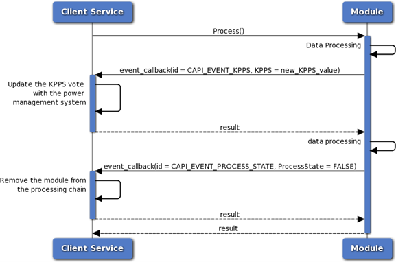

   Typical call flow for raising events

In the diagram, two events are raised in a call to
`capi\_vtbl\_t::process() <#capi-err-t-capi-vtbl-t-process-capi-t-pif-capi-stream-data-t-input-capi-stream-data-t-output>`__.
The framework takes the appropriate action within the callback
function.
**NOTE** The module can raise an event in any of the CAPI calls from
`capi\_vtbl\_t <#struct-capi-vtbl-t>`__: init(), get\_properties(),
set\_properties(), get\_param(), set\_param(), process(), and end().

Thread Safety
~~~~~~~~~~~~~

The callback function implementation is not thread safe. If the
module uses separate threads internally for processing, it can only
call the function within a function call made by the framework. The
following call flow diagram illustrates this point.

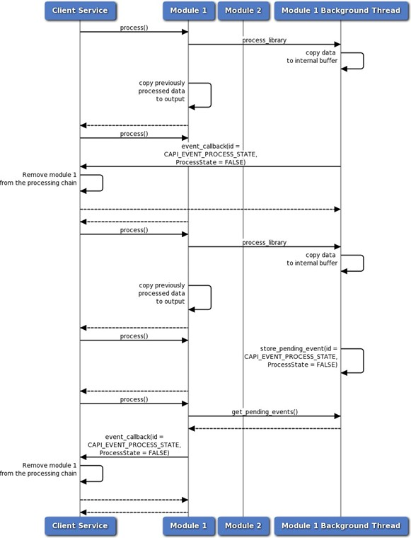

   Thread safety call flow

In the diagram, Module 1 uses a background thread to process data.
If this thread is to raise an event, it cannot call the callback
function of the framework directly. The framework thread might be in
the middle of doing some other processing at that time, so this
would corrupt its data.
The correct approach in this case is for the background thread to
internally store this event as a pending event (the data structure
used here must be thread safe). When the framework calls
`capi\_vtbl\_t::process() <#capi-err-t-capi-vtbl-t-process-capi-t-pif-capi-stream-data-t-input-capi-stream-data-t-output>`__
(or any other function), the module can query this data structure
from the context of the framework thread and then raise any pending
events.

Raise Events to ARE Clients
~~~~~~~~~~~~~~~~~~~~~~~~~~~

CAPI provides a special event
(`CAPI\_EVENT\_DATA\_TO\_DSP\_CLIENT <#_bookmark331>`__ or
`CAPI\_EVENT\_DATA\_TO\_DSP\_CLIENT\_V2 <#_bookmark343>`__) that can
be used to send data to the client processor of the ARE. The module
must raise this event when it is to send data and provide the
following information:

-  Parameter ID – Indicates the type of the payload. The values of the
   parameter IDs and the corresponding payloads are defined by the
   module developer, and the destination service on the ARE client
   processor must understand them.

-  Token – Identifier that can be used to provide additional
   instance-related information. The destination service should be able
   to interpret this token.

-  Payload – The payload that is to be sent.

CAPI events to the ARE client are supported using
`CAPI\_REGISTER\_EVENT\_DATA\_TO\_DSP\_CLIENT <#_bookmark257>`__ and
`CAPI\_EVENT\_DATA\_TO\_DSP\_CLIENT <#_bookmark331>`__. However,
with this method, the framework must take care of the event
information.

To remove this overhead and make event handling more transparent,
use the following events instead:

-  `CAPI\_REGISTER\_EVENT\_DATA\_TO\_DSP\_CLIENT\_V2 <#_bookmark258>`__
   and CAPI\_EVENT\_DATA\_TO\_DSP\_CLIENT\_V2 are introduced

-  `CAPI\_REGISTER\_EVENT\_DATA\_TO\_DSP\_CLIENT\_V2 <#_bookmark258>`__
   takes the destination address, token, and any event configuration

The differences provided by v2 of these events are:

-  Modules must manage the client address.

-  The client can register with different configurations for the same
   event. For example, one client can register with one set of watermark
   levels compared to another.

In both versions, multiple clients per event is possible.

Common Events
~~~~~~~~~~~~~~

+---------------------------+-------------------------------------------------------------------------------+
|     **Event**             | **Description**                                                               |
+===========================+===============================================================================+
|     Algorithmic delay     |     Group delay of a filter, for example, is reported as algorithmic delay.   |
+---------------------------+-------------------------------------------------------------------------------+
|     KPPS/BW               |     Million instruction per second (MIPS) is a standard term used for         |
|                           |                                                                               |
|                           |     algorithm complexity.                                                     |
|                           |                                                                               |
|                           |     In Hexagon processor terminology, because a packet of instructions        |
|                           |                                                                               |
|                           |     (containing at most 4 instructions) can be executed in one cycle (ideal   |
|                           |                                                                               |
|                           |     cache), kilo packets per second (KPPS) is typically used.                 |
|                           |                                                                               |
|                           |     Bandwidth represents the amount of bus traffic the module generates.      |
+---------------------------+-------------------------------------------------------------------------------+
|     Output media format   |     See section :ref:`media_format`                                           |
+---------------------------+-------------------------------------------------------------------------------+
|     Process state         |     Describes whether the module is enabled or disabled.                      |
|                           |                                                                               |
|                           |     A module might want to disable itself based on a UI setting (such as      |
|                           |                                                                               |
|                           |     equalizer disable), calibration, or other condition. When a module is     |
|                           |                                                                               |
|                           |     disabled, it is removed from processing.                                  |
|                           |                                                                               |
|                           |     For single-port modules, the framework bypasses the module and the        |
|                           |                                                                               |
|                           |     rest of the graph can still run.                                          |
|                           |                                                                               |
|                           |     Disabling a multiport module might render an entire graph unusable        |
|                           |                                                                               |
|                           |     (depending on the shape of the graph).                                    |
+---------------------------+-------------------------------------------------------------------------------+

Process Call
------------

The
`capi\_vtbl\_t::process() <#capi-err-t-capi-vtbl-t-process-capi-t-pif-capi-stream-data-t-input-capi-stream-data-t-output>`__
call is the most important function because it is repeatedly called
for signal and data processing:
capi\_err\_t (\*process)(capi\_t\* \_pif,
capi\_stream\_data\_v2\_t\* input[], capi\_stream\_data\_v2\_t\*
output[]);
There are two stream data versions (v1 and v2); the difference is
that v2 supports metadata.
To access v2, cast the
`capi\_stream\_data\_v2\_t <#struct-capi-stream-data-v2-t>`__
pointers to
`capi\_stream\_data\_v2\_t <#struct-capi-stream-data-v2-t>`__
pointers for stream\_data\_version == 1 (in
`capi\_stream\_flags\_t <#union-capi-stream-flags-t>`__).

**NOTES:**

-  There might be holes (NULL pointers) in the
   `capi\_stream\_data\_v2\_t <#struct-capi-stream-data-v2-t>`__ array
   for inactive (closed) ports.

-  The process() function might be called with NULL input buffers
   (input[i] == NULL \|\| input[ i].buf\_ptr == NULL \|\|
   input[i].buf\_ptr[j].data\_ptr == NULL) or buffers with actual\_len =
   0.

   This is useful if any internal memory of the CAPI module is to be
   given out without any new input. Modules must make the necessary
   NULL checks before accessing pointers.

-  If a call to process() results in an event, the output buffer must
   not be filled in some cases. Check the event definition to see which
   events belong to this category.

Stream Data
~~~~~~~~~~~~~~~~~~~~~

For each port, stream data contains the following:

-  Flags – timestamp validity, end-of-frame (EOF), end-of-stream (EOS),
   erasure, stream data version

-  Timestamp

-  Buffers:

   -  Only one buffer for interleaved and deinterleaved packed data

   -  Multiple buffers for deinterleaved unpacked data

In stream data version 1, a doubly linked list of metadata per port is present.

Timestamp Propagation
~~~~~~~~~~~~~~~~~~~~~

For SISO modules, the framework assigns an output timestamp and
flags (in
`capi\_stream\_data\_v2\_t <#struct-capi-stream-data-v2-t>`__)
before calling
`capi\_vtbl\_t::process() <#capi-err-t-capi-vtbl-t-process-capi-t-pif-capi-stream-data-t-input-capi-stream-data-t-output>`__.

For SISO modules, the framework assigns the output timestamp and
flags before calling process() as follows: output timestamp = input
timestamp - algorithmic delay, where algorithmic delay is reported
by the module using
`CAPI\_EVENT\_ALGORITHMIC\_DELAY <#_bookmark334>`__.

If a module is to change this behavior, it must assign the
appropriate value for the timestamp in the output
`capi\_stream\_data\_v2\_t <#struct-capi-stream-data-v2-t>`__.

For multiport modules, the association of output to input is not
known to the framework. The module is responsible for routing
`capi\_stream\_data\_v2\_t <#struct-capi-stream-data-v2-t>`__
correctly.

Return CAPI\_ENEEDMORE in a Process Call
~~~~~~~~~~~~~~~~~~~~~~~~~~~~~~~~~~~~~~~~

If the input data is not sufficient for processing a frame (in fixed
frame modules), a CAPI module must check and return
`CAPI\_ENEEDMORE <#define-capi-eneedmore-uint32-t-1-4>`__.

If the EOF is set (see section :ref:`eof_handling`), the
module must try to process the frame with whatever it has or drop
the data.

.. _eof_handling:

EOF Handling
~~~~~~~~~~~~

An EOF is set by the framework when it is to force process a frame
(that is, the module must process the frame with whatever data it
has or drop the data).

For example, when processing in 5 ms frames, suppose 2 ms of data is
left. It is possible to wait for 3 ms more data, but a media format
might be received indicating that subsequent data is of a different
media format. The old 2 ms and 3 ms cannot be concatenated and sent
in one buffer due to the media format change. The framework sets the
EOF and asks the module to process the 2 ms of data, if possible.
The module can then process the 2 ms data or drop it.

**NOTE:** Do not pad 3 ms of data because it will increase the
signal length and hence cause a subsequent delay in draining the
data.

For another example, some decoders might wait for the next frame’s
synchronization word before processing given data. To force a module
to decode existing data without waiting for subsequent data, the EOF
is set.

When the EOS flag is set, an EOF is also set because
force-processing is implicitly required.

Timestamp discontinuities also cause an EOF to be set because two
buffers with discontinuous timestamps might not be concatenated.

A module that propagates metadata must also handle an EOF by itself.
Typically, an EOF is propagated when the module cannot produce any
more outputs with the given input. It is preferable to output EOF at
the same time as the last batch of output is sent instead of waiting
for one more process call.

EOS Handling
~~~~~~~~~~~~

An EOS is indicated through the marker\_eos flag
(`capi\_stream\_flags\_t <#union-capi-stream-flags-t>`__)and also
through MODULE\_CMN\_MD\_ID\_EOS in
`capi\_stream\_data\_v2\_t::metadata\_list\_ptr <#_bookmark180>`__
(`CAPI\_STREAM\_V2 <#_bookmark184>`__\ *>*\ =1). A module that
handles metadata must also propagate an EOS.

An EOS indicates that the stream is ending:

-  Flushing – Any memory in the algorithms must be flushed

-  Non-flushing – Any memory in the algorithms must not be flushed and
   the EOS must suffer the delay.

For example, consider two streams being mixed into one speaker. The
stream-side processing must be flushed when an EOS flows so that any
data left inside the algorithms can be sent out. But, when the EOS
flows through the mixer, it changes to non-flushing. If it is to
remain flushing, the rendered data will have gaps in the second
stream’s audio as well. By keeping the EOS as non-flushing, it still
flows in the path until the speaker sends a notification about EOS
rendering. At this point, the application can close stream one.

An EOS sent by the ARE client is called an *external EOS*. An EOS
generated by the framework for certain cases is called an *internal
EOS*.

-  An internal EOS is used to indicate the data flow state due to an
   upstream data flow stop (for example, upstream data flow of a mixer
   stops, the EOS is sent by the upstream data flow, and the mixer can
   stop waiting on that stream).

-  An external EOS also indicates a data flow stop. An external EOS
   results in an event to the ARE client when it reaches a sink endpoint
   (or when it is dropped).

For more details about data flow states, see :ref:`data_flow_states`.

Erasure Handling
~~~~~~~~~~~~~~~~

Erasure is set when input is not available. This can happen when a
certain amount of data is expected at a certain time but, due to
delays in the upstream, data was not available on time. Erasure
tells the module about the absence of data. Some modules, such as
decoders, can trigger packet loss concealment. Some other modules
can trigger ramp down on buffered data to smooth out under-run. Most
modules may not use this flag but, if they propagate metadata, then
they must propagate this flag as well.

Metadata Propagation
~~~~~~~~~~~~~~~~~~~~

Metadata including EOS propagation is performed using the
`INTF\_EXTN\_METADATA <#define-intf-extn-metadata-0x0a00101f>`__
extension.

Raise Events in Process Context
~~~~~~~~~~~~~~~~~~~~~~~~~~~~~~~

When the following events are to be raised in a
`capi\_vtbl\_t::process() <#capi-err-t-capi-vtbl-t-process-capi-t-pif-capi-stream-data-t-input-capi-stream-data-t-output>`__
context, modules must not output data:

-  `CAPI\_EVENT\_OUTPUT\_MEDIA\_FORMAT\_UPDATED <#_bookmark332>`__ or
   `CAPI\_EVENT\_OUTPUT\_MEDIA\_FORMAT\_UPDATED\_V2 <#_bookmark341>`__

-  `CAPI\_EVENT\_PROCESS\_STATE <#_bookmark333>`__

-  `CAPI\_EVENT\_PORT\_DATA\_THRESHOLD\_CHANGE <#_bookmark336>`__

For example, if a process() call causes the media format to change
and it outputs data, there might be some data in the old media
format and some data in the new media format. It will take at most
three process calls to handle this case:

-  In the first process() call, output the data in the old media format.

-  In the second call, raise the new media format.

The framework handles the media format event (resizes the buffers, if necessary) and calls the module back to see if it can output some data.

-  In the third call, output the data in the new media format.

Key Framework Extensions
------------------------

Signal Triggered Module
~~~~~~~~~~~~~~~~~~~~~~~

The `FWK\_EXTN\_STM <#define-fwk-extn-stm-0x0a001003>`__ framework extension is useful for modules that are triggered based on an interrupt (DMA) or timer. Only one such module can be present in a container. A signal, which can be set on a timer or interrupt, is given to the module. The entire graph is executed when this trigger occurs. Thus, the whole container is designated as signal- or timer-triggered.

Trigger Policy
~~~~~~~~~~~~~~

The trigger policy framework extension (`FWK\_EXTN\_TRIGGER\_POLICY <#define-fwk-extn-trigger-policy-0x0a00103a>`__) is used to determine when to call a module based on triggers available at the module’s ports:

-  For input ports — Containing data is a trigger

-  For output ports — Containing an empty buffer is a trigger

For example, a module can be called when input or output is available, or it can be called only when both input and output are available.

A module that buffers data internally can use a trigger policy. Initially, it might block output and listen only to input. When the buffer threshold is reached, the module might set the trigger policy as input OR output. After the buffer is drained, it might set the policy as both input AND output.

For more details, see :ref:`trigger_policy`.

Key Interface Extensions
------------------------

Data Port Operation
~~~~~~~~~~~~~~~~~~~

The data port operation interface (`INTF\_EXTN\_DATA\_PORT\_OPERATION <#define-intf-extn-data-port-operation-0x0a001023>`__) allows modules to know when a port is opened, started, stopped, or closed. It also provides port ID-to-index mapping.

Inter-module Control Link (IMCL)
~~~~~~~~~~~~~~~~~~~~~~~~~~~~~~~~

Inter-module communication in ARE is based on the concept of control links. The graph designer connects control ports of the modules while designing the graph.

Modules must implement `INTF\_EXTN\_IMCL <#define-intf-extn-imcl-0x0a001012>`__ extension and also annotate the h2xml tags of the module with control ports. The modules must also define and implement the messages for communication between the modules.

IMCL allows the following:

-  In-band communication within containers, across containers, and across processors.

-  Messages can be sent in any direction. The module instance ID and control port IDs are used.

-  No HLOS or framework is required to set up IMCL; it is set up in the ARC platform.

-  Recurring or one-time communication; triggerable or non-triggerable.

For example, a keyword-detected notification can be sent to the
buffering module so it can open the gate.

Metadata
~~~~~~~~

The metadata extension (`INTF\_EXTN\_METADATA <#define-intf-extn-metadata-0x0a00101f>`__) is used to send a metadata message in the data path in sync with the data. It only flows downstream. Modules can inject, delete, and propagate metadata. For metadata to  be handled properly, modules must accurately report algorithmic delays. Garbage collection is handled in the framework.

There are different types of metadata, including sample-associated and buffer-associated metadata. For example:

-  EOS

-  Encoded frame’s PCM duration

-  Accurate path delay measurement, which is possible by marking data with metadata (see :ref:`path_delay`).

-  DTMF generation parameters

Port Property Propagation
~~~~~~~~~~~~~~~~~~~~~~~~~

Some modules use the following interface extensions to propagate two port properties:

-  `INTF\_EXTN\_PROP\_IS\_RT\_PORT\_PROPERTY <#define-intf-extn-prop-is-rt-port-property-0x0a001048>`__
   – Propagate the is\_rt port property: real time or non-real time
   (`intf\_extn\_param\_id\_is\_rt\_port\_property\_t <#_bookmark639>`__)

-  `INTF\_EXTN\_PROP\_PORT\_DS\_STATE <#define-intf-extn-prop-port-ds-state-0x0a001040>`__
   – Propagate the downstream port state: stopped, prepared started
   (`intf\_extn\_param\_id\_port\_ds\_state\_t <#_bookmark646>`__)

For details, see :ref:`port_property_propagation`.

Supporting Libraries
--------------------

**NOTE:** Supporting CAPI libraries are deprecated in the ARE.

Supporting libraries for CAPI modules are provided as header files
that define the library interfaces as virtual function tables. To
use a library, the module must get an object that implements that
library interface. Each interface has a GUID associated with it.

Query for a Library
~~~~~~~~~~~~~~~~~~~

A module can get an instance of a library by raising the
`CAPI\_EVENT\_GET\_LIBRARY\_INSTANCE <#_bookmark339>`__. The
framework returns an object that implements this interface. When the
module is finished using this object, it calls the
`capi\_library\_base\_t::end() <#_bookmark373>`__ function of the
object to destroy it.
Following is a typical call flow for getting an instance of a
library.

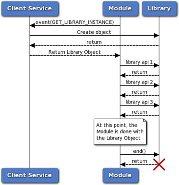

   Library instance call flow

Standard Functions in Libraries
~~~~~~~~~~~~~~~~~~~~~~~~~~~~~~~

All CAPI supporting library interfaces have the
`capi\_library\_base\_t::get\_interface\_id() <#_bookmark372>`__
function as the first function and the
`capi\_library\_base\_t::end() <#_bookmark373>`__ function as the
second function. These functions can be called without knowledge of
the rest of the interface.

-  get\_interface\_id() – Returns the GUID of the interface implemented
   by the object.

This function can be used to identify the interface of the object without knowing its type.

-  end() – Destroys the object. After this function is called, the
   object pointer is no longer valid.

.. _data_flow_states:

Data Flow States
--------------------

A module such as a mixer might need to decide whether to wait for
certain input. If the upstream data flow of a mixer is stopped or if
the stream sends an EOS, there is no need to wait for that input.
This case is handled through data flow states. There are two states:

-  Data is Flowing

-  Data Flow is at Gap (DFG)

Initially, all ports are at DFG. When the
`capi\_vtbl\_t::process() <#capi-err-t-capi-vtbl-t-process-capi-t-pif-capi-stream-data-t-input-capi-stream-data-t-output>`__
function is called with data on the port, it moves to the Data is
Flowing state. When an internal EOS, external EOS, or explicit
`MODULE\_CMN\_MD\_ID\_DFG <#define-module-cmn-md-tracking-event-policy-each-1>`__
is received on the port, the data flow state switches to DFG.
Most modules are not required to consider the data flow state in
their implementation; the framework takes care of it. Multi-port
modules might need to consider the state in their implementation.

.. _data_port_operation:

Data Port Operation
===================

The Data Port Operation interface extension
(`INTF\_EXTN\_DATA\_PORT\_OPERATION <#define-intf-extn-data-port-operation-0x0a001023>`__)
defines port operations (open, start, stop, close).
Most simple PP modules might not be required to implement this
extension. Modules such as EC, buffering modules, mixer, splitter,
and so on might be required to implement it.

Open
----

The open operation
(`INTF\_EXTN\_DATA\_PORT\_OPEN <#intf-extn-data-port-open>`__) communicates the
port ID-to-index mapping that the modules might want to cache for
future use.
When a new data connection is made to a module, a data port is
opened. This operation is set for ports that were opened immediately
when the module was created as well as for any ports that are opened
after module creation.

Start
-----

The start operation
(`INTF\_EXTN\_DATA\_PORT\_START <#intf-extn-data-port-start>`__) indicates that
the framework started providing buffers on the given ports. On an input port, the start operation indicates that the subgraph
containing the module and the upstream operations of the module on
this port are all started. On an output port, the start operation indicates that the subgraph
containing the module and the downstream operations of the module on
this port are all started.

Stop
----

The start operation
(`INTF\_EXTN\_DATA\_PORT\_STOP <#intf-extn-data-port-stop>`__) indicates that
the framework stopped providing buffers on the stopped port. On an input port, the stop operation indicates that the subgraph
containing the module is stopped. Upstream stop is indicated through
metadata (EOS), not through port operation. The metadata method
helps to drain data instead of dropping it at once. On an output port, the stop operation indicates that the subgraph
containing the module or any downstream operations of the module on
this port are stopped.

Close
-----

The close operation
(`INTF\_EXTN\_DATA\_PORT\_CLOSE <#intf-extn-data-port-close>`__) is issued when a
module is closing or when the connection to an input or output port
is removed. If a stop was not issued before this close, a stop is
also issued before the close.
When an input port in the data flowing state is closed, modules that
handle metadata must insert an internal EOS on all corresponding
outputs. This tells downstream operations about the upstream gap.
Open ports are not required to be closed for symmetry. For example,
`INTF\_EXTN\_DATA\_PORT\_OPEN <#intf-extn-data-port-open>`__ need not be
completed by `INTF\_EXTN\_DATA\_PORT\_CLOSE <#intf-extn-data-port-close>`__.
When the input port of a metadata handling module (which implements
`INTF\_EXTN\_METADATA <#define-intf-extn-metadata-0x0a00101f>`__) is
closed, and if the data flow state of the port is not already
at-gap, an internal EOS might be required to be inserted at this
input port and eventually propagated to corresponding outputs. This
internal EOS serves as a way to indicate upstream data flow gap. The
framework takes care of this for modules that do not handle
metadata.

Data Flow State vs Port State
-----------------------------

+----------------------------------------------------+--------------------------------------------------------------+
|     **Port state**                                 |     **Data flow state**                                      |
+====================================================+==============================================================+
|     Related to the data port operations: closed,   |     States are: Data is Flowing and Data Flow is at Gap      |
|                                                    |                                                              |
|     opened, started, stopped, suspended.           |     (DFG).                                                   |
+----------------------------------------------------+--------------------------------------------------------------+
|     Directly related to the port operations.       |     State change is due to data arrival at a port, or EOS    |
|                                                    |                                                              |
|                                                    |     or DFG metadata departure from a port.                   |
+----------------------------------------------------+--------------------------------------------------------------+
|     State change is due to an ARE client sending a |     State change is due to any gap in the data flow. For     |
|                                                    |                                                              |
|     subgraph management command on the self or     |     example: an ARE client sends a subgraph management       |
|                                                    |                                                              |
|     downstream peers.                              |     command on the self or upstream peers; or an EOS either  |
|                                                    |                                                              |
|                                                    |     comes from the client or is due to an upstream pause.    |
+----------------------------------------------------+--------------------------------------------------------------+

.. _intermodule_control_link:

Intermodule Control Link (IMCL)
===============================

The `INTF\_EXTN\_IMCL <#define-intf-extn-imcl-0x0a001012>`__
interface extension allows two modules to talk to each other. Any
module that requires a control link must implement INTF\_EXTN\_IMCL.
The framework can use this information to perform control port
ID-based link handling, buffer management, queue management, and so
on.
IMCL is bidirectional and point-to-point.

Intents
-------

Although IMCL provides the pipe for communication, it does not
design the parameters or protocol to be used between the modules. It
is up to the modules to determine the information they want to
exchange with each other.
A control link can support multiple intents. An intent is an
abstract concept that groups a set of interactions between two
modules. Module developers can define their own intents. Intent IDs
are GUIDs.
For example, a timer drift intent defines the APIs required for some
modules to query drifts from other modules. The protocols (when,
what API is called, and so on) are completely defined within the
intent. As long as the connection exists, the modules can talk to
each other.

Types of Ports
--------------

Static control ports are labeled and have fixed meaning. They
support only a fixed list of intents defined in the
h2xmlm\_ctrlStaticPort tag.
Other ports are defined through h2xmlm\_ctrlDynamicPortIntent, where
intents and the maximum number of possible usages of that intent are
provided. Graph designers assign the appropriate intents to the
links in the ARC GUI.

Control Link Port Operations
----------------------------

Like data port operations, control port operations are associated
with connections being created, connected, disconnected, or closed.
For more information, see :ref:`intermodule_control_link`.

Types of Messages
----------------------------

One Time vs. Repeating
~~~~~~~~~~~~~~~~~~~~~~

Repeating messages use a queue to create a pool of buffers up front.

Triggerable or Polling
~~~~~~~~~~~~~~~~~~~~~~

Most messages are required to be read only once per frame. Such
messages are handled through polling. Occasionally, messages might
be sent when data processing is not occurring. For such scenarios,
triggerable messages are suitable.
For every message, a flag can be set to help route messages
appropriately.

Typical Operation
-----------------

1. Create control ports with
   `INTF\_EXTN\_IMCL\_PORT\_OPEN <#intf-extn-imcl-port-open>`__, where the number of
   ports and required intents are mentioned.

    If necessary, the module raises
    `INTF\_EXTN\_EVENT\_ID\_IMCL\_RECURRING\_BUF\_INFO <#define-intf-extn-event-id-imcl-recurring-buf-info-0x0a001013>`__
    to the framework to create recurring buffers.

2. The module creates the memory for the control ports after any
   validations.

    When the peer is connected, the container notifies the module
    through `INTF\_EXTN\_IMCL\_PORT\_PEER\_CONNECTED <#intf-extn-imcl-port-peer-connected>`__.

3. After the peer is connected, the module does the following:

   a. Sends messages by first getting recurring buffers (`INTF\_EXTN\_EVENT\_ID\_IMCL\_GET\_RECURRING\_BUF <#define-intf-extn-event-id-imcl-get-recurring-buf-0x0a001014>`__) or one-time buffers (`INTF\_EXTN\_EVENT\_ID\_IMCL\_GET\_ONE\_TIME\_BUF <#define-intf-extn-event-id-imcl-get-one-time-buf-0x0a001015>`__).

   b. Uses `INTF\_EXTN\_EVENT\_ID\_IMCL\_OUTGOING\_DATA <#define-intf-extn-event-id-imcl-outgoing-data-0x0a001016>`__ to send messages to the peer.

   c. Uses `INTF\_EXTN\_PARAM\_ID\_IMCL\_INCOMING\_DATA <#define-intf-extn-param-id-imcl-incoming-data-0x0a001019>`__ to receive parameters from the peer.

4. The framework issues `INTF\_EXTN\_IMCL\_PORT\_PEER\_DISCONNECTED <#intf-extn-imcl-port-peer-disconnected>`__ to indicate that the peer is disconnected.

    The module must not send any more messages. If the module is holding any buffers, they must be returned (`INTF\_EXTN\_EVENT\_ID\_IMCL\_OUTGOING\_DATA <#define-intf-extn-event-id-imcl-outgoing-data-0x0a001016>`__ must be sent as FALSE).

5. When `INTF\_EXTN\_IMCL\_PORT\_CLOSE <#intf-extn-imcl-port-close>`__ is issued to the module, memory can be freed. All the intents cease to exist.

Metadata
========

Metadata is information about the data in a buffer. The Metadata
interface extension
(`INTF\_EXTN\_METADATA <#define-intf-extn-metadata-0x0a00101f>`__)
must be implemented by modules that are required to inject, modify,
use, or propagate metadata:

-  All multi-port modules

-  All buffering modules

-  Any single-port modules

The framework does not help to propagate metadata for modules that
implement this extension. A module implementing this extension is
responsible for all metadata, not just metadata the module might be
interested in. It is responsible for propagating metadata from input
to output, including all flags in
`capi\_stream\_flags\_t <#union-capi-stream-flags-t>`__
(end\_of\_frame, timestamp, EOS, and so on).
After a
`capi\_init\_f() <#typedef-capi-err-t-capi-init-f-capi-t-pif-capi-proplist-t-init-set-proplist>`__
call, a vtable and context pointer are passed to the module that is
implementing this extension. The vtable includes callback functions
that help in common metadata operations.
Metadata transfer is performed using doubly linked lists
(`module\_cmn\_md\_list\_t <#struct-module-cmn-md-list-t>`__).
Single-port modules that implement this extension must ensure that
they send or destroy all the internally held metadata when they
disable themselves.
Sink modules that implement this extension must destroy all metadata
after the metadata goes through internal algorithm delays.
For most SISO modules, the framework’s default implementation should
be sufficient. A SISO module implementing this extension must clear
the internally held metadata before moving to the Disable Process
state. When such a module is disabled, the framework propagates the
metadata.

Common Metadata Interfaces
--------------------------

The module\_cmn\_metadata.h header file defines the common metadata
structures.
All metadata must use the
`module\_cmn\_md\_t <#struct-module-cmn-md-t>`__ structure. It
contains a metadata ID (GUID), flags, size, offset, and either
in-band or out-band data for the actual metadata.

Flags
~~~~~

Metadata flags are defined in
`module\_cmn\_md\_flags\_t <#struct-module-cmn-md-flags-t>`__.

Out-of-band
^^^^^^^^^^^

The following figure illustrates in-band and out-of-band flags.

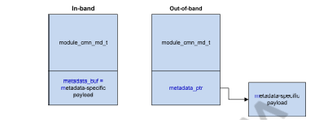

   In-band and out-of-band flags

-  For in-band, `module\_cmn\_md\_t <#struct-module-cmn-md-t>`__ and the
   metadata-specific payload are in one contiguous memory buffer).

-  For out-of-band, metadata-specific memory is elsewhere and
   `module\_cmn\_md\_t <#struct-module-cmn-md-t>`__ has a pointer to it.

Metadata-specific memory cannot contain any pointers.

Buffer Association
^^^^^^^^^^^^^^^^^^

Metadata can be sample- or buffer-associated (via `module\_cmn\_md\_flags\_t <#struct-module-cmn-md-flags-t>`__).

-  Sample-associated metadata always sticks to the same position in the
   signal, even when the signal is processed by an algorithm with delay.
   Thus, when the signal is processed by a module, the offset is
   adjusted by algorithmic delay.

Sample-associated metadata suffers both algorithmic and buffering delay.

Example: EOS is sample-associated because EOS cannot be propagated ahead of the last sample. The following diagram shows metadata propagation for sample-associated metadata.

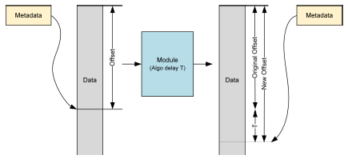

-  Buffer-associated metadata does not suffer algorithmic delay, but it
   does suffer from any buffering delay. Buffering delay is typically
   zero for simple PP modules.

Some modules might have internal data buffered, which might be used to delay some metadata. In the absence of a buffering delay, even when a signal suffers delay, metadata comes out quicker.

For example, a DFG is buffer-associated metadata because it must propagate even if data is delayed by an algorithmic delay.

Offset
~~~~~~

An offset in `module\_cmn\_md\_t <#struct-module-cmn-md-t>`__
indicates the position in the data buffer from or at which metadata
is applicable. For example, when a stream gain metadata is
applicable from the 50th sample onwards, the offset is 50.

Lists
~~~~~

Metadata transfers are done using doubly linked lists (via `module\_cmn\_md\_list\_t <#struct-module-cmn-md-list-t>`__).

EOS Metadata
--------------------

Flags
~~~~~~~~~~~~~~~~~~~

Flushing EOS
^^^^^^^^^^^^^^^^^^^

Flushing EOS causes all stream data to be rendered, as shown in the
following figure. To send all the signals to the output, zeroes
worth of algorithmic delay are pushed through the module: zeroes
worth = zero samples equal to the amount of algorithmic delay.

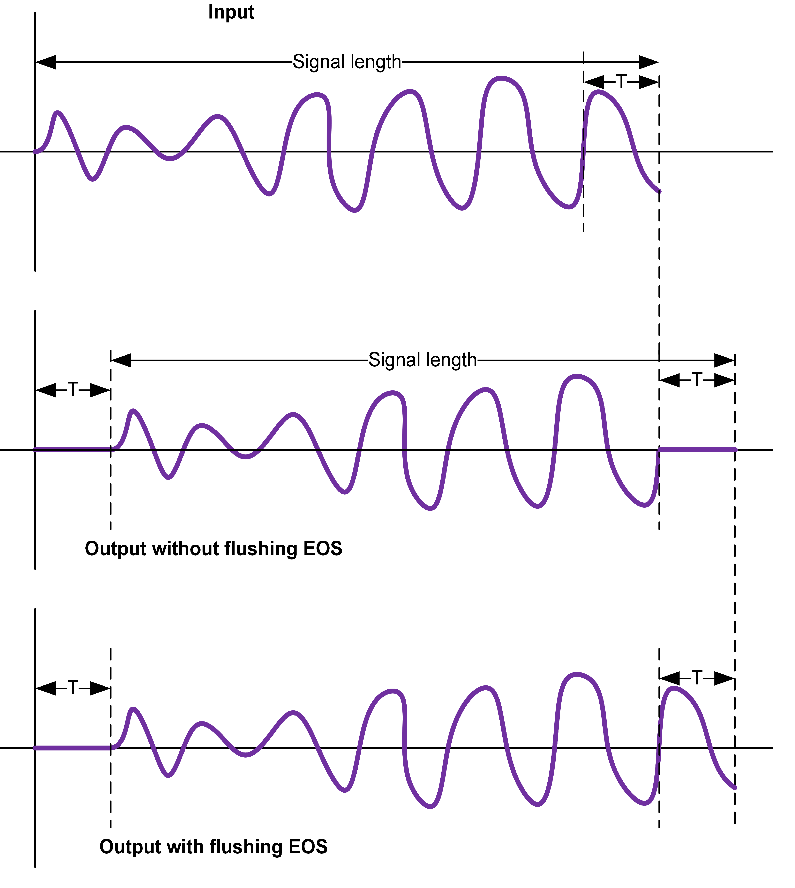

   Stream data rendered due to flushing EOS

When data follows the external EOS, the EOS stops it from being
flushed. The incoming data itself can send data. Hence, a flushing
EOS is converted to non-flushing if there is any data follows the
EOS.

Internal EOS
^^^^^^^^^^^^

Internal EOS is used to indicate data flow stoppage due to upstream
stops or flushes. If any data follows the internal EOS, the internal
EOS is not useful and can be dropped.

EOS Payload
~~~~~~~~~~~

The modules that propagate metadata must keep
`module\_cmn\_md\_eos\_t <#struct-module-cmn-md-eos-t>`__ intact.

DFG Metadata
------------

DFG metadata indicates that the upstream data flow has a data flow
gap (possibly due to a stream pause operation).

Virtual Function Table
----------------------

After initialization, a virtual function table (vtable) and context
pointer (both in
`intf\_extn\_param\_id\_metadata\_handler\_t <#struct-intf-extn-param-id-metadata-handler-t>`__)
are passed to the module that is implementing this extension. The
vtable includes callback functions that help in common metadata
operations: create, clone, destroy, propagate, and modify at DFG.

.. _trigger_policy:

Trigger Policy
==============

The Trigger Policy framework extension
(`FWK\_EXTN\_TRIGGER\_POLICY <#define-fwk-extn-trigger-policy-0x0a00103a>`__)
determines when the
`capi\_vtbl\_t::process() <#capi-err-t-capi-vtbl-t-process-capi-t-pif-capi-stream-data-t-input-capi-stream-data-t-output>`__
function is called for a module. Most modules are called when all
input ports have data and output ports have buffers (the default
policy of the framework). Input data and output buffers are defined
as follows:

-  Data buffer, or data, refers to a buffer that has some data. In the
   context of a process() call, input ports have data.

-  Empty buffer, or buffer, refers to a buffer that is ready to accept
   data. In the context of a process() call, output ports have a buffer.

For multiport and buffering modules, complex triggers are possible (for example, when process() is called because input data is available, or because an output buffer is available).

.. _trigger_types:

Types of Triggers
-----------------

Containers are triggered in two ways:

-  Data or buffer trigger – If a container thread is awakened by data or
   a buffer, the current trigger for processing is called a *data
   trigger*.

-  Signal trigger – Certain containers can have signal-triggered
   (timer-triggered) modules. If a container is awakened by a signal,
   the current trigger is called a *signal trigger*.

The policy used to call the module is based on the current trigger.
If the current trigger is based on signals, the signal trigger
policy is used; otherwise, the data trigger policy is used.

**NOTE** A trigger policy is only one of the conditions for calling
modules. Other conditions for calling the modules (such as meeting a
threshold or if ports are started) must also be satisfied
independently.

A module can leave either or both policies as NULL. In this case,
the default policy is used, which means all ports are mandatory:

-  All input ports get input data

-  All output ports get a buffer when the timer trigger causes a graph
   to be processed.

If input data is not present, an underrun (underflow) occurs
(erasure flag is set). If output is not present, an overrun
(overflow) occurs.

A signal trigger policy is not useful if there is no signal trigger
module in the container. Only under special conditions is a module
required to implement a signal trigger policy: when the module is
used in a signal-triggered container and the default policy does not work.
Typically, the default policy works for most modules, for example, a
SISO module might behave as a source during calibration time.

If a module requires a data trigger policy in a signal-triggered
container, the module must explicitly enable the policy through
`FWK\_EXTN\_EVENT\_ID\_DATA\_TRIGGER\_IN\_ST\_CNTR <#define-fwk-extn-event-id-data-trigger-in-st-cntr-0x0a00104c>`__.
Data triggers are handled in the middle of signal triggers.

The schema for defining a trigger policy is the same for both signal
triggers and data triggers, but the actual callbacks are different.

.. _triggerable_ports:

Triggerable Ports
-----------------

The trigger policy is described in two levels, ports and group of
ports.

**NOTE** A port in a triggerable group can belong to multiple
groups.

Mandatory Policy
~~~~~~~~~~~~~~~~

For the mandatory policy
(`FWK\_EXTN\_PORT\_TRIGGER\_POLICY\_MANDATORY <#_bookmark477>`__),
ports in each group are ANDed. That is, all ports in the group must
satisfy the trigger condition (present or absent).

Multiple groups are ORed. That is, a module process() is called as
long as at least one group has a trigger. Using the ports/groups and
present/absent notion, any Boolean expression can be satisfied. For
example:

-  The module process() might be called when either of the inputs (a or
   b) and output (c) are present: ac + bc, where ac forms the first
   group, and bc forms the second group.

-  The module process() might be called in an XOR condition of inputs
   a^b = (!a)b + a(!b), where (!a) indicates the absence of
   input a.

-  The module process() might be called when either inputs (a, b) or
   output (c) is present. There are three groups: a+b+c.

Optional Policy
~~~~~~~~~~~~~~~~

For the optional policy
(`FWK\_EXTN\_PORT\_TRIGGER\_POLICY\_OPTIONAL <#_bookmark478>`__),
ports in each group are ORed and multiple groups are ANDed. For
example, (a+c)(b+c). Thus, the module process() is called for a
module when a timer trigger occurs OR all ports in at least one
group have a trigger.

The framework calls
`capi\_vtbl\_t::process() <#capi-err-t-capi-vtbl-t-process-capi-t-pif-capi-stream-data-t-input-capi-stream-data-t-output>`__
if any one of the OR conditions is satisfied. In this case, the
module also must check which OR condition is actually satisfied
before processing. For example, if the module asks for the (abc +
def) trigger policy, when process() is called, the module must check
that either abc or def is satisfied.

.. _non_triggerable_and_blocked_ports:

Non-triggerable Ports and Blocked Ports
---------------------------------------

Apart from groups, there are optional non-triggerable ports and
blocked ports. Both non-triggerable and blocked ports belong to a
non-triggerable group that is ignored when the framework determines
whether to call
`capi\_vtbl\_t::process() <#capi-err-t-capi-vtbl-t-process-capi-t-pif-capi-stream-data-t-input-capi-stream-data-t-output>`__
on a module.

**NOTE** A port cannot belong to both triggerable and
non-triggerable groups.

Non-triggerable Ports
~~~~~~~~~~~~~~~~~~~~~

Optional non-triggerable ports never trigger a
`capi\_vtbl\_t::process() <#capi-err-t-capi-vtbl-t-process-capi-t-pif-capi-stream-data-t-input-capi-stream-data-t-output>`__
call. However, if a module is triggered due to other ports, and if
these ports also have a trigger at that time, the ports carry the
data and output.

Blocked Ports
~~~~~~~~~~~~~

An input or output port must not be given when calling
`capi\_vtbl\_t::process() <#capi-err-t-capi-vtbl-t-process-capi-t-pif-capi-stream-data-t-input-capi-stream-data-t-output>`__
on the module, even though buffer or data might be present.

**NOTE** Blocked ports do not apply for timer (signal) triggers.

Default Trigger Policy
----------------------

The default data or buffer trigger policy for all modules is *All
ports must have triggers*. This policy is the same as having all
groups in one group.

Upon an algorithm reset, port reset, or other resets, the trigger
policy is not reset. Also, for module enable and disable operations,
modules must explicitly issue a callback.

In a group, if a port is mandatory but it is stopped, the module
will not get a call unless the stopped port is removed from the
group.

.. _port_property_propagation:

Port Property Propagation
=========================

Certain modules must propagate two port properties:

-  Real-time flag

-  Downstream state

Typically, multi-port modules must propagate these properties if the
framework default does not work for the module.

Real-time Flag
--------------

The
`INTF\_EXTN\_PROP\_IS\_RT\_PORT\_PROPERTY <#define-intf-extn-prop-is-rt-port-property-0x0a001048>`__
interface extension allows propagation of port properties across
modules in real time or non-real time. An event from a module
indicates that the upstream port is in either real time or non-real
time.

When a module implements this interface extension, the framework
does not automatically propagate the port property, even for SISO
modules.

For Input Ports
~~~~~~~~~~~~~~~

A `capi\_vtbl\_t::set\_param() <#capi-err-t-capi-vtbl-t-set-param-capi-t-pif-uint32-t-param-id-const-capi-port-info-t-port-info-ptr-capi-buf-t-params-ptr>`__ call indicates that the upstream port is in either real time or non-real time. An event from a module indicates that the downstream port is in either real time or non-real time.

The following figure shows upstream (US) and downstream (DS) real-time (RT)/non-real-time (NRT) values. Practical graphs can have branches, which means propagation might not be straightforward.

.. figure:: images/capi/capi_image14.png
   :width: 6.09417in
   :height: 2.38250in
   :figclass: fig-center

   Upstream and downstream values in real time or non-real time

For Output Ports
~~~~~~~~~~~~~~~~

A `capi\_vtbl\_t::set\_param() <#capi-err-t-capi-vtbl-t-set-param-capi-t-pif-uint32-t-param-id-const-capi-port-info-t-port-info-ptr-capi-buf-t-params-ptr>`__ call indicates that the downstream port is in either real time or non-real time. An event from the module indicates that the upstream port is either real time or non-real time.

Usage Examples
~~~~~~~~~~~~~~

-  Modules such as multi-port modules might need to propagate this flag
   because the container is not aware of routing from input to output.

Also, the container is not aware of the trigger policy of the module (see :ref:`port_properties_and_trigger_policy_interaction`).

-  A module that changes from real time to non-real time (such as a buffering module or a timer-triggered module) must also implement this flag.

For example, introducing a buffering module in an otherwise real-time path changes the real-time flag to FALSE. Introducing a timer-driven module in a non-real-time path changes the flag to TRUE.

Framework Default Settings
~~~~~~~~~~~~~~~~~~~~~~~~~~

-  Initially, all ports are non-real time.

-  If a started input port of a module is marked as real time upstream
   (through propagation), all the output ports should be marked as real
   time upstream. Otherwise, they are marked as non-real time.

-  If a started output port of a module is marked as real time
   downstream (through propagation), all the input ports should be
   marked as real time downstream. Otherwise, they are marked as
   non-real time.

Downstream State
--------------------

The `INTF\_EXTN\_PROP\_PORT\_DS\_STATE <#define-intf-extn-prop-port-ds-state-0x0a001040>`__ interface extension is used to propagate the downstream state of a
port across modules. The downstream state is different from the
port’s own state. The framework first propagates the downstream
state and then applies the downgraded state on the port.
State propagation is only from downstream to upstream. A container
sets the state on the output port. A module can then propagate this
state to the connected input ports (connected from that output port
only for which a set parameter was done). When an event is raised
from a module, it is raised on the input port, and it can be raised
only in the
`INTF\_EXTN\_PARAM\_ID\_PORT\_DS\_STATE <#define-intf-extn-param-id-port-ds-state-0x0a001041>`__ context.
A port’s downstream state can only be Prepare, Start, Suspend, or
Stop. This state is different from the port state itself. For
example, you can propagate a Stop state and the port itself might be
stopped.

Multi-port Modules
~~~~~~~~~~~~~~~~~~

All multi-port modules must implement the downstream state because a
container does not know the routing inside the module (unless the
framework default works for the module). Unlike the real-time flag,
which depends on trigger policy grouping or ports being marked as
non-triggerable, the port state depends only on the connection
inside the module.
For example, consider a splitter that outputs data on two ports. If
one of the output paths is stopped somewhere, ideally, the other
path should not be affected. In this case, the stopped downstream
state is propagated backwards, which indicates to the splitter that
it no longer needs to wait for buffers to become available on the
corresponding output port.
For modules that implement the `CAPI\_MIN\_PORT\_NUM\_INFO <#_bookmark241>`__ property and set minimum\_output\_port to zero, refer to the `CAPI\_MIN\_PORT\_NUM\_INFO <#_bookmark241>`__ property
documentation.

Framework Default Settings
~~~~~~~~~~~~~~~~~~~~~~~~~~

The framework default assumes that all the inputs are connected to
all the outputs.

-  If all the output ports of a module are in the Stop state, propagate
   this state backwards on all the input ports.

-  If an output port of a module is in the Start state, propagate this
   state on all the input ports.

-  If an output port of a module is in the Prepare state and none of the
   output ports is in the Start state, propagate the Prepare state to
   all input ports.

The downstream state is handled through this `INTF\_EXTN\_PROP\_PORT\_DS\_STATE <#define-intf-extn-prop-port-ds-state-0x0a001040>`__ extension, but the modules are notified of the upstream state
through an internal EOS, which indicates that data flow is stopped.
Availability of the data indicates that data flow started. Data flow
state propagation is discussed in section :ref:`data_flow_states`.

.. _port_properties_and_trigger_policy_interaction:

Interaction Between Port Properties and Trigger Policy
------------------------------------------------------

At a multi-port module, there is an interaction between trigger
policy, port state, and real-time flag.

-  The port state is an independent variable. It can dictate changes in
   trigger policy and real-time flags.

-  The trigger policy and real-time flags are interdependent.

For example, one input port of a mixer is real time and another port
is non-real time. A reasonable trigger policy is to wait for the
real-time input port before processing. When that port has data and
because real-time data cannot wait, the mixer performs processing even if
other input ports and the output port do not have data. If the
real-time input port is stopped (data flow stop), the mixer must
wait for both input and output ports before processing, and the
output port will be non-real time.

Similarly, when one output port of a splitter is real-time and other
ports are non-real time, the input port can consider downstream data
as real time. However, if the real-time port is stopped, the input
port must consider the downstream data as non-real time. Like the
mixer, trigger policies can also change.

If a module implements the trigger policy extension
(`FWK\_EXTN\_TRIGGER\_POLICY <#define-fwk-extn-trigger-policy-0x0a00103a>`__),
it must also implement this
`INTF\_EXTN\_PROP\_IS\_RT\_PORT\_PROPERTY <#define-intf-extn-prop-is-rt-port-property-0x0a001048>`__
extension to propagate the real-time/non-real-time port property. This requirement is because
the way ports are grouped can change the real-time nature on other
side. In the following figure, ab and d are one group, and c and e
are another group. Processing triggers when (abd + ce) is TRUE. If a
has real-time upstream data, the d is real-time upstream, but e is
not because it depends only on c.

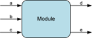

   Example of port property propagation

Frame Duration and Threshold-related Extensions
===============================================

Threshold Configuration
-----------------------

In the ARE, every module belongs to a subgraph. The subgraph is characterized by a performance mode that helps to achieve power vs. latency tradeoffs. Certain modules might need to know the duration that corresponds to the performance mode. The     `FWK\_EXTN\_THRESHOLD\_CONFIGURATION <#define-fwk-extn-threshold-configuration-0x0a00104d>`__ extension helps to achieve these tradeoffs.

During initialization, a module is notified (via a set parameter) about the threshold configuration, which is the duration that corresponds to the performance mode. Based on the media format, the module can raise a threshold event after the set parameter. For  example, a module that wants to run a timer can use this extension to configure the timer.

Container Frame Duration
------------------------

A container hosts modules that can have different thresholds. The
container aggregates all the thresholds to arrive at a composite
frame duration, typically the least common multiple (LCM). For
example, if a module is required to determine the container frame
duration in order to decide a buffer length, it can implement the
`FWK\_EXTN\_CONTAINER\_FRAME\_DURATION <#define-fwk-extn-container-frame-duration-0x0a001021>`__
extension. A set parameter is issued whenever the container frame
duration changes.

The module must not raise a threshold event in response to this set
parameter because container frame duration is typically a byproduct
of a threshold event. Raising a threshold event in response can
trigger an infinite loop.

Container Processing Duration
-----------------------------

Typically, a container takes as much processing time as the
container frame duration itself (the worst case). However, if clock
voting is bumped up, the processing duration decreases by a factor.
A module can use the
`FWK\_EXTN\_CONTAINER\_PROC\_DURATION <#define-fwk-extn-container-proc-duration-0x0a001043>`__
extension to obtain the container processing duration through a set
parameter.

Data Duration Modifying Modules and Container Handling
======================================================

DM Modules
--------------------

Duration Modifying (DM) modules are modules which can change the
duration of data from input to output by a small amount while
processing a frame.

For example, a module that corrects clock jitter may drop one sample
from input or may add an extra sample at output. Similarly, a module
that converts data from one sample rate to another sample rate may
not be able to generate the exact duration of output data which it
consumes from input.

DM handling in ARE
------------------

In the ARE, containers need to handle such modules carefully to
avoid any unnecessary buffering within the topology. If there is a
threshold module connected at the output of the DM module, then the
framework must ensure that the fixed amount of output (which is the
same as the threshold of the connected module) is generated from the
DM module. Similarly, if the threshold module is connected at the
input of the DM module, then the framework must ensure that the DM
module consumes all the data provided by the input (from threshold
module) to avoid any buffering in topology.
Therefore, based on the topology and the positioning of
threshold/STM/MIMO modules, DM modules should either work in
Fixed-Input mode where they consume all input data provided by the
framework and can generate a variable amount of output or work in
Fixed-Output mode where they generate fixed amount of output samples
requested by the container and can consume a variable amount of
input data.
Along with the mode of operation (Fixed-In or Fixed-Out) the module
should also report the maximum buffer size requirement on the
variable path so the container can size the topo buffers correctly.
Since DM modules will either consume input at a variable rate or
generate output at a variable rate the framework may need to add
prebuffering (buffers with zero prefill) in the variable path so
upstream or downstream is not impacted by the variable rate of
operation.
DM modules are required to use
`FWK\_EXTN\_DM <#define-fwk-extn-dm-0x0a001027>`__ . This ensures
the framework sizes the topo buffers correctly, configures the mode
of operation (fixed-in or fixed-out) properly, and sends the
prebuffer.
Mode of operation is set to the DM module via
`FWK\_EXTN\_DM\_PARAM\_ID\_CHANGE\_MODE <#define-fwk-extn-dm-param-id-change-mode-0x0a001028>`__
. To ensure that the output/input buffer is allocated with
sufficient size, framework sets the maximum amount of input/output
data which can be given/requested at a time to/from the DM module
via
`FWK\_EXTN\_DM\_PARAM\_ID\_SET\_MAX\_SAMPLES <#define-fwk-extn-dm-param-id-set-max-samples-0x0a00102b>`__
and then the DM module should inform about the maximum amount of
output/input data which it may generate or consume via
`FWK\_EXTN\_DM\_EVENT\_ID\_REPORT\_MAX\_SAMPLES <#define-fwk-extn-dm-event-id-report-max-samples-0x0a00102c>`__
.

Special handling for Fixed-Output mode of operation
---------------------------------------------------

Based on the current internal buffering, the amount of data which a
Fixed-Output DM module should generate may vary from process to
process. The goal is to reduce or avoid internal buffering of the
data. If there is already some data stuck between a Fixed-Output DM
module and a threshold module, then the framework can try to request
less than container-frame-size amount of output data from the DM
module. This requires the framework to set the expected amount of
output data before every process to the DM module which is done via
`FWK\_EXTN\_DM\_PARAM\_ID\_SET\_SAMPLES <#define-fwk-extn-dm-param-id-set-samples-0x0a001029>`__
. In turn, the DM module must inform the amount of input data it
needs to generate the expected amount of output data, this is done
by the DM module via `FWK\_EXTN\_DM\_EVENT\_ID\_REPORT\_SAMPLES <#define-fwk-extn-dm-event-id-report-samples-0x0a00102a>`__.

Typical Recommendations
=======================

-  Encoder input is expected to receive interleaved fixed-point data in
   Q15 format (for 16-bit data) and Q31 format (for 24-bit or 32-bit
   data). Thus, a driver can control all encoders in a uniform way.

-  Pre/postprocessing modules are expected to operate on deinterleaved
   unpacked data in Q15 or Q27 format, which aids interoperability with
   other PP modules.

-  Decoders are expected to implement the
   PARAM\_ID\_PCM\_OUTPUT\_FORMAT\_CFG parameter to output PCM data in a
   specified format.

-  If multiple versions of an operation code (opcode) are present, use
   the latest version (highest version number). An opcode version
   indicates that functionalities or features have been added to the
   main operation performed by that opcode.

A version is identified by a suffix, such as \_V2. For example:

-  Use CAPI\_EVENT\_OUTPUT\_MEDIA\_FORMAT\_UPDATED\_V2 instead of
   CAPI\_EVENT\_OUTPUT\_MEDIA\_FORMAT\_UPDATED.

-  Use capi\_stream\_data\_v2\_t instead of capi\_stream\_data\_t.

Optimization
============

Some features of CAPI useful for MIPS and memory optimization are:

-  Use “inplace” processing when possible. Inplace can be statically set
   using CAPI properties ( `CAPI\_IS\_INPLACE <#_bookmark235>`__ ) or
   dynamically changed using
   `CAPI\_EVENT\_DYNAMIC\_INPLACE\_CHANGE <#_bookmark344>`__ . When a
   module is “inplace”, the input and output buffers can be the same.
   This reduces memory requirements and extra copies.

-  `CAPI\_IS\_ELEMENTARY <#_bookmark240>`__ is a property that can be
   used to recognize “elementary” modules such as data-logging or gain.
   Elementary modules are handled differently by the framework which
   helps reduce MIPS.

-  In general, modules with zero port-threshold and
   requires-data-buffering set as FALSE are better from MIPS and memory
   perspectives. Modules that require the framework to do buffering
   (that is CAPI property
   `CAPI\_REQUIRES\_DATA\_BUFFERING <#_bookmark236>`__ = True) usually
   take higher MIPS overhead (e.g., decoders, rate matching modules,
   fractional resampling cases).

CAPI Interfaces
===================

Virtual Function Table
----------------------

Data Structure Documentation
~~~~~~~~~~~~~~~~~~~~~~~~~~~~

struct capi\_vtbl\_t
~~~~~~~~~~~~~~~~~~~~

Function table for plain C implementations of CAPI-compliant objects.
 
Objects must have a pointer to a function table as the first element in their instance structure. This structure is the function table type for all such objects.
 
 **Data Fields**

-  `capi\_err\_t <#typedef-uint32-t-capi-err-t>`__\ (∗
   `process <#capi-err-t-capi-vtbl-t-process-capi-t-pif-capi-stream-data-t-input-capi-stream-data-t-output>`__
   )(\ `capi\_t <#struct-capi-t>`__ ∗\_pif,
   `capi\_stream\_data\_t <#struct-capi-stream-data-t>`__ ∗input[ ],
   `capi\_stream\_data\_t <#struct-capi-stream-data-t>`__ ∗output[ ])

-  `capi\_err\_t <#typedef-uint32-t-capi-err-t>`__\ (∗
   `end <#capi-err-t-capi-vtbl-t-end-capi-t-pif>`__
   )(\ `capi\_t <#struct-capi-t>`__ ∗\_pif)

-  `capi\_err\_t <#typedef-uint32-t-capi-err-t>`__\ (∗
   `set\_param <#capi-err-t-capi-vtbl-t-set-param-capi-t-pif-uint32-t-param-id-const-capi-port-info-t-port-info-ptr-capi-buf-t-params-ptr>`__
   )(\ `capi\_t <#struct-capi-t>`__ ∗\_pif, uint32\_t param\_id, const
   `capi\_port\_info\_t <#struct-capi-port-info-t>`__ ∗port\_info\_ptr,
   `capi\_buf\_t <#struct-capi-buf-t>`__ ∗params\_ptr)

-  `capi\_err\_t <#typedef-uint32-t-capi-err-t>`__\ (∗
   `get\_param <#capi-err-t-capi-vtbl-t-get-param-capi-t-pif-uint32-t-param-id-const-capi-port-info-t-port-info-ptr-capi-buf-t-params-ptr>`__
   )(\ `capi\_t <#struct-capi-t>`__ ∗\_pif, uint32\_t param\_id, const
   `capi\_port\_info\_t <#struct-capi-port-info-t>`__ ∗port\_info\_ptr,
   `capi\_buf\_t <#struct-capi-buf-t>`__ ∗params\_ptr)

-  `capi\_err\_t <#typedef-uint32-t-capi-err-t>`__\ (∗
   `set\_properties <#capi-err-t-capi-vtbl-t-set-properties-capi-t-pif-capi-proplist-t-proplist-ptr>`__
   )(\ `capi\_t <#struct-capi-t>`__ ∗\_pif,
   `capi\_proplist\_t <#struct-capi-proplist-t>`__ ∗proplist\_ptr)

-  \ `capi\_err\_t <#typedef-uint32-t-capi-err-t>`__\ (∗
   `get\_properties <#capi-err-t-capi-vtbl-t-get-properties-capi-t-pif-capi-proplist-t-proplist-ptr>`__
   )(\ `capi\_t <#struct-capi-t>`__ ∗\_pif,
   `capi\_proplist\_t <#struct-capi-proplist-t>`__ ∗proplist\_ptr)

struct capi\_t
~~~~~~~~~~~~~~~~~~~

Plain C interface wrapper for the virtual function table,
`capi\_vtbl\_t <#struct-capi-vtbl-t>`__.
This `capi\_t <#struct-capi-t>`__ structure appears to the caller as
a virtual function table. The virtual function table in the instance
structure is followed by other structure elements, but those are
invisible to the users of the CAPI object. This
`capi\_t <#struct-capi-t>`__ structure is all that is publicly
visible.

+----------------------------------------------------+---------------------+------------------------------------------+
|     **Type**                                       |     **Parameter**   |     **Description**                      |
+====================================================+=====================+==========================================+
|     const `capi\_vtbl_t <#struct-capi-vtbl-t>`__ ∗ | vtbl\_ptr           | Pointer to the virtual function table.   |
+----------------------------------------------------+---------------------+------------------------------------------+

process()
--------------------

Variable Documentation
~~~~~~~~~~~~~~~~~~~~~~

capi\_err\_t(∗ capi\_vtbl\_t::process)(capi\_t ∗\_pif, capi\_stream\_data\_t ∗input[ ], capi\_stream\_data\_t ∗output[ ])
~~~~~~~~~~~~~~~~~~~~~~~~~~~~~~~~~~~~~~~~~~~~~~~~~~~~~~~~~~~~~~~~~~~~~~~~~~~~~~~~~~~~~~~~~~~~~~~~~~~~~~~~~~~~~~~~~~~~~~~~~

Generic function that processes input data on all input ports and
provides output on all output ports.

**Associated data types**

`capi\_t <#struct-capi-t>`__
`capi\_stream\_data\_t <#struct-capi-stream-data-t>`__

**Parameters**

+--------------+----------------+------------------------------------------------------------------------------------------------------------------------------------------------------------------------------------------------------------------------------------------------------------------------------------------------------------------------------------+
|     in,out   |     *\_pif*    | Pointer to the module object.                                                                                                                                                                                                                                                                                                      |
+==============+================+====================================================================================================================================================================================================================================================================================================================================+
|     in,out   |     *input*    | Array of pointers to the input data for each input port.                                                                                                                                                                                                                                                                           |
|              |                |                                                                                                                                                                                                                                                                                                                                    |
|              |                | The length of the array is the number of input ports. The client sets the number of input ports using the `CAPI\_PORT\_NUM\_INFO <#_bookmark245>`__ property.                                                                                                                                                                      |
|              |                |                                                                                                                                                                                                                                                                                                                                    |
|              |                | The function must modify the actual\_data\_len field to indicate how many bytes were consumed.                                                                                                                                                                                                                                     |
|              |                |                                                                                                                                                                                                                                                                                                                                    |
|              |                | Depending on stream\_data\_version (in `capi\_stream\_flags\_t <#union-capi-stream-flags-t>`__), the actual structure can be a version of `capi\_stream\_data\_t <#struct-capi-stream-data-t>`__ (like `capi\_stream\_data\_t <#struct-capi-stream-data-t>`__ or `capi\_stream\_data\_v2\_t <#struct-capi-stream-data-v2-t>`__).   |
|              |                |                                                                                                                                                                                                                                                                                                                                    |
|              |                | Some elements of input[] can be NULL. This occurs when there is mismatch between `CAPI\_PORT\_NUM\_INFO <#_bookmark245>`__ and the currently active ports. NULL elements must be ignored.                                                                                                                                          |
+--------------+----------------+------------------------------------------------------------------------------------------------------------------------------------------------------------------------------------------------------------------------------------------------------------------------------------------------------------------------------------+
|     out      |     *output*   | Array of pointers to the output data for each output port.                                                                                                                                                                                                                                                                         |
|              |                |                                                                                                                                                                                                                                                                                                                                    |
|              |                | The client sets the number of output ports using the `CAPI\_PORT\_NUM\_INFO <#_bookmark245>`__ property.                                                                                                                                                                                                                           |
|              |                |                                                                                                                                                                                                                                                                                                                                    |
|              |                | The function sets the actual\_data\_len field to indicate how many bytes were generated.                                                                                                                                                                                                                                           |
|              |                |                                                                                                                                                                                                                                                                                                                                    |
|              |                | Depending on stream\_data\_version (in `capi\_stream\_flags\_t <#union-capi-stream-flags-t>`__), the actual structure can be a version of `capi\_stream\_data\_t <#struct-capi-stream-data-t>`__ (like `capi\_stream\_data\_t <#struct-capi-stream-data-t>`__ or `capi\_stream\_data\_v2\_t <#struct-capi-stream-data-v2-t>`__).   |
|              |                |                                                                                                                                                                                                                                                                                                                                    |
|              |                | For single input/single output modules, the framework typically assigns the output flags, timestamp, and metadata with input flags, timestamp, and metadata before calling process.                                                                                                                                                |
|              |                |                                                                                                                                                                                                                                                                                                                                    |
|              |                | Metadata is only available in `capi\_stream\_data\_v2\_t <#struct-capi-stream-data-v2-t>`__ and later. If the module has delay, it must reset the output `capi\_stream\_data\_t <#struct-capi-stream-data-t>`__ (or `capi\_stream\_data\_v2\_t <#struct-capi-stream-data-v2-t>`__) and set it back                                 |
|              |                |                                                                                                                                                                                                                                                                                                                                    |
|              |                | after the delay is over.                                                                                                                                                                                                                                                                                                           |
|              |                |                                                                                                                                                                                                                                                                                                                                    |
|              |                | Some elements of output[] can be NULL. This occurs when there is mismatch between `CAPI\_PORT\_NUM\_INFO <#_bookmark245>`__ and the currently active ports. NULL elements must be ignored.                                                                                                                                         |
+--------------+----------------+------------------------------------------------------------------------------------------------------------------------------------------------------------------------------------------------------------------------------------------------------------------------------------------------------------------------------------+

**Detailed description**

On each call to
`capi\_vtbl\_t::process() <#capi-err-t-capi-vtbl-t-process-capi-t-pif-capi-stream-data-t-input-capi-stream-data-t-output>`__,
the behavior of the module depends on the value it returned for the
`CAPI\_REQUIRES\_DATA\_BUFFERING <#_bookmark236>`__ property. For a
description of the behavior, see the comments for
CAPI\_REQUIRES\_DATA\_BUFFERING.

No debug messages are allowed in this function.

Modules must make a NULL check for the following and use them only
if they are not NULL:

-  input

-  output

-  `capi\_buf\_t <#struct-capi-buf-t>`__ in
   `capi\_stream\_data\_t <#struct-capi-stream-data-t>`__

-  data buffer in `capi\_buf\_t <#struct-capi-buf-t>`__

For some events that result from a
`capi\_vtbl\_t::process() <#capi-err-t-capi-vtbl-t-process-capi-t-pif-capi-stream-data-t-input-capi-stream-data-t-output>`__
call, the output buffer must not be filled. Check the event
definition for this restriction.

**Returns**

`CAPI\_EOK <#define-capi-eok-0>`__ – Success

Error code – Failure (see :ref:`capi_error_codes`)

**Dependencies**

A valid input media type must have been set on each input port using
the `CAPI\_INPUT\_MEDIA\_FORMAT <#_bookmark247>`__ property.

end()
--------------------

Variable Documentation
~~~~~~~~~~~~~~~~~~~~~~

capi\_err\_t(∗ capi\_vtbl\_t::end)(capi\_t ∗\_pif)
~~~~~~~~~~~~~~~~~~~~~~~~~~~~~~~~~~~~~~~~~~~~~~~~~~

Frees any memory allocated by the module.

**Associated data types**

`capi\_t <#struct-capi-t>`__

**Parameters**

+--------------+---------------+---------------------------------+
|     in,out   |     *\_pif*   | Pointer to the module object.   |
+--------------+---------------+---------------------------------+

**NOTE** After calling this function, \_pif is no longer a valid
CAPI object. Do not call any CAPI functions after using it.

**Returns**

`CAPI\_EOK <#define-capi-eok-0>`__ – Success

Error code – Failure (see :ref:`capi_error_codes`)

**Dependencies**

None.

set\_param()
--------------------

Variable Documentation
~~~~~~~~~~~~~~~~~~~~~~~

capi\_err\_t(∗ capi\_vtbl\_t::set\_param)(capi\_t ∗\_pif, uint32\_t param\_id, const capi\_port\_info\_t ∗port\_info\_ptr, capi\_buf\_t ∗params\_ptr)
~~~~~~~~~~~~~~~~~~~~~~~~~~~~~~~~~~~~~~~~~~~~~~~~~~~~~~~~~~~~~~~~~~~~~~~~~~~~~~~~~~~~~~~~~~~~~~~~~~~~~~~~~~~~~~~~~~~~~~~~~~~~~~~~~~~~~~~~~~~~~~~~~~~~~

Sets a parameter value based on a unique parameter ID.

**Associated data types**
`capi\_t <#struct-capi-t>`__
`capi\_port\_info\_t <#struct-capi-port-info-t>`__
`capi\_buf\_t <#struct-capi-buf-t>`__

**Parameters**

+--------------+-------------------------+----------------------------------------------------------------------------------+
|     in,out   |     *\_pif*             | Pointer to the module object.                                                    |
+==============+=========================+==================================================================================+
|     in       |     *param\_id*         | ID of the parameter whose value is to be set.                                    |
+--------------+-------------------------+----------------------------------------------------------------------------------+
|     in       |     *port\_info\_ptr*   | Pointer to the information about the port on which this function must operate.   |
|              |                         |                                                                                  |
|              |                         | If a valid port index is not provided, the port index does not matter for the    |
|              |                         |                                                                                  |
|              |                         | param\_id, the param\_id is applicable to all ports, or the port index might be  |
|              |                         |                                                                                  |
|              |                         | part of the parameter payload.                                                   |
+--------------+-------------------------+----------------------------------------------------------------------------------+
|     in       |     *params\_ptr*       | Pointer to the buffer containing the value of the parameter.                     |
|              |                         |                                                                                  |
|              |                         | The format of the data in the buffer depends on the implementation.              |
+--------------+-------------------------+----------------------------------------------------------------------------------+

**Detailed description**

The actual\_data\_len field of the parameter pointer must be at
least the size of the parameter structure. Therefore, the following
check must be performed for each tuning parameter ID:

.. code:: C

   if (params_ptr->actual_data_len >= sizeof(gain_struct_t))
   {
   :
   :
   }
   else
   {
   MSG_1(MSG_SSID_QDSP6, DBG_ERROR_PRIO,"CAPI Libname Set, Bad param size
   %lu",params_ptr->actual_data_len);
   return AR_ENEEDMORE;
   }

Optionally, some parameter values can be printed for tuning
verification.

**NOTE** In this code sample, gain\_struct is an example only. Use
the correct structure based on the parameter ID.

**Returns**

`CAPI\_EOK <#define-capi-eok-0>`__ – Success

Error code – Failure (see :ref:`capi_error_codes`)

**Dependencies**

None.

get\_param()
--------------------

Variable Documentation
~~~~~~~~~~~~~~~~~~~~~~

capi\_err\_t(∗ capi\_vtbl\_t::get\_param)(capi\_t ∗\_pif, uint32\_t param\_id, const capi\_port\_info\_t ∗port\_info\_ptr, capi\_buf\_t ∗params\_ptr)
~~~~~~~~~~~~~~~~~~~~~~~~~~~~~~~~~~~~~~~~~~~~~~~~~~~~~~~~~~~~~~~~~~~~~~~~~~~~~~~~~~~~~~~~~~~~~~~~~~~~~~~~~~~~~~~~~~~~~~~~~~~~~~~~~~~~~~~~~~~~~~~~~~~~~~

Gets a parameter value based on a unique parameter ID.

**Associated data types**
`capi\_t <#struct-capi-t>`__
`capi\_port\_info\_t <#struct-capi-port-info-t>`__
`capi\_buf\_t <#struct-capi-buf-t>`__

**Parameters**

+--------------+-------------------------+----------------------------------------------------------------------------------------------------------------------------------------------------------------------------------------------------+
|     in,out   |     *\_pif*             | Pointer to the module object.                                                                                                                                                                      |
+==============+=========================+====================================================================================================================================================================================================+
|     in       |     *param\_id*         | Parameter ID of the parameter whose value is being passed in                                                                                                                                       |
|              |                         |                                                                                                                                                                                                    |
|              |                         | this function. For example:                                                                                                                                                                        |
|              |                         |                                                                                                                                                                                                    |
|              |                         | -  CAPI\_LIBNAME\_ENABLE                                                                                                                                                                           |
|              |                         |                                                                                                                                                                                                    |
|              |                         | -  CAPI\_LIBNAME\_FILTER\_COEFF                                                                                                                                                                    |
+--------------+-------------------------+----------------------------------------------------------------------------------------------------------------------------------------------------------------------------------------------------+
|     in       |     *port\_info\_ptr*   | Pointer to the information about the port on which this function                                                                                                                                   |
|              |                         |                                                                                                                                                                                                    |
|              |                         | must operate.                                                                                                                                                                                      |
|              |                         |                                                                                                                                                                                                    |
|              |                         | If the port index is invalid, either the port index does not matter for the param\_id, the param\_id is applicable to all ports, or the port information might be part of the parameter payload.   |
+--------------+-------------------------+----------------------------------------------------------------------------------------------------------------------------------------------------------------------------------------------------+
|     out      |     *params\_ptr*       | Pointer to the buffer to be filled with the value of the parameter.                                                                                                                                |
|              |                         |                                                                                                                                                                                                    |
|              |                         | The format depends on the implementation.                                                                                                                                                          |
+--------------+-------------------------+----------------------------------------------------------------------------------------------------------------------------------------------------------------------------------------------------+

**Detailed description**
The max\_data\_len field of the parameter pointer must be at least
the size of the parameter structure. Therefore, the following check
must be performed for each tuning parameter ID.

.. code:: C

    if (params_ptr->max_data_len >= sizeof(gain_struct_t))
    {
    :
    :
    }
    else
    {
    MSG_1(MSG_SSID_QDSP6, DBG_ERROR_PRIO,"CAPI Libname Get, Bad param size
    %lu",params_ptr->max_data_len);
    return AR_ENEEDMORE;
    }

Before returning, the actual\_data\_len field must be filled with
the number of bytes written into the buffer.
Optionally, some parameter values can be printed for tuning
verification.

**NOTE** In this code sample, gain\_struct is an example only. Use
the correct structure based on the parameter ID.

**Returns**
`CAPI\_EOK <#define-capi-eok-0>`__ – Success

Error code – Failure (see :ref:`capi_error_codes`)

**Dependencies**
None.

set\_properties()
--------------------

Variable Documentation
~~~~~~~~~~~~~~~~~~~~~~

capi\_err\_t(∗capi\_vtbl\_t::set\_properties)(capi\_t ∗\_pif, capi\_proplist\_t ∗\ **proplist\_ptr)**
~~~~~~~~~~~~~~~~~~~~~~~~~~~~~~~~~~~~~~~~~~~~~~~~~~~~~~~~~~~~~~~~~~~~~~~~~~~~~~~~~~~~~~~~~~~~~~~~~~~~~

Sets a list of property values. Optionally, some property values can
be printed for debugging.

**Associated data types**

`capi\_t <#struct-capi-t>`__
`capi\_proplist\_t <#struct-capi-proplist-t>`__

**Parameters**

+--------------+-----------------------+-------------------------------------------+
|     in,out   |     *\_pif*           | Pointer to the module object.             |
+==============+=======================+===========================================+
|     in       |     *proplist\_ptr*   | Pointer to the list of property values.   |
+--------------+-----------------------+-------------------------------------------+

**Returns**

`CAPI\_EOK <#define-capi-eok-0>`__ – Success

Error code – Failure (see :ref:`capi_error_codes`)

Errors that occur when setting or getting a property must be handled
in the following way:

-  If the property is not supported by the module, the
   CAPI\_EUNSUPPORTED flag must be set in the error code and the
   actual\_data\_len field for that property must be set to zero.

-  The rest of the properties must still be processed (rather than
   exiting when an unsupported property is encountered).

**Dependencies**

    None.

get\_properties()
--------------------

Variable Documentation
~~~~~~~~~~~~~~~~~~~~~~

capi\_err\_t(∗capi\_vtbl\_t::get\_properties)(capi\_t ∗\_pif, capi\_proplist\_t ∗\ **proplist\_ptr)**
~~~~~~~~~~~~~~~~~~~~~~~~~~~~~~~~~~~~~~~~~~~~~~~~~~~~~~~~~~~~~~~~~~~~~~~~~~~~~~~~~~~~~~~~~~~~~~~~~~~~~

Gets a list of property values.

**Associated data types**
`capi\_t <#struct-capi-t>`__
`capi\_proplist\_t <#struct-capi-proplist-t>`__

**Parameters**

+--------------+-----------------------+-------------------------------------------------------------------------------------+
|     in,out   |     *\_pif*           | Pointer to the module object.                                                       |
+==============+=======================+=====================================================================================+
|     out      |     *proplist\_ptr*   | Pointer to the list of empty structures that must be filled with the appropriate    |
|              |                       |                                                                                     |
|              |                       | property values, which are based on the property IDs provided.                      |
|              |                       |                                                                                     |
|              |                       | The client must fill some elements of the structures as input to the module.        |
|              |                       |                                                                                     |
|              |                       | These elements must be explicitly indicated in the structure definition.            |
+--------------+-----------------------+-------------------------------------------------------------------------------------+

**Returns**

`CAPI\_EOK <#define-capi-eok-0>`__ – Success
Error code – Failure (see :ref:`capi_error_codes`)

Errors that occur when setting or getting a property must be handled
in the following way:

-  If the property is not supported by the module, the
   CAPI\_EUNSUPPORTED flag must be set in the error code and the
   actual\_data\_len field for that property must be set to zero.

-  The rest of the properties must still be processed (rather than
   exiting when an unsupported property is encountered).

**Dependencies**

    None.

capi\_get\_static\_properties\_f()
----------------------------------

Typedef Documentation
~~~~~~~~~~~~~~~~~~~~~

typedef capi\_err\_t(∗capi\_get\_static\_properties\_f)(capi\_proplist\_t ∗\ **init\_set\_proplist, capi\_proplist\_t** ∗\ **static\_proplist)**
~~~~~~~~~~~~~~~~~~~~~~~~~~~~~~~~~~~~~~~~~~~~~~~~~~~~~~~~~~~~~~~~~~~~~~~~~~~~~~~~~~~~~~~~~~~~~~~~~~~~~~~~~~~~~~~~~~~~~~~~~~~~~~~~~~~~~~~~~~~~~~~~

Queries for properties as follows:

-  Static properties of the module that are independent of the instance

-  Any property that is part of the set of properties that can be
   statically queried

**Associated data types**

`capi\_proplist\_t <#struct-capi-proplist-t>`__

**Parameters**

+-----------+-----------------------------+-------------------------------------------------------------------------------------------------------------------------------------------------------------------------------------------+
|     in    |     *init\_set\_proplist*   | Pointer to the same properties that are sent in the call to                                                                                                                               |
|           |                             |                                                                                                                                                                                           |
|           |                             | `capi\_init\_f() <#typedef-capi-err-t-capi-init-f-capi-t-pif-capi-proplist-t-init-set-proplist>`__.                                                                                       |
+===========+=============================+===========================================================================================================================================================================================+
|     out   |     *static\_proplist*      | Pointer to the property list structure.                                                                                                                                                   |
|           |                             |                                                                                                                                                                                           |
|           |                             | The client fills in the property IDs for which it needs property values. The client also allocates the memory for the payloads. The module must fill in the information in this memory.   |
+-----------+-----------------------------+-------------------------------------------------------------------------------------------------------------------------------------------------------------------------------------------+

**Detailed description**

This function is used to query the memory requirements of the module
to create an instance. The function must fill in the data for the
properties in the static\_proplist.

As an input to this function, the client must pass in the property
list that it passes to
`capi\_init\_f() <#typedef-capi-err-t-capi-init-f-capi-t-pif-capi-proplist-t-init-set-proplist>`__.
The module can use the property values in init\_set\_proplist to
calculate its memory requirements.

The same properties that are sent to the module in the call to
capi\_init\_f() are also sent to this function to enable the module
to calculate the memory requirement.

**Returns**

 `CAPI\_EOK <#define-capi-eok-0>`__ – Success

 Error code – Failure (see :ref:`capi_error_codes`)

 Errors that occur when setting or getting a property must be handled
 in the following way:

-  If the property is not supported by the module, the
   CAPI\_EUNSUPPORTED flag must be set in the error code and the
   actual\_data\_len field for that property must be set to zero.

-  The rest of the properties must still be processed (rather than
   exiting when an unsupported property is encountered).

**Dependencies**

None.

capi\_init\_f()
--------------------

Typedef Documentation
~~~~~~~~~~~~~~~~~~~~~

typedef capi\_err\_t(∗ capi\_init\_f)(capi\_t ∗\_pif, capi\_proplist\_t ∗init\_set\_proplist)
~~~~~~~~~~~~~~~~~~~~~~~~~~~~~~~~~~~~~~~~~~~~~~~~~~~~~~~~~~~~~~~~~~~~~~~~~~~~~~~~~~~~~~~~~~~~~

 Instantiates the module to set up the virtual function table, and
 also allocates any memory required by the module.

**Associated data types**
   `capi\_t <#struct-capi-t>`__
   `capi\_proplist\_t <#struct-capi-proplist-t>`__

**Parameters**

+--------------+-----------------------------+-----------------------------------------------------------------------------------------------------------------------------------------------+
|     in,out   |     *\_pif*                 | Pointer to the module object.                                                                                                                 |
|              |                             |                                                                                                                                               |
|              |                             | The memory has been allocated by the client based on the size returned in the `CAPI\_INIT\_MEMORY\_REQUIREMENT <#_bookmark232>`__ property.   |
+==============+=============================+===============================================================================================================================================+
|     in       |     *init\_set\_proplist*   | Pointer to the properties set by the service to be used while                                                                                 |
|              |                             |                                                                                                                                               |
|              |                             | initializing.                                                                                                                                 |
+--------------+-----------------------------+-----------------------------------------------------------------------------------------------------------------------------------------------+

**Detailed description**

States within the module must be initialized at the same time.
For any unsupported property ID passed in the init\_set\_proplist
parameter, the function prints a message and continues processing
other property IDs.
All return codes returned by this function, except
`CAPI\_EOK <#define-capi-eok-0>`__, are considered to be FATAL.
 
**Returns**
 `CAPI\_EOK <#define-capi-eok-0>`__ – Success
 Error code – Failure (see :ref:`capi_error_codes`)

**Dependencies**

   None.

Data Types and Payloads
-----------------------

Refer to :ref:`capi_types_h` for more details  on data types and payloads.

.. _capi_error_codes:

Error Codes
--------------------

Define Documentation
~~~~~~~~~~~~~~~~~~~~

#define CAPI\_EOK 0
^^^^^^^^^^^^^^^^^^^

Success. The operation completed with no errors.

#define CAPI\_EFAILED ((uint32\_t)1)
^^^^^^^^^^^^^^^^^^^^^^^^^^^^^^^^^^^^

General failure.

#define CAPI\_EBADPARAM (((uint32\_t)1) *<<* 1)
^^^^^^^^^^^^^^^^^^^^^^^^^^^^^^^^^^^^^^^^^^^^^^^

Invalid parameter value set.

#define CAPI\_EUNSUPPORTED (((uint32\_t)1) *<<* 2)
^^^^^^^^^^^^^^^^^^^^^^^^^^^^^^^^^^^^^^^^^^^^^^^^^^

Unsupported routine or operation.

#define CAPI\_ENOMEMORY (((uint32\_t)1) *<<* 3)
^^^^^^^^^^^^^^^^^^^^^^^^^^^^^^^^^^^^^^^^^^^^^^^

Operation does not have memory.

#define CAPI\_ENEEDMORE (((uint32\_t)1) *<<* 4)
^^^^^^^^^^^^^^^^^^^^^^^^^^^^^^^^^^^^^^^^^^^^^^^

Operation needs more data or buffer space.

#define CAPI\_ENOTREADY (((uint32\_t)1) *<<* 5)
^^^^^^^^^^^^^^^^^^^^^^^^^^^^^^^^^^^^^^^^^^^^^^^

CAPI currently cannot perform this operation because necessary
properties and parameters are not set or because of any internal
state.

#define CAPI\_EALREADY (((uint32\_t)1) *<<* 6)
^^^^^^^^^^^^^^^^^^^^^^^^^^^^^^^^^^^^^^^^^^^^^^

CAPI currently cannot perform this operation. There might be
restrictions on overwriting calibration after a certain operation.
For example, recalibrating the hardware interface after it is
started.

#define CAPI\_FAILED( *x* ) (CAPI\_EOK != (x))
^^^^^^^^^^^^^^^^^^^^^^^^^^^^^^^^^^^^^^^^^^^^^^

Macro that checks whether a CAPI error code has any error bits set.

#define CAPI\_SUCCEEDED( *x* ) (CAPI\_EOK == (x))
^^^^^^^^^^^^^^^^^^^^^^^^^^^^^^^^^^^^^^^^^^^^^^^^^

Macro that checks whether a CAPI error code represents a success
case.

#define CAPI\_SET\_ERROR( error\_flags, return\_code ) ((error\_flags) \|\ = (return\_code))
^^^^^^^^^^^^^^^^^^^^^^^^^^^^^^^^^^^^^^^^^^^^^^^^^^^^^^^^^^^^^^^^^^^^^^^^^^^^^^^^^^^^^^^^^^^^^^

Macro that sets an error flag in a CAPI error code.

#define \CAPI\_IS\_ERROR\_CODE\_SET( error\_flags, error\_code) (((error\_flags) & (error\_code)) != CAPI\_EOK)
^^^^^^^^^^^^^^^^^^^^^^^^^^^^^^^^^^^^^^^^^^^^^^^^^^^^^^^^^^^^^^^^^^^^^^^^^^^^^^^^^^^^^^^^^^^^^^^^^^^^^^^^^^^^^^^^

Macro that checks whether a specific error flag is set in a CAPI
error code.

Typedef Documentation
~~~~~~~~~~~~~~~~~~~~~

typedef uint32\_t capi\_err\_t
^^^^^^^^^^^^^^^^^^^^^^^^^^^^^^

Error code type for CAPI.

Property IDs
------------

Properties are used to set and get information to and from the
module. Properties are identified by IDs and have corresponding
payloads. Their usage is similar to parameters, but parameters are
module specific:

-  Parameters are defined by the implementer of the module

-  Parameters are used to control aspects that are specific to the
   underlying algorithm

-  Properties are generic and are defined in the CAPI interface.

**Categories of properties**

-  Properties that can be queried statically using
   `capi\_get\_static\_properties\_f() <#typedef-capi-err-t-capi-get-static-properties-f-capi-proplist-t-init-set-proplist-capi-proplist-t-static-proplist>`__:

   -  `CAPI\_INIT\_MEMORY\_REQUIREMENT <#_bookmark232>`__

   -  `CAPI\_STACK\_SIZE <#_bookmark233>`__

   -  `CAPI\_MAX\_METADATA\_SIZE <#_bookmark234>`__

   -  `CAPI\_IS\_INPLACE <#_bookmark235>`__

   -  `CAPI\_REQUIRES\_DATA\_BUFFERING <#_bookmark236>`__

   -  `CAPI\_NUM\_NEEDED\_FRAMEWORK\_EXTENSIONS <#_bookmark237>`__

   -  `CAPI\_NEEDED\_FRAMEWORK\_EXTENSIONS <#_bookmark238>`__

   -  `CAPI\_INTERFACE\_EXTENSIONS <#_bookmark239>`__

   -  `CAPI\_MAX\_STATIC\_PROPERTIES <#_bookmark243>`__

   -  `CAPI\_IS\_ELEMENTARY <#_bookmark240>`__

   -  `CAPI\_MIN\_PORT\_NUM\_INFO <#_bookmark241>`__

-  Properties that can be set at initialization and at any time after
   initialization:

   -  `CAPI\_EVENT\_CALLBACK\_INFO <#_bookmark244>`__

   -  `CAPI\_PORT\_NUM\_INFO <#_bookmark245>`__

   -  `CAPI\_HEAP\_ID <#_bookmark246>`__

   -  `CAPI\_INPUT\_MEDIA\_FORMAT <#_bookmark247>`__

   -  `CAPI\_LOG\_CODE <#_bookmark248>`__

   -  `CAPI\_CUSTOM\_INIT\_DATA <#_bookmark249>`__

   -  `CAPI\_SESSION\_IDENTIFIER <#_bookmark250>`__

   -  `CAPI\_INPUT\_MEDIA\_FORMAT\_V2 <#_bookmark251>`__

   -  `CAPI\_MAX\_INIT\_PROPERTIES <#_bookmark254>`__

-  Properties that can be set only after initialization:

   -  `CAPI\_ALGORITHMIC\_RESET <#_bookmark255>`__

   -  `CAPI\_EXTERNAL\_SERVICE\_ID <#_bookmark256>`__

   -  `CAPI\_REGISTER\_EVENT\_DATA\_TO\_DSP\_CLIENT <#_bookmark257>`__

   -  `CAPI\_REGISTER\_EVENT\_DATA\_TO\_DSP\_CLIENT\_V2 <#_bookmark258>`__

   -  `CAPI\_PARAM\_PERSISTENCE\_INFO <#_bookmark259>`__

   -  `CAPI\_MAX\_SET\_PROPERTIES <#_bookmark260>`__

-  Properties that can be queried using
   `capi\_vtbl\_t::get\_properties() <#capi-err-t-capi-vtbl-t-get-properties-capi-t-pif-capi-proplist-t-proplist-ptr>`__:

   -  `CAPI\_METADATA <#_bookmark261>`__

   -  `CAPI\_PORT\_DATA\_THRESHOLD <#_bookmark262>`__

   -  `CAPI\_OUTPUT\_MEDIA\_FORMAT\_SIZE <#_bookmark263>`__

   -  `CAPI\_MAX\_GET\_PROPERTIES <#_bookmark264>`__

-  Properties that can be set using
   `capi\_vtbl\_t::set\_properties() <#capi-err-t-capi-vtbl-t-set-properties-capi-t-pif-capi-proplist-t-proplist-ptr>`__
   and queried using
   `capi\_vtbl\_t::get\_properties() <#capi-err-t-capi-vtbl-t-get-properties-capi-t-pif-capi-proplist-t-proplist-ptr>`__:

   -  `CAPI\_OUTPUT\_MEDIA\_FORMAT <#_bookmark265>`__

   -  `CAPI\_CUSTOM\_PROPERTY <#_bookmark266>`__

   -  `CAPI\_OUTPUT\_MEDIA\_FORMAT\_V2 <#_bookmark267>`__

   -  `CAPI\_MAX\_SET\_GET\_PROPERTIES <#_bookmark268>`__

   -  `CAPI\_MAX\_PROPERTY <#_bookmark269>`__

Refer to :ref:`capi_properties_h` for more details on CAPI properties.

Events
------

Modules use events to send asynchronous notifications to the
framework. During initialization, the framework provides a callback
function and a context pointer. The module can call this function
any time to raise an event. The appropriate payload must be sent
based on the event ID.

The callback function is not thread safe, so it must be called from
the same thread context as the interface functions unless mentioned
otherwise in the event description. The payload data is copied
before the function returns.

For example, raising the kilo packets per second (KPPS) change
event:

.. code:: C

   capi_event_KPPS_t payload;
   payload.KPPS = 10000;

   capi_event_info_t payload_buffer;
   payload_buffer.port_info.is_valid = FALSE;
   payload_buffer.payload.data_ptr = (int8_t*)(&payload);
   payload_buffer.payload.actual_data_len = payload_buffer.payload.max_data_len = sizeof(payload);

   capi_err_t result = event_cb_ptr(context_ptr, CAPI_EVENT_KPPS, &payload_buffer);

Refer to :ref:`capi_events_h` for more details on CAPI events.

Framework Extensions
====================

CAPI provides framework extensions that extend the functionality of the interface.
 
A framework extension is typically defined using a header file that is included by both the module and the client (the application that runs on the HLOS and invokes the DSP services). Each extension is identified by a GUID. The header file then describes how the service and module that use the extensions behave. The header file also has any set parameter IDs and payloads, constant definitions, and function declarations required for this extension. The service uses `capi\_get\_static\_properties\_f()  <#typedef-capi-err-t-capi-get-static-properties-f-capi-proplist-t-init-set-proplist-capi-proplist-t-static-proplist>`__ to query the module for the list of extensions that it needs. If the client supports these extensions, it can create the module and proceed. If the client does not support these extensions, it must not create the module.

Example of Using a Framework Extension
--------------------------------------

A module performs sample removal or insertion to match the audio
that goes from one clock domain to another. The module requires the
clock drift information to be passed to it.

Create a framework extension for this purpose. The extension header
includes the following information:

-  The GUID that identifies this extension

-  The parameter ID and payload format the client uses to pass the drift
   information to the module

A module that implements the rate matching functionality can include
this header and return the GUID in the list of framework extensions
it needs. The client can then perform the required set parameters to
pass the drift information.

Bluetooth Codec
---------------
The Bluetooth framework extension (FWK\_EXTN\_BT\_CODEC) provides special events that are required to enable Bluetooth codecs.

Define Documentation
~~~~~~~~~~~~~~~~~~~~

#define FWK\_EXTN\_BT\_CODEC 0x000132e4
^^^^^^^^^^^^^^^^^^^^^^^^^^^^^^^^^^^^^^^

Unique identifier of the Bluetooth framework extension for a module. This extension supports the following events:

-  `CAPI\_BT\_CODEC\_EXTN\_EVENT\_ID\_DISABLE\_PREBUFFER <#_bookmark387>`__

-  \ `CAPI\_BT\_CODEC\_EXTN\_EVENT\_ID\_KPPS\_SCALE\_FACTOR <#define-capi-bt-codec-extn-event-id-kpps-scale-factor-0x000132e7>`__

#define CAPI\_BT\_CODEC\_EXTN\_EVENT\_ID\_DISABLE\_PREBUFFER 0x000132e5
^^^^^^^^^^^^^^^^^^^^^^^^^^^^^^^^^^^^^^^^^^^^^^^^^^^^^^^^^^^^^^^^^^^^^^^

   ID of the event the encoder module uses to disable pre-buffering.
   This event must be raised during CAPI initialization before data
   processing.
   **Message payload (capi\_bt\_codec\_extn\_event\_disable\_prebuffer\_t)**

+-----------------+-----------------------+-----------------------------------------------+
|     **Type**    |     **Parameter**     |     **Description**                           |
+=================+=======================+===============================================+
|     uint32\_t   | disable\_prebuffering | Specifies whether to disable pre-buffering.   |
|                 |                       |                                               |
|                 |                       | **Supported values:**                         |
|                 |                       |                                               |
|                 |                       | -  ≥ 1 – Disable pre-buffering                |
|                 |                       |                                               |
|                 |                       | -  0 – Enable pre-buffering                   |
+-----------------+-----------------------+-----------------------------------------------+

**See also**

`CAPI\_EVENT\_DATA\_TO\_DSP\_SERVICE`

#define CAPI\_BT\_CODEC\_EXTN\_EVENT\_ID\_KPPS\_SCALE\_FACTOR 0x000132e7
^^^^^^^^^^^^^^^^^^^^^^^^^^^^^^^^^^^^^^^^^^^^^^^^^^^^^^^^^^^^^^^^^^^^^^^^^^

ID of the event the encoder module uses to set the KPPS scale
factor.

This scale factor increases the clock speed so the processing time
of the encoder catches up with the real time. It is the factor by
which the clock speed must be increased.

This event can be raised by the module any time.

**NOTE** KPPS scaling does not scale the processing by the exact value. It will be lower than the factor due to thread pre-emptions and relative thread priorities in the system.

**Message payload (capi\_bt\_codec\_etxn\_event\_kpps\_scale\_factor\_t)**

+-----------------+---------------------+--------------------------------------------------------------+
|     **Type**    |     **Parameter**   |     **Description**                                          |
+=================+=====================+==============================================================+
|     uint32\_t   | scale\_factor       | Scale factor for KPPS voting (it can be a decimal number).   |
|                 |                     |                                                              |
|                 |                     | **Supported values:**                                        |
|                 |                     |                                                              |
|                 |                     | -  Bits 31 to 4 – Integral part of the decimal number        |
|                 |                     |                                                              |
|                 |                     | -  Bits 0 to 3 – Fractional part of the decimal number       |
+-----------------+---------------------+--------------------------------------------------------------+

**See also**

`CAPI\_EVENT\_DATA\_TO\_DSP\_SERVICE <#_bookmark338>`__

Container Frame Duration
------------------------

Define Documentation
~~~~~~~~~~~~~~~~~~~~

#define FWK\_EXTN\_CONTAINER\_FRAME\_DURATION 0x0A001021
^^^^^^^^^^^^^^^^^^^^^^^^^^^^^^^^^^^^^^^^^^^^^^^^^^^^^^^^

Unique identifier of the framework extension that modules use to get
the container frame duration from the framework (see `FWK\_EXTN\_THRESHOLD\_CONFIGURATION <#define-fwk-extn-threshold-configuration-0x0a00104d>`__).

#define FWK\_EXTN\_PARAM\_ID\_CONTAINER\_FRAME\_DURATION 0x0A001022
^^^^^^^^^^^^^^^^^^^^^^^^^^^^^^^^^^^^^^^^^^^^^^^^^^^^^^^^^^^^^^^^^^^^^

ID of the parameter used to set the container frame duration to
modules. This parameter can help with internal buffer allocations.

The modules must not raise a threshold event in response to a `capi\_vtbl\_t::set\_param() <#capi-err-t-capi-vtbl-t-set-param-capi-t-pif-uint32-t-param-id-const-capi-port-info-t-port-info-ptr-capi-buf-t-params-ptr>`__ call of this parameter.

**Message payload (fwk\_extn\_param\_id\_container\_frame\_duration\_t)**

+-----------------+---------------------+-----------------------------------------------------------------+
|     **Type**    |     **Parameter**   |     **Description**                                             |
+=================+=====================+=================================================================+
|     uint32\_t   | duration\_us        | Container frame duration in microseconds based on aggregation   |
|                 |                     |                                                                 |
|                 |                     | across all threshold modules.                                   |
+-----------------+---------------------+-----------------------------------------------------------------+

Container Processing Duration
-----------------------------

Define Documentation
~~~~~~~~~~~~~~~~~~~~

#define FWK\_EXTN\_CONTAINER\_PROC\_DURATION 0x0A001043
^^^^^^^^^^^^^^^^^^^^^^^^^^^^^^^^^^^^^^^^^^^^^^^^^^^^^^^^^^^^^^^^^^

Unique identifier of the interface extension that modules use to
receive container processing duration. The modules use this
extension to get the container processing delay from the framework
(see `FWK\_EXTN\_CONTAINER\_FRAME\_DURATION <#define-fwk-extn-container-frame-duration-0x0a001021>`__).

Typically, the container processing duration and container frame
duration are the same except when a floor clock is being voted for
faster processing.

#define FWK\_EXTN\_PARAM\_ID\_CONTAINER\_PROC\_DURATION 0x0A001044
^^^^^^^^^^^^^^^^^^^^^^^^^^^^^^^^^^^^^^^^^^^^^^^^^^^^^^^^^^^^^^^^^^

ID of the parameter that sets the container processing delay to the modules.

**Message payload (fwk\_extn\_param\_id\_container\_proc\_duration\_t)**

+-----------------+---------------------+-----------------------------------------------+
|     **Type**    |     **Parameter**   |     **Description**                           |
+=================+=====================+===============================================+
|     uint32\_t   | proc\_duration\_us  | Container processing delay in microseconds.   |
+-----------------+---------------------+-----------------------------------------------+

Data Duration Modifying Modules
-------------------------------

The data duration modifying (DM) framework extension
(`FWK\_EXTN\_DM <#define-fwk-extn-dm-0x0a001027>`__) is used to take
care of data duration modifying modules with variable input
consumption rates or output production rates.

DM modules change the duration of input data by a small amount
relative to output, or vice versa. These modules do not act as
buffering modules, and they always produce one output for one input.
Examples include sample slipping, Asynchronous Sample Rate Converter
(ASRC), and fractional resampling.

This DM extension, used for rate corrections through sample
slipping/stuffing or fractional sample rate conversion, has the
following requirements:

-  Prebuffering

-  Setting of fixed input or output mode

-  Allocation of appropriately sized input and output buffers after
   querying the module

Define Documentation
~~~~~~~~~~~~~~~~~~~~

#define FWK\_EXTN\_DM 0x0A001027
^^^^^^^^^^^^^^^^^^^^^^^^^^^^^^^^

Unique identifier of the framework extension used to specify a data
duration modifying module. This extension supports the following
parameter and event IDs:

-  `FWK\_EXTN\_DM\_PARAM\_ID\_CHANGE\_MODE <#define-fwk-extn-dm-param-id-change-mode-0x0a001028>`__

-  `FWK\_EXTN\_DM\_PARAM\_ID\_SET\_SAMPLES <#define-fwk-extn-dm-param-id-set-samples-0x0a001029>`__

-  `FWK\_EXTN\_DM\_EVENT\_ID\_REPORT\_SAMPLES <#define-fwk-extn-dm-event-id-report-samples-0x0a00102a>`__

-  `FWK\_EXTN\_DM\_PARAM\_ID\_SET\_MAX\_SAMPLES <#define-fwk-extn-dm-param-id-set-max-samples-0x0a00102b>`__

-  `FWK\_EXTN\_DM\_EVENT\_ID\_REPORT\_MAX\_SAMPLES <#define-fwk-extn-dm-event-id-report-max-samples-0x0a00102c>`__

-  `FWK\_EXTN\_DM\_EVENT\_ID\_DISABLE\_DM <#define-fwk-extn-dm-event-id-disable-dm-0x0a00102d>`__

#define FWK\_EXTN\_DM\_PARAM\_ID\_CONSUME\_PARTIAL\_INPUT 0x080012EE
^^^^^^^^^^^^^^^^^^^^^^^^^^^^^^^^^^^^^^^^^^^^^^^^^^^^^^^^^^^^^^^^^^^^

    ID of the parameter used to inform the DM module whether it should
    consume partial input or keep it unconsumed while configured for
    Fixed Output mode.

    This parameter doesn’t need to be implemented if this module won’t
    be placed in the same container upstream of a module implementing
    FWK\_EXTN\_SYNC.

    When a DM module is placed upstream of a module implementing
    FWK\_EXTN\_SYNC, it must be configured to Fixed Output mode and it
    is expected to be able to process data even when less than the
    expected input amount is provided. When less than the expected input
    is provided, this module is allowed to produce for any amount of
    output to be generated (less than the fixed output threshold). This
    extra requirement is necessary for proper sync module behavior when
    the threshold is disabled.

    This parameter allows the framework to inform the DM module of
    whether it should or should not consume data when less than the
    expected input is provided.

    **Message payload
    (fwk\_extn\_dm\_param\_id\_consume\_partial\_input\_t)**

+-----------------+---------------------------------+---------------------------------------------------------------------------------------+
|     **Type**    |     **Parameter**               |     **Description**                                                                   |
+=================+=================================+=======================================================================================+
|     uint32\_t   | should\_consume\_partial\_input | **Supported values:**                                                                 |
|                 |                                 |                                                                                       |
|                 |                                 | -  1 – The module should consume data even if less than expected input is provided.   |
|                 |                                 |                                                                                       |
|                 |                                 | -  0 – The module should not consume data if less than expected input is provided.    |
+-----------------+---------------------------------+---------------------------------------------------------------------------------------+

#define FWK\_EXTN\_DM\_PARAM\_ID\_CHANGE\_MODE 0x0A001028
^^^^^^^^^^^^^^^^^^^^^^^^^^^^^^^^^^^^^^^^^^^^^^^^^^^^^^^^^

    ID of the parameter used to configure a module to run in Fixed Input
    or Fixed Output mode.

    In Fixed Input mode, the module consumes all data on the input side
    but it does not necessarily fill the entire output buffer. If the
    output buffer passed for processing is not large enough to contain
    all data that is produced when consuming the entire input, the
    module fills the output buffer entirely, although it does not
    consume the entire input.

    In Fixed Output mode, the module produces enough data to completely
    fill the output buffer but does not necessarily consume all the
    input data. If the input buffer passed for processing is not large
    enough such that enough data is produced to fill the output buffer,
    the module consumes all input, although it does not fill the entire
    output buffer.

    **Message payload (fwk\_extn\_dm\_param\_id\_change\_mode\_t)**

+-----------------+---------------------+-------------------------------------------------------------+
|     **Type**    |     **Parameter**   |     **Description**                                         |
+=================+=====================+=============================================================+
|     uint32\_t   | dm\_mode            | Type of data duration modifying mode.                       |
|                 |                     |                                                             |
|                 |                     | **Supported values:**                                       |
|                 |                     |                                                             |
|                 |                     | -  `FWK\_EXTN\_DM\_FIXED\_INPUT\_MODE <#_bookmark411>`__    |
|                 |                     |                                                             |
|                 |                     | -  `FWK\_EXTN\_DM\_FIXED\_OUTPUT\_MODE <#_bookmark412>`__   |
+-----------------+---------------------+-------------------------------------------------------------+

#define FWK\_EXTN\_DM\_PARAM\_ID\_SET\_SAMPLES 0x0A001029
^^^^^^^^^^^^^^^^^^^^^^^^^^^^^^^^^^^^^^^^^^^^^^^^^^^^^^^^^

    ID of the parameter used to set the number of samples that are
    either required on output or are provided on input to the module.

    The module responds to this parameter ID with
    `FWK\_EXTN\_DM\_EVENT\_ID\_REPORT\_SAMPLES <#define-fwk-extn-dm-event-id-report-samples-0x0a00102a>`__.

**Message payload (fwk\_extn\_dm\_param\_id\_req\_samples\_t)**

+--------------------------------------------+---------------------+------------------------------------------------------------------------------------------------------------------------------------------------------------------------------+
|     **Type**                               |     **Parameter**   |     **Description**                                                                                                                                                          |
+============================================+=====================+==============================================================================================================================================================================+
|     uint16\_t                              | is\_input           | Indicates whether samples are being set for input or output ports.                                                                                                           |
+--------------------------------------------+---------------------+------------------------------------------------------------------------------------------------------------------------------------------------------------------------------+
|     uint16\_t                              | num\_ports          | Number of ports for which samples are being set.                                                                                                                             |
+--------------------------------------------+---------------------+------------------------------------------------------------------------------------------------------------------------------------------------------------------------------+
|     `fwk\_extn\_dm\_- <#_bookmark404>`__   | req\_samples        | Array that contains the required samples.                                                                                                                                    |
|                                            |                     |                                                                                                                                                                              |
|     `port\_samples\_t <#_bookmark404>`__   |                     | For `FWK\_EXTN\_DM\_PARAM\_ID\_SET\_MAX\_SAMPLES <#define-fwk-extn-dm-param-id-set-max-samples-0x0a00102b>`__, input port samples are samples to be provided to the module,  |
|                                            |                     |                                                                                                                                                                              |
|                                            |                     | and output port samples are samples that are required from the module.                                                                                                       |
|                                            |                     |                                                                                                                                                                              |
|                                            |                     | For `FWK\_EXTN\_DM\_EVENT\_ID\_REPORT\_MAX\_SAMPLES <#define-fwk-extn-dm-event-id-report-max-samples-0x0a00102c>`__, input port samples are samples required by the module,  |
|                                            |                     |                                                                                                                                                                              |
|                                            |                     | and output port samples indicate that output buffer space is required.                                                                                                       |
+--------------------------------------------+---------------------+------------------------------------------------------------------------------------------------------------------------------------------------------------------------------+

**Message payload (fwk\_extn\_dm\_port\_samples\_t)**

+------------------+-----------------------+-----------------------------------------------+
|     \ **Type**   |     **Parameter**     |     **Description**                           |
+==================+=======================+===============================================+
|     uint32\_t    | port\_index           | Port index for which samples are being set.   |
+------------------+-----------------------+-----------------------------------------------+
|     uint32\_t    | samples\_per\_channel | Number of samples per channel for the port.   |
+------------------+-----------------------+-----------------------------------------------+

#define FWK\_EXTN\_DM\_EVENT\_ID\_REPORT\_SAMPLES 0x0A00102A
^^^^^^^^^^^^^^^^^^^^^^^^^^^^^^^^^^^^^^^^^^^^^^^^^^^^^^^^^^^^

    ID of the event raised in response to
    `FWK\_EXTN\_DM\_PARAM\_ID\_SET\_SAMPLES <#define-fwk-extn-dm-param-id-set-samples-0x0a001029>`__
    or when the sample requirement of a module changes.

    For modules configured in Fixed Input mode, this event is raised for
    output ports. For modules configured in Fixed Output mode, this
    event is raised for input ports.

    **Message payload (fwk\_extn\_dm\_param\_id\_req\_samples\_t)**

+--------------------------------------------+---------------------+------------------------------------------------------------------------------------------------------------------------------------------------------------------------------+
|     **Type**                               |     **Parameter**   |     **Description**                                                                                                                                                          |
+============================================+=====================+==============================================================================================================================================================================+
|     uint16\_t                              | is\_input           | Indicates whether samples are being set for input or output ports.                                                                                                           |
+--------------------------------------------+---------------------+------------------------------------------------------------------------------------------------------------------------------------------------------------------------------+
|     uint16\_t                              | num\_ports          | Number of ports for which samples are being set.                                                                                                                             |
+--------------------------------------------+---------------------+------------------------------------------------------------------------------------------------------------------------------------------------------------------------------+
|     `fwk\_extn\_dm\_- <#_bookmark404>`__   | req\_samples        | Array that contains the required samples.                                                                                                                                    |
|                                            |                     |                                                                                                                                                                              |
|     `port\_samples\_t <#_bookmark404>`__   |                     | For `FWK\_EXTN\_DM\_PARAM\_ID\_SET\_MAX\_SAMPLES <#define-fwk-extn-dm-param-id-set-max-samples-0x0a00102b>`__, input port samples are samples to be provided to the module,  |
|                                            |                     |                                                                                                                                                                              |
|                                            |                     | and output port samples are samples that are required from the module.                                                                                                       |
|                                            |                     |                                                                                                                                                                              |
|                                            |                     | For `FWK\_EXTN\_DM\_EVENT\_ID\_REPORT\_MAX\_SAMPLES <#define-fwk-extn-dm-event-id-report-max-samples-0x0a00102c>`__, input port samples are samples required by the module,  |
|                                            |                     |                                                                                                                                                                              |
|                                            |                     | and output port samples indicate that output buffer space is required.                                                                                                       |
+--------------------------------------------+---------------------+------------------------------------------------------------------------------------------------------------------------------------------------------------------------------+

**Message payload (fwk\_extn\_dm\_port\_samples\_t)**

+-----------------+-----------------------+-----------------------------------------------+
|     **Type**    |     **Parameter**     |     **Description**                           |
+=================+=======================+===============================================+
|     uint32\_t   | port\_index           | Port index for which samples are being set.   |
+-----------------+-----------------------+-----------------------------------------------+
|     uint32\_t   | samples\_per\_channel | Number of samples per channel for the port.   |
+-----------------+-----------------------+-----------------------------------------------+

#define FWK\_EXTN\_DM\_PARAM\_ID\_SET\_MAX\_SAMPLES 0x0A00102B
^^^^^^^^^^^^^^^^^^^^^^^^^^^^^^^^^^^^^^^^^^^^^^^^^^^^^^^^^^^^^^

ID of the parameter used to set either the maximum number of samples
that a module can provide when required on input, or the maximum
space required on output. Usage depends on the mode.

The module responds to this setting with `FWK\_EXTN\_DM\_EVENT\_ID\_REPORT\_MAX\_SAMPLES <#define-fwk-extn-dm-event-id-report-max-samples-0x0a00102c>`__.

**Message payload (fwk\_extn\_dm\_param\_id\_req\_samples\_t)**

+--------------------------------------------+---------------------+------------------------------------------------------------------------------------------------------------------------------------------------------------------------------+
|     **Type**                               |     **Parameter**   |     **Description**                                                                                                                                                          |
+============================================+=====================+==============================================================================================================================================================================+
|     uint16\_t                              | is\_input           | Indicates whether samples are being set for input or output ports.                                                                                                           |
+--------------------------------------------+---------------------+------------------------------------------------------------------------------------------------------------------------------------------------------------------------------+
|     uint16\_t                              | num\_ports          | Number of ports for which samples are being set.                                                                                                                             |
+--------------------------------------------+---------------------+------------------------------------------------------------------------------------------------------------------------------------------------------------------------------+
|     `fwk\_extn\_dm\_- <#_bookmark404>`__   | req\_samples        | Array that contains the required samples.                                                                                                                                    |
|                                            |                     |                                                                                                                                                                              |
|     `port\_samples\_t <#_bookmark404>`__   |                     | For `FWK\_EXTN\_DM\_PARAM\_ID\_SET\_MAX\_SAMPLES <#define-fwk-extn-dm-param-id-set-max-samples-0x0a00102b>`__, input port samples are samples to be provided to the module,  |
|                                            |                     |                                                                                                                                                                              |
|                                            |                     | and output port samples are samples that are required from the module.                                                                                                       |
|                                            |                     |                                                                                                                                                                              |
|                                            |                     | For `FWK\_EXTN\_DM\_EVENT\_ID\_REPORT\_MAX\_SAMPLES <#define-fwk-extn-dm-event-id-report-max-samples-0x0a00102c>`__, input port samples are samples required by the module,  |
|                                            |                     |                                                                                                                                                                              |
|                                            |                     | and output port samples indicate that output buffer space is required.                                                                                                       |
+--------------------------------------------+---------------------+------------------------------------------------------------------------------------------------------------------------------------------------------------------------------+

#define FWK\_EXTN\_DM\_EVENT\_ID\_REPORT\_MAX\_SAMPLES 0x0A00102C
^^^^^^^^^^^^^^^^^^^^^^^^^^^^^^^^^^^^^^^^^^^^^^^^^^^^^^^^^^^^^^^^^

ID of the event used in response to `FWK\_EXTN\_DM\_PARAM\_ID\_SET\_MAX\_SAMPLES <#define-fwk-extn-dm-param-id-set-max-samples-0x0a00102b>`__.

**Message payload (fwk\_extn\_dm\_param\_id\_req\_samples\_t)**

+--------------------------------------------+---------------------+------------------------------------------------------------------------------------------------------------------------------------------------------------------------------+
|     **Type**                               |     **Parameter**   |     **Description**                                                                                                                                                          |
+============================================+=====================+==============================================================================================================================================================================+
|     uint16\_t                              | is\_input           | Indicates whether samples are being set for input or output ports.                                                                                                           |
+--------------------------------------------+---------------------+------------------------------------------------------------------------------------------------------------------------------------------------------------------------------+
|     uint16\_t                              | num\_ports          | Number of ports for which samples are being set.                                                                                                                             |
+--------------------------------------------+---------------------+------------------------------------------------------------------------------------------------------------------------------------------------------------------------------+
|     `fwk\_extn\_dm\_- <#_bookmark404>`__   | req\_samples        | Array that contains the required samples.                                                                                                                                    |
|                                            |                     |                                                                                                                                                                              |
|     `port\_samples\_t <#_bookmark404>`__   |                     | For `FWK\_EXTN\_DM\_PARAM\_ID\_SET\_MAX\_SAMPLES <#define-fwk-extn-dm-param-id-set-max-samples-0x0a00102b>`__, input port samples are samples to be provided to the module,  |
|                                            |                     |                                                                                                                                                                              |
|                                            |                     | and output port samples are samples that are required from the module.                                                                                                       |
|                                            |                     |                                                                                                                                                                              |
|                                            |                     | For `FWK\_EXTN\_DM\_EVENT\_ID\_REPORT\_MAX\_SAMPLES <#define-fwk-extn-dm-event-id-report-max-samples-0x0a00102c>`__, input port samples are samples required by the module,  |
|                                            |                     |                                                                                                                                                                              |
|                                            |                     | and output port samples indicate that output buffer space is required.                                                                                                       |
+--------------------------------------------+---------------------+------------------------------------------------------------------------------------------------------------------------------------------------------------------------------+

#define FWK\_EXTN\_DM\_EVENT\_ID\_DISABLE\_DM 0x0A00102D
^^^^^^^^^^^^^^^^^^^^^^^^^^^^^^^^^^^^^^^^^^^^^^^^^^^^^^^^

ID of the event a module raises to disable or enable DM mode, which the framework sets with `FWK\_EXTN\_DM\_PARAM\_ID\_CHANGE\_MODE <#define-fwk-extn-dm-param-id-change-mode-0x0a001028>`__.

Depending on the output media configuration or input media format,
the module can raise disable = 1 to indicate that it will not act as
a DM module. For example, a disabled rate matching module or a
resampler currently performing integer sample rate conversion.

The module can enable itself by raising disable = 0 when the it
starts fractional resampling.

**Message payload (fwk\_extn\_dm\_event\_id\_disable\_dm\_t)**

+-----------------+---------------------+----------------------------------------------------------+
|     **Type**    |     **Parameter**   |     **Description**                                      |
+=================+=====================+==========================================================+
|     uint32\_t   | disabled            | Indicates whether the DM mode is disabled.               |
|                 |                     |                                                          |
|                 |                     | **Supported values:**                                    |
|                 |                     |                                                          |
|                 |                     | -  0 – `FWK\_EXTN\_DM\_ENABLED\_DM <#_bookmark414>`__    |
|                 |                     |                                                          |
|                 |                     | -  1 – `FWK\_EXTN\_DM\_DISABLED\_DM <#_bookmark415>`__   |
+-----------------+---------------------+----------------------------------------------------------+

Enumeration Type Documentation
~~~~~~~~~~~~~~~~~~~~~~~~~~~~~~

enum fwk\_extn\_dm\_mode\_t
^^^^^^^^^^^^^^^^^^^^^^^^^^^

Defines the data duration modifying modes.

**Enumerator:**

| **FWK\_EXTN\_DM\_INVALID\_MODE** Invalid value.
| **FWK\_EXTN\_DM\_FIXED\_INPUT\_MODE** Module runs in Fixed Input mode.
| **FWK\_EXTN\_DM\_FIXED\_OUTPUT\_MODE** Module runs in Fixed Output mode.

enum event\_id\_disable\_dm\_supported\_values\_t
^^^^^^^^^^^^^^^^^^^^^^^^^^^^^^^^^^^^^^^^^^^^^^^^^

Defines the DM modes.

**Enumerator:**

|   **FWK\_EXTN\_DM\_ENABLED\_DM** Module can raise an event to
    enable the DM mode (if it is currently in Disabled mode).

    By default, the module is assumed to be in Enabled mode. Once the
    module is enabled, it can operate in fixed in/fixed out mode as set
    by the framework.

|   **FWK\_EXTN\_DM\_DISABLED\_DM** Module does not modify data
    duration in the context of input media format or output media format
    configuration.

ECNS
----

The ECNS framework extension (FWK\_EXTN\_ECNS) provides support for
the echo cancellation and noise suppression (ECNS) feature.

ECNS is a fundamental part of voice uplink processing. When a person
uses a phone to make a voice call, the sound played back on the
speaker is echoed back to the microphone electrically and
acoustically. This echo can be perceived by the far end and can vary
from mildly annoying to unacceptable, depending on how much coupling
exists.

EC algorithms cancel this echoed signal from the microphone input
with an adaptive filter that models the path taken by the echo. When
this model is combined with the signal played on the speaker, a
replica of the echo can be created, which is then subtracted from
the microphone signal. The noise suppressor suppresses the near-end
noise.

Define Documentation
~~~~~~~~~~~~~~~~~~~~

#define FWK\_EXTN\_ECNS 0x0A00101E
^^^^^^^^^^^^^^^^^^^^^^^^^^^^^^^^^^

Unique identifier of the custom framework extension used by modules that support the ECNS feature.

Multi-port Buffering
--------------------

Define Documentation
~~~~~~~~~~~~~~~~~~~~

#define FWK\_EXTN\_MULTI\_PORT\_BUFFERING 0x0A001010
^^^^^^^^^^^^^^^^^^^^^^^^^^^^^^^^^^^^^^^^^^^^^^^^^^^^

Unique identifier of the framework extension used for multi-port buffering modules. The framework must recognize multi-port buffering.

PCM
---

The PCM framework extension (FWK\_EXTN\_PCM) is used for specific PCM use cases. The PCM modules (such as converter, decoder, and encoder) require the framework to support extended media formats and setting performance modes.

Define Documentation
~~~~~~~~~~~~~~~~~~~~

#define FWK\_EXTN\_PCM 0x0A001000
^^^^^^^^^^^^^^^^^^^^^^^^^^^^^^^^^

Unique identifier of the framework extension for PCM modules.

#define FWK\_EXTN\_PCM\_PARAM\_ID\_MEDIA\_FORMAT\_EXTN 0x0A001001
^^^^^^^^^^^^^^^^^^^^^^^^^^^^^^^^^^^^^^^^^^^^^^^^^^^^^^^^^^^^^^^^^

ID of the parameter that defines the extension to the media format. For an input media format:

-  This parameter is always set before
   `CAPI\_INPUT\_MEDIA\_FORMAT <#_bookmark247>`__ or `CAPI\_INPUT\_MEDIA\_FORMAT\_V2 <#_bookmark251>`__.

-  Information from this format and the event must be handled in tandem.
   For an output media format:

-  This parameter is always queried after the
   `CAPI\_EVENT\_OUTPUT\_MEDIA\_FORMAT\_UPDATED <#_bookmark332>`__ or
   `CAPI\_EVENT\_OUTPUT\_MEDIA\_FORMAT\_UPDATED\_V2 <#_bookmark341>`__
   event, or after the `CAPI\_OUTPUT\_MEDIA\_FORMAT <#_bookmark265>`__
   property query.

-  Information from this format and the event or property query are
   handled in tandem.

**Message payload (fwk\_extn\_pcm\_param\_id\_media\_fmt\_extn\_t)**

+-----------------+---------------------+-------------------------------------------------------------------------------------------------------------------------------------------+
|     **Type**    |     **Parameter**   |     **Description**                                                                                                                       |
+=================+=====================+===========================================================================================================================================+
|     uint32\_t   | bit\_width          | Width of the sample word size.                                                                                                            |
|                 |                     |                                                                                                                                           |
|                 |                     | A CAPI media format has a bits\_per\_sample element (`capi\_standard\_data\_format\_v2\_t <#struct-capi-standard-data-format-v2-t>`__)    |
|                 |                     |                                                                                                                                           |
|                 |                     | that stands for the sample word size. For example, if the bit\_width is 24 bits, the                                                      |
|                 |                     |                                                                                                                                           |
|                 |                     | sample word size is 32 in Q27 format                                                                                                      |
|                 |                     |                                                                                                                                           |
|                 |                     | -  24-bit bit\_width data placed in 24 bits has a sample word size of 24 (packed).                                                        |
|                 |                     |                                                                                                                                           |
|                 |                     | -  24-bit bit\_width data placed in 32 bits has a sample word size of 32 (unpacked).                                                      |
|                 |                     |                                                                                                                                           |
|                 |                     | Packing can be done in two ways: MSB aligned or LSB aligned.                                                                              |
|                 |                     |                                                                                                                                           |
|                 |                     | -  For MSB-aligned, the Q factor is 31 in `capi\_standard\_data\_format\_v2\_t <#struct-capi-standard-data-format-v2-t>`__, (set          |
|                 |                     |                                                                                                                                           |
|                 |                     |    q\_factor to `CAPI\_DATA\_FORMAT\_INVALID\_VAL <#define-capi-data-format-invalid-val-capi-invalid-val>`__).                            |
|                 |                     |                                                                                                                                           |
|                 |                     | -  For LSB aligned, the Q factor is 23.                                                                                                   |
|                 |                     |                                                                                                                                           |
|                 |                     | If the format is Q27, the actual bits\_per\_sample is 24.                                                                                 |
|                 |                     |                                                                                                                                           |
|                 |                     | 32-bit bit\_width data can be in Q31 format.                                                                                              |
|                 |                     |                                                                                                                                           |
|                 |                     | -  The word size is always 32.                                                                                                            |
|                 |                     |                                                                                                                                           |
|                 |                     | -  The alignment is `CAPI\_DATA\_FORMAT\_INVALID\_VAL <#define-capi-data-format-invalid-val-capi-invalid-val>`__.                         |
|                 |                     |                                                                                                                                           |
|                 |                     | 16-bit bit\_width data can be in Q15 format.                                                                                              |
|                 |                     |                                                                                                                                           |
|                 |                     | -  The word size is 16 or 32.                                                                                                             |
|                 |                     |                                                                                                                                           |
|                 |                     | -  If 16, alignment is `CAPI\_DATA\_FORMAT\_INVALID\_VAL <#define-capi-data-format-invalid-val-capi-invalid-val>`__.                      |
|                 |                     |                                                                                                                                           |
|                 |                     | -  If 32, alignment can be MSB or LSB aligned.                                                                                            |
|                 |                     |                                                                                                                                           |
|                 |                     | An invalid value = `CAPI\_DATA\_FORMAT\_INVALID\_VAL <#define-capi-data-format-invalid-val-capi-invalid-val>`__.                          |
+-----------------+---------------------+-------------------------------------------------------------------------------------------------------------------------------------------+
|     uint32\_t   | alignment           | Alignment of samples in a word.                                                                                                           |
|                 |                     |                                                                                                                                           |
|                 |                     | **Supported values:**                                                                                                                     |
|                 |                     |                                                                                                                                           |
|                 |                     | -  PCM\_LSB\_ALIGNED                                                                                                                      |
|                 |                     |                                                                                                                                           |
|                 |                     | -  PCM\_MSB\_ALIGNED                                                                                                                      |
|                 |                     |                                                                                                                                           |
|                 |                     | An invalid value = `CAPI\_DATA\_FORMAT\_INVALID\_VAL <#define-capi-data-format-invalid-val-capi-invalid-val>`__                           |
+-----------------+---------------------+-------------------------------------------------------------------------------------------------------------------------------------------+
|     uint32\_t   | endianness          | Endianness of the data.                                                                                                                   |
|                 |                     |                                                                                                                                           |
|                 |                     | **Supported values:**                                                                                                                     |
|                 |                     |                                                                                                                                           |
|                 |                     | -  PCM\_LITTLE\_ENDIAN                                                                                                                    |
|                 |                     |                                                                                                                                           |
|                 |                     | -  PCM\_BIG\_ENDIAN                                                                                                                       |
|                 |                     |                                                                                                                                           |
|                 |                     | An invalid value = `CAPI\_DATA\_FORMAT\_INVALID\_VAL <#define-capi-data-format-invalid-val-capi-invalid-val>`__                           |
+-----------------+---------------------+-------------------------------------------------------------------------------------------------------------------------------------------+

Signal Triggered Module
-----------------------

Define Documentation
~~~~~~~~~~~~~~~~~~~~

#define FWK\_EXTN\_STM 0x0A001003
^^^^^^^^^^^^^^^^^^^^^^^^^^^^^^^^^^

Unique identifier of the framework extension for the Signal Triggered Module (STM). This extension supports the following property and parameter IDs:

-  `FWK\_EXTN\_PROPERTY\_ID\_STM\_TRIGGER <#define-fwk-extn-property-id-stm-trigger-0x0a001004>`__

-  `FWK\_EXTN\_PROPERTY\_ID\_STM\_CTRL <#define-fwk-extn-property-id-stm-ctrl-0x0a001005>`__

-  \ `FWK\_EXTN\_PARAM\_ID\_LATEST\_TRIGGER\_TIMESTAMP\_PTR <#define-fwk-extn-param-id-latest-trigger-timestamp-ptr-0x0a001050>`__

#define FWK\_EXTN\_PROPERTY\_ID\_STM\_TRIGGER 0x0A001004
^^^^^^^^^^^^^^^^^^^^^^^^^^^^^^^^^^^^^^^^^^^^^^^^^^^^^^^^^

ID of the custom property used to set a trigger.

Through this STM extension, the framework sends a signal to the modules. This signal is triggered as follows:

-  Every interrupt for hardware endpoint modules

-  Every time the timer completes for timer-driven modules

**Message payload (capi\_prop\_stm\_trigger\_t)**

+------------------+---------------------+-----------------------------------------------------------------------+
|     **Type**     |     **Parameter**   |     **Description**                                                   |
+==================+=====================+=======================================================================+
|     void ∗       | signal\_ptr         | Pointer to the signal from the framework.                             |
+------------------+---------------------+-----------------------------------------------------------------------+
|     int32\_t ∗   | raised\_intr\_-     | The counter pointed to by this pointer is incremented by the module   |
|                  |                     |                                                                       |
|                  | counter\_ptr        | whenever the signal is set/raised by an interrupt.                    |
+------------------+---------------------+-----------------------------------------------------------------------+

#define FWK\_EXTN\_PROPERTY\_ID\_STM\_CTRL 0x0A001005
^^^^^^^^^^^^^^^^^^^^^^^^^^^^^^^^^^^^^^^^^^^^^^^^^^^^^

ID of the custom property used to set the STM to a specific state.

The framework uses this property ID to tell the module to start or stop.

**Message payload (capi\_prop\_stm\_ctrl\_t)**

+----------------+---------------------+----------------------------------------+
|     **Type**   |     **Parameter**   |     **Description**                    |
+================+=====================+========================================+
|     bool\_t    | enable              | Specifies whether to enable the STM.   |
|                |                     |                                        |
|                |                     | **Supported values:**                  |
|                |                     |                                        |
|                |                     | -  0 – FALSE (disable)                 |
|                |                     |                                        |
|                |                     | -  1 – TRUE (enable)                   |
+----------------+---------------------+----------------------------------------+

#define FWK\_EXTN\_EVENT\_ID\_IS\_SIGNAL\_TRIGGERED\_ACTIVE 0x0A00100D
^^^^^^^^^^^^^^^^^^^^^^^^^^^^^^^^^^^^^^^^^^^^^^^^^^^^^^^^^^^^^^^^^^^^^^^^

ID of the event to update the module state to the framework ("is\_signal\_triggered\_active").

**Message payload (intf\_extn\_event\_id\_is\_signal\_triggered\_active\_t)**

+-----------------+---------------------+----------------------------------------------+
|     **Type**    |     **Parameter**   |     **Description**                          |
+=================+=====================+==============================================+
|     uint32\_t   | is\_signal\_-       | Specifies whether signal trigger is active   |
|                 |                     |                                              |
|                 | triggered\_active   | **Supported values:**                        |
|                 |                     |                                              |
|                 |                     | -  0 – FALSE (disable)                       |
|                 |                     |                                              |
|                 |                     | -  1 – TRUE (enable)                         |
+-----------------+---------------------+----------------------------------------------+

#define FWK\_EXTN\_PARAM\_ID\_LATEST\_TRIGGER\_TIMESTAMP\_PTR 0x0A001050
^^^^^^^^^^^^^^^^^^^^^^^^^^^^^^^^^^^^^^^^^^^^^^^^^^^^^^^^^^^^^^^^^^^^^^^^^^

ID of the parameter used to get the handle to query the latest latched signal trigger or interrupt timestamp from the STM module.

For hardware EP modules, this parameter corresponds to the pointer to the function which returns the latest latched hardware interface’s interrupt timestamp. If the trigger timestamp is not available, the module can return a NULL pointer or set the invalid  flag.

**Message payload (capi\_param\_id\_stm\_latest\_trigger\_ts\_ptr\_t)**

+---------------------------------------------------------------------------------------------------------------------+------------------------+----------------------------------------------------+
|     **Type**                                                                                                        |     **Parameter**      |     **Description**                                |
+=====================================================================================================================+========================+====================================================+
|     `stm\_latest\_trigger\_ts\_t <#_bookmark435>`__ ∗                                                               | ts\_ptr                | Pointer to the timestamp structure.                |
+---------------------------------------------------------------------------------------------------------------------+------------------------+----------------------------------------------------+
|     `stm\_get\_ts\_fn\_ptr\_t <#typedef-ar-result-t-stm-get-ts-fn-ptr-t-void-context-ptr-uint64-t-intr-ts-ptr>`__   | update\_stm\_ts\_fptr  | function pointer to get the latest STM timestamp   |
+---------------------------------------------------------------------------------------------------------------------+------------------------+----------------------------------------------------+
|     void ∗                                                                                                          | stm\_ts\_ctxt\_ptr     | ptr to the dev handle of different ep-modules      |
+---------------------------------------------------------------------------------------------------------------------+------------------------+----------------------------------------------------+

**Timestamp structure (stm\_latest\_trigger\_ts\_t)**

+------------------+---------------------+--------------------------------------------------------------------------------------------------------------------------------------+
|     \ **Type**   |     **Parameter**   |     **Description**                                                                                                                  |
+==================+=====================+======================================================================================================================================+
|     bool\_t      | is\_valid           | Specifies whether the timestamp is valid.                                                                                            |
|                  |                     |                                                                                                                                      |
|                  |                     | **Supported values:**                                                                                                                |
|                  |                     |                                                                                                                                      |
|                  |                     | -  0 – Not valid                                                                                                                     |
|                  |                     |                                                                                                                                      |
|                  |                     | -  1 – Valid                                                                                                                         |
+------------------+---------------------+--------------------------------------------------------------------------------------------------------------------------------------+
|     uint64\_t    | timestamp           | Timestamp of the latest signal trigger or interrupt (updated in the                                                                  |
|                  |                     |                                                                                                                                      |
|                  |                     | `capi\_vtbl\_t::process() <#capi-err-t-capi-vtbl-t-process-capi-t-pif-capi-stream-data-t-input-capi-stream-data-t-output>`__ call).  |
+------------------+---------------------+--------------------------------------------------------------------------------------------------------------------------------------+

Typedef Documentation
~~~~~~~~~~~~~~~~~~~~~

typedef ar\_result\_t(∗ stm\_get\_ts\_fn\_ptr\_t)(void ∗context\_ptr, uint64\_t ∗\ **intr\_ts\_ptr)**
^^^^^^^^^^^^^^^^^^^^^^^^^^^^^^^^^^^^^^^^^^^^^^^^^^^^^^^^^^^^^^^^^^^^^^^^^^^^^^^^^^^^^^^^^^^^^^^^^^^^^

    Pointer to the function that updates the timestamp.

Async Signal Triggered Module
-----------------------------

Define Documentation
~~~~~~~~~~~~~~~~~~~~

#define FWK\_EXTN\_ASYNC\_SIGNAL\_TRIGGER 0x0A001024
^^^^^^^^^^^^^^^^^^^^^^^^^^^^^^^^^^^^^^^^^^^^^^^^^^^^

Unique identifier of the Async signal trigger framework extension. This extension supports the following property and parameter IDs:

-  `FWK\_EXTN\_PROPERTY\_ID\_ASYNC\_SIGNAL\_CTRL <#define-fwk-extn-property-id-async-signal-ctrl-0x0a001047>`__

-  \ `FWK\_EXTN\_PROPERTY\_ID\_ASYNC\_SIGNAL\_CALLBACK\_INFO <#define-fwk-extn-property-id-async-signal-callback-info-0x0a00105a>`__

#define FWK\_EXTN\_PROPERTY\_ID\_ASYNC\_SIGNAL\_CTRL 0x0A001047
^^^^^^^^^^^^^^^^^^^^^^^^^^^^^^^^^^^^^^^^^^^^^^^^^^^^^^^^^^^^^^^

ID of the custom property used to share the async signal handle with the module. When the module sets this signal:

1. The container will be triggered with a command signal.

2. The container issues a module callback to inform the caller that the
   signal is set.

3. The container calls the process after the callback is done, similar
   to other commands.

The async signal must not be used for periodic data trigger signals like the STM extension. Modules need this extension, to indicate if a module has dependency on a service that needs to trigger the module asynchronously.

For example:

1. If the module is waiting on a control interrupt from hardware, then
   the module can register an ISR to set the async signal.

2. The container is woken up.

3. The container provides its context for the module to process the
   async signal.

**Message payload (capi\_prop\_async\_signal\_ctrl\_t)**

+----------------+---------------------+------------------------------------------------------------------------+
|     **Type**   |     **Parameter**   |     **Description**                                                    |
+================+=====================+========================================================================+
|     bool\_t    | enable              | Specifies whether to enable the async STM .                            |
|                |                     |                                                                        |
|                |                     | **Supported values:**                                                  |
|                |                     |                                                                        |
|                |                     | -  0 – FALSE (disable)                                                 |
|                |                     |                                                                        |
|                |                     | -  1 – TRUE (enable)                                                   |
+----------------+---------------------+------------------------------------------------------------------------+
|     void ∗     | async\_signal\_ptr  | Pointer to the signal from the framework. Its valid only if enable=1   |
+----------------+---------------------+------------------------------------------------------------------------+

#define FWK\_EXTN\_PROPERTY\_ID\_ASYNC\_SIGNAL\_CALLBACK\_INFO 0x0A00105A
^^^^^^^^^^^^^^^^^^^^^^^^^^^^^^^^^^^^^^^^^^^^^^^^^^^^^^^^^^^^^^^^^^^^^^^^^^^

ID of the parameter used to get the callback info from the module. The framework issues the callback when the async signal triggers the container.

The callback must be island safe and the module is responsible to exit the island from the callback if necessary.

**Message payload (capi\_prop\_async\_signal\_callback\_info\_t)**

+-----------------------------------------------------------------------------------------------------------------------------+---------------------+-----------------------------------------------------------------------+
|     **Type**                                                                                                                |     **Parameter**   |     **Description**                                                   |
+=============================================================================================================================+=====================+=======================================================================+
|     `fwk\_extn\_async\_- <#typedef-ar-result-t-fwk-extn-async-signal-callback-fn-ptr-t-void-module-context-ptr>`__          | module\_-           | Callback function pointer called by the framework when the async      |
|                                                                                                                             |                     |                                                                       |
|     `signal\_callback\_fn\_ptr\_t <#typedef-ar-result-t-fwk-extn-async-signal-callback-fn-ptr-t-void-module-context-ptr>`__ | callback\_fptr      | signal is set. The callback must be island safe and modules are       |
|                                                                                                                             |                     |                                                                       |
|                                                                                                                             |                     | responsible for exiting the island from the callback if necessary.    |
+-----------------------------------------------------------------------------------------------------------------------------+---------------------+-----------------------------------------------------------------------+
|     void ∗                                                                                                                  | module\_-           | The module handle passed to the callback as an argument.              |
|                                                                                                                             |                     |                                                                       |
|                                                                                                                             | context\_ptr        |                                                                       |
+-----------------------------------------------------------------------------------------------------------------------------+---------------------+-----------------------------------------------------------------------+

Typedef Documentation
~~~~~~~~~~~~~~~~~~~~~

typedef ar\_result\_t(∗fwk\_extn\_async\_signal\_callback\_fn\_ptr\_t)(void ∗\ **module\_context\_ptr)**
^^^^^^^^^^^^^^^^^^^^^^^^^^^^^^^^^^^^^^^^^^^^^^^^^^^^^^^^^^^^^^^^^^^^^^^^^^^^^^^^^^^^^^^^^^^^^^^^^^^^^^^^

Pointer to the function that updates the timestamp.

Soft Timer
----------

The CAPI soft timer framework extension (FWK\_EXTN\_SOFT\_TIMER) defines the soft timers that are used to start and disable timers and send a `capi\_vtbl\_t::set\_param() <#capi-err-t-capi-vtbl-t-set-param-capi-t-pif-uint32-t-param-id-const-capi-port-info-t-port-info-ptr-capi-buf-t-params-ptr>`__ to the corresponding module when the timer expires.

In this case, *soft* means the timer is not expected to be precise because it runs in the same thread as the framework `capi\_vtbl\_t::process() <#capi-err-t-capi-vtbl-t-process-capi-t-pif-capi-stream-data-t-input-capi-stream-data-t-output>`__ call and it has a lower priority.

Define Documentation
~~~~~~~~~~~~~~~~~~~~

#define FWK\_EXTN\_SOFT\_TIMER 0x0A001008
^^^^^^^^^^^^^^^^^^^^^^^^^^^^^^^^^^^^^^^^^

Unique identifier of the framework extension for soft timers.

#define FWK\_EXTN\_EVENT\_ID\_SOFT\_TIMER\_START 0x0A001009
^^^^^^^^^^^^^^^^^^^^^^^^^^^^^^^^^^^^^^^^^^^^^^^^^^^^^^^^^^^

ID of the custom event used to notify the framework to start a timer.

**Message payload (fwk\_extn\_event\_id\_soft\_timer\_start\_t)**

+-----------------+---------------------+-------------------------------------------------------------------------+
|     **Type**    |     **Parameter**   |     **Description**                                                     |
+=================+=====================+=========================================================================+
|     uint32\_t   | timer\_id           | Identifies the specific timer to be started.                            |
|                 |                     |                                                                         |
|                 |                     | **Supported values:** 0 to 15000                                        |
+-----------------+---------------------+-------------------------------------------------------------------------+
|     uint32\_t   | duration\_ms        | Indicates the duration when the timer is to finish (in milliseconds).   |
|                 |                     |                                                                         |
|                 |                     | **Supported values:** 0 to 15000                                        |
+-----------------+---------------------+-------------------------------------------------------------------------+

#define FWK\_EXTN\_EVENT\_ID\_SOFT\_TIMER\_DISABLE 0x0A00100A
^^^^^^^^^^^^^^^^^^^^^^^^^^^^^^^^^^^^^^^^^^^^^^^^^^^^^^^^^^^^^
 
ID of the custom event used to notify the framework to disable the timer.

**Message payload (fwk\_extn\_event\_id\_soft\_timer\_disable\_t)**

+-----------------+---------------------+-------------------------------------------------+
|     **Type**    |     **Parameter**   |     **Description**                             |
+=================+=====================+=================================================+
|     uint32\_t   | timer\_id           | Identifies the specific timer to be disabled.   |
+-----------------+---------------------+-------------------------------------------------+

#define FWK\_EXTN\_PARAM\_ID\_SOFT\_TIMER\_EXPIRED 0x0A00100B
^^^^^^^^^^^^^^^^^^^^^^^^^^^^^^^^^^^^^^^^^^^^^^^^^^^^^^^^^^^^^

ID of the parameter used to notify a module that the timer expired.

**Message payload (fwk\_extn\_param\_id\_soft\_timer\_expired\_t)**

+-----------------+---------------------+--------------------------------------------------------------------------+
|     **Type**    |     **Parameter**   |     **Description**                                                      |
+=================+=====================+==========================================================================+
|     uint32\_t   | timer\_id           | Identifies the specific timer that sends this parameter to the module.   |
+-----------------+---------------------+--------------------------------------------------------------------------+

Synchronization
---------------

The Synchronization module framework extension is required for the following purposes:

-  During synchronization, the module must disable framework-layer
   threshold buffering.

   -  The module has a synchronization error that is dependent on the
      amount of time between subsequent buffer arrivals. Therefore, it
      is imperative that the module receives input data immediately when
      that data arrives at its host container.

   -  Once the ports are synchronized, the module no longer has this
      requirement and it can re-enable threshold buffering.

   -  The module uses
      `FWK\_EXTN\_SYNC\_EVENT\_ID\_ENABLE\_THRESHOLD\_BUFFERING <#define-fwk-extn-sync-event-id-enable-threshold-buffering-0x0a00101b>`__
      for enabling and disabling the buffering.

-  The framework must inform the module of the threshold by using the
   FWK\_EXTN\_PARAM\_ID\_CONTAINER\_FRAME\_DURATION set parameter in the
   `FWK\_EXTN\_CONTAINER\_FRAME\_DURATION <#define-fwk-extn-container-frame-duration-0x0a001021>`__
   extension.

-  When an external port is started, the Synchronization module receives
   a
   `FWK\_EXTN\_SYNC\_PARAM\_ID\_PORT\_WILL\_START <#define-fwk-extn-sync-param-id-port-will-start-0x0a00101d>`__
   set parameter that indicates when that port will start.

   -  This set parameter is necessary because the mere presence of input
      data implies data flow is starting. However, input data is not
      sent to the Synchronization module until the entire threshold is
      buffered on all ports.

   -  The Synchronization module must receive this set parameter so it
      can tell the container to disable the threshold. Then when the
      first data buffer is received, the framework can immediately send
      that buffer to the Synchronization module.

   -  When the Synchronization module receives this set parameter, it is
      not required to know which port was started. This command is only
      handled when any of the module’s ports are stopped; otherwise, the
      parameter is ignored.

   -  This framework extension includes an
      FWK\_EXTN\_SYNC\_EVENT\_ID\_DATA\_PORT\_ACTIVITY\_STATE event.
      This event, if raised by the module, indicates that a particular
      port is active/inactive. The framework can use this information to
      optimally copy data between only the active ports and invoke
      `capi\_vtbl\_t::process() <#capi-err-t-capi-vtbl-t-process-capi-t-pif-capi-stream-data-t-input-capi-stream-data-t-output>`__
      on the module.

-  This event should only be raised on an output port of the Sync module
   if and only if the input port associated with it is not opened
   (closed).

-  By default, all ports are deemed active by the framework.

-  If a module has already disabled threshold buffering and a new input
   port starts or an output media format is propagated then the module
   must raise a duplicate threshold buffering disabled event.

**NOTE** The Synchronization framework extension is specific to
Synchronization module behavior. Thus, it is not expected to be
required for any custom or non-synchronization modules.

Define Documentation
~~~~~~~~~~~~~~~~~~~~

#define FWK\_EXTN\_SYNC 0x0A00101A
^^^^^^^^^^^^^^^^^^^^^^^^^^^^^^^^^^

Unique identifier of the framework extension for the Synchronization module, which is used to synchronize data at its inputs.

This extension supports the following event and parameter IDs:

-  `FWK\_EXTN\_SYNC\_EVENT\_ID\_ENABLE\_THRESHOLD\_BUFFERING <#define-fwk-extn-sync-event-id-enable-threshold-buffering-0x0a00101b>`__

-  `FWK\_EXTN\_SYNC\_PARAM\_ID\_PORT\_WILL\_START <#define-fwk-extn-sync-param-id-port-will-start-0x0a00101d>`__

-  `FWK\_EXTN\_SYNC\_EVENT\_ID\_DATA\_PORT\_ACTIVITY\_STATE <#define-fwk-extn-sync-event-id-data-port-activity-state-0x08001372>`__

#define FWK\_EXTN\_SYNC\_EVENT\_ID\_ENABLE\_THRESHOLD\_BUFFERING 0x0A00101B
^^^^^^^^^^^^^^^^^^^^^^^^^^^^^^^^^^^^^^^^^^^^^^^^^^^^^^^^^^^^^^^^^^^^^^^^^^^

ID of the custom event raised when the Synchronization module enables or disables threshold buffering.

With threshold buffering disabled, the framework invokes the topology whenever input data is received, regardless of whether the threshold amount of input data is met.

**Message payload (fwk\_extn\_sync\_event\_id\_enable\_threshold\_buffering\_t)**

+----------------+--------------------------+-----------------------------------------------------------+
|     **Type**   |     **Parameter**        |     **Description**                                       |
+================+==========================+===========================================================+
|     bool\_t    | enable\_-                | Indicates whether threshold buffering is to be enabled.   |
|                |                          |                                                           |
|                | threshold\_buffering     | **Supported values:**                                     |
|                |                          |                                                           |
|                |                          | -  0 – Disabled                                           |
|                |                          |                                                           |
|                |                          | -  1 – Enabled                                            |
+----------------+--------------------------+-----------------------------------------------------------+

#define FWK\_EXTN\_SYNC\_PARAM\_ID\_PORT\_WILL\_START 0x0A00101D
^^^^^^^^^^^^^^^^^^^^^^^^^^^^^^^^^^^^^^^^^^^^^^^^^^^^^^^^^^^^^^^^

ID of the custom parameter a container sends when an external input port connected to the Synchronization module moves to the Start state. The module then raises a disable threshold event to accept partial data to begin the synchronization process.

#define FWK\_EXTN\_SYNC\_EVENT\_ID\_DATA\_PORT\_ACTIVITY\_STATE 0x08001372
^^^^^^^^^^^^^^^^^^^^^^^^^^^^^^^^^^^^^^^^^^^^^^^^^^^^^^^^^^^^^^^^^^^^^^^^^^

+-----------------+---------------------+-----------------------------------------------------------+
|     **Type**    |     **Parameter**   |     **Description**                                       |
+=================+=====================+===========================================================+
|     uint32\_t   | is\_inactive        | Indicates whether the port state is inactive.             |
|                 |                     |                                                           |
|                 |                     | **Supported values:**                                     |
|                 |                     |                                                           |
|                 |                     | -  0 – FALSE (active)                                     |
|                 |                     |                                                           |
|                 |                     | -  1 – TRUE (inactive)                                    |
+-----------------+---------------------+-----------------------------------------------------------+
|     uint32\_t   | out\_port\_index    | Output port index, depending on the value of is\_input.   |
+-----------------+---------------------+-----------------------------------------------------------+

Threshold Configuration
-----------------------

Define Documentation
~~~~~~~~~~~~~~~~~~~~

#define FWK\_EXTN\_THRESHOLD\_CONFIGURATION 0x0A00104D
^^^^^^^^^^^^^^^^^^^^^^^^^^^^^^^^^^^^^^^^^^^^^^^^^^^^^^^

    Unique identifier of the framework extension that modules use to get
    the nominal frame duration (in microseconds) from the framework.

#define FWK\_EXTN\_PARAM\_ID\_THRESHOLD\_CFG 0x0A00104E
^^^^^^^^^^^^^^^^^^^^^^^^^^^^^^^^^^^^^^^^^^^^^^^^^^^^^^^

    ID of the parameter used configure the threshold based on the
    performance mode of the graph.

    **Message payload (fwk\_extn\_param\_id\_threshold\_cfg\_t)**

+-----------------+---------------------+------------------------------------------------------------------------------------------------------------------------------------------------------------------------------------------------------+
|     **Type**    |     **Parameter**   |     **Description**                                                                                                                                                                                  |
+=================+=====================+======================================================================================================================================================================================================+
|     uint32\_t   | duration\_us        | Threshold configuration (in microseconds) based on the                                                                                                                                               |
|                 |                     |                                                                                                                                                                                                      |
|                 |                     | performance mode of the graph.                                                                                                                                                                       |
|                 |                     |                                                                                                                                                                                                      |
|                 |                     | The actual container frame duration might be different depending on other threshold modules. See `FWK\_EXTN\_CONTAINER\_FRAME\_DURATION <#define-fwk-extn-container-frame-duration-0x0a001021>`__.   |
+-----------------+---------------------+------------------------------------------------------------------------------------------------------------------------------------------------------------------------------------------------------+

Trigger Policy
--------------------

Define Documentation
~~~~~~~~~~~~~~~~~~~~

#define FWK\_EXTN\_TRIGGER\_POLICY 0x0A00103A
^^^^^^^^^^^^^^^^^^^^^^^^^^^^^^^^^^^^^^^^^^^^^^^^^^^^^^^

Unique identifier of the framework extension that modules use to decide on a trigger policy. (For more information, see :ref:`trigger_policy`)

#define FWK\_EXTN\_PARAM\_ID\_TRIGGER\_POLICY\_CB\_FN 0x0A00103B
^^^^^^^^^^^^^^^^^^^^^^^^^^^^^^^^^^^^^^^^^^^^^^^^^^^^^^^^^^^^^^^^

ID of the parameter a module uses to decide when its process() function is to be called. 
**Message payload (fwk\_extn\_param\_id\_trigger\_policy\_cb\_fn\_t)**

+--------------------------------------------+-------------------------------+---------------------------------------------------------------------------------------------------------------------------------------------------------------------------------------------------------------------+
|     **Type**                               |     **Parameter**             |     **Description**                                                                                                                                                                                                 |
+============================================+===============================+=====================================================================================================================================================================================================================+
|     uint32\_t                              | version                       | Version of this payload (currently 1).                                                                                                                                                                              |
|                                            |                               |                                                                                                                                                                                                                     |
|                                            |                               | In subsequent versions, extra fields might be present, but no fields will be removed.                                                                                                                               |
+--------------------------------------------+-------------------------------+---------------------------------------------------------------------------------------------------------------------------------------------------------------------------------------------------------------------+
|     void ∗                                 | context\_ptr                  | Pointer to the argument that must be passed to                                                                                                                                                                      |
|                                            |                               |                                                                                                                                                                                                                     |
|                                            |                               | `fwk\_extn\_change\_trigger\_policy\_fn() <#_bookmark474>`__.                                                                                                                                                       |
+--------------------------------------------+-------------------------------+---------------------------------------------------------------------------------------------------------------------------------------------------------------------------------------------------------------------+
|     `fwk\_extn\_- <#_bookmark474>`__       | change\_data\_-               | Callback function to change the data trigger policy.                                                                                                                                                                |
|                                            |                               |                                                                                                                                                                                                                     |
|     `change\_trigger- <#_bookmark474>`__   | trigger\_policy-              | The policy affects future `capi\_vtbl\_t::process() <#capi-err-t-capi-vtbl-t-process-capi-t-pif-capi-stream-data-t-input-capi-stream-data-t-output>`__ calls. The callback can also be made from a process() call.  |
|                                            |                               |                                                                                                                                                                                                                     |
|     `\_policy\_fn <#_bookmark474>`__       | \_cb\_fn                      |                                                                                                                                                                                                                     |
+--------------------------------------------+-------------------------------+---------------------------------------------------------------------------------------------------------------------------------------------------------------------------------------------------------------------+
|     `fwk\_extn\_- <#_bookmark474>`__       | change\_signal-               | Callback function to change the signal trigger policy.                                                                                                                                                              |
|                                            |                               |                                                                                                                                                                                                                     |
|     `change\_trigger- <#_bookmark474>`__   | \_trigger\_policy\_cb\_fn     | The policy affects future `capi\_vtbl\_t::process() <#capi-err-t-capi-vtbl-t-process-capi-t-pif-capi-stream-data-t-input-capi-stream-data-t-output>`__ calls. The callback can also be made from a process() call.  |
|                                            |                               |                                                                                                                                                                                                                     |
|     `\_policy\_fn <#_bookmark474>`__       |                               |                                                                                                                                                                                                                     |
+--------------------------------------------+-------------------------------+---------------------------------------------------------------------------------------------------------------------------------------------------------------------------------------------------------------------+

#define FWK\_EXTN\_EVENT\_ID\_DATA\_TRIGGER\_IN\_ST\_CNTR 0x0A00104C
^^^^^^^^^^^^^^^^^^^^^^^^^^^^^^^^^^^^^^^^^^^^^^^^^^^^^^^^^^^^^^^^^^^^

ID of the event the trigger policy module raises to enable or
disable a data trigger if the module is in a signal-triggered
container.

The module process() is called only when a signal trigger occurs and
its data trigger policies are ignored.

The signal-triggered container’s topology process cannot be called
with a data trigger unless a module that can buffer or drop the data
is before the STM module. If the module is a buffering module or if
it handles the data dropping, it can raise this event to allow
process() to be called with a data trigger in the signal-triggered container.

Most module are not required to raise this event, such as a module
that is to change a signal trigger policy.

For more details, see :ref:`trigger_types`.

**Message payload (fwk\_extn\_event\_id\_data\_trigger\_in\_st\_cntr\_t)**

+-----------------+---------------------+------------------------------------------------------------------------------------+
|     **Type**    |     **Parameter**   |     **Description**                                                                |
+=================+=====================+====================================================================================+
|     uint32\_t   | is\_enable          | Indicates whether to allow a topology process with a data trigger to               |
|                 |                     |                                                                                    |
|                 |                     | be in an ST container.                                                             |
|                 |                     |                                                                                    |
|                 |                     | **Supported values:**                                                              |
|                 |                     |                                                                                    |
|                 |                     | -  0 – FALSE (error; do not allow topology process)                                |
|                 |                     |                                                                                    |
|                 |                     | -  1 – TRUE (allow topology process)                                               |
+-----------------+---------------------+------------------------------------------------------------------------------------+
|     uint32\_t   | needs\_input\_-     | Indicates whether this module consumes input during data triggers                  |
|                 |                     |                                                                                    |
|                 | triggers            | in STM containers.                                                                 |
|                 |                     |                                                                                    |
|                 |                     | **Supported values:**                                                              |
|                 |                     |                                                                                    |
|                 |                     | -  0 – FALSE; module doesn’t consume input for data triggers in STM containers     |
|                 |                     |                                                                                    |
|                 |                     | -  1 – TRUE; module consumes input for data triggers in STM containers             |
+-----------------+---------------------+------------------------------------------------------------------------------------+
|     uint32\_t   | needs\_output\_-    | Indicates whether this module generates output during data triggers                |
|                 |                     |                                                                                    |
|                 | triggers            | in STM containers.                                                                 |
|                 |                     |                                                                                    |
|                 |                     | **Supported values:**                                                              |
|                 |                     |                                                                                    |
|                 |                     | -  0 – FALSE; module doesn’t generate output for data triggers in STM containers   |
|                 |                     |                                                                                    |
|                 |                     | -  1 – TRUE; module generates output for data triggers in STM containers           |
+-----------------+---------------------+------------------------------------------------------------------------------------+

Data Structure Documentation
~~~~~~~~~~~~~~~~~~~~~~~~~~~~

struct fwk\_extn\_port\_nontrigger\_group\_t
^^^^^^^^^^^^^^^^^^^^^^^^^^^^^^^^^^^^^^^^^^^^

Defines a non-triggerable group of ports.

+-----------------------------------------------------------------------------------------------+---------------------+--------------------------------------------------------------------------------------------------------------------------+
|     **Type**                                                                                  |     **Parameter**   |     **Description**                                                                                                      |
+===============================================================================================+=====================+==========================================================================================================================+
|     `fwk\_extn\_port\_nontrigger\_policy\_t <#enum-fwk-extn-port-nontrigger-policy-t>`__ ∗    | in\_port\_grp\_-    | Pointer to the array that contains a value at the input port index. This                                                 |
|                                                                                               |                     |                                                                                                                          |
|                                                                                               | policy\_ptr         | value indicates that the port belongs to the optional non-triggerable or blocked group.                                  |
|                                                                                               |                     |                                                                                                                          |
|                                                                                               |                     | The array is as big as the maximum number of input ports (as indicated in `CAPI\_PORT\_NUM\_INFO <#_bookmark245>`__).    |
+-----------------------------------------------------------------------------------------------+---------------------+--------------------------------------------------------------------------------------------------------------------------+
|     `fwk\_extn\_port\_nontrigger\_policy\_t <#enum-fwk-extn-port-nontrigger-policy-t>`__ ∗    | out\_port\_grp\_-   | Pointer to the array that contains a value at the output port index.                                                     |
|                                                                                               |                     |                                                                                                                          |
|                                                                                               | policy\_ptr         | This value indicates that the port belongs to the optional non-triggerable or blocked group.                             |
|                                                                                               |                     |                                                                                                                          |
|                                                                                               |                     | The array is as big as the maximum number of output ports (as indicated in `CAPI\_PORT\_NUM\_INFO <#_bookmark245>`__).   |
+-----------------------------------------------------------------------------------------------+---------------------+--------------------------------------------------------------------------------------------------------------------------+

struct fwk\_extn\_port\_trigger\_group\_t
^^^^^^^^^^^^^^^^^^^^^^^^^^^^^^^^^^^^^^^^^

Defines a triggerable group of ports.

+-----------------------------------------------------------------------------------------------+---------------------+--------------------------------------------------------------------------------------------------------------------------+
|     **Type**                                                                                  |     **Parameter**   |     **Description**                                                                                                      |
+===============================================================================================+=====================+==========================================================================================================================+
|     `fwk\_extn\_port\_trigger\_affinity\_t <#enum-fwk-extn-port-trigger-affinity-t>`__  ∗     | in\_port\_grp\_-    | Pointer to the array that contains a value at the input port index, if                                                   |
|                                                                                               |                     |                                                                                                                          |
|                                                                                               | affinity\_ptr       | the input port belongs to the group.                                                                                     |
|                                                                                               |                     |                                                                                                                          |
|                                                                                               |                     | The array is as big as the maximum number of input ports (as indicated in `CAPI\_PORT\_NUM\_INFO <#_bookmark245>`__).    |
+-----------------------------------------------------------------------------------------------+---------------------+--------------------------------------------------------------------------------------------------------------------------+
|     `fwk\_extn\_port\_trigger\_affinity\_t <#enum-fwk-extn-port-trigger-affinity-t>`__ ∗      | out\_port\_grp\_-   | Pointer to the array that contains a value at the output port index, if                                                  |
|                                                                                               |                     |                                                                                                                          |
|                                                                                               | affinity\_ptr       | the output port belongs to the group.                                                                                    |
|                                                                                               |                     |                                                                                                                          |
|                                                                                               |                     | The array is as big as the maximum number of output ports (as indicated in `CAPI\_PORT\_NUM\_INFO <#_bookmark245>`__).   |
+-----------------------------------------------------------------------------------------------+---------------------+--------------------------------------------------------------------------------------------------------------------------+

Typedef Documentation
~~~~~~~~~~~~~~~~~~~~~

\ **typedef capi\_err\_t(**\ ∗ **fwk\_extn\_change\_trigger\_policy\_fn)(void** ∗\ **context\_ptr, fwk\_extn\_port\_nontrigger\_group\_t** ∗\ **nontriggerable\_ports\_ptr,** **fwk\_extn\_port\_trigger\_policy\_t port\_trigger\_policy, uint32\_t num\_groups, fwk\_extn\_port\_trigger\_group\_t** ∗\ **triggerable\_groups\_ptr)**

Callback function that changes the trigger policy.

**Associated data types**

`fwk\_extn\_port\_nontrigger\_group\_t` 

`fwk\_extn\_port\_trigger\_policy\_t` 

`fwk\_extn\_port\_trigger\_group\_t`

    **Parameters**

+----------+--------------------------------+------------------------------------------------------------------------------------------------------------------------------+
|     in   |     *context\_ptr*             | Pointer to the context given by the container in                                                                             |
|          |                                |                                                                                                                              |
|          |                                | `FWK\_EXTN\_PARAM\_ID\_TRIGGER\_POLICY\_CB\_FN <#define-fwk-extn-param-id-trigger-policy-cb-fn-0x0a00103b>`__.               |
+==========+================================+==============================================================================================================================+
|     in   |     *nontriggerable\_-*        | Pointer to the `fwk\_extn\_port\_nontrigger\_policy\_t <#enum-fwk-extn-port-nontrigger-policy-t>`__ structure that           |
|          |                                |                                                                                                                              |
|          |     *ports\_ptr*               | indicates which ports are optional non-triggerable and which ports are blocked.                                              |
|          |                                |                                                                                                                              |
|          |                                | The value can be NULL if there are no nontriggerable or blocked ports.                                                       |
+----------+--------------------------------+------------------------------------------------------------------------------------------------------------------------------+
|     in   |     *port\_trigger\_policy*    | Type of trigger policy for a port: mandatory or optional.                                                                    |
+----------+--------------------------------+------------------------------------------------------------------------------------------------------------------------------+
|     in   |     *num\_groups*              | Number of elements in the array.                                                                                             |
+----------+--------------------------------+------------------------------------------------------------------------------------------------------------------------------+
|     in   |     *triggerable\_groups\_-*   | Pointer to the array of length num\_groups, where each element                                                               |
|          |                                |                                                                                                                              |
|          |     *ptr*                      | is of type `fwk\_extn\_port\_trigger\_policy\_t <#enum-fwk-extn-port-trigger-policy-t>`__.                                   |
|          |                                |                                                                                                                              |
|          |                                | Any call to this function replaces the previous call’s values for all ports.                                                 |
|          |                                |                                                                                                                              |
|          |                                | For the signal trigger policy, nontriggerable\_ports\_ptr must be NULL because non-trigger policies are not yet supported.   |
+----------+--------------------------------+------------------------------------------------------------------------------------------------------------------------------+

Modules may require trigger control only in transient states and may not require it in steady states. In that case, a module can remove custom non-trigger and trigger policies by setting the nontriggerable\_ports\_ptr and triggerable\_groups\_ptr to NULL. In   this case, the framework switches to the default policies.

Modules should try to remove policies as long as they can, as this removes overhead from the framework. Modules are also allowed to disable themselves after removing the trigger policy.

Enumeration Type Documentation
~~~~~~~~~~~~~~~~~~~~~~~~~~~~~~

enum fwk\_extn\_port\_trigger\_policy\_t
^^^^^^^^^^^^^^^^^^^^^^^^^^^^^^^^^^^^^^^^

Types of trigger groups that indicate whether multiple ports in a group must be ANDED or ORed. (For more information, see :ref:`triggerable_ports`.)

**Enumerator:**

\ **FWK\_EXTN\_PORT\_TRIGGER\_POLICY\_MANDATORY** All ports in a group must satisfy the trigger specified through `fwk\_extn\_port\_trigger\_affinity\_t <#enum-fwk-extn-port-trigger-affinity-t>`__.

\ **FWK\_EXTN\_PORT\_TRIGGER\_POLICY\_OPTIONAL** Any port in a group is sufficient to trigger a `capi\_vtbl\_t::process() <#capi-err-t-capi-vtbl-t-process-capi-t-pif-capi-stream-data-t-input-capi-stream-data-t-output>`__ call.

enum fwk\_extn\_port\_nontrigger\_policy\_t
^^^^^^^^^^^^^^^^^^^^^^^^^^^^^^^^^^^^^^^^^^^

Types of non-trigger groups. (For details, see :ref:`non_triggerable_and_blocked_ports`.)

**Enumerator:**

**FWK\_EXTN\_PORT\_NON\_TRIGGER\_INVALID** Invalid value (default).

**FWK\_EXTN\_PORT\_NON\_TRIGGER\_OPTIONAL** Optional non-triggerable port that never triggers a `capi\_vtbl\_t::process() <#capi-err-t-capi-vtbl-t-process-capi-t-pif-capi-stream-data-t-input-capi-stream-data-t-output>`__ call.

**FWK\_EXTN\_PORT\_NON\_TRIGGER\_BLOCKED** Blocked port that does not trigger the module even if there is data or a buffer.

enum fwk\_extn\_port\_trigger\_affinity\_t
^^^^^^^^^^^^^^^^^^^^^^^^^^^^^^^^^^^^^^^^^^

Types of affinity modes for a port.

**Enumerator:**

**FWK\_EXTN\_PORT\_TRIGGER\_AFFINITY\_NONE** Indicates that the port does not belong to this group.

**FWK\_EXTN\_PORT\_TRIGGER\_AFFINITY\_PRESENT** Indicates that the presence of a trigger on the port contributes to the group trigger.

**FWK\_EXTN\_PORT\_TRIGGER\_AFFINITY\_ABSENT** Currently not supported.

Indicates that the absence of a trigger on the port contributes to the group trigger (the port must still be started).

Voice Delivery
--------------

The voice delivery framework extension (`FWK\_EXTN\_VOICE\_DELIVERY <#define-fwk-extn-voice-delivery-0x0a00103d>`__) allows a module to control the timing of its host container’s topology invocations.

This extension is required for voice use cases when data processing must begin at a precise time each VFR cycle; but, within that VFR cycle, multiple frames might need to be processed as soon as possible. To achieve this, the container must switch between
timer-triggered and buffer-triggered topology invocation policies. This customized behavior is placed within a module that implements the FWK\_EXTN\_VOICE\_DELIVERY extension.

A module that implements the FWK\_EXTN\_VOICE\_DELIVERY extension is responsible for the following:

-  Subscribing to the voice timer to receive periodic triggers when receiving the `FWK\_EXTN\_PROPERTY\_ID\_VOICE\_PROC\_START\_TRIGGER <#define-fwk-extn-property-id-voice-proc-start-trigger-0x0a00103e>`__ property.

-  Raising the `FWK\_EXTN\_VOICE\_DELIVERY\_EVENT\_ID\_CHANGE\_CONTAINER\_TRIGGER\_POLICY <#define-fwk-extn-voice-delivery-event-id-change-container-trigger-policy-0x0a00103f>`__ to tell the host container when to switch between timer-triggered and buffer-triggered policies.

-  Receiving `FWK\_EXTN\_VOICE\_DELIVERY\_PARAM\_ID\_FIRST\_PROC\_TICK\_NOTIF <#define-fwk-extn-voice-delivery-param-id-first-proc-tick-notif-0x0a00104f>`__ when the first timer trigger expires. The module can use this information as a signal to begin outputting data.

**NOTE** This framework extension is specific to the Smart Synchronization module behavior, and thus it is not expected to be required for any other module.

Define Documentation
~~~~~~~~~~~~~~~~~~~~

#define FWK\_EXTN\_VOICE\_DELIVERY 0x0A00103D
^^^^^^^^^^^^^^^^^^^^^^^^^^^^^^^^^^^^^^^^^^^^^

Unique identifier of the framework extension used for the Voice Delivery module. This extension supports the following property, event, and parameter IDs:

-  `FWK\_EXTN\_PROPERTY\_ID\_VOICE\_PROC\_START\_TRIGGER <#define-fwk-extn-property-id-voice-proc-start-trigger-0x0a00103e>`__

-  `FWK\_EXTN\_VOICE\_DELIVERY\_EVENT\_ID\_CHANGE\_CONTAINER\_TRIGGER\_POLICY <#define-fwk-extn-voice-delivery-event-id-change-container-trigger-policy-0x0a00103f>`__

-  `FWK\_EXTN\_VOICE\_DELIVERY\_PARAM\_ID\_FIRST\_PROC\_TICK\_NOTIF <#define-fwk-extn-voice-delivery-param-id-first-proc-tick-notif-0x0a00104f>`__

#define FWK\_EXTN\_PROPERTY\_ID\_VOICE\_PROC\_START\_TRIGGER 0x0A00103E
^^^^^^^^^^^^^^^^^^^^^^^^^^^^^^^^^^^^^^^^^^^^^^^^^^^^^^^^^^^^^^^^^^^^^^^^

ID of the custom property used to set the trigger for voice processing to start.

The framework sends a signal to the Voice Delivery module to register the voice timer for any VFR tick.

**Message payload (capi\_prop\_voice\_proc\_start\_trigger\_t)**

+----------------+---------------------+-----------------------------------------------------------------------------------------------------------------------------------------+
|     **Type**   |     **Parameter**   |     **Description**                                                                                                                     |
+================+=====================+=========================================================================================================================================+
|     void ∗     | proc\_start\_-      | Pointer to a posal\_signal\_t that is owned by the framework.                                                                           |
|                |                     |                                                                                                                                         |
|                | signal\_ptr         | This signal should be set when the timer trigger expires. The framework timer trigger handling will occur when this signal is set.      |
|                |                     |                                                                                                                                         |
|                |                     | The pointer is set via the `FWK\_EXTN\_PROPERTY\_ID\_VOICE\_- <#define-fwk-extn-property-id-voice-proc-start-trigger-0x0a00103e>`__     |
|                |                     |                                                                                                                                         |
|                |                     | `PROC\_START\_TRIGGER <#define-fwk-extn-property-id-voice-proc-start-trigger-0x0a00103e>`__                                             |
|                |                     |                                                                                                                                         |
|                |                     | property.                                                                                                                               |
+----------------+---------------------+-----------------------------------------------------------------------------------------------------------------------------------------+
|     void ∗     | resync\_signal\_-   | Resync signal to the framework posal\_signal\_t.                                                                                        |
|                |                     |                                                                                                                                         |
|                | ptr                 |                                                                                                                                         |
+----------------+---------------------+-----------------------------------------------------------------------------------------------------------------------------------------+

#define FWK\_EXTN\_VOICE\_DELIVERY\_EVENT\_ID\_CHANGE\_CONTAINER\_TRIGGER\_POLICY 0x0A00103F
^^^^^^^^^^^^^^^^^^^^^^^^^^^^^^^^^^^^^^^^^^^^^^^^^^^^^^^^^^^^^^^^^^^^^^^^^^^^^^^^^^^^^^^^^^^^^^

ID of the event the Voice Delivery module raises to set the container trigger policy. The container determines when to start processing based on the trigger policy.

-  The module raises this event with the VOICE\_TIMER\_TRIGGER policy to request that the host container triggers processing based on timer expiration.

-  The module raises this event with the OUTPUT\_BUFFER\_TRIGGER policy to request that the host container triggers processing based on the arrival of an output buffer.

**Message payload (capi\_event\_change\_container\_trigger\_policy\_t)**

+---------------------------------------------------------------+---------------------+---------------------------------------------------------------------+
|     **Type**                                                  |     **Parameter**   |     **Description**                                                 |
+===============================================================+=====================+=====================================================================+
|     `container\_- <#enum-container-trigger-policy-t>`__       | container\_-        | Trigger policy the container uses to determine when to invoke the   |
|                                                               |                     |                                                                     |
|     `trigger\_policy_t <#enum-container-trigger-policy-t>`__  | trigger\_policy     | topology.                                                           |
+---------------------------------------------------------------+---------------------+---------------------------------------------------------------------+

#define FWK\_EXTN\_VOICE\_DELIVERY\_PARAM\_ID\_FIRST\_PROC\_TICK\_NOTIF 0x0A00104F
^^^^^^^^^^^^^^^^^^^^^^^^^^^^^^^^^^^^^^^^^^^^^^^^^^^^^^^^^^^^^^^^^^^^^^^^^^^^^^^^^^^^

ID of the custom parameter used to notify the Voice Delivery module that the container received the first processing tick.

This parameter is set to the module when the first processing tick is received after any of the following occur:

-  The Voice Delivery module’s subgraph switches from the Stop state to
   the Start state.

-  The Voice Delivery module’s subgraph switches from the Suspend state
   to the Start state.

-  A resynchronization occurs.

#define FWK\_EXTN\_VOICE\_DELIVERY\_PARAM\_ID\_RESYNC\_NOTIF 0x0A001055
^^^^^^^^^^^^^^^^^^^^^^^^^^^^^^^^^^^^^^^^^^^^^^^^^^^^^^^^^^^^^^^^^^^^^^^

Custom parameter ID to inform the voice delivery module of the container’s reception of the VFR resync. This parameter has no payload.

#define FWK\_EXTN\_VOICE\_DELIVERY\_PARAM\_ID\_DATA\_DROP\_DURING\_SYNC 0x0A001007
^^^^^^^^^^^^^^^^^^^^^^^^^^^^^^^^^^^^^^^^^^^^^^^^^^^^^^^^^^^^^^^^^^^^^^^^^^^^^^^^^^

Custom parameter ID to inform the voice delivery module that there was upstream data drop which occurred while the voice delivery module is in the Syncing state.

#define FWK\_EXTN\_VOICE\_DELIVERY\_PARAM\_ID\_TOPO\_PROCESS\_NOTIF 0x0A001017
^^^^^^^^^^^^^^^^^^^^^^^^^^^^^^^^^^^^^^^^^^^^^^^^^^^^^^^^^^^^^^^^^^^^^^^^^^^^^^^^

Custom parameter ID to inform the voice delivery module that topo-process is being invoked from the container. The module is only supposed to generate one cntr-frame-len worth of data per topo-process.

#define FWK\_EXTN\_VOICE\_DELIVERY\_EVENT\_ID\_UPDATE\_SYNC\_STATE 0x0800137E
^^^^^^^^^^^^^^^^^^^^^^^^^^^^^^^^^^^^^^^^^^^^^^^^^^^^^^^^^^^^^^^^^^^^^^^^^^^^^^^

ID of the event the Voice Delivery module raises to inform VCPM if its inputs are synced or not.

**Message payload (fwk\_extn\_voice\_delivery\_event\_update\_sync\_state\_t)**

+-----------------+---------------------+--------------------------------------------------------------------------+
|     **Type**    |     **Parameter**   |     **Description**                                                      |
+=================+=====================+==========================================================================+
|     uint32\_t   | is\_synced          | Indicates if the inputs to the voice delivery module are synced or out   |
|                 |                     |                                                                          |
|                 |                     | of sync.                                                                 |
+-----------------+---------------------+--------------------------------------------------------------------------+

Enumeration Type Documentation
~~~~~~~~~~~~~~~~~~~~~~~~~~~~~~

enum container\_trigger\_policy\_t
^^^^^^^^^^^^^^^^^^^^^^^^^^^^^^^^^^

Defines the trigger policy types.

**Enumerator:**

|   **VOICE\_TIMER\_TRIGGER** Container starts a topology process with the voice timer trigger.
|   **OUTPUT\_BUFFER\_TRIGGER** Container starts a topology process with the output buffer trigger.
|   **INVALID\_TRIGGER** Invalid value.

Island Handling
--------------------

Define Documentation
~~~~~~~~~~~~~~~~~~~~

#define FWK\_EXTN\_ISLAND 0x0A001057
^^^^^^^^^^^^^^^^^^^^^^^^^^^^^^^^^^^^

Unique identifier of the framework extension that modules use to exit from island.

#define FWK\_EXTN\_EVENT\_ID\_ISLAND\_EXIT 0x0A001058
^^^^^^^^^^^^^^^^^^^^^^^^^^^^^^^^^^^^^^^^^^^^^^^^^^^^^

ID of the event a module uses to trigger island exit.

Interface Extensions
====================

Data Port Operations
--------------------

The Data Port Operation interface extension (INTF\_EXTN\_DATA\_PORT\_OPERATION) allows modules to tell the framework that they require data port state information from the framework.

Define Documentation
~~~~~~~~~~~~~~~~~~~~

#define INTF\_EXTN\_DATA\_PORT\_OPERATION 0x0A001023
^^^^^^^^^^^^^^^^^^^^^^^^^^^^^^^^^^^^^^^^^^^^^^^^^^^^

Unique identifier of the Data Port Operation interface extension.

#define INTF\_EXTN\_PARAM\_ID\_DATA\_PORT\_OPERATION 0x0A001031
^^^^^^^^^^^^^^^^^^^^^^^^^^^^^^^^^^^^^^^^^^^^^^^^^^^^^^^^^^^^^^^

ID of the parameter the framework uses to inform the module if there is a port state change.

\ **Message payload (intf\_extn\_data\_port\_operation\_t)**

Following this structure is the port ID-index mapping array of size num\_ports.

+-------------------------------------------------------------------------------+---------------------+-----------------------------------------------------------------------------------------------------------------------------------------------------------------------+
|     **Type**                                                                  |     **Parameter**   |     **Description**                                                                                                                                                   |
+===============================================================================+=====================+=======================================================================================================================================================================+
|     bool\_t                                                                   | is\_input\_port     | Indicates the type of port.                                                                                                                                           |
|                                                                               |                     |                                                                                                                                                                       |
|                                                                               |                     | **Supported values:**                                                                                                                                                 |
|                                                                               |                     |                                                                                                                                                                       |
|                                                                               |                     | -  TRUE – Input port                                                                                                                                                  |
|                                                                               |                     |                                                                                                                                                                       |
|                                                                               |                     | -  FALSE – Output port                                                                                                                                                |
+-------------------------------------------------------------------------------+---------------------+-----------------------------------------------------------------------------------------------------------------------------------------------------------------------+
|     `intf\_extn\_data- <#enum-intf-extn-data-port-opcode-t>`__                | opcode              | Indicates the type of operation to be done on the input or output                                                                                                     |
|                                                                               |                     |                                                                                                                                                                       |
|     `\_port\_opcode\_t <#enum-intf-extn-data-port-opcode-t>`__                |                     | port: open, close, start, stop, suspend.                                                                                                                              |
+-------------------------------------------------------------------------------+---------------------+-----------------------------------------------------------------------------------------------------------------------------------------------------------------------+
|     `capi\_buf\_t <#struct-capi-buf-t>`__                                     | opcode\_-           | CAPI buffer element specific to the opcode. One buffer is to be used                                                                                                  |
|                                                                               |                     |                                                                                                                                                                       |
|                                                                               | payload\_buf        | per opcode for the entire port ID-to-index map.                                                                                                                       |
|                                                                               |                     |                                                                                                                                                                       |
|                                                                               |                     | This element can contain a NULL data pointer if the operation does not require a specific payload.                                                                    |
+-------------------------------------------------------------------------------+---------------------+-----------------------------------------------------------------------------------------------------------------------------------------------------------------------+
|     uint32\_t                                                                 | num\_ports          | Number of elements in the array.                                                                                                                                      |
+-------------------------------------------------------------------------------+---------------------+-----------------------------------------------------------------------------------------------------------------------------------------------------------------------+
|     `intf\_extn\_data- <#struct-intf-extn-data-port-id-idx-map-t>`__          | id\_idx             | Array of port ID-to-index mappings.                                                                                                                                   |
|                                                                               |                     |                                                                                                                                                                       |
|     `\_port\_id\_idx\_map\_t <#struct-intf-extn-data-port-id-idx-map-t>`__    |                     | This array is of variable length and depends on the number of ports to operate on. This payload has the ID-to-index couplet for each of the elements in num\_ports.   |
+-------------------------------------------------------------------------------+---------------------+-----------------------------------------------------------------------------------------------------------------------------------------------------------------------+

#define INTF\_EXTN\_PORT\_OPCODE\_INVALID\_VAL AR\_NON\_GUID(0xFFFFFFFF)
^^^^^^^^^^^^^^^^^^^^^^^^^^^^^^^^^^^^^^^^^^^^^^^^^^^^^^^^^^^^^^^^^^^^^^^^^^

Operation code (opcode) used in any field of `intf\_extn\_data\_port\_opcode\_t <#enum-intf-extn-data-port-opcode-t>`__ to indicate that the value is unspecified.

Data Structure Documentation
~~~~~~~~~~~~~~~~~~~~~~~~~~~~

struct intf\_extn\_data\_port\_id\_idx\_map\_t
^^^^^^^^^^^^^^^^^^^^^^^^^^^^^^^^^^^^^^^^^^^^^^

ID-to-index map used in any `intf\_extn\_data\_port\_operation\_t <#_bookmark502>`__ instance.

+-----------------+---------------------+-----------------------------------------------------------------------------------------------------------------------------------------+
|     **Type**    |     **Parameter**   |     **Description**                                                                                                                     |
+=================+=====================+=========================================================================================================================================+
|     uint32\_t   | port\_id            | Identifies the port.                                                                                                                    |
|                 |                     |                                                                                                                                         |
|                 |                     | **Supported values:** Port IDs exposed by the module that is visible to the ARC tools                                                   |
+-----------------+---------------------+-----------------------------------------------------------------------------------------------------------------------------------------+
|     uint32\_t   | port\_index         | Index that is mapped to the port ID.                                                                                                    |
|                 |                     |                                                                                                                                         |
|                 |                     | **Supported values:** Between 0 and the maximum number of ports as sent to the module using `CAPI\_PORT\_NUM\_INFO <#_bookmark245>`__   |
+-----------------+---------------------+-----------------------------------------------------------------------------------------------------------------------------------------+

Enumeration Type Documentation
~~~~~~~~~~~~~~~~~~~~~~~~~~~~~~

enum intf\_extn\_data\_port\_opcode\_t
^^^^^^^^^^^^^^^^^^^^^^^^^^^^^^^^^^^^^^

Valid values for the port operation code. For more information, see :ref:`data_port_operation`.

**Enumerator:**

**INTF\_EXTN\_DATA\_PORT\_OPEN**
^^^^^^^^^^^^^^^^^^^^^^^^^^^^^^^^^
Port open operation on specific ID-to-index mappings.

This operation does not require a payload.

**INTF\_EXTN\_DATA\_PORT\_START**
^^^^^^^^^^^^^^^^^^^^^^^^^^^^^^^^^
Port start operation on specific ID-to-index mappings. This operation indicates that the framework starts providing buffers on the given ports.

    This operation does not require a payload.

**INTF\_EXTN\_DATA\_PORT\_STOP**
^^^^^^^^^^^^^^^^^^^^^^^^^^^^^^^^^
Port stop operation on specific ID-to-index mappings. This operation indicates that the framework stops providing buffers on the stopped port.

    This operation does not require a payload.

**INTF\_EXTN\_DATA\_PORT\_CLOSE**
^^^^^^^^^^^^^^^^^^^^^^^^^^^^^^^^^
Port close operation on specific ID-to-index mappings.

Open ports are not required to be closed for symmetry. For example, INTF\_EXTN\_DATA\_PORT\_CLOSE is not required to close INTF\_EXTN\_DATA\_PORT\_OPEN.

When the input port of a metadata handling module (that is, it implements `INTF\_EXTN\_METADATA <#define-intf-extn-metadata-0x0a00101f>`__) is closed, and if the data flow state of the port is not already at-gap, an internal EOS might need to be inserted at this input port and eventually propagated to the corresponding outputs. This internal EOS is a way to indicate the upstream data flow gap. The framework takes care of this EOS for modules that do not handle metadata.

This operation does not require a payload.

**INTF\_EXTN\_DATA\_PORT\_SUSPEND**
^^^^^^^^^^^^^^^^^^^^^^^^^^^^^^^^^^^

Port suspend operation on specific IDs-Indices.

This operation indicates that data flow is paused and the framework will not provide buffers on the suspended ports. The module must not reset the port state at suspend.

This operation does not require a payload.

**INTF\_EXTN\_DATA\_PORT\_OP\_INVALID**
^^^^^^^^^^^^^^^^^^^^^^^^^^^^^^^^^^^^^^^
Port operation code is not valid.

enum intf\_extn\_data\_port\_state\_t
^^^^^^^^^^^^^^^^^^^^^^^^^^^^^^^^^^^^^

Types of port states.

**Enumerator:**

| **DATA\_PORT\_STATE\_CLOSED** Data port is destroyed and there is no further data flow.
| **DATA\_PORT\_STATE\_OPENED** Data port is opened.
| **DATA\_PORT\_STATE\_STARTED** Data port is started. It can expect incoming data or it can output data on this port.
| **DATA\_PORT\_STATE\_STOPPED** Data port is stopped.
| **DATA\_PORT\_STATE\_SUSPENDED** Data port is suspended.
| **DATA\_PORT\_STATE\_INVALID** Data port state is not valid.

IMCL
----

The Intermodule Control Link interface extension (INTF\_EXTN\_IMCL) allows modules to tell the framework that they support communication via IMCL.

Modules use `CAPI\_EVENT\_DATA\_TO\_DSP\_SERVICE <#_bookmark338>`__ to communicate with the framework. The param\_id field is populated with one of the event IDs and the capi\_bufs data pointer to the corresponding event payload.

Define Documentation
~~~~~~~~~~~~~~~~~~~~

#define INTF\_EXTN\_IMCL 0x0A001012
^^^^^^^^^^^^^^^^^^^^^^^^^^^^^^^^^^^

Unique identifier of the IMCL interface extension.

This extension supports the following events and parameter IDs:

-  `INTF\_EXTN\_EVENT\_ID\_IMCL\_RECURRING\_BUF\_INFO <#define-intf-extn-event-id-imcl-recurring-buf-info-0x0a001013>`__

-  `INTF\_EXTN\_EVENT\_ID\_IMCL\_GET\_RECURRING\_BUF <#define-intf-extn-event-id-imcl-get-recurring-buf-0x0a001014>`__

-  `INTF\_EXTN\_EVENT\_ID\_IMCL\_GET\_ONE\_TIME\_BUF <#define-intf-extn-event-id-imcl-get-one-time-buf-0x0a001015>`__

-  `INTF\_EXTN\_EVENT\_ID\_IMCL\_OUTGOING\_DATA <#define-intf-extn-event-id-imcl-outgoing-data-0x0a001016>`__

-  `INTF\_EXTN\_PARAM\_ID\_IMCL\_PORT\_OPERATION <#define-intf-extn-param-id-imcl-port-operation-0x0a001018>`__

-  \ `INTF\_EXTN\_PARAM\_ID\_IMCL\_INCOMING\_DATA <#define-intf-extn-param-id-imcl-incoming-data-0x0a001019>`__

#define INTF\_EXTN\_EVENT\_ID\_IMCL\_RECURRING\_BUF\_INFO 0x0A001013
^^^^^^^^^^^^^^^^^^^^^^^^^^^^^^^^^^^^^^^^^^^^^^^^^^^^^^^^^^^^^^^^^^^^

ID of the event a module raises to tell the framework that it requires a recurring buffer of a specific size on a specific control port. The framework will allocate the queues accordingly.

**Message payload (event\_id\_imcl\_recurring\_buf\_info\_t)**

+-----------------+---------------------+--------------------------------------------------------------------------------------------------+
|     **Type**    |     **Parameter**   |     **Description**                                                                              |
+=================+=====================+==================================================================================================+
|     uint32\_t   | port\_id            | Identifies the port.                                                                             |
|                 |                     |                                                                                                  |
|                 |                     | **Supported values:** Control port IDs exposed by the module that is visible to the ARC tools    |
+-----------------+---------------------+--------------------------------------------------------------------------------------------------+
|     uint32\_t   | buf\_size           | Size (in bytes) of the recurring packet that the module expects on the                           |
|                 |                     |                                                                                                  |
|                 |                     | specified port ID.                                                                               |
+-----------------+---------------------+--------------------------------------------------------------------------------------------------+
|     uint32\_t   | num\_bufs           | Number of recurring packets that the module expects on the                                       |
|                 |                     |                                                                                                  |
|                 |                     | specified port ID.                                                                               |
+-----------------+---------------------+--------------------------------------------------------------------------------------------------+

#define INTF\_EXTN\_EVENT\_ID\_IMCL\_GET\_RECURRING\_BUF 0x0A001014
^^^^^^^^^^^^^^^^^^^^^^^^^^^^^^^^^^^^^^^^^^^^^^^^^^^^^^^^^^^^^^^^^^^

ID of the event a module raises to ask the framework for a recurring buffer. The parameter provides a pointer that the framework populates from the appropriate queue.

**Message payload (event\_id\_imcl\_get\_recurring\_buf\_t)**

+---------------------------------------------+---------------------+--------------------------------------------------------------------------------------------------------------------------------------------------------------------------------------+
|     **Type**                                |     **Parameter**   |     **Description**                                                                                                                                                                  |
+=============================================+=====================+======================================================================================================================================================================================+
|     uint32\_t                               | port\_id            | Identifies the port.                                                                                                                                                                 |
|                                             |                     |                                                                                                                                                                                      |
|                                             |                     | **Supported values:** Control port IDs exposed by the module that is visible to the ARC tools                                                                                        |
+---------------------------------------------+---------------------+--------------------------------------------------------------------------------------------------------------------------------------------------------------------------------------+
|     `capi\_buf\_t <#struct-capi-buf-t>`__   | buf                 | CAPI buffer for the requested buffer.                                                                                                                                                |
|                                             |                     |                                                                                                                                                                                      |
|                                             |                     | The framework populates the pointer to the buffer in data\_ptr, in which the module then copies the data. The framework also populates max\_data\_len when the buffer is returned.   |
+---------------------------------------------+---------------------+--------------------------------------------------------------------------------------------------------------------------------------------------------------------------------------+

#define INTF\_EXTN\_EVENT\_ID\_IMCL\_GET\_ONE\_TIME\_BUF 0x0A001015
^^^^^^^^^^^^^^^^^^^^^^^^^^^^^^^^^^^^^^^^^^^^^^^^^^^^^^^^^^^^^^^^^^^

ID of the event a module raises to ask the framework for a one-time buffer. This parameter provides a pointer that the framework populates from the appropriate source, like a buffer manager.

**Message payload (event\_id\_imcl\_get\_one\_time\_buf\_t)**

+---------------------------------------------+---------------------+--------------------------------------------------------------------------------------------------+
|     **Type**                                |     **Parameter**   |     **Description**                                                                              |
+=============================================+=====================+==================================================================================================+
|     uint32\_t                               | port\_id            | Identifies the port.                                                                             |
|                                             |                     |                                                                                                  |
|                                             |                     | **Supported values:** Control port IDs exposed by the module that is visible to the ARC tools    |
+---------------------------------------------+---------------------+--------------------------------------------------------------------------------------------------+
|     `capi\_buf\_t <#struct-capi-buf-t>`__   | buf                 | CAPI buffer for the requested buffer.                                                            |
|                                             |                     |                                                                                                  |
|                                             |                     | The actual\_data\_len field contains the requested size of the one-time buffer.                  |
|                                             |                     |                                                                                                  |
|                                             |                     | The framework populates data\_ptr, into which the module then copies the data.                   |
+---------------------------------------------+---------------------+--------------------------------------------------------------------------------------------------+

#define INTF\_EXTN\_EVENT\_ID\_IMCL\_OUTGOING\_DATA 0x0A001016
^^^^^^^^^^^^^^^^^^^^^^^^^^^^^^^^^^^^^^^^^^^^^^^^^^^^^^^^^^^^^^

ID of the event a module raises to inform the framework that it is ready to send data to its peer. The framework pushes the data to the module on the other end of the control link.

**Message payload (event\_id\_imcl\_outgoing\_data\_t)**

+---------------------------------------------+---------------------+--------------------------------------------------------------------------------------------------+
|     **Type**                                |     **Parameter**   |     **Description**                                                                              |
+=============================================+=====================+==================================================================================================+
|     uint32\_t                               | port\_id            | Identifies the port.                                                                             |
|                                             |                     |                                                                                                  |
|                                             |                     | **Supported values:** Control port IDs exposed by the module that is visible to the ARC tools    |
+---------------------------------------------+---------------------+--------------------------------------------------------------------------------------------------+
|     `capi\_buf\_t <#struct-capi-buf-t>`__   | buf                 | CAPI buffer for the requested buffer.                                                            |
|                                             |                     |                                                                                                  |
|                                             |                     | The module must populate the data\_ptr and actual\_data\_len fields.                             |
+---------------------------------------------+---------------------+--------------------------------------------------------------------------------------------------+
|     `imcl\_outgoing- <#_bookmark521>`__     | flags               | Flags that control the buffer destination and type of message.                                   |
|                                             |                     |                                                                                                  |
|     `\_data\_flag\_t <#_bookmark521>`__     |                     |                                                                                                  |
+---------------------------------------------+---------------------+--------------------------------------------------------------------------------------------------+

**Outgoing data control flags (imcl\_outgoing\_data\_flag\_t)**

+------------------+---------------------+--------------------------------------------------------------------------------------------------------------------------------------+
|     \ **Type**   |     **Parameter**   |     **Description**                                                                                                                  |
+==================+=====================+======================================================================================================================================+
|     uint32\_t    | should\_send: 1     | Indicates to the framework whether the buffer is to be sent to the                                                                   |
|                  |                     |                                                                                                                                      |
|                  |                     | peer.                                                                                                                                |
|                  |                     |                                                                                                                                      |
|                  |                     | **Supported values:**                                                                                                                |
|                  |                     |                                                                                                                                      |
|                  |                     | -  0 – FALSE; the buffer returns to the buffer source                                                                                |
|                  |                     |                                                                                                                                      |
|                  |                     | -  1 – TRUE; the buffer is sent to the peer                                                                                          |
+------------------+---------------------+--------------------------------------------------------------------------------------------------------------------------------------+
|     uint32\_t    | is\_trigger: 1      | Indicates whether the module is to send a trigger or polling message.                                                                |
|                  |                     |                                                                                                                                      |
|                  |                     | **Supported values:**                                                                                                                |
|                  |                     |                                                                                                                                      |
|                  |                     | -  0 – FALSE; a polling message is pushed to the destination control port buffer queue, which is handled at the processed boundary   |
|                  |                     |                                                                                                                                      |
|                  |                     | -  1 – TRUE; a trigger message is pushed to the command queue of the destination container                                           |
+------------------+---------------------+--------------------------------------------------------------------------------------------------------------------------------------+

#define INTF\_EXTN\_PARAM\_ID\_IMCL\_PORT\_OPERATION 0x0A001018
^^^^^^^^^^^^^^^^^^^^^^^^^^^^^^^^^^^^^^^^^^^^^^^^^^^^^^^^^^^^^^^

ID of the parameter a module uses to control port operations associated with connections being created, connected, disconnected, or closed.

**Message payload (intf\_extn\_param\_id\_imcl\_port\_operation\_t)**

+------------------------------------------------------------------+---------------------+------------------------------------------------------------------------------------------------------+
| **Type**                                                         |     **Parameter**   |     **Description**                                                                                  |
+==================================================================+=====================+======================================================================================================+
|     `intf\_extn\_imcl- <#enum-intf-extn-imcl-port-opcode-t>`__   | opcode              | Operation code that indicates the type of operation to be done on the                                |
|                                                                  |                     |                                                                                                      |
|     `\_port\_opcode\_t <#enum-intf-extn-imcl-port-opcode-t>`__   |                     | control ports.                                                                                       |
+------------------------------------------------------------------+---------------------+------------------------------------------------------------------------------------------------------+
| `capi\_buf\_t <#struct-capi-buf-t>`__                            | op\_payload         | CAPI buffer element specific to the operation code. One buffer is to                                 |
|                                                                  |                     |                                                                                                      |
|                                                                  |                     | be used per opcode.                                                                                  |
|                                                                  |                     |                                                                                                      |
|                                                                  |                     | This element can contain a NULL data pointer if the operation does not require a specific payload.   |
+------------------------------------------------------------------+---------------------+------------------------------------------------------------------------------------------------------+

#define INTF\_EXTN\_PARAM\_ID\_IMCL\_INCOMING\_DATA 0x0A001019
^^^^^^^^^^^^^^^^^^^^^^^^^^^^^^^^^^^^^^^^^^^^^^^^^^^^^^^^^^^^^^

ID of the parameter a module uses to receive the IMCL buffer from its peer.

The framework uses this ID and does a `capi\_vtbl\_t::set\_param() <#capi-err-t-capi-vtbl-t-set-param-capi-t-pif-uint32-t-param-id-const-capi-port-info-t-port-info-ptr-capi-buf-t-params-ptr>`__ on the destination port ID. The module then parses the payload based on the intent code, which the IMCL peers understand.

This parameter follows the typical set\_param() routine with the payload pointing to the data buffer sent by the IMCL Peer.

**Message payload (intf\_extn\_param\_id\_imcl\_incoming\_data\_t)**

+-----------------+---------------------+-----------------------------------------------+
|     **Type**    |     **Parameter**   |     **Description**                           |
+=================+=====================+===============================================+
|     uint32\_t   | port\_id            | Identifies the port that is receiving data.   |
+-----------------+---------------------+-----------------------------------------------+
|     uint32\_t   | reserved            | Maintains 8-byte alignment.                   |
+-----------------+---------------------+-----------------------------------------------+
|     uint64\_t   | buf                 | Array of buffers.                             |
+-----------------+---------------------+-----------------------------------------------+

Data Structure Documentation
~~~~~~~~~~~~~~~~~~~~~~~~~~~~

struct intf\_extn\_imcl\_id\_intent\_map\_t
^^^^^^^^^^^^^^^^^^^^^^^^^^^^^^^^^^^^^^^^^^^

Contains the intents that are supported over the specified port.

+-----------------+---------------------+--------------------------------------------------------------------------------------------------+
|     **Type**    |     **Parameter**   |     **Description**                                                                              |
+=================+=====================+==================================================================================================+
|     uint32\_t   | port\_id            | Identifies the port.                                                                             |
|                 |                     |                                                                                                  |
|                 |                     | **Supported values:** Control port IDs exposed by the module that is visible to the ARC tools    |
+-----------------+---------------------+--------------------------------------------------------------------------------------------------+
|     uint32\_t   | peer\_module\_-     | Identifies the peer module instance.                                                             |
|                 |                     |                                                                                                  |
|                 | instance\_id        |                                                                                                  |
+-----------------+---------------------+--------------------------------------------------------------------------------------------------+
|     uint32\_t   | peer\_port\_id      | Identifies the peer port.                                                                        |
+-----------------+---------------------+--------------------------------------------------------------------------------------------------+
|     uint32\_t   | num\_intents        | Number of elements in the array. The intents are supported by the                                |
|                 |                     |                                                                                                  |
|                 |                     | control port (port\_id).                                                                         |
+-----------------+---------------------+--------------------------------------------------------------------------------------------------+
|     uint32\_t   | intent\_arr         | Array of intents of size num\_intents.                                                           |
+-----------------+---------------------+--------------------------------------------------------------------------------------------------+

struct intf\_extn\_imcl\_port\_open\_t
^^^^^^^^^^^^^^^^^^^^^^^^^^^^^^^^^^^^^^

Payload for the `INTF\_EXTN\_IMCL\_PORT\_OPEN <#intf-extn-imcl-port-open>`__ operation.

+------------------------------------------------------------------------+---------------------+---------------------------------------------------------------------------------------------------------------------------+
|     **Type**                                                           |     **Parameter**   |     **Description**                                                                                                       |
+========================================================================+=====================+===========================================================================================================================+
|     uint32\_t                                                          | num\_ports          | Number of elements in the array.                                                                                          |
+------------------------------------------------------------------------+---------------------+---------------------------------------------------------------------------------------------------------------------------+
|     `intf\_extn\_imcl- <#struct-intf-extn-imcl-id-intent-map-t>`__     | intent\_map         | Array of intents (list of `intf\_extn\_imcl\_id\_intent\_map\_t <#struct-intf-extn-imcl-id-intent-map-t>`__ structures)   |
|                                                                        |                     |                                                                                                                           |
|     `\_id\_intent\_map\_t <#struct-intf-extn-imcl-id-intent-map-t>`__  |                     | supported by each opened control port.                                                                                    |
+------------------------------------------------------------------------+---------------------+---------------------------------------------------------------------------------------------------------------------------+

struct intf\_extn\_imcl\_port\_close\_t
^^^^^^^^^^^^^^^^^^^^^^^^^^^^^^^^^^^^^^^

Payload for the `INTF\_EXTN\_IMCL\_PORT\_CLOSE <#intf-extn-imcl-port-close>`__ operation.

+-----------------+---------------------+-------------------------------------------+
|     **Type**    |     **Parameter**   |     **Description**                       |
+=================+=====================+===========================================+
|     uint32\_t   | num\_ports          | Number of elements in the array.          |
+-----------------+---------------------+-------------------------------------------+
|     uint32\_t   | port\_id\_arr       | Array of control port IDs to be closed.   |
+-----------------+---------------------+-------------------------------------------+

struct intf\_extn\_imcl\_port\_start\_t
^^^^^^^^^^^^^^^^^^^^^^^^^^^^^^^^^^^^^^^

Payload for the `INTF\_EXTN\_DATA\_PORT\_START <#intf-extn-data-port-start>`__ operation.

+-----------------+---------------------+--------------------------------------------+
|     **Type**    |     **Parameter**   |     **Description**                        |
+=================+=====================+============================================+
|     uint32\_t   | num\_ports          | Number of elements in the array.           |
+-----------------+---------------------+--------------------------------------------+
|     uint32\_t   | port\_id\_arr       | Array of control port IDs to be started.   |
+-----------------+---------------------+--------------------------------------------+

struct intf\_extn\_imcl\_port\_stop\_t
^^^^^^^^^^^^^^^^^^^^^^^^^^^^^^^^^^^^^^

Payload for the `INTF\_EXTN\_DATA\_PORT\_STOP <#intf-extn-data-port-stop>`__ operation.

+-----------------+---------------------+--------------------------------------------+
|     **Type**    |     **Parameter**   |     **Description**                        |
+=================+=====================+============================================+
|     uint32\_t   | num\_ports          | Number of elements in the array.           |
+-----------------+---------------------+--------------------------------------------+
|     uint32\_t   | port\_id\_arr       | Array of control port IDs to be stopped.   |
+-----------------+---------------------+--------------------------------------------+

Enumeration Type Documentation
~~~~~~~~~~~~~~~~~~~~~~~~~~~~~~

enum intf\_extn\_imcl\_port\_opcode\_t
^^^^^^^^^^^^^^^^^^^^^^^^^^^^^^^^^^^^^^

Types of port operation codes (opcodes) used by `INTF\_EXTN\_PARAM\_ID\_IMCL\_PORT\_OPERATION <#define-intf-extn-param-id-imcl-port-operation-0x0a001018>`__.

**Enumerator:**

**INTF\_EXTN\_IMCL\_PORT\_OPEN**
^^^^^^^^^^^^^^^^^^^^^^^^^^^^^^^^
Indicates the port open operation on specific control port IDs.

Information provided to the modules includes the number of ports being opened, control port IDs, peer module instance IDs, peer port IDs, and the array of intents. (Each port ID can have multiple intents.)

Modules must not send any messages when the control port is in this state. 

   Payload: `intf\_extn\_imcl\_port\_open\_t <#struct-intf-extn-imcl-port-open-t>`__

**INTF\_EXTN\_IMCL\_PORT\_PEER\_CONNECTED**
^^^^^^^^^^^^^^^^^^^^^^^^^^^^^^^^^^^^^^^^^^^

Indicates that the peer port is connected and ready to handle incoming messages.

As soon as a control port is opened, a module might try to send a message, however, the other side might not be ready yet. The module must wait for the connected state before it can send any messages over the control link.

**INTF\_EXTN\_IMCL\_PORT\_PEER\_DISCONNECTED**
^^^^^^^^^^^^^^^^^^^^^^^^^^^^^^^^^^^^^^^^^^^^^^
Indicates that the peer port is stopped and is not ready to receive messages.

Modules must not send any messages when the control port is in this state.

**INTF\_EXTN\_IMCL\_PORT\_CLOSE**
^^^^^^^^^^^^^^^^^^^^^^^^^^^^^^^^^^

Indicates the port close operation on specific port IDs. Each port ID can have multiple intents.

A close operation is atomic: all intents associated with the port are closed. Modules must not send any control messages when the control port is in this state. 

   Payload: `intf\_extn\_imcl\_port\_close\_t <#struct-intf-extn-imcl-port-close-t>`__

**INTF\_EXTN\_IMCL\_PORT\_STATE\_INVALID**
^^^^^^^^^^^^^^^^^^^^^^^^^^^^^^^^^^^^^^^^^^

Port opcode is not valid.

Metadata
--------------------

Define Documentation
~~~~~~~~~~~~~~~~~~~~

#define INTF\_EXTN\_METADATA 0x0A00101F
^^^^^^^^^^^^^^^^^^^^^^^^^^^^^^^^^^^^^^^

Unique identifier of the interface extension for metadata definitions and their methods.

#define INTF\_EXTN\_METADATA\_HANDLER\_VERSION 0x00000001
^^^^^^^^^^^^^^^^^^^^^^^^^^^^^^^^^^^^^^^^^^^^^^^^^^^^^^^^^

Version details of the metadata handler supported by the framework. Will be incremented for every update to the supported features.

#define INTF\_EXTN\_PARAM\_ID\_METADATA\_HANDLER 0x0A001020
^^^^^^^^^^^^^^^^^^^^^^^^^^^^^^^^^^^^^^^^^^^^^^^^^^^^^^^^^^^

ID of the parameter the containers or services use to set the handlers for different methods of operating on metadata lists.

#define MODULE\_CMN\_MD\_TRACKING\_USE\_SPECIFIED\_HEAP\_OPTIONAL 0
^^^^^^^^^^^^^^^^^^^^^^^^^^^^^^^^^^^^^^^^^^^^^^^^^^^^^^^^^^^^^^^^^^^

Specifies that it is optional to allocate the metadata tracking information in the client-specified heap.

#define MODULE\_CMN\_MD\_TRACKING\_USE\_SPECIFIED\_HEAP\_MANDATORY 1
^^^^^^^^^^^^^^^^^^^^^^^^^^^^^^^^^^^^^^^^^^^^^^^^^^^^^^^^^^^^^^^^^^^^

Specifies that it is mandatory to allocate the metadata tracking information in the client-specified heap.

#define MODULE\_CMN\_MD\_TRACKING\_DISABLE\_CLONING\_EVENT 0
^^^^^^^^^^^^^^^^^^^^^^^^^^^^^^^^^^^^^^^^^^^^^^^^^^^^^^^^^^^^

Specifies that client does not need any cloning events.

#define MODULE\_CMN\_MD\_TRACKING\_ENABLE\_CLONING\_EVENT 1
^^^^^^^^^^^^^^^^^^^^^^^^^^^^^^^^^^^^^^^^^^^^^^^^^^^^^^^^^^^

Specifies that client requires a cloning event from the framework when the tracking MD is cloned.

#define MODULE\_CMN\_MD\_TRACKING\_USE\_GENERIC\_EVENT 0
^^^^^^^^^^^^^^^^^^^^^^^^^^^^^^^^^^^^^^^^^^^^^^^^^^^^^^^^

Specifies that the tracking event uses a generic implementation.

#define MODULE\_CMN\_MD\_TRACKING\_USE\_CUSTOM\_EVENT 1
^^^^^^^^^^^^^^^^^^^^^^^^^^^^^^^^^^^^^^^^^^^^^^^^^^^^^^^

Specifies that the tracking event needs custom implementation.

example : EOS from the HLOS client uses custom implementation and
    EOS from OLC uses generic implementation.

#define MODULE\_CMN\_MD\_OUT\_OF\_BAND 1
^^^^^^^^^^^^^^^^^^^^^^^^^^^^^^^^^^^^^^^^

Metadata is out-of-band.

The metadata-specific memory is elsewhere and `module\_cmn\_md\_t <#struct-module-cmn-md-t>`__ has a pointer to it.

#define MODULE\_CMN\_MD\_IN\_BAND 0
^^^^^^^^^^^^^^^^^^^^^^^^^^^^^^^^^^^

Metadata is in-band.

The `module\_cmn\_md\_t <#struct-module-cmn-md-t>`__ structure and the metadata-specific payload are in one contiguous memory buffer.

#define MODULE\_CMN\_MD\_SAMPLE\_ASSOCIATED 0
^^^^^^^^^^^^^^^^^^^^^^^^^^^^^^^^^^^^^^^^^^^^^

Metadata is applicable at the offset at which it is inserted.

This metadata suffers both algorithmic and buffering delays. For example, EOS.

#define MODULE\_CMN\_MD\_BUFFER\_ASSOCIATED 1
^^^^^^^^^^^^^^^^^^^^^^^^^^^^^^^^^^^^^^^^^^^^^

Metadata is applicable at the offset for the buffer.

This metadata suffers buffering delays only. For example, Data Flow Gap (DFG).

#define MODULE\_CMN\_MD\_IS\_EXTERNAL\_CLIENT\_MD 1
^^^^^^^^^^^^^^^^^^^^^^^^^^^^^^^^^^^^^^^^^^^^^^^^^^^

Metadata is from an external ARE client.

#define MODULE\_CMN\_MD\_IS\_INTERNAL\_CLIENT\_MD 0
^^^^^^^^^^^^^^^^^^^^^^^^^^^^^^^^^^^^^^^^^^^^^^^^^^^

Metadata is from an internal ARE client.

#define MODULE\_CMN\_MD\_TRACKING\_CONFIG\_DISABLE 0
^^^^^^^^^^^^^^^^^^^^^^^^^^^^^^^^^^^^^^^^^^^^^^^^^^^^

Definition of a metadata tracking configuration disable.

#define MODULE\_CMN\_MD\_TRACKING\_CONFIG\_ENABLE\_FOR\_DROPS\_ONLY 1
^^^^^^^^^^^^^^^^^^^^^^^^^^^^^^^^^^^^^^^^^^^^^^^^^^^^^^^^^^^^^^^^^^^^^

Definition of a metadata tracking configuration to enable for MD drops only.

#define MODULE\_CMN\_MD\_TRACKING\_CONFIG\_ENABLE\_FOR\_DROP\_OR\_CONSUME 2
^^^^^^^^^^^^^^^^^^^^^^^^^^^^^^^^^^^^^^^^^^^^^^^^^^^^^^^^^^^^^^^^^^^^^^^^^^^

Definition of a metadata tracking configuration to enable for MD drop or consume.

#define MODULE\_CMN\_MD\_TRACKING\_EVENT\_POLICY\_LAST 0
^^^^^^^^^^^^^^^^^^^^^^^^^^^^^^^^^^^^^^^^^^^^^^^^^^^^^^^^

Definition of a metadata tracking event policy last.

#define MODULE\_CMN\_MD\_TRACKING\_EVENT\_POLICY\_EACH 1
^^^^^^^^^^^^^^^^^^^^^^^^^^^^^^^^^^^^^^^^^^^^^^^^^^^^^^^^

Definition of a metadata tracking event policy each.

#define MODULE\_CMN\_MD\_VERSION 0
^^^^^^^^^^^^^^^^^^^^^^^^^^^^^^^^^^

Specifies the version of the metadata

#define MODULE\_CMN\_MD\_END\_ASSOCIATED\_MD
^^^^^^^^^^^^^^^^^^^^^^^^^^^^^^^^^^^^^^^^^^^^

Specifies that the metadata offset at the output should be at the end of the buffer.

#define MODULE\_CMN\_MD\_BEGIN\_ASSOCIATED\_MD
^^^^^^^^^^^^^^^^^^^^^^^^^^^^^^^^^^^^^^^^^^^^^^

Specifies that the metadata offset at the output should be at the start of the buffer.

#define MODULE\_CMN\_MD\_NEEDS\_PROPAGATION\_TO\_CLIENT\_BUFFER\_ENABLE 1
^^^^^^^^^^^^^^^^^^^^^^^^^^^^^^^^^^^^^^^^^^^^^^^^^^^^^^^^^^^^^^^^^^^^^^^^^

Definition of a metadata to enable propagation to CLIENT BUFFER

#define MODULE\_CMN\_MD\_NEEDS\_PROPAGATION\_TO\_CLIENT\_BUFFER\_DISABLE 0
^^^^^^^^^^^^^^^^^^^^^^^^^^^^^^^^^^^^^^^^^^^^^^^^^^^^^^^^^^^^^^^^^^^^^^^^^^

Definition of a metadata to disable propagation to CLIENT BUFFER

#define MODULE\_CMN\_MD\_INBAND\_GET\_REQ\_SIZE(inband\_size)
^^^^^^^^^^^^^^^^^^^^^^^^^^^^^^^^^^^^^^^^^^^^^^^^^^^^^^^^^^^^^

Macro for getting the required size for in-band metadata.

#define MODULE\_CMN\_MD\_EOS\_BASIC\_CLIENT\_CMD 0
^^^^^^^^^^^^^^^^^^^^^^^^^^^^^^^^^^^^^^^^^^^^^^^^^^

Basic EOS command from the client.

#define MODULE\_CMN\_MD\_EOS\_EXTENSION\_CLIENT\_CMD 1
^^^^^^^^^^^^^^^^^^^^^^^^^^^^^^^^^^^^^^^^^^^^^^^^^^^^^^

Extended EOS message from the client for addressing multi-DSP offload.

#define MODULE\_CMN\_MD\_EOS\_FLUSHING 1
^^^^^^^^^^^^^^^^^^^^^^^^^^^^^^^^^^^^^^^^

Macro for flushing EOS.

#define MODULE\_CMN\_MD\_EOS\_NON\_FLUSHING 0
^^^^^^^^^^^^^^^^^^^^^^^^^^^^^^^^^^^^^^^^^^^^^

Macro for non-flushing EOS.

#define MODULE\_CMN\_MD\_ID\_DFG 0x0A001025
^^^^^^^^^^^^^^^^^^^^^^^^^^^^^^^^^^^^^^^^^^^

Identifies the metadata ID for DFG.

The `module\_cmn\_md\_t <#struct-module-cmn-md-t>`__ structure must set the metadata\_id field to this ID when the metadata is DFG. The module also must check this ID before operating on DFG structures. A data flow gap indicates that there will be a larger than steady-state gap in time between when the most recent data message was sent to this input port and when the next data message (if one exists) will be sent to this input port.

Data Structure Documentation
~~~~~~~~~~~~~~~~~~~~~~~~~~~~

struct intf\_extn\_md\_propagation\_t
^^^^^^^^^^^^^^^^^^^^^^^^^^^^^^^^^^^^^

Defines the input and output data formats.

+-------------------------------------------------+----------------------+-----------------------------------------------------------------------------------------------------------------------------------------------------------------------------------------------------------------+
|     **Type**                                    |     **Parameter**    |     **Description**                                                                                                                                                                                             |
+=================================================+======================+=================================================================================================================================================================================================================+
|     `data\_format\_t <#enum-data-format-t>`__   | df                   | Data format.                                                                                                                                                                                                    |
|                                                 |                      |                                                                                                                                                                                                                 |
|                                                 |                      | For CAPI\_RAW\_COMPRESSED: bits\_per\_sample and sample\_rate are not applicable.                                                                                                                               |
|                                                 |                      |                                                                                                                                                                                                                 |
|                                                 |                      | In all other cases (PCM and packetized), they are applicable.                                                                                                                                                   |
|                                                 |                      |                                                                                                                                                                                                                 |
|                                                 |                      | For PCM and packetized: all lengths are given in bytes\_per\_channel.                                                                                                                                           |
|                                                 |                      |                                                                                                                                                                                                                 |
|                                                 |                      | For raw compressed: per\_channel qualifier is not applicable.                                                                                                                                                   |
+-------------------------------------------------+----------------------+-----------------------------------------------------------------------------------------------------------------------------------------------------------------------------------------------------------------+
|     uint32\_t                                   | initial\_len\_per-   | Amount of data in the buffer (in bytes per channel) when                                                                                                                                                        |
|                                                 |                      |                                                                                                                                                                                                                 |
|                                                 | \_ch\_in\_bytes      | `capi\_vtbl\_t::process() <#capi-err-t-capi-vtbl-t-process-capi-t-pif-capi-stream-data-t-input-capi-stream-data-t-output>`__ is entered.                                                                        |
|                                                 |                      |                                                                                                                                                                                                                 |
|                                                 |                      | For inputs: after process() returns, the data remaining in the buffer = (initial\_len\_per\_ch\_in\_bytes - len\_per\_ch\_in\_bytes) *>*\ = 0.                                                                  |
|                                                 |                      |                                                                                                                                                                                                                 |
|                                                 |                      | For outputs: after process returns, the data in the output buffer = (initial\_len\_per\_ch\_in\_bytes + len\_per\_ch\_in\_bytes).                                                                               |
|                                                 |                      |                                                                                                                                                                                                                 |
|                                                 |                      | Also, after moving metadata to the output list, offsets are adjusted by adding initial\_len\_per\_ch\_in\_bytes.                                                                                                |
+-------------------------------------------------+----------------------+-----------------------------------------------------------------------------------------------------------------------------------------------------------------------------------------------------------------+
|     uint32\_t                                   | len\_per\_ch\_in-    | Length (in bytes) of data consumed for input and data produced for output per channel.                                                                                                                          |
|                                                 |                      |                                                                                                                                                                                                                 |
|                                                 | \_bytes              | For inputs and outputs, this value corresponds to the actual length after the `capi\_vtbl\_t::process() <#capi-err-t-capi-vtbl-t-process-capi-t-pif-capi-stream-data-t-input-capi-stream-data-t-output>`__ call.|
+-------------------------------------------------+----------------------+-----------------------------------------------------------------------------------------------------------------------------------------------------------------------------------------------------------------+
|     uint32\_t                                   | buf\_delay\_per-     | Delay (length in bytes) of data per channel already buffered in the                                                                                                                                             |
|                                                 |                      |                                                                                                                                                                                                                 |
|                                                 | \_ch\_in\_bytes      | input or output channel before the `capi\_vtbl\_t::process() <#capi-err-t-capi-vtbl-t-process-capi-t-pif-capi-stream-data-t-input-capi-stream-data-t-output>`__ call.                                           |
|                                                 |                      |                                                                                                                                                                                                                 |
|                                                 |                      | **Supported values:**                                                                                                                                                                                           |
|                                                 |                      |                                                                                                                                                                                                                 |
|                                                 |                      | -  0 – For most modules                                                                                                                                                                                         |
|                                                 |                      |                                                                                                                                                                                                                 |
|                                                 |                      | -  Nonzero – For modules with internal buffering that is not accounted for by the algorithm delay.                                                                                                              |
|                                                 |                      |                                                                                                                                                                                                                 |
|                                                 |                      | This buffering delay must not be included in a module’s reported algorithm delay. It will lead to incorrect calculations in                                                                                     |
|                                                 |                      |                                                                                                                                                                                                                 |
|                                                 |                      | `intf\_extn\_param\_id\_metadata\_handler\_t::metadata\_propagate() <#_bookmark612>`__ for adjusting metadata offsets.                                                                                          |
+-------------------------------------------------+----------------------+-----------------------------------------------------------------------------------------------------------------------------------------------------------------------------------------------------------------+
|     uint32\_t                                   | bits\_per\_-         | Bits per sample if the data is PCM or packetized.                                                                                                                                                               |
|                                                 |                      |                                                                                                                                                                                                                 |
|                                                 | sample               | **Supported values:** 16, 32                                                                                                                                                                                    |
+-------------------------------------------------+----------------------+-----------------------------------------------------------------------------------------------------------------------------------------------------------------------------------------------------------------+
|     uint32\_t                                   | sample\_rate         | Sample rate (in Hertz) if the data is PCM or packetized.                                                                                                                                                        |
+-------------------------------------------------+----------------------+-----------------------------------------------------------------------------------------------------------------------------------------------------------------------------------------------------------------+

struct module\_cmn\_md\_tracking\_flags\_t
^^^^^^^^^^^^^^^^^^^^^^^^^^^^^^^^^^^^^^^^^^

Specifies the control flags for tracking metadata.

+---------------------------------------------------------------------------------+---------------------+-----------------------+
|     **Type**                                                                    |     **Parameter**   |     **Description**   |
+=================================================================================+=====================+=======================+
|     union `module- <#struct-module-cmn-md-tracking-flags-t>`__                  | unnamed             |                       |
|                                                                                 |                     |                       |
|     `\_cmn\_md\_tracking\_flags\_t <#struct-module-cmn-md-tracking-flags-t>`__  |                     |                       |
+---------------------------------------------------------------------------------+---------------------+-----------------------+

union module\_cmn\_md\_tracking\_flags\_t. unnamed 
^^^^^^^^^^^^^^^^^^^^^^^^^^^^^^^^^^^^^^^^^^^^^^^^^^^

+-----------------+---------------------+-------------------------------------------------------------------------+
|     **Type**    |     **Parameter**   |     **Description**                                                     |
+=================+=====================+=========================================================================+
|     unnamed     | unnamed             |                                                                         |
+-----------------+---------------------+-------------------------------------------------------------------------+
|     uint32\_t   | word                | Entire 32-bit word for easy access to read or write an entire word in   |
|                 |                     |                                                                         |
|                 |                     | one shot.                                                               |
+-----------------+---------------------+-------------------------------------------------------------------------+

struct module\_cmn\_md\_tracking\_flags\_t. unnamed *.* unnamed 
^^^^^^^^^^^^^^^^^^^^^^^^^^^^^^^^^^^^^^^^^^^^^^^^^^^^^^^^^^^^^^^^

+-----------------+----------------------+----------------------------------------------------------------------------------------------------------------------------------+
|     **Type**    |     **Parameter**    |     **Description**                                                                                                              |
+=================+======================+==================================================================================================================================+
|     uint32\_t   | use\_only\_-         | Indicates if the tracking information needs to be allocated only from                                                            |
|                 |                      |                                                                                                                                  |
|                 | specified\_heap: 1   | the specified heap.                                                                                                              |
|                 |                      |                                                                                                                                  |
|                 |                      | **Supported values:**                                                                                                            |
|                 |                      |                                                                                                                                  |
|                 |                      | -  `MODULE\_CMN\_MD\_TRACKING\_USE\_SPECIFIED\_HEAP\_OPTIONAL <#define-module-cmn-md-tracking-use-specified-heap-optional-0>`__  |
|                 |                      |                                                                                                                                  |
|                 |                      | -  `MODULE\_CMN\_MD\_TRACKING\_USE\_SPECIFIED\_HEAP\_MANDATORY <#define-module-cmn-md-tracking-use-specified-heap-mandatory-1>`__|
+-----------------+----------------------+----------------------------------------------------------------------------------------------------------------------------------+
|     uint32\_t   | enable\_cloning-     | Indicates if the client needs to be notified through an event when the                                                           |
|                 |                      |                                                                                                                                  |
|                 | \_event: 1           | tracking MD is cloned in the framework.                                                                                          |
|                 |                      |                                                                                                                                  |
|                 |                      | **Supported values:**                                                                                                            |
|                 |                      |                                                                                                                                  |
|                 |                      | -  `MODULE\_CMN\_MD\_TRACKING\_DISABLE\_CLONING\_EVENT <#define-module-cmn-md-tracking-disable-cloning-event-0>`__               |
|                 |                      |                                                                                                                                  |
|                 |                      | -  `MODULE\_CMN\_MD\_TRACKING\_ENABLE\_CLONING\_EVENT <#define-module-cmn-md-tracking-enable-cloning-event-1>`__                 |
+-----------------+----------------------+----------------------------------------------------------------------------------------------------------------------------------+
|     uint32\_t   | requires\_-          | Indicates if the metadata needs custom tracking event handling.                                                                  |
|                 |                      |                                                                                                                                  |
|                 | custom\_event: 1     | **Supported values:**                                                                                                            |
|                 |                      |                                                                                                                                  |
|                 |                      | -  `MODULE\_CMN\_MD\_TRACKING\_USE\_GENERIC\_EVENT <#define-module-cmn-md-tracking-use-generic-event-0>`__                       |
|                 |                      |                                                                                                                                  |
|                 |                      | -  `MODULE\_CMN\_MD\_TRACKING\_USE\_CUSTOM\_EVENT <#define-module-cmn-md-tracking-use-custom-event-1>`__                         |
+-----------------+----------------------+----------------------------------------------------------------------------------------------------------------------------------+

struct module\_cmn\_md\_tracking\_payload\_t
^^^^^^^^^^^^^^^^^^^^^^^^^^^^^^^^^^^^^^^^^^^^

    Payload structure specific to the metadata tracking information.

+-------------------------------------------------------------------------+---------------------+----------------------------------------------------------------------------------------------------+
|     **Type**                                                            |     **Parameter**   |     **Description**                                                                                |
+=========================================================================+=====================+====================================================================================================+
|     `module\_cmn\_- <#struct-module-cmn-md-tracking-flags-t>`__         | flags               | Indicates the metadata tracking flag.                                                              |
|                                                                         |                     |                                                                                                    |
|     `md\_tracking\_flags\_t <#struct-module-cmn-md-tracking-flags-t>`__ |                     |                                                                                                    |
+-------------------------------------------------------------------------+---------------------+----------------------------------------------------------------------------------------------------+
|     uint16\_t                                                           | src\_domain\_id     | Domain ID of the packet’s source.                                                                  |
|                                                                         |                     |                                                                                                    |
|                                                                         |                     | Bits 8 to 15 (eight bits) in the core header structure, gpr\_packet\_t (see gpr\_packet.h).        |
+-------------------------------------------------------------------------+---------------------+----------------------------------------------------------------------------------------------------+
|     uint16\_t                                                           | dst\_domain\_id     | Domain ID of the destination where the packet is to be delivered.                                  |
|                                                                         |                     |                                                                                                    |
|                                                                         |                     | Bits 0 to 7 (eight bits) in the core header structure, gpr\_packet\_t (see gpr\_packet.h).         |
+-------------------------------------------------------------------------+---------------------+----------------------------------------------------------------------------------------------------+
|     uint32\_t                                                           | src\_port           | Identifies the service from where the packet came.                                                 |
|                                                                         |                     |                                                                                                    |
|                                                                         |                     | Bits 31 to 0 (thirty-two bits) in the core header structure, gpr\_packet\_t (see gpr\_packet.h).   |
+-------------------------------------------------------------------------+---------------------+----------------------------------------------------------------------------------------------------+
|     uint32\_t                                                           | dest\_port          | Identifies the service where the packet is to be delivered.                                        |
|                                                                         |                     |                                                                                                    |
|                                                                         |                     | Bits 31 to 0 (thirty-two bits) in the core header structure, gpr\_packet\_t (see gpr\_packet.h).   |
+-------------------------------------------------------------------------+---------------------+----------------------------------------------------------------------------------------------------+
|     uint32\_t                                                           | token\_lsw          | Client transaction ID provided by the sender. Lower 32 bits of the                                 |
|                                                                         |                     |                                                                                                    |
|                                                                         |                     | token. This value is populated from the metadata header sent by the client.                        |
+-------------------------------------------------------------------------+---------------------+----------------------------------------------------------------------------------------------------+
|     uint32\_t                                                           | token\_msw          | Client transaction ID provided by the sender. Higher 32 bits of the                                |
|                                                                         |                     |                                                                                                    |
|                                                                         |                     | token. This value is populated from the metadata header sent by the client.                        |
+-------------------------------------------------------------------------+---------------------+----------------------------------------------------------------------------------------------------+

struct module\_cmn\_md\_tracking\_t
^^^^^^^^^^^^^^^^^^^^^^^^^^^^^^^^^^^

The metadata can create a tracking reference based on the client configuration. The metadata tracking would have the payload to raise an event when the metadata is either dropped/rendered based on the client configuration. The payload also specifies the control flags and heap ID to create the tracking reference.

+--------------------------------------------------------------------------------------------------------------------------------+---------------------+--------------------------------------------------------------+
|     **Type**                                                                                                                   |     **Parameter**   |     **Description**                                          |
+================================================================================================================================+=====================+==============================================================+
|     `module\_cmn\_- <#struct-module-cmn-md-tracking-payload-t>`__                                                              | tracking\_-         | Metadata tracking payload information.                       |
|                                                                                                                                |                     |                                                              |
|     `md\_tracking\_payload\_t <#struct-module-cmn-md-tracking-payload-t>`__                                                    | payload             |                                                              |
+--------------------------------------------------------------------------------------------------------------------------------+---------------------+--------------------------------------------------------------+
|     `capi\_heap\_id\_t <#struct-capi-heap-id-t>`__                                                                             | heap\_info          | Specifies the heap ID for allocating the tracking payload.   |
+--------------------------------------------------------------------------------------------------------------------------------+---------------------+--------------------------------------------------------------+

struct intf\_extn\_param\_id\_metadata\_handler\_t
^^^^^^^^^^^^^^^^^^^^^^^^^^^^^^^^^^^^^^^^^^^^^^^^^^

Function wrapper for callback functions that help in common metadata operations. This wrapper includes the following functions:

-  `metadata\_create() <#_bookmark609>`__

-  `metadata\_clone() <#_bookmark610>`__

-  `metadata\_destroy() <#_bookmark611>`__

-  \ `metadata\_propagate() <#_bookmark612>`__

-  `metadata\_modify\_at\_data\_flow\_start() <#_bookmark613>`__

-  `metadata\_create\_with\_tracking() <#_bookmark614>`__

**Data Fields**

-  uint32\_t `version <#_bookmark607>`__

-  void ∗ `context\_ptr <#_bookmark608>`__

-  `capi\_err\_t <#typedef-uint32-t-capi-err-t>`__\ (∗
   `metadata\_create <#_bookmark609>`__ )(void
   ∗\ `context\_ptr <#_bookmark608>`__,
   `module\_cmn\_md\_list\_t <#struct-module-cmn-md-list-t>`__ ∗∗md\_list\_pptr,
   uint32\_t size, `capi\_heap\_id\_t <#struct-capi-heap-id-t>`__
   heap\_id, bool\_t is\_out\_band,
   `module\_cmn\_md\_t <#struct-module-cmn-md-t>`__ ∗∗md\_pptr)

-  `capi\_err\_t <#typedef-uint32-t-capi-err-t>`__\ (∗
   `metadata\_clone <#_bookmark610>`__ )(void
   ∗\ `context\_ptr <#_bookmark608>`__,
   `module\_cmn\_md\_t <#struct-module-cmn-md-t>`__ ∗md\_ptr,
   `module\_cmn\_md\_list\_t <#struct-module-cmn-md-list-t>`__ ∗∗md\_list\_pptr,
   `capi\_heap\_id\_t <#struct-capi-heap-id-t>`__ heap\_id)

-  `capi\_err\_t <#typedef-uint32-t-capi-err-t>`__\ (∗
   `metadata\_destroy <#_bookmark611>`__ )(void
   ∗\ `context\_ptr <#_bookmark608>`__,
   `module\_cmn\_md\_list\_t <#struct-module-cmn-md-list-t>`__ ∗md\_list\_ptr, bool\_t
   is\_dropped, `module\_cmn\_md\_list\_t <#struct-module-cmn-md-list-t>`__
   ∗∗head\_pptr)

-  `capi\_err\_t <#typedef-uint32-t-capi-err-t>`__\ (∗
   `metadata\_propagate <#_bookmark612>`__ )(void
   ∗\ `context\_ptr <#_bookmark608>`__,
   `capi\_stream\_data\_v2\_t <#struct-capi-stream-data-v2-t>`__
   ∗input\_stream\_ptr,
   `capi\_stream\_data\_v2\_t <#struct-capi-stream-data-v2-t>`__
   ∗output\_stream\_ptr, `module\_cmn\_md\_list\_t <#struct-module-cmn-md-list-t>`__
   ∗∗internal\_md\_list\_pptr, uint32\_t algo\_delay\_us,
   `intf\_extn\_md\_propagation\_t <#struct-intf-extn-md-propagation-t>`__
   ∗input\_md\_info\_ptr,
   `intf\_extn\_md\_propagation\_t <#struct-intf-extn-md-propagation-t>`__
   ∗output\_md\_info\_ptr)

-  `capi\_err\_t <#typedef-uint32-t-capi-err-t>`__\ (∗
   `metadata\_modify\_at\_data\_flow\_start <#_bookmark613>`__ )(void
   ∗\ `context\_ptr <#_bookmark608>`__,
   `module\_cmn\_md\_list\_t <#struct-module-cmn-md-list-t>`__

    ∗md\_node\_pptr, `module\_cmn\_md\_list\_t <#struct-module-cmn-md-list-t>`__
    ∗∗head\_pptr)

-  `capi\_err\_t <#typedef-uint32-t-capi-err-t>`__\ (∗
   `metadata\_create\_with\_tracking <#_bookmark614>`__ )(void
   ∗\ `context\_ptr <#_bookmark608>`__,
   `module\_cmn\_md\_list\_t <#struct-module-cmn-md-list-t>`__ ∗∗md\_list-

    \_pptr, uint32\_t size,
    `capi\_heap\_id\_t <#struct-capi-heap-id-t>`__ heap\_id, uint32\_t
    metadata\_id,
    `module\_cmn\_md\_flags\_t <#struct-module-cmn-md-flags-t>`__ flags,
    `module\_cmn\_md\_tracking\_t <#struct-module-cmn-md-tracking-t>`__
    ∗md\_tracking\_ptr, `module\_cmn\_md\_t <#struct-module-cmn-md-t>`__
    ∗∗md\_pptr)

**Field Documentation**

   . \ **uint32\_t intf\_extn\_param\_id\_metadata\_handler\_t::version**

    Version of this structure (currently v1).

    In subsequent versions, more fields might be present, but no fields will be removed.

    The version supported by the framework would be configured to the module. The module should only use features supported by the specified version.

    example : If the module is compiled for version 2 and framework uses version 1, the module should only use API features from version 1 specified by framework to the module.

   **void**\ ∗
   **intf\_extn\_param\_id\_metadata\_handler\_t::conte**\ \ **xt\_ptr**

    Context pointer passed to the module implementing this extension.

   **capi\_err\_t(**\ ∗
   **intf\_extn\_param\_id\_metadata\_handler\_t::metadata\_create)(void**
   ∗\ **context\_ptr, module\_cmn\_md\_list\_t** ∗∗\ **md\_list\_pptr,
   uint32\_t size, capi\_heap\_id\_t heap\_id, bool\_t is\_out\_band,
   module\_cmn\_md\_t** ∗∗\ **md\_pptr)**

    Allocates memory for metadata, creates a list node, and inserts the
    new list node to the tail of a given list.

**Associated data types**

    `capi\_heap\_id\_t <#struct-capi-heap-id-t>`__

**Parameters**

+----------+------------------------+------------------------------------------------------------------+
|     in   |     *context\_ptr*     | Pointer to the context of the handler.                           |
+==========+========================+==================================================================+
|     in   |     *md\_list\_pptr*   | Double pointer to the list to which the new metadata object is   |
|          |                        |                                                                  |
|          |                        | inserted.                                                        |
+----------+------------------------+------------------------------------------------------------------+
|     in   |     *size*             | Size of the metadata object to be created                        |
+----------+------------------------+------------------------------------------------------------------+
|     in   |     *heap\_id*         | ID of the heap on which the metadata object is to be created.    |
+----------+------------------------+------------------------------------------------------------------+
|     in   |     *is\_out\_band*    | Indicates whether the metadata object is out-of-band in the      |
|          |                        |                                                                  |
|          |                        | `module\_cmn\_md\_t <#struct-module-cmn-md-t>`__ structure.      |
+----------+------------------------+------------------------------------------------------------------+
|     in   |     *md\_pptr*         | Double pointer to the new metadata object that is inserted.      |
+----------+------------------------+------------------------------------------------------------------+

**Detailed description**

This function handles only one metadata object per call.

The module initializes the metadata with the ID, flag, and other details.

The metadata payload cannot contain references, for example, metadata\_buf or metadata\_ptr, that cannot contain a pointer to another memory.

**Returns**

    Error code (see :ref:`capi_error_codes`).

\ **capi\_err\_t(\ ∗intf\_extn\_param\_id\_metadata\_handler\_t::metadata\_clone)(void ∗\context\_ptr, module\_cmn\_md\_t ∗\md\_ptr, module\_cmn\_md\_list\_t ∗∗\md\_list\_pptr, capi\_heap\_id\_t heap\_id)**

Creates a clone and (deep) copies the payload contents of the given metadata (even for out-of-band, which is inherited when cloning).

**Associated data types**

`capi\_heap\_id\_t <#struct-capi-heap-id-t>`__

**Parameters**

+----------+------------------------+------------------------------------------------------------------+
|     in   |     *context\_ptr*     | Pointer to the context of the handler.                           |
+==========+========================+==================================================================+
|     in   |     *md\_ptr*          | Pointer to the metadata to be cloned.                            |
+----------+------------------------+------------------------------------------------------------------+
|     in   |     *md\_list\_pptr*   | Double pointer to the metadata list in which the cloned object   |
|          |                        |                                                                  |
|          |                        | is to be inserted.                                               |
+----------+------------------------+------------------------------------------------------------------+
|     in   |     *heap\_id*         | ID of the heap on which the metadata object is to be created     |
|          |                        |                                                                  |
|          |                        | when cloning.                                                    |
+----------+------------------------+------------------------------------------------------------------+

**Detailed description**

This function handles only one metadata object per call. For EOS and the data flow gap (DFG), special handling is automatically used.

Cloning is useful for modules such as splitters that replicate data from an input to multiple outputs.

However, cloning is costly due to mallocs. Use this function only if the input metadata list and objects cannot be reused for output. For example, the first output port can reuse metadata from input, but other output ports require clones.

The metadata payload cannot contain references, for example, metadata\_buf or metadata\_ptr, that cannot contain a pointer to another memory.

**Returns**

    Error code (see :ref:`capi_error_codes`).

**Dependencies**

    All input arguments must be valid.

\ **capi\_err\_t(**\ ∗ **intf\_extn\_param\_id\_metadata\_handler\_t::metadata\_destroy)(void** ∗\ **context\_ptr, module\_cmn\_md\_list\_t** ∗\ **md\_list\_ptr, bool\_t is\_dropped, module\_cmn\_md\_list\_t** ∗∗\ **head\_pptr)**

Destroys a metadata object and updates the head pointer of the stream data’s metadata list.

**Parameters**

+----------+-----------------------+---------------------------------------------------------------------+
|     in   |     *context\_ptr*    | Pointer to the context of the handler.                              |
+==========+=======================+=====================================================================+
|     in   |     *md\_list\_ptr*   | Pointer to the list of metadata.                                    |
+----------+-----------------------+---------------------------------------------------------------------+
|     in   |     *is\_dropped*     | Indicates whether some metadata (EOS) can result in events          |
|          |                       |                                                                     |
|          |                       | when not dropped.                                                   |
+----------+-----------------------+---------------------------------------------------------------------+
|     in   |     *head\_pptr*      | Pointer to the metadata list head pointer. If the current head is   |
|          |                       |                                                                     |
|          |                       | being destroyed, it is updated with the next pointer.               |
+----------+-----------------------+---------------------------------------------------------------------+

**Detailed description**

This destroy function is different from simply freeing memory. It changes reference counters and thus can affect when certain events are raised.

This function handles only one metadata per call. It updates the list when an object and list node are removed. For EOS, special handling is automatically used. For out-of-band, the payload is also freed.

If the caller is iterating over a list, the next pointer must be read before calling this function because the node will be freed by this call.

**Returns**

    Error code (see :ref:`capi_error_codes`).

**Dependencies**

    All input arguments must be valid.

\ **capi\_err\_t(**\ ∗ **intf\_extn\_param\_id\_metadata\_handler\_t::metadata\_propagate)(void**

∗\ **context\_ptr, capi\_stream\_data\_v2\_t** ∗\ **input\_stream\_ptr, capi\_stream\_data\_v2\_t** ∗\ **output\_stream\_ptr, module\_cmn\_md\_list\_t** ∗∗\ **internal\_md\_list\_pptr, uint32\_t algo\_delay\_us, intf\_extn\_md\_propagation\_t** ∗\ **input\_md\_info\_ptr, intf\_extn\_md\_propagation\_t** ∗\ **output\_md\_info\_ptr)**

Propagates metadata from the input stream to an internal list and the output stream while considering algorithmic and buffering delays.

**Associated data types**

`capi\_stream\_data\_v2\_t <#struct-capi-stream-data-v2-t>`__
`intf\_extn\_md\_propagation\_t <#struct-intf-extn-md-propagation-t>`__

**Parameters**

+----------+-------------------------------+----------------------------------------------------------------------------------------------------------------------------------------------------------------------------------------------------------------------------------------------------------------------------------------+
|     in   |     *context\_ptr*            | Pointer to the context of the handler.                                                                                                                                                                                                                                                 |
+==========+===============================+========================================================================================================================================================================================================================================================================================+
|     in   |     *input\_stream\_ptr*      | Pointer to the input stream provided in the                                                                                                                                                                                                                                            |
|          |                               |                                                                                                                                                                                                                                                                                        |
|          |                               | `capi\_vtbl\_t::process() <#capi-err-t-capi-vtbl-t-process-capi-t-pif-capi-stream-data-t-input-capi-stream-data-t-output>`__ call.                                                                                                                                                     |
|          |                               |                                                                                                                                                                                                                                                                                        |
|          |                               | This function uses only `capi\_stream\_data\_v2\_t::flags <#_bookmark178>`__ and metadata\_list\_ptr. It does not use `capi\_stream\_data\_v2\_t::buf\_ptr <#_bookmark179>`__ or `capi\_buf\_t::actual\_data\_len <#_bookmark172>`__.                                                  |
+----------+-------------------------------+----------------------------------------------------------------------------------------------------------------------------------------------------------------------------------------------------------------------------------------------------------------------------------------+
|     in   |     *output\_stream\_ptr*     | Pointer to the output stream pointer provided in the                                                                                                                                                                                                                                   |
|          |                               |                                                                                                                                                                                                                                                                                        |
|          |                               | `capi\_vtbl\_t::process() <#capi-err-t-capi-vtbl-t-process-capi-t-pif-capi-stream-data-t-input-capi-stream-data-t-output>`__ call.                                                                                                                                                     |
|          |                               |                                                                                                                                                                                                                                                                                        |
|          |                               | This function uses only `capi\_stream\_data\_v2\_t::flags <#_bookmark178>`__ and `capi\_stream\_data\_v2\_t::metadata\_list\_ptr <#_bookmark180>`__. It does not use `capi\_stream\_data\_v2\_t::buf\_ptr <#_bookmark179>`__ or `capi\_buf\_t::actual\_data\_len <#_bookmark172>`__.   |
+----------+-------------------------------+----------------------------------------------------------------------------------------------------------------------------------------------------------------------------------------------------------------------------------------------------------------------------------------+
|     in   |     *internal\_md\_list\_-*   | Double pointer to the list internal to the module.                                                                                                                                                                                                                                     |
|          |                               |                                                                                                                                                                                                                                                                                        |
|          |     *pptr*                    | This list stores the metadata that could not get to the output due to an algorithm delay.                                                                                                                                                                                              |
|          |                               |                                                                                                                                                                                                                                                                                        |
|          |                               | For decoders, the internal list must be provided even if the algorithm delay is zero, because decoders must be called repeatedly during a forced `capi\_vtbl\_t::process() <#capi-err-t-capi-vtbl-t-process-capi-t-pif-capi-stream-data-t-input-capi-stream-data-t-output>`__ call.    |
+----------+-------------------------------+----------------------------------------------------------------------------------------------------------------------------------------------------------------------------------------------------------------------------------------------------------------------------------------+
|     in   |     *algo\_delay\_us*         | Algorithm delay in microseconds. This value must not include                                                                                                                                                                                                                           |
|          |                               |                                                                                                                                                                                                                                                                                        |
|          |                               | the buffering delay.                                                                                                                                                                                                                                                                   |
+----------+-------------------------------+----------------------------------------------------------------------------------------------------------------------------------------------------------------------------------------------------------------------------------------------------------------------------------------+
|     in   |     *input\_md\_info\_ptr*    | Pointer to the input metadata information.                                                                                                                                                                                                                                             |
+----------+-------------------------------+----------------------------------------------------------------------------------------------------------------------------------------------------------------------------------------------------------------------------------------------------------------------------------------+
|     in   |     *output\_md\_info\_ptr*   | Pointer to the output metadata information.                                                                                                                                                                                                                                            |
+----------+-------------------------------+----------------------------------------------------------------------------------------------------------------------------------------------------------------------------------------------------------------------------------------------------------------------------------------+

**Detailed description**

This function handles all metadata per call. Following is the simplified algorithm:

-  Metadata whose offset is within the input data being consumed is
   removed from the input stream metadata list and is moved to internal
   list.

-  From the internal list, metadata whose offset is beyond the
   algorithmic delay (plus buffering delay) is moved to the output
   metadata list.

-  Stream data flags except EOF are updated.

Typically, modules call this function from `capi\_vtbl\_t::process() <#capi-err-t-capi-vtbl-t-process-capi-t-pif-capi-stream-data-t-input-capi-stream-data-t-output>`__ after the module’s algorithm is processed and the amount of input consumed and amount of output produced are known.

While adjusting metadata offsets, this function segregates the input metadata list into the output metadata list or a module internal metadata list.

This function is suitable for one-to-one or one-to-many transfers of metadata from input to output (pairwise). It is not suitable for many-to-one because the input list is cleared after the first copy.

Multiport modules can use the function input-output pairwise. Metadata handling modules must take care of EOF because this function does not propagate EOF.

This function does not propagate end\_of\_frame (in `capi\_stream\_data\_v2\_t <#struct-capi-stream-data-v2-t>`__).

Typically, end\_of\_frame must be propagated only after the module cannot produce any more outputs with the given inputs. 

When end\_of\_frame is set, the given input can also be dropped if no output can be produced (for example, the threshold modules might require fixed length input to produce any output).

For modules that generate or consume metadata, the recommended order is:

1. Consume the input metadata.

2. Propagate the rest of the metadata using this function.

3. Add new metadata for the output.

If data is dropped, this function must be called after dropping data.

**See also**

    marker\_eos flag
    (`capi\_stream\_flags\_t <#union-capi-stream-flags-t>`__)

**Returns**

    Error code (see :ref:`capi_error_codes`).

**Dependencies**

All input arguments must be valid.

\ **capi\_err\_t(**\ ∗ **intf\_extn\_param\_id\_metadata\_handler\_t::metadata\_modify\_at\_data\_flow\_start)(void** ∗\ **context\_ptr, module\_cmn\_md\_list\_t** ∗\ **md\_node\_pptr, module\_cmn\_md\_list\_t** ∗∗\ **head\_pptr)**

Checks and modifies any metadata when data flow starts.

**Associated data types**

    `module\_cmn\_md\_list\_t <#struct-module-cmn-md-list-t>`__
    `intf\_extn\_md\_propagation\_t <#struct-intf-extn-md-propagation-t>`__

**Parameters**

+----------+------------------------+-----------------------------------------------------+
|     in   |     *context\_ptr*     | Pointer to the context of the handler.              |
+==========+========================+=====================================================+
|     in   |     *md\_node\_pptr*   | Pointer to the metadata node to be handled.         |
+----------+------------------------+-----------------------------------------------------+
|     in   |     *head\_pptr*       | Double pointer to the head pointer to be updated.   |
+----------+------------------------+-----------------------------------------------------+

**Detailed description**

When data flow starts, any internal EOS or DFG in the buffer can be destroyed. Flushing EOS must be converted to non-flushing EOS. To achieve this, modules can call this function.

Only modules that modify the data flow state should implement this function. Most modules are not required to use this function because the framework typically takes care of this operation. For example, a module inserts zeroes when upstream data flow is stopped; it must call this function to change flushing EOS to non-flushing EOS. Thus, the metadata is modified as follows:

1. If it is flushing external EOS, make it non-flushing.

2. If it is flushing internal EOS, it is destroyed.

3. If it is DFG, it is destroyed.

This function handles only one metadata node and updates the head pointer if necessary.

**Returns**

    Error code (see :ref:`capi_error_codes`).

\ **capi\_err\_t(**\ ∗ **intf\_extn\_param\_id\_metadata\_handler\_t::metadata\_create\_with\_tracking)(void** ∗\ **context\_ptr, module\_cmn\_md\_list\_t** ∗∗\ **md\_list\_pptr, uint32\_t size, capi\_heap\_id\_t** **heap\_id, uint32\_t metadata\_id, module\_cmn\_md\_flags\_t flags, module\_cmn\_md\_tracking\_t** ∗\ **md\_tracking\_ptr, module\_cmn\_md\_t** ∗∗\ **md\_pptr)**

Allocates memory for metadata with tracking, creates a list node, inserts the new list node to the tail of a given list, and creates a reference counter for tracking.

**Associated data types**

    `capi\_heap\_id\_t <#struct-capi-heap-id-t>`__

**Parameters**

+----------+-----------------------------+-----------------------------------------------------------------------+
|     in   |     *context\_ptr*          | Pointer to the context of the handler.                                |
+==========+=============================+=======================================================================+
|     in   |     *md\_list\_pptr*        | Double pointer to the list to which the new metadata object is        |
|          |                             |                                                                       |
|          |                             | inserted.                                                             |
+----------+-----------------------------+-----------------------------------------------------------------------+
|     in   |     *size*                  | Size of the metadata object to be created.                            |
+----------+-----------------------------+-----------------------------------------------------------------------+
|     in   |     *heap\_id*              | ID of the heap on which the metadata object is to be created.         |
+----------+-----------------------------+-----------------------------------------------------------------------+
|     in   |     *metadata\_id*          | Metadata GUID.                                                        |
+----------+-----------------------------+-----------------------------------------------------------------------+
|     in   |     *flags*                 | Specifies the metadata flags. variable type :                         |
|          |                             |                                                                       |
|          |                             | `module\_cmn\_md\_flags\_t <#struct-module-cmn-md-flags-t>`__         |
+----------+-----------------------------+-----------------------------------------------------------------------+
|     in   |     *tracking\_info\_ptr*   | Specifies the tracking information. variable type :                   |
|          |                             |                                                                       |
|          |                             | `module\_cmn\_md\_tracking\_t <#struct-module-cmn-md-tracking-t>`__   |
+----------+-----------------------------+-----------------------------------------------------------------------+
|     in   |     *md\_pptr*              | Double pointer to the new metadata object that is inserted.           |
+----------+-----------------------------+-----------------------------------------------------------------------+

**Detailed description**

    This function handles only one metadata object per call.

    The module initializes the metadata with the offset and other
    details. This create would update the metadata ID and the flags.

    The metadata creates a tracking reference. The tracking reference
    contains the payload to raise an event when the metadata is
    dropped/rendered based on the configuration specified during
    metadata create.

    The metadata payload cannot contain references, for example,
    metadata\_buf or metadata\_ptr, that cannot contain a pointer to
    another memory.

**Returns**

    Error code (see :ref:`capi_error_codes`).

struct module\_cmn\_md\_flags\_t
^^^^^^^^^^^^^^^^^^^^^^^^^^^^^^^^

    Specifies the control flags for the various metadata features.

+-----------------------------------------------------------+---------------------+-----------------------+
|     **Type**                                              |     **Parameter**   |     **Description**   |
+===========================================================+=====================+=======================+
|     union `module\_- <#struct-module-cmn-md-flags-t>`__   | unnamed             |                       |
|                                                           |                     |                       |
|     `cmn\_md\_flags- <#struct-module-cmn-md-flags-t>`__   |                     |                       |
|                                                           |                     |                       |
|     `\_t <#struct-module-cmn-md-flags-t>`__               |                     |                       |
+-----------------------------------------------------------+---------------------+-----------------------+

union module\_cmn\_md\_flags\_t. unnamed 
^^^^^^^^^^^^^^^^^^^^^^^^^^^^^^^^^^^^^^^^^

+-----------------+---------------------+-------------------------------------------------------------------------+
|     **Type**    |     **Parameter**   |     **Description**                                                     |
+=================+=====================+=========================================================================+
|     unnamed     | unnamed             |                                                                         |
+-----------------+---------------------+-------------------------------------------------------------------------+
|     uint32\_t   | word                | Entire 32-bit word for easy access to read or write an entire word in   |
|                 |                     |                                                                         |
|                 |                     | one shot.                                                               |
+-----------------+---------------------+-------------------------------------------------------------------------+

struct module\_cmn\_md\_flags\_t. unnamed *.* unnamed 
^^^^^^^^^^^^^^^^^^^^^^^^^^^^^^^^^^^^^^^^^^^^^^^^^^^^^^

+-----------------+---------------------+-----------------------------------------------------------------------------------------------------------------------------------------------------------------+
|     **Type**    |     **Parameter**   |     **Description**                                                                                                                                             |
+=================+=====================+=================================================================================================================================================================+
|     uint32\_t   | version: 3          | Specifies the version of the internal metadata API.                                                                                                             |
|                 |                     |                                                                                                                                                                 |
|                 |                     | **Supported values:**                                                                                                                                           |
|                 |                     |                                                                                                                                                                 |
|                 |                     | -  `MODULE\_CMN\_MD\_VERSION <#define-module-cmn-md-version-0>`__                                                                                               |
+-----------------+---------------------+-----------------------------------------------------------------------------------------------------------------------------------------------------------------+
|     uint32\_t   | is\_out\_of\_band: 1| Indicates whether the metadata is out-of-band.                                                                                                                  |
|                 |                     |                                                                                                                                                                 |
|                 |                     | **Supported values:**                                                                                                                                           |
|                 |                     |                                                                                                                                                                 |
|                 |                     | -  `MODULE\_CMN\_MD\_OUT\_OF\_BAND <#define-module-cmn-md-out-of-band-1>`__                                                                                     |
|                 |                     |                                                                                                                                                                 |
|                 |                     | -  `MODULE\_CMN\_MD\_IN\_BAND <#define-module-cmn-md-in-band-0>`__                                                                                              |
+-----------------+---------------------+-----------------------------------------------------------------------------------------------------------------------------------------------------------------+
|     uint32\_t   | is\_client\_-       | Specifies if the metadata is from/to the external client.                                                                                                       |
|                 |                     |                                                                                                                                                                 |
|                 | metadata: 1         | **Supported values:**                                                                                                                                           |
|                 |                     |                                                                                                                                                                 |
|                 |                     | -  `MODULE\_CMN\_MD\_IS\_EXTERNAL\_CLIENT\_MD <#define-module-cmn-md-is-external-client-md-1>`__                                                                |
|                 |                     |                                                                                                                                                                 |
|                 |                     | -  `MODULE\_CMN\_MD\_IS\_INTERNAL\_CLIENT\_MD <#define-module-cmn-md-is-internal-client-md-0>`__                                                                |
+-----------------+---------------------+-----------------------------------------------------------------------------------------------------------------------------------------------------------------+
|     uint32\_t   | tracking\_mode: 2   | Specifies if the metadata needs to be tracked and the event is raised for drop or consumption of the metadata.                                                  |
|                 |                     |                                                                                                                                                                 |
|                 |                     | **Supported values:**                                                                                                                                           |
|                 |                     |                                                                                                                                                                 |
|                 |                     | -  `MODULE\_CMN\_MD\_TRACKING\_CONFIG\_DISABLE <#define-module-cmn-md-tracking-config-disable-0>`__                                                             |
|                 |                     |                                                                                                                                                                 |
|                 |                     | -  `MODULE\_CMN\_MD\_TRACKING\_CONFIG\_ENABLE\_FOR\_DROPS\_ONLY <#define-module-cmn-md-tracking-config-enable-for-drops-only-1>`__                              |
|                 |                     |                                                                                                                                                                 |
|                 |                     | -  `MODULE\_CMN\_MD\_TRACKING\_CONFIG\_ENABLE\_FOR\_DROP\_OR\_CONSUME <#define-module-cmn-md-tracking-config-enable-for-drop-or-consume-2>`__                   |
+-----------------+---------------------+-----------------------------------------------------------------------------------------------------------------------------------------------------------------+
|     uint32\_t   | tracking\_policy: 1 | Specifies the policy for raising the event.                                                                                                                     |
|                 |                     |                                                                                                                                                                 |
|                 |                     | For every split in the path, the metadata will be cloned to both the paths. This increases the internal references for the specified metadata and can lead to   |
|                 |                     |                                                                                                                                                                 |
|                 |                     | multiple drops/consumptions.                                                                                                                                    |
|                 |                     |                                                                                                                                                                 |
|                 |                     | **Supported values:**                                                                                                                                           |
|                 |                     |                                                                                                                                                                 |
|                 |                     | -  `MODULE\_CMN\_MD\_TRACKING\_EVENT\_POLICY\_LAST <#define-module-cmn-md-tracking-event-policy-last-0>`__                                                      |
|                 |                     |                                                                                                                                                                 |
|                 |                     | -  `MODULE\_CMN\_MD\_TRACKING\_EVENT\_POLICY\_EACH <#define-module-cmn-md-tracking-event-policy-each-1>`__                                                      |
+-----------------+---------------------+-----------------------------------------------------------------------------------------------------------------------------------------------------------------+
|     uint32\_t   | buf\_sample\_-      | Indicates whether the metadata is sample- or buffer-associated.                                                                                                 |
|                 |                     |                                                                                                                                                                 |
|                 | association: 1      | Sample-associated metadata is applicable at the offset at which it is inserted. This metadata suffers both algorithmic and buffering delays, for example, EOS.  |
|                 |                     |                                                                                                                                                                 |
|                 |                     | Buffer-associated metadata is applicable at the offset for the buffer. This metadata suffers buffering delays only, for example, Data Flow Gap.                 |
|                 |                     |                                                                                                                                                                 |
|                 |                     | **Supported values:**                                                                                                                                           |
|                 |                     |                                                                                                                                                                 |
|                 |                     | -  `MODULE\_CMN\_MD\_BUFFER\_ASSOCIATED <#define-module-cmn-md-buffer-associated-1>`__                                                                          |
|                 |                     |                                                                                                                                                                 |
|                 |                     | -  `MODULE\_CMN\_MD\_SAMPLE\_ASSOCIATED <#define-module-cmn-md-sample-associated-0>`__                                                                          |
+-----------------+---------------------+-----------------------------------------------------------------------------------------------------------------------------------------------------------------+
|     uint32\_t   | is\_begin\_-        | Indicates whether the metadata is begin- or end-associated.                                                                                                     |
|                 |                     |                                                                                                                                                                 |
|                 | associated\_md: 1   | This is applicable when metadata is present when the data buffer is empty. If a module produces output data when there is no input data, this field indicates   |
|                 |                     |                                                                                                                                                                 |
|                 |                     | whether the metadata offset at the output should be at the start or end of the buffer. The default behavior is end-associated.                                  |
|                 |                     |                                                                                                                                                                 |
|                 |                     | For example, consider TTR metadata on voice Rx path in case of erasure. The Mailbox Rx module will set the erasure flag, create TTR metadata, and provide       |
|                 |                     |                                                                                                                                                                 |
|                 |                     | an empty data buffer. Then, the voice decoder will insert the correct amount of zeros. During metadata propagation through the voice decoder, TTR must          |
|                 |                     |                                                                                                                                                                 |
|                 |                     | remain atthe beginning of the buffer. However, other metadata like EOS must remain at the end of the buffer.                                                    |
|                 |                     |                                                                                                                                                                 |
|                 |                     | **Supported values:**                                                                                                                                           |
|                 |                     |                                                                                                                                                                 |
|                 |                     | -  `MODULE\_CMN\_MD\_END\_ASSOCIATED\_MD <#define-module-cmn-md-end-associated-md>`__                                                                           |
|                 |                     |                                                                                                                                                                 |
|                 |                     | -  `MODULE\_CMN\_MD\_BEGIN\_ASSOCIATED\_MD <#define-module-cmn-md-begin-associated-md>`__                                                                       |
+-----------------+---------------------+-----------------------------------------------------------------------------------------------------------------------------------------------------------------+
|     uint32\_t   | needs\_-            | Specifies if the metadata needs to be propagated to client in the  client buffer as well. This flag would be used to write the metadata to the Read Buffer if   |
|                 |                     |                                                                                                                                                                 |
|                 | propagation\_to-    | enabled                                                                                                                                                         |
|                 |                     |                                                                                                                                                                 |
|                 | \_client\_buffer: 1 | **Supported values:**                                                                                                                                           |
|                 |                     |                                                                                                                                                                 |
|                 |                     | -  `MODULE\_CMN\_MD\_NEEDS\_PROPAGATION\_TO\_CLIENT\_BUFFER\_DISABLE <#define-module-cmn-md-needs-propagation-to-client-buffer-disable-0>`__                    |
|                 |                     |                                                                                                                                                                 |
|                 |                     | -  `MODULE\_CMN\_MD\_NEEDS\_PROPAGATION\_TO\_CLIENT\_BUFFER\_ENABLE <#define-module-cmn-md-needs-propagation-to-client-buffer-enable-1>`__                      |
+-----------------+---------------------+-----------------------------------------------------------------------------------------------------------------------------------------------------------------+

struct module\_cmn\_md\_t
^^^^^^^^^^^^^^^^^^^^^^^^^

    Contains the CAPI metadata information.

    In the ARE, metadata is passed in a
    `capi\_vtbl\_t::process() <#capi-err-t-capi-vtbl-t-process-capi-t-pif-capi-stream-data-t-input-capi-stream-data-t-output>`__
    call through
    `capi\_stream\_data\_v2\_t <#struct-capi-stream-data-v2-t>`__.
    Modules can consume some metadata from the list and produce metadata
    that is attached to the list.

    Metadata can be transferred between containers via the
    metadata\_list\_ptr field of
    `capi\_stream\_data\_v2\_t <#struct-capi-stream-data-v2-t>`__. The
    metadata payload cannot contain references; that is, both
    metadata\_buf and metadata\_ptr cannot
    contain a pointer to another memory buffer.

    If the structure of the metadata payload is similar to {element 1,
    element 2, pointer\_to\_mem}, we recommend you split this payload
    into two metadata payloads with elements 1 and 2 in the first
    payload, and pointer\_to\_mem in the second (out of band) payload.

    All metadata is applicable for all channels. In other words, you
    cannot attach different metadata to different channels.

+---------------------------------------------------------------------------------------------+---------------------+------------------------------------------------------------------------------------------------------------------------------------+
|     **Type**                                                                                |     **Parameter**   |     **Description**                                                                                                                |
+=============================================================================================+=====================+====================================================================================================================================+
|     uint32\_t                                                                               | metadata\_id        | Globally Unique ID (GUID) of the metadata flag.                                                                                    |
+---------------------------------------------------------------------------------------------+---------------------+------------------------------------------------------------------------------------------------------------------------------------+
|     `module\_cmn\_md\_flags\_t <#struct-module-cmn-md-flags-t>`__                           | metadata\_flag      | Indicates the metadata flag.                                                                                                       |
+---------------------------------------------------------------------------------------------+---------------------+------------------------------------------------------------------------------------------------------------------------------------+
|     uint32\_t                                                                               | actual\_size        | Number of valid bytes in the payload.                                                                                              |
|                                                                                             |                     |                                                                                                                                    |
|                                                                                             |                     | This value starts from metadata\_ptr or metadata\_buf and excludes this `module\_cmn\_md\_t <#struct-module-cmn-md-t>`__ struct.   |
+---------------------------------------------------------------------------------------------+---------------------+------------------------------------------------------------------------------------------------------------------------------------+
|     uint32\_t                                                                               | max\_size           | Total size (in bytes) of the buffer in the payload.                                                                                |
|                                                                                             |                     |                                                                                                                                    |
|                                                                                             |                     | This value starts from metadata\_ptr or metadata\_buf and excludes this `module\_cmn\_md\_t <#struct-module-cmn-md-t>`__ struct.   |
+---------------------------------------------------------------------------------------------+---------------------+------------------------------------------------------------------------------------------------------------------------------------+
|     uint32\_t                                                                               | offset              | Starting offset from which metadata is applicable.                                                                                 |
|                                                                                             |                     |                                                                                                                                    |
|                                                                                             |                     | When the offset is a valid value, the following criteria apply for propagation:                                                    |
|                                                                                             |                     |                                                                                                                                    |
|                                                                                             |                     | -  For raw compressed data (`CAPI\_RAW\_COMPRESSED <#_bookmark188>`__), the offset is in bytes.                                    |
|                                                                                             |                     |                                                                                                                                    |
|                                                                                             |                     | -  For PCM and packetized data, the offset is in samples (per channel).                                                            |
|                                                                                             |                     |                                                                                                                                    |
|                                                                                             |                     | -  For de-interleaved data, metadata is applicable from the sample at (buffer + (sample\_offset ∗ bits\_per\_sample)).             |
|                                                                                             |                     |                                                                                                                                    |
|                                                                                             |                     | -  For interleaved data (most packetized formats are also                                                                          |
|                                                                                             |                     |                                                                                                                                    |
|                                                                                             |                     |     interleaved), metadata is applicable from the sample at (buffer + (sample\_offset ∗ bits\_per\_sample ∗ num channels)).        |
|                                                                                             |                     |                                                                                                                                    |
|                                                                                             |                     | -  For de-interleaved packed data, metadata is applicable from the                                                                 |
|                                                                                             |                     |                                                                                                                                    |
|                                                                                             |                     |     sample at (buffer + offset + bits\_per\_sample) in each channel.                                                               |
|                                                                                             |                     |                                                                                                                                    |
|                                                                                             |                     | The sample\_offset must be less than buffer end.                                                                                   |
+---------------------------------------------------------------------------------------------+---------------------+------------------------------------------------------------------------------------------------------------------------------------+
|     `module\_cmn\_md\_tracking\_payload\_t <#struct-module-cmn-md-tracking-payload-t>`__ ∗  | tracking\_ptr       | Metadata tracking payload, this pointer is valid only if tracking is                                                               |
|                                                                                             |                     |                                                                                                                                    |
|                                                                                             |                     | enabled.                                                                                                                           |
+---------------------------------------------------------------------------------------------+---------------------+------------------------------------------------------------------------------------------------------------------------------------+
|     union `module\_cmn\_md\_t <#struct-module-cmn-md-t>`__                                  | unnamed             |                                                                                                                                    |
+---------------------------------------------------------------------------------------------+---------------------+------------------------------------------------------------------------------------------------------------------------------------+

union module\_cmn\_md\_t. unnamed 
^^^^^^^^^^^^^^^^^^^^^^^^^^^^^^^^^^

+-----------------+-----------------+------------------------------------------------------------------------+
|     **Type**    | **Parameter**   |     **Description**                                                    |
+=================+=================+========================================================================+
|     uint64\_t   | metadata\_buf   | First byte of the metadata starts here (inline).                       |
+-----------------+-----------------+------------------------------------------------------------------------+
|     void ∗      | metadata\_ptr   | Pointer to the metadata buffer based on the metadata ID. It can be     |
|                 |                 |                                                                        |
|                 |                 | cast according to the structure that corresponds to the metadata ID.   |
+-----------------+-----------------+------------------------------------------------------------------------+

struct module\_cmn\_md\_list\_t
^^^^^^^^^^^^^^^^^^^^^^^^^^^^^^^

    Doubly linked list of metadata objects.

+-----------------------------------------------------------------------+---------------------+--------------------------------------+
|     **Type**                                                          |     **Parameter**   |     **Description**                  |
+=======================================================================+=====================+======================================+
|     `module\_cmn\_md\_t <#struct-module-cmn-md-t>`__ ∗                | obj\_ptr            | Pointer to the metadata object.      |
+-----------------------------------------------------------------------+---------------------+--------------------------------------+
|     `module\_cmn\_md\_list\_t <#struct-module-cmn-md-list-t>`__ ∗     | next\_ptr           | Pointer to the next list item.       |
+-----------------------------------------------------------------------+---------------------+--------------------------------------+
|     `module\_cmn\_md\_list\_t <#struct-module-cmn-md-list-t>`__ ∗     | prev\_ptr           | Pointer to the previous list item.   |
+-----------------------------------------------------------------------+---------------------+--------------------------------------+

struct module\_cmn\_md\_eos\_flags\_t
^^^^^^^^^^^^^^^^^^^^^^^^^^^^^^^^^^^^^

    Contains the metadata EOS flags.

+----------------------------------------------------------------------------------------------------------------+---------------------+-----------------------+
|     **Type**                                                                                                   |     **Parameter**   |     **Description**   |
+================================================================================================================+=====================+=======================+
|     union `module\_- <#struct-module-cmn-md-eos-flags-t>`__                                                    | unnamed             |                       |
|                                                                                                                |                     |                       |
|     `cmn\_md\_eos\_flags\_t <#struct-module-cmn-md-eos-flags-t>`__                                             |                     |                       |
+----------------------------------------------------------------------------------------------------------------+---------------------+-----------------------+

union module\_cmn\_md\_eos\_flags\_t. unnamed 
^^^^^^^^^^^^^^^^^^^^^^^^^^^^^^^^^^^^^^^^^^^^^^

+-----------------+---------------------+-------------------------------------------------------------------------+
|     **Type**    |     **Parameter**   |     **Description**                                                     |
+=================+=====================+=========================================================================+
|     unnamed     | unnamed             |                                                                         |
+-----------------+---------------------+-------------------------------------------------------------------------+
|     uint32\_t   | word                | Entire 32-bit word for easy access to read or write an entire word in   |
|                 |                     |                                                                         |
|                 |                     | one shot.                                                               |
+-----------------+---------------------+-------------------------------------------------------------------------+

+----------------+---------------------+-----------------------+
|     **Type**   |     **Parameter**   |     **Description**   |
+----------------+---------------------+-----------------------+

struct module\_cmn\_md\_eos\_flags\_t. unnamed *.* unnamed 
^^^^^^^^^^^^^^^^^^^^^^^^^^^^^^^^^^^^^^^^^^^^^^^^^^^^^^^^^^^

+-----------------+----------------------+-------------------------------------------------------------------------------------------------------------------------------------------------------------------------------------------------------------------------------+
|     **Type**    |     **Parameter**    |     **Description**                                                                                                                                                                                                           |
+=================+======================+===============================================================================================================================================================================================================================+
|     uint32\_t   | is\_flushing\_eos: 1 | Flag that indicates whether all stream data is to be rendered.                                                                                                                                                                |
|                 |                      |                                                                                                                                                                                                                               |
|                 |                      | **Supported values:**                                                                                                                                                                                                         |
|                 |                      |                                                                                                                                                                                                                               |
|                 |                      | -  `MODULE\_CMN\_MD\_EOS\_FLUSHING <#define-module-cmn-md-eos-flushing-1>`__                                                                                                                                                  |
|                 |                      |                                                                                                                                                                                                                               |
|                 |                      | -  `MODULE\_CMN\_MD\_EOS\_NON\_FLUSHING <#define-module-cmn-md-eos-non-flushing-0>`__                                                                                                                                         |
+-----------------+----------------------+-------------------------------------------------------------------------------------------------------------------------------------------------------------------------------------------------------------------------------+
|     uint32\_t   | is\_internal\_eos: 1 | Flag that indicates whether an EOS was introduced internally.                                                                                                                                                                 |
|                 |                      |                                                                                                                                                                                                                               |
|                 |                      | **Supported values:**                                                                                                                                                                                                         |
|                 |                      |                                                                                                                                                                                                                               |
|                 |                      | -  TRUE (EOS was introduced internally due to an upstream gap (stop or flush)                                                                                                                                                 |
|                 |                      |                                                                                                                                                                                                                               |
|                 |                      | -  FALSE (EOS is due to some other reason)                                                                                                                                                                                    |
+-----------------+----------------------+-------------------------------------------------------------------------------------------------------------------------------------------------------------------------------------------------------------------------------+
|     uint32\_t   | skip\_voting\_-      | Flag that indicates if KPPS and bandwidth voting needs to be                                                                                                                                                                  |
|                 |                      |                                                                                                                                                                                                                               |
|                 | on\_dfs\_change: 1   | skipped when data flow stops and restarts for the modules that propagated this particular EOS. Framework does best effort to not vote if this flag is set.                                                                    |
|                 |                      |                                                                                                                                                                                                                               |
|                 |                      | This can help in the cases where data flow changes within island and the use case doesnt have to exit island.                                                                                                                 |
|                 |                      |                                                                                                                                                                                                                               |
|                 |                      | If any another EOS gets propagated with this flag=false, any previous skip votings may not be honored. The same applies if any control/events get triggered, skip vote will be ignored and framework will update the votes.   |
|                 |                      |                                                                                                                                                                                                                               |
|                 |                      | **Supported values:**                                                                                                                                                                                                         |
|                 |                      |                                                                                                                                                                                                                               |
|                 |                      | -  TRUE – KPPS and bandwidth voting can be skipped in the propagated path                                                                                                                                                     |
|                 |                      |                                                                                                                                                                                                                               |
|                 |                      | -  FALSE – Default behavior; updates the votes based on the data flow state                                                                                                                                                   |
+-----------------+----------------------+-------------------------------------------------------------------------------------------------------------------------------------------------------------------------------------------------------------------------------+

struct module\_cmn\_md\_eos\_t
^^^^^^^^^^^^^^^^^^^^^^^^^^^^^^

    Contains the stream’s metadata

+-----------------------------------------------------------------+---------------------+-------------------------------------------------------------------------+
|     **Type**                                                    |     **Parameter**   |     **Description**                                                     |
+=================================================================+=====================+=========================================================================+
|     `module\_cmn\_- <#struct-module-cmn-md-eos-flags-t>`__      | flags               | EOS flags                                                               |
|                                                                 |                     |                                                                         |
|     `md\_eos\_flags\_t <#struct-module-cmn-md-eos-flags-t>`__   |                     |                                                                         |
+-----------------------------------------------------------------+---------------------+-------------------------------------------------------------------------+
|     void ∗                                                      | cntr\_ref\_ptr      | Pointer to the container reference structure, which only lives within   |
|                                                                 |                     |                                                                         |
|                                                                 |                     | a container.                                                            |
+-----------------------------------------------------------------+---------------------+-------------------------------------------------------------------------+

.. _path_delay:

Path Delay
--------------------

Define Documentation
~~~~~~~~~~~~~~~~~~~~

#define INTF\_EXTN\_PATH\_DELAY 0x0A00102E
^^^^^^^^^^^^^^^^^^^^^^^^^^^^^^^^^^^^^^^^^^

    Unique identifier of the Path Delay interface extension, which
    modules use to get defined path delays. This module supports the
    following event and parameter IDs:

-  `INTF\_EXTN\_EVENT\_ID\_REQUEST\_PATH\_DELAY <#define-intf-extn-event-id-request-path-delay-0x0a00102f>`__

-  `INTF\_EXTN\_PARAM\_ID\_RESPONSE\_PATH\_DELAY <#define-intf-extn-param-id-response-path-delay-0x0a001030>`__

-  \ `INTF\_EXTN\_PARAM\_ID\_DESTROY\_PATH\_DELAY <#define-intf-extn-param-id-destroy-path-delay-0x0a001032>`__

#define INTF\_EXTN\_EVENT\_ID\_REQUEST\_PATH\_DELAY 0x0A00102F
^^^^^^^^^^^^^^^^^^^^^^^^^^^^^^^^^^^^^^^^^^^^^^^^^^^^^^^^^^^^^^

    ID of the event to use with
    `CAPI\_EVENT\_DATA\_TO\_DSP\_SERVICE <#_bookmark338>`__ to request a
    service to set up the path delay mechanism.

**Message payload (intf\_extn\_event\_id\_request\_path\_delay\_t)**

+-----------------+---------------------+-----------------------------------------------------------------------+
|     **Type**    |     **Parameter**   |     **Description**                                                   |
+=================+=====================+=======================================================================+
|     uint32\_t   | src\_module\_-      | Identifies the module instance that is the source of the path.        |
|                 |                     |                                                                       |
|                 | instance\_id        |                                                                       |
+-----------------+---------------------+-----------------------------------------------------------------------+
|     uint32\_t   | src\_port\_id       | Identifies the port that is the source of the path.                   |
|                 |                     |                                                                       |
|                 |                     | If the ID is unknown, set this field to 0.                            |
+-----------------+---------------------+-----------------------------------------------------------------------+
|     uint32\_t   | dst\_module\_-      | Identifies the module instance that is the destination of the path.   |
|                 |                     |                                                                       |
|                 | instance\_id        |                                                                       |
+-----------------+---------------------+-----------------------------------------------------------------------+
|     uint32\_t   | dst\_port\_id       | Identifies the port that is the destination of the path.              |
|                 |                     |                                                                       |
|                 |                     | If the ID is unknown, set this field to 0.                            |
+-----------------+---------------------+-----------------------------------------------------------------------+

#define INTF\_EXTN\_PARAM\_ID\_RESPONSE\_PATH\_DELAY 0x0A001030
^^^^^^^^^^^^^^^^^^^^^^^^^^^^^^^^^^^^^^^^^^^^^^^^^^^^^^^^^^^^^^^

    ID of the parameter used to set the path delay-related information.

    The containers sets this parameter on the module that raised
    `INTF\_EXTN\_EVENT\_ID\_REQUEST\_PATH\_DELAY <#define-intf-extn-event-id-request-path-delay-0x0a00102f>`__.

**Message payload (intf\_extn\_path\_delay\_response\_t)**

+---------------------------+---------------------+-------------------------------------------------------------------------+
|     **Type**              |     **Parameter**   |     **Description**                                                     |
+===========================+=====================+=========================================================================+
|     uint32\_t             | path\_id            | Identifies the path assigned by the framework.                          |
+---------------------------+---------------------+-------------------------------------------------------------------------+
|     uint32\_t             | src\_module\_-      | Identifies the module instance that is the source of the path.          |
|                           |                     |                                                                         |
|                           | instance\_id        |                                                                         |
+---------------------------+---------------------+-------------------------------------------------------------------------+
|     uint32\_t             | src\_port\_id       | Identifies the port that is the source of the path.                     |
+---------------------------+---------------------+-------------------------------------------------------------------------+
|     uint32\_t             | dst\_module\_-      | Identifies the module instance that is the destination of the path.     |
|                           |                     |                                                                         |
|                           | instance\_id        |                                                                         |
+---------------------------+---------------------+-------------------------------------------------------------------------+
|     uint32\_t             | dst\_port\_id       | Identifies the port that is the destination of the path.                |
+---------------------------+---------------------+-------------------------------------------------------------------------+
|     uint32\_t             | num\_delay\_ptrs    | Number of delay pointers.                                               |
+---------------------------+---------------------+-------------------------------------------------------------------------+
|     volatile uint32\_t ∗∗ | delay\_us\_pptr     | Pointer to the array of pointers to the delay variable created by the   |
|                           |                     |                                                                         |
|                           |                     | Audio Processing Manager (APM).                                         |
+---------------------------+---------------------+-------------------------------------------------------------------------+

#define INTF\_EXTN\_PARAM\_ID\_DESTROY\_PATH\_DELAY 0x0A001032
^^^^^^^^^^^^^^^^^^^^^^^^^^^^^^^^^^^^^^^^^^^^^^^^^^^^^^^^^^^^^^

    ID of the parameter used to clear the path delay-related
    information.

    The containers set this parameter on the module that received
    `INTF\_EXTN\_PARAM\_ID\_RESPONSE\_PATH\_DELAY <#define-intf-extn-param-id-response-path-delay-0x0a001030>`__.

    Even if the destroy function is not called, the modules are to clear
    everything in the end function.

**Message payload (intf\_extn\_path\_delay\_destroy\_t)**

+-----------------+-----------------------------+-----------------------------------------------------------------------------------------------------------------------------------------------------+
|     **Type**    |     **Parameter**           |     **Description**                                                                                                                                 |
+=================+=============================+=====================================================================================================================================================+
|     bool\_t     | is\_set                     | Indicates whether the path delay is set.                                                                                                            |
|                 |                             |                                                                                                                                                     |
|                 |                             | **Supported values:**                                                                                                                               |
|                 |                             |                                                                                                                                                     |
|                 |                             | -  0 – FALSE (unset the delay during close or destroy operations)                                                                                   |
|                 |                             |                                                                                                                                                     |
|                 |                             | -  1 – TRUE (set the delay in response to `INTF\_EXTN\_EVENT\_ID\_REQUEST\_PATH\_DELAY <#define-intf-extn-event-id-request-path-delay-0x0a00102f>`__|
+-----------------+-----------------------------+-----------------------------------------------------------------------------------------------------------------------------------------------------+
|     uint32\_t   | path\_id                    | Identifies the path assigned by the framework.                                                                                                      |
+-----------------+-----------------------------+-----------------------------------------------------------------------------------------------------------------------------------------------------+
|     uint32\_t   | src\_module\_instance\_id   | Identifies the module instance that is the source of the path.                                                                                      |
+-----------------+-----------------------------+-----------------------------------------------------------------------------------------------------------------------------------------------------+
|     uint32\_t   | src\_port\_id               | Port ID of the source of the path.                                                                                                                  |
+-----------------+-----------------------------+-----------------------------------------------------------------------------------------------------------------------------------------------------+

Propagated Port Properties
--------------------------

Define Documentation
~~~~~~~~~~~~~~~~~~~~

#define INTF\_EXTN\_PROP\_IS\_RT\_PORT\_PROPERTY 0x0A001048
^^^^^^^^^^^^^^^^^^^^^^^^^^^^^^^^^^^^^^^^^^^^^^^^^^^^^^^^^^^

    Unique identifier of the interface extension used to propagate port
    properties across modules in real time or non-real time.

    This extension supports the following parameter and event IDs:

-  `INTF\_EXTN\_PARAM\_ID\_IS\_RT\_PORT\_PROPERTY <#define-intf-extn-param-id-is-rt-port-property-0x0a001049>`__

-  \ `INTF\_EXTN\_EVENT\_ID\_IS\_RT\_PORT\_PROPERTY <#define-intf-extn-event-id-is-rt-port-property-0x0a00104a>`__

#define INTF\_EXTN\_PARAM\_ID\_IS\_RT\_PORT\_PROPERTY 0x0A001049
^^^^^^^^^^^^^^^^^^^^^^^^^^^^^^^^^^^^^^^^^^^^^^^^^^^^^^^^^^^^^^^^

ID of the parameter a container uses to tell a module about the port property of a specified port.

Upon receiving the property, the module can either propagate the state to the connected input/output ports or ignore the parameter.

**Message payload (intf\_extn\_param\_id\_is\_rt\_port\_property\_t)**

+------------------+---------------------+--------------------------------------------------------------------+
|     \ **Type**   |     **Parameter**   |     **Description**                                                |
+==================+=====================+====================================================================+
|     bool\_t      | is\_rt              | Indicates whether the propagated property is real time.            |
|                  |                     |                                                                    |
|                  |                     | **Supported values:**                                              |
|                  |                     |                                                                    |
|                  |                     | -  0 – FALSE (non-real time)                                       |
|                  |                     |                                                                    |
|                  |                     | -  1 – TRUE (real time)                                            |
+------------------+---------------------+--------------------------------------------------------------------+
|     bool\_t      | is\_input           | Indicates whether the port is an input port.                       |
|                  |                     |                                                                    |
|                  |                     | **Supported values:**                                              |
|                  |                     |                                                                    |
|                  |                     | -  0 – FALSE (output port)                                         |
|                  |                     |                                                                    |
|                  |                     | -  1 – TRUE (input port)                                           |
+------------------+---------------------+--------------------------------------------------------------------+
|     uint32\_t    | port\_index         | Input or output port index, depending on the value of is\_input.   |
+------------------+---------------------+--------------------------------------------------------------------+

#define INTF\_EXTN\_EVENT\_ID\_IS\_RT\_PORT\_PROPERTY 0x0A00104A
^^^^^^^^^^^^^^^^^^^^^^^^^^^^^^^^^^^^^^^^^^^^^^^^^^^^^^^^^^^^^^^^

ID of the event raised by a module via `CAPI\_EVENT\_DATA\_TO\_DSP\_SERVICE <#_bookmark338>`__ in response to `INTF\_EXTN\_PARAM\_ID\_IS\_RT\_PORT\_PROPERTY <#define-intf-extn-param-id-is-rt-port-property-0x0a001049>`__.

**Message payload (intf\_extn\_param\_id\_is\_rt\_port\_property\_t)**

+-----------------+---------------------+--------------------------------------------------------------------+
|     **Type**    |     **Parameter**   |     **Description**                                                |
+=================+=====================+====================================================================+
|     bool\_t     | is\_rt              | Indicates whether the propagated property is real time.            |
|                 |                     |                                                                    |
|                 |                     | **Supported values:**                                              |
|                 |                     |                                                                    |
|                 |                     | -  0 – FALSE (non-real time)                                       |
|                 |                     |                                                                    |
|                 |                     | -  1 – TRUE (real time)                                            |
+-----------------+---------------------+--------------------------------------------------------------------+
|     bool\_t     | is\_input           | Indicates whether the port is an input port.                       |
|                 |                     |                                                                    |
|                 |                     | **Supported values:**                                              |
|                 |                     |                                                                    |
|                 |                     | -  0 – FALSE (output port)                                         |
|                 |                     |                                                                    |
|                 |                     | -  1 – TRUE (input port)                                           |
+-----------------+---------------------+--------------------------------------------------------------------+
|     uint32\_t   | port\_index         | Input or output port index, depending on the value of is\_input.   |
+-----------------+---------------------+--------------------------------------------------------------------+

Propagated Port Downstream States
---------------------------------

Define Documentation
~~~~~~~~~~~~~~~~~~~~

#define INTF\_EXTN\_PROP\_PORT\_DS\_STATE 0x0A001040
^^^^^^^^^^^^^^^^^^^^^^^^^^^^^^^^^^^^^^^^^^^^^^^^^^^^

Unique identifier of the interface extension used to propagate the downstream state of a port. This extension supports the following parameter and event IDs:

-  `INTF\_EXTN\_PARAM\_ID\_PORT\_DS\_STATE <#define-intf-extn-param-id-port-ds-state-0x0a001041>`__

-  `INTF\_EXTN\_EVENT\_ID\_PORT\_DS\_STATE <#define-intf-extn-event-id-port-ds-state-0x0a001042>`__

-  \ `INTF\_EXTN\_EVENT\_ID\_BLOCK\_PORT\_DS\_STATE\_PROP <#define-intf-extn-event-id-block-port-ds-state-prop-0x0a001046>`__

#define INTF\_EXTN\_PARAM\_ID\_PORT\_DS\_STATE 0x0A001041
^^^^^^^^^^^^^^^^^^^^^^^^^^^^^^^^^^^^^^^^^^^^^^^^^^^^^^^^^^^^^^^^

ID of the parameter that the container uses to send the downstream state of an output port to a module. Upon receiving the state, the module can either propagate the state to connected input ports or ignore the parameter.

When a module implements this interface extension, the framework does not automatically propagate the state, even for SISO modules.

If the module chooses to ignore the downstream state, it must ignore all Prepare, Start, and Stop states.

**Message payload (intf\_extn\_param\_id\_port\_ds\_state\_t)**

+------------------------------------------------------------------------------------------+---------------------+--------------------------------------------------------------------------------------------------+
|     \ **Type**                                                                           |     **Parameter**   |     **Description**                                                                              |
+==========================================================================================+=====================+==================================================================================================+
|     uint32\_t                                                                            | output\_port\_index | Index of the output port that receives the downstream state.                                     |
+------------------------------------------------------------------------------------------+---------------------+--------------------------------------------------------------------------------------------------+
|     `intf\_extn\_prop\_data\_port\_state\_t <#enum-intf-extn-prop-data-port-state-t>`__  | port\_state         | Downstream state of the port being propagated.                                                   |
|                                                                                          |                     |                                                                                                  |
|                                                                                          |                     | **Supported values:**                                                                            |
|                                                                                          |                     |                                                                                                  |
|                                                                                          |                     | -  `INTF\_EXTN\_PROP\_DATA\_PORT\_STATE\_STOPPED <#intf-extn-prop-data-port-state-stopped>`__    |
|                                                                                          |                     |                                                                                                  |
|                                                                                          |                     | -  `INTF\_EXTN\_PROP\_DATA\_PORT\_STATE\_PREPARED <#intf-extn-prop-data-port-state-prepared>`__  |
|                                                                                          |                     |                                                                                                  |
|                                                                                          |                     | -  `INTF\_EXTN\_PROP\_DATA\_PORT\_STATE\_STARTED <#intf-extn-prop-data-port-state-started>`__    |
+------------------------------------------------------------------------------------------+---------------------+--------------------------------------------------------------------------------------------------+

#define INTF\_EXTN\_EVENT\_ID\_PORT\_DS\_STATE 0x0A001042
^^^^^^^^^^^^^^^^^^^^^^^^^^^^^^^^^^^^^^^^^^^^^^^^^^^^^^^^^

ID of the event raised by module via `CAPI\_EVENT\_DATA\_TO\_DSP\_SERVICE <#_bookmark338>`__ in response to `INTF\_EXTN\_PARAM\_ID\_PORT\_DS\_STATE <#define-intf-extn-param-id-port-ds-state-0x0a001041>`__.

**Message payload (intf\_extn\_event\_id\_port\_ds\_state\_t)**

+------------------------------------------------------------------------------------------+---------------------+--------------------------------------------------------------------------------------------------+
|     **Type**                                                                             |     **Parameter**   |     **Description**                                                                              |
+==========================================================================================+=====================+==================================================================================================+
|     uint32\_t                                                                            | input\_port\_index  | Index of the input port that is providing the downstream state.                                  |
+------------------------------------------------------------------------------------------+---------------------+--------------------------------------------------------------------------------------------------+
|     `intf\_extn\_prop\_data\_port\_state\_t <#enum-intf-extn-prop-data-port-state-t>`__  | port\_state         | Downstream state of the port being propagated.                                                   |
|                                                                                          |                     |                                                                                                  |
|                                                                                          |                     | **Supported values:**                                                                            |
|                                                                                          |                     |                                                                                                  |
|                                                                                          |                     | -  `INTF\_EXTN\_PROP\_DATA\_PORT\_STATE\_STOPPED <#intf-extn-prop-data-port-state-stopped>`__    |
|                                                                                          |                     |                                                                                                  |
|                                                                                          |                     | -  `INTF\_EXTN\_PROP\_DATA\_PORT\_STATE\_PREPARED <#intf-extn-prop-data-port-state-prepared>`__  |
|                                                                                          |                     |                                                                                                  |
|                                                                                          |                     | -  `INTF\_EXTN\_PROP\_DATA\_PORT\_STATE\_STARTED <#intf-extn-prop-data-port-state-started>`__    |
+------------------------------------------------------------------------------------------+---------------------+--------------------------------------------------------------------------------------------------+

#define INTF\_EXTN\_EVENT\_ID\_BLOCK\_PORT\_DS\_STATE\_PROP 0x0A001046
^^^^^^^^^^^^^^^^^^^^^^^^^^^^^^^^^^^^^^^^^^^^^^^^^^^^^^^^^^^^^^^^^^^^^^^^

Raised on an output port to block the downstream state propagation from that port.

A module raises this event when the state of its output port is not to change because of the downstream state. This event is raised only when the output port is open, so the module also must implement `INTF\_EXTN\_DATA\_PORT\_OPERATION <#define-intf-extn-data-port-operation-0x0a001023>`__.

**Message payload (intf\_extn\_event\_id\_block\_port\_ds\_state\_prop\_t)**

+-----------------+---------------------+---------------------------------------------------------------------+
|     **Type**    |     **Parameter**   |     **Description**                                                 |
+=================+=====================+=====================================================================+
|     uint32\_t   | output\_port\_index | Index of the output port that is not to change per the downstream   |
|                 |                     |                                                                     |
|                 |                     | state propagation.                                                  |
+-----------------+---------------------+---------------------------------------------------------------------+

Enumeration Type Documentation
~~~~~~~~~~~~~~~~~~~~~~~~~~~~~~

enum intf\_extn\_prop\_data\_port\_state\_t
^^^^^^^^^^^^^^^^^^^^^^^^^^^^^^^^^^^^^^^^^^^

Valid values for propagated data port states.

**Enumerator:**

**INTF\_EXTN\_PROP\_DATA\_PORT\_STATE\_STOPPED**
^^^^^^^^^^^^^^^^^^^^^^^^^^^^^^^^^^^^^^^^^^^^^^^^

Propagated state of the port is stopped.

**INTF\_EXTN\_PROP\_DATA\_PORT\_STATE\_PREPARED**
^^^^^^^^^^^^^^^^^^^^^^^^^^^^^^^^^^^^^^^^^^^^^^^^^

Propagated state of the port is prepared.

**INTF\_EXTN\_PROP\_DATA\_PORT\_STATE\_STARTED**
^^^^^^^^^^^^^^^^^^^^^^^^^^^^^^^^^^^^^^^^^^^^^^^^^

Propagated state of the port is started.

**INTF\_EXTN\_PROP\_DATA\_PORT\_STATE\_SUSPENDED**
^^^^^^^^^^^^^^^^^^^^^^^^^^^^^^^^^^^^^^^^^^^^^^^^^^

Propagated state of data port is suspended.

**INTF\_EXTN\_PROP\_DATA\_PORT\_STATE\_INVALID**
~~~~~~~~~~~~~~~~~~~~~~~~~~~~~~~~~~~~~~~~~~~~~~~~

Invalid propagated state.

MIMO Modules Process States
---------------------------

MIMO modules that can sometimes work in SISO mode and don’t need any processing from input to output can be disabled using this extension.

If MIMO modules use the generic event (`CAPI\_EVENT\_PROCESS\_STATE <#_bookmark333>`__) to disable then data flow is blocked at their input which may not be desirable, so this extension can be used to inform the framework that they are disabled. The framework tries to honor the modules’ request by evaluating the following conditions.

-  Module must be in SISO mode. Only one active input and one active
   output port.

-  Module must have zero algorithm/buffer delay. It should not be
   maintaining any delay buffer while in the Disabled state.

-  Module must have valid and same media format on input and output
   ports.

The framework can enable the module at any time without informing the module. Usually this occurs when:

-  A new port opens and module is not operating in SISO mode anymore

-  Framework detects non-zero algorithm delay for the module

-  Framework detects a different media format on input and output ports

Modules can also be enabled temporarily to propagate certain metadata. This is why modules must not have any algorithm delay when disabled, because its processes can be called discontinuously and if there is any delay buffer then it can get discontinuous data.

Define Documentation
~~~~~~~~~~~~~~~~~~~~

#define INTF\_EXTN\_MIMO\_MODULE\_PROCESS\_STATE 0x0A00101C
^^^^^^^^^^^^^^^^^^^^^^^^^^^^^^^^^^^^^^^^^^^^^^^^^^^^^^^^^^^

Unique identifier of the interface extension that the MIMO module uses to enable/disable itself. Only MIMO modules which can’t use `CAPI\_EVENT\_PROCESS\_STATE <#_bookmark333>`__ to update their enable/disable state should use this extension.

This extension supports the following events:

-  `INTF\_EXTN\_EVENT\_ID\_MIMO\_MODULE\_PROCESS\_STATE <#define-intf-extn-event-id-mimo-module-process-state-0x0a001059>`__

#define INTF\_EXTN\_EVENT\_ID\_MIMO\_MODULE\_PROCESS\_STATE 0x0A001059
^^^^^^^^^^^^^^^^^^^^^^^^^^^^^^^^^^^^^^^^^^^^^^^^^^^^^^^^^^^^^^^^^^^^^^

ID of the custom event raised by the module to enable/disable itself.

When the module disables itself the framework evaluates whether the module can be removed from the processing chain or not.

-  If it can be removed the module’s process will not be called .

-  If it can’t be removed the module is considered enabled.

Even if the module is considered disabled, the framework can still call the module’s process, usually to propagate certain metadata.

**Message payload (intf\_extn\_event\_id\_mimo\_module\_process\_state\_t)**

+----------------+---------------------+--------------------------------------------------------+
|     **Type**   |     **Parameter**   |     **Description**                                    |
+================+=====================+========================================================+
|     bool\_t    | is\_disabled        | Indicates whether the module is disabled or enabled.   |
|                |                     |                                                        |
|                |                     | **Supported values:**                                  |
|                |                     |                                                        |
|                |                     | -  0 – Enabled                                         |
|                |                     |                                                        |
|                |                     | -  1 – Disabled                                        |
+----------------+---------------------+--------------------------------------------------------+

Duty Cycling Island
--------------------

Define Documentation
~~~~~~~~~~~~~~~~~~~~

#define INTF\_EXTN\_PARAM\_ID\_CNTR\_DUTY\_CYCLING\_ENABLED 0x0A001063
^^^^^^^^^^^^^^^^^^^^^^^^^^^^^^^^^^^^^^^^^^^^^^^^^^^^^^^^^^^^^^^^^^^^^^

ID of the parameter a container uses to tell a module about the duty cycling mode of the container. Upon receiving the property, the gapless module raises a buffer fullness event.

**Message payload (intf\_extn\_param\_id\_cntr\_duty\_cycling\_enabled\_t)**

+----------------+---------------------------+------------------------------------------------------------+
|     **Type**   |     **Parameter**         |     **Description**                                        |
+================+===========================+============================================================+
|     bool\_t    | is\_cntr\_duty\_cycling   | Indicates whether the container is duty cycling enabled.   |
|                |                           |                                                            |
|                |                           | **Supported values:**                                      |
|                |                           |                                                            |
|                |                           | -  0 – FALSE                                               |
|                |                           |                                                            |
|                |                           | -  1 – TRUE                                                |
+----------------+---------------------------+------------------------------------------------------------+

#define INTF\_EXTN\_EVENT\_ID\_ALLOW\_DUTY\_CYCLING 0x0A001064
^^^^^^^^^^^^^^^^^^^^^^^^^^^^^^^^^^^^^^^^^^^^^^^^^^^^^^^^^^^^^^

ID of the event raised by a module via `CAPI\_EVENT\_DATA\_TO\_DSP\_SERVICE <#_bookmark338>`__ in response to `INTF\_EXTN\_EVENT\_ID\_ALLOW\_DUTY\_CYCLING <#define-intf-extn-event-id-allow-duty-cycling-0x0a001064>`__.

**Message payload (intf\_extn\_event\_id\_allow\_duty\_cycling\_t)**

+----------------+------------------------------------+--------------------------------------------------------------------+
|     **Type**   |     **Parameter**                  |     **Description**                                                |
+================+====================================+====================================================================+
|     bool\_t    | is\_buffer\_full\_-                | Indicates whether the module buffer is full, e.g., Gapless Delay   |
|                |                                    |                                                                    |
|                | req\_dcm\_to\_unblock\_island-     | Buffer.                                                            |
|                |                                    |                                                                    |
|                | \_entry                            | **Supported values:**                                              |
|                |                                    |                                                                    |
|                |                                    | -  0 – FALSE                                                       |
|                |                                    |                                                                    |
|                |                                    | -  1 – TRUE                                                        |
+----------------+------------------------------------+--------------------------------------------------------------------+

#define INTF\_EXTN\_EVENT\_ID\_ALLOW\_DUTY\_CYCLING\_V2 0x0A001069
^^^^^^^^^^^^^^^^^^^^^^^^^^^^^^^^^^^^^^^^^^^^^^^^^^^^^^^^^^^^^^^^^^

ID of the event raised by a module via `CAPI\_EVENT\_DATA\_TO\_DSP\_SERVICE <#_bookmark338>`__ in response to `INTF\_EXTN\_EVENT\_ID\_ALLOW\_DUTY\_CYCLING\_V2 <#define-intf-extn-event-id-allow-duty-cycling-v2-0x0a001069>`__.

**Message payload (intf\_extn\_event\_id\_allow\_duty\_cycling\_v2\_t)**

+----------------+-----------------------+----------------------------------------------------------------------+
|     **Type**   |     **Parameter**     |     **Description**                                                  |
+================+=======================+======================================================================+
|     bool\_t    | allow\_duty\_cycling  | Indicates whether the module allows duty cycling or not, e.g., the   |
|                |                       |                                                                      |
|                |                       | gapless module allows duty cycling when the buffer is full.          |
|                |                       |                                                                      |
|                |                       | **Supported values:**                                                |
|                |                       |                                                                      |
|                |                       | -  0 – FALSE                                                         |
|                |                       |                                                                      |
|                |                       | -  1 – TRUE                                                          |
+----------------+-----------------------+----------------------------------------------------------------------+

Typedef Documentation
~~~~~~~~~~~~~~~~~~~~~

typedef struct intf\_extn\_param\_id\_cntr\_duty\_cycling\_enabled\_t intf\_extn\_param\_id\_cntr\_duty\_cycling\_enabled\_t
^^^^^^^^^^^^^^^^^^^^^^^^^^^^^^^^^^^^^^^^^^^^^^^^^^^^^^^^^^^^^^^^^^^^^^^^^^^^^^^^^^^^^^^^^^^^^^^^^^^^^^^^^^^^^^^^^^^^^^^^^^^^

ID of the event raised by a module via `CAPI\_EVENT\_DATA\_TO\_DSP\_SERVICE <#_bookmark338>`__ in response to `INTF\_EXTN\_PARAM\_ID\_CNTR\_DUTY\_CYCLING\_ENABLED <#define-intf-extn-param-id-cntr-duty-cycling-enabled-0x0a001063>`__.

**Message payload (intf\_extn\_param\_id\_cntr\_duty\_cycling\_enabled\_t)**

+----------------+---------------------------+------------------------------------------------------------+
|     **Type**   |     **Parameter**         |     **Description**                                        |
+================+===========================+============================================================+
|     bool\_t    | is\_cntr\_duty\_cycling   | Indicates whether the container is duty cycling enabled.   |
|                |                           |                                                            |
|                |                           | **Supported values:**                                      |
|                |                           |                                                            |
|                |                           | -  0 – FALSE                                               |
|                |                           |                                                            |
|                |                           | -  1 – TRUE                                                |
+----------------+---------------------------+------------------------------------------------------------+

Period Length
--------------------

Define Documentation
~~~~~~~~~~~~~~~~~~~~

#define INTF\_EXTN\_PERIOD 0x0A001060
^^^^^^^^^^^^^^^^^^^^^^^^^^^^^^^^^^^^^

Unique identifier to get the VFR cycle duration.

#define INTF\_EXTN\_PARAM\_ID\_PERIOD 0x0A001061
^^^^^^^^^^^^^^^^^^^^^^^^^^^^^^^^^^^^^^^^^^^^^^^^

ID of the parameter the framework uses to inform VFR cycle duration to the module.

+-----------------+---------------------+-----------------------+
|     **Type**    |     **Parameter**   |     **Description**   |
+=================+=====================+=======================+
|     uint32\_t   | period\_us          |                       |
+-----------------+---------------------+-----------------------+

**Message payload (intf\_extn\_period\_t)**

Signal Triggered Module Timestamp
---------------------------------

Define Documentation
~~~~~~~~~~~~~~~~~~~~

#define INTF\_EXTN\_STM\_TS 0x0A001BAF
^^^^^^^^^^^^^^^^^^^^^^^^^^^^^^^^^^^^^^

Unique identifier of the Signal Triggered Module Timestamp interface extension.

#define INTF\_EXTN\_PARAM\_ID\_STM\_TS 0x0A001BB0
^^^^^^^^^^^^^^^^^^^^^^^^^^^^^^^^^^^^^^^^^^^^^^^^^

ID of the parameter the framework uses to share the latest signal-trigger timestamp value to the module.

Data Structure Documentation
~~~~~~~~~~~~~~~~~~~~~~~~~~~~

struct intf\_extn\_param\_id\_stm\_ts\_t
^^^^^^^^^^^^^^^^^^^^^^^^^^^^^^^^^^^^^^^^

+--------------------------------------------+---------------------+----------------------------------------------------------------------+
|     **Type**                               |     **Parameter**   |     **Description**                                                  |
+============================================+=====================+======================================================================+
|     `stm\_latest\_- <#_bookmark435>`__     | ts\_ptr             | Pointer to store the address pointing to the latest signal trigger   |
|                                            |                     |                                                                      |
|     `trigger\_ts\_t <#_bookmark435>`__ ∗   |                     | timestamp.                                                           |
+--------------------------------------------+---------------------+----------------------------------------------------------------------+

Typedef Documentation
~~~~~~~~~~~~~~~~~~~~~

typedef struct stm\_latest\_trigger\_ts\_t stm\_latest\_trigger\_ts\_t
^^^^^^^^^^^^^^^^^^^^^^^^^^^^^^^^^^^^^^^^^^^^^^^^^^^^^^^^^^^^^^^^^^^^^^

Structure used in `INTF\_EXTN\_PARAM\_ID\_STM\_TS <#define-intf-extn-param-id-stm-ts-0x0a001bb0>`__

References
==========

Acronyms and Terms
------------------

+---------------------------+-----------------------------------------------+
|     **Acronym or term**   |     **Definition**                            |
+===========================+===============================================+
|     APM                   |     Audio Processing Manager                  |
+---------------------------+-----------------------------------------------+
|     ASRC                  |     Asynchronous Sample Rate Converter        |
+---------------------------+-----------------------------------------------+
|     CAPI                  |     Common Audio Processor Interface          |
+---------------------------+-----------------------------------------------+
|     COP                   |     Compressed over PCM                       |
+---------------------------+-----------------------------------------------+
|     DRC                   |     Dynamic range control                     |
+---------------------------+-----------------------------------------------+
|     DSD                   |     Direct-Stream Digital                     |
+---------------------------+-----------------------------------------------+
|     DTX                   |     Discontinuous transmission                |
+---------------------------+-----------------------------------------------+
|     ECNS                  |     Echo cancellation and noise suppression   |
+---------------------------+-----------------------------------------------+
|     EOF                   |     End of frame                              |
+---------------------------+-----------------------------------------------+
|     EOS                   |     End of stream                             |
+---------------------------+-----------------------------------------------+
|     GUID                  |     Globally unique identifier                |
+---------------------------+-----------------------------------------------+
|     KPPS                  |     Kilo packets per second                   |
+---------------------------+-----------------------------------------------+
|     LCM                   |     Least common multiple                     |
+---------------------------+-----------------------------------------------+
|     PCM                   |     Pulse coded modulation                    |
+---------------------------+-----------------------------------------------+
|     SISO                  |     Single input-single output                |
+---------------------------+-----------------------------------------------+
|     ARC                   |     AudioReach Creator                        |
+---------------------------+-----------------------------------------------+
