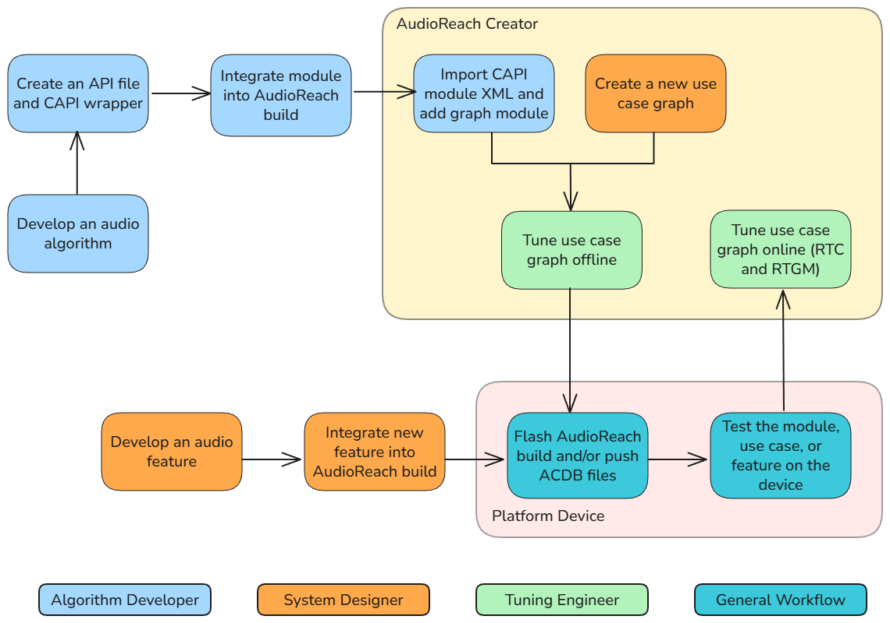

.. _dev_workflow:

Development Workflow
#####################

.. toctree::
   :maxdepth: 1
   :hidden:

   adding_modules
   capi_mod_dev

The AudioReach project envisions three different profiles of audio product developers:

	* **Algorithm Developer:** Develops audio algorithms and integrates them into AudioReach by converting them into modules.
	* **Tuning Engineer:** Tunes existing audio use cases in AudioReach to their exact specification.
	* **System Integrator:** Designs audio graph with necessary modules and develops software components in AudioReach in order to realize audio use cases and operations associated with the use cases, such as pause, seeking, volume control, and etc.

   
   Workflow diagram with color-coded developer workflows.
	
The AudioReach SDK and tools provides feature-rich capabilities to enable these audio developer types.
For example, developers can use the program **AudioReach Creator** to modify and tune audio use cases, and to add custom modules to use case graphs.
AudioReach Creator is an integral part of AudioReach and is a necessary tool for all of the workflow types listed above. 
For steps on how to install AudioReach Creator, please refer to the :ref:`arosp_overview` page, under the section "Steps to install ARC".

	* Note: To access the AudioReach Creator guide, after installing and opening the program, select the "User Guide" option on the start-up window.

Additionally, AudioReach developers can use a supported platform device, such as the Raspberry Pi 4 or the RB3 Gen2, to test new modules, use cases, or features. 
Please refer to the available :ref:`platform` for steps on how to setup an AudioReach build for the preferred device and run a basic use case.

Below is a description of each type of developer, and which documentation pages or resources they should take a look at to get started.

====================================
 
**Algorithm Developer**

An algorithm developer can integrate a custom audio algorithm into AudioReach in the form of a **module**. 
Once a custom module is developed, it can be compiled into an AudioReach build and then added to a use case graph in AudioReach Creator.
Then, the module can be tested by pushing the use case (or ACDB) files to a platform device and running the use case.
For a more in-depth guide on how to integrate a custom module into AudioReach and test, please refer to the page :ref:`adding_modules`.

The :ref:`available_modules` page contains the list of audio modules that are currently available on AudioReach.

====================================

**Tuning Engineer**

An audio tuning engineer will utilize the full capabilities of AudioReach Creator to tune audio use cases to their exact specifications by changing module properties 
such as volume, audio filtering, media format, and more.
Tuning engineers can take advantage of both "offline" and "online" tuning.

In offline tuning, a developer can change module properties (such as the volume or media format) in AudioReach Creator and save the use case in the form of ACDB files.
These ACDB files will then contain the use case with the updated module properties, which can be loaded onto the platform device to test the new calibration.

In online tuning, a developer can run an audio use case on the platform device and directly tune module properties while the use case is running, which is known as **Real-time Calibration (RTC)**.
To do this, the device must first be connected to the "online mode" of AudioReach Creator. Once AudioReach Creator is connected, running a use case on the device will cause the corresponding 
audio use case graph to appear in the AudioReach Creator graph view. Then, the developer can directly update the module properties in AudioReach Creator and hear the updated results in real time. 
For example, a developer can start a playback use case, increase the volume using the "Volume Control" module, set the changes, and hear the change in volume while the clip is running.

In some cases, modules can also be added and removed from the use case graph while the use case is running, which is known as **Real-time Graph Modification (RTGM)**. 
Online tuning allows the developer to modify the use case properties without re-uploading the ACDB files and rebooting the device.
Developers can also use integrated resource monitoring (IRM) to view latency and performance measurements while in online tuning mode.

Tuning engineers will likely want to take full advantage of the calibration tools in AudioReach Creator. For this, please refer to section 5 of the AudioReach Creator guide. 

====================================

**System Integrator**

A system integrator is responsible for developing and integrating software components which utilize AudioReach constructs and APIs to enable new audio use cases and their associated operations, such as pausing, seeking, and volume control. 
This role may also involve creating new use case graphs on which the use case software will operate. 
To successfully expand new features and functionalities into the intended product, system integrators must possess an in-depth knowledge of AudioReach constructs, software design, and relevant tools.

More information about the system integrator workflow, including explanations on how calibrations for audio operations are set in AudioReach, 
please check section 4 of the AudioReach Creator guide.
To learn more about the full design of AudioReach, please refer to the :ref:`design` pages.