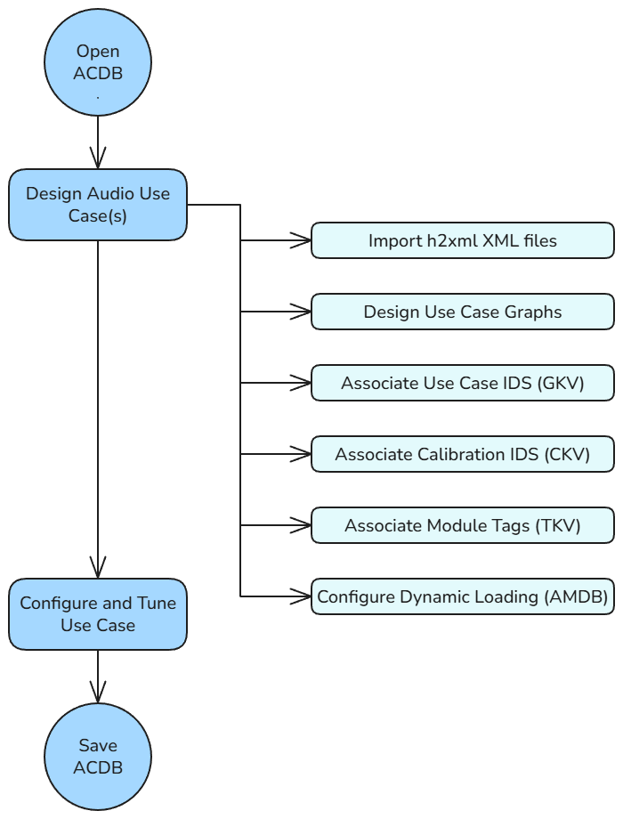
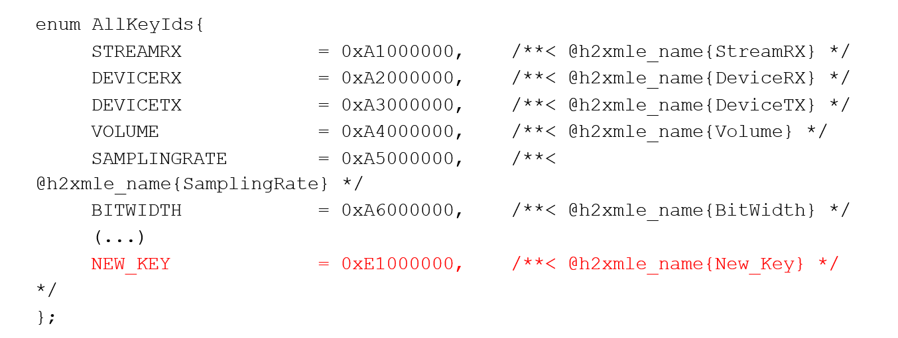
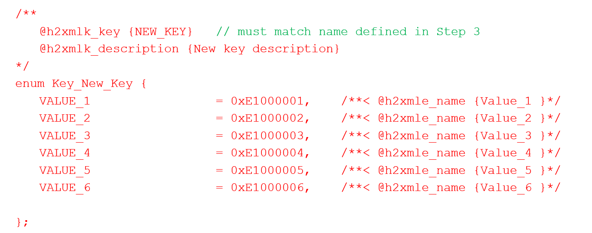
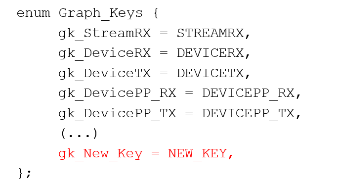
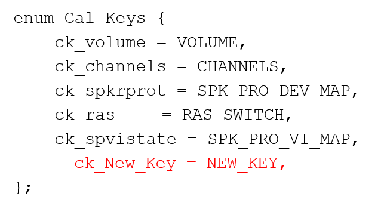
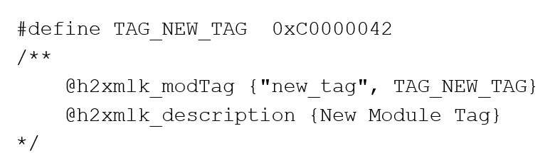
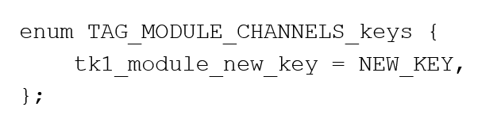

.. _system_workflow:

System Integrator Workflow
###########################

.. contents::
   :local:
   :depth: 2

Introduction
==============
This document is a high-level overview of the system integrator workflow. 
A system integrator utilizes AudioReach to design audio use case graph and develop software to operate on the use case graph. 
Before proceeding to rest of document, it is important for system integrator to first understand fundamental AudioReach graph 
composition and use case constructs. For high-level overviews of these concepts along with some examples, 
please refer to the :ref:`design_concept` page.

Workflow Overview
=================

   System Integrator Workflow Diagram

Import H2XML XML files
--------------------------
In AudioReach, H2XML definitions are used to generate metadata that can be leveraged
in ARC to create use cases. H2XML files are generated via annotations in the API files. Some examples of H2XML metadata include:

* CAPI module definitions
* Key-values and module tags, defined in kvh2xml.h
* Container properties
* Driver properties

Design use case graphs
--------------------------
The core task of the system designer is to create a system of graphs that satisfy the
product-specific use case requirements. The system designer should have some
knowledge of the tuning requirements for a device in order to utilize the best signal
processing topology for a particular use case. In many situations, the reference 
implementation may be adequate.

Associate GKV, CKV, TKV
---------------------------
To satisfy the driver-side logic, the system designer must associate GKVs, CKVs and
TKVs to leverage graphs and modules with minimal calibration entries. Some tuning
knowledge is required (for example, which modules should be sample rate-dependent
(useful when assigning CKVs)).
If necessary, the system designer may also create new key-values using the KVH2XML
header file.

Configure dynamic loading
-----------------------------
The system designer may optionally choose to configure whether each module is
loaded either at bootup or runtime.

Customizing KVs with KVH2XML
==============================

KVH2XML overview
--------------------
AudioReach defines a data-driven method of use case handling. Using
KVH2XML.h, H2XML tools, and the Discovery Wizard in ARC, a system designer can
define and manage custom keys and values.
The general steps to add or modify keys/key-values are:

1. Update driver software to include a new key/key-value to associate to a new use
case.

2. In ARC, import the updated key definitions and associate them to a new use case.

Adding a generic key
------------------------
In KVH2XML, keys are first defined as generic keys then later added as graph keys,
calibration keys, or module tags. The below images are examples used 
exclusively by Qualcomm. To add a generic key:

1. Open kvh2xml.h located in the audioreach-conf repository.
2. Add a new key ID to the AllKeyIds enum:

The key ID value will follow the format 0xFF000000.

3. Define the key values:

Adding a graph or calibration key
-------------------------------------
To add the key as a graph or calibration key (after adding as a generic key):

1. Using the key ID, add the generic key to the Graph_Keys enum:

   
Otherwise, if the new key is a calibration key, add it to the CAL-Keys enum:

2. Update the driver side logic to create a use case mapping for the new key.
3. After recompiling, the output XML file is automatically generated. Import the new
KVH2XML xml file using the Discovery Wizard. For details, see section 4.1 of the ARC guide.

Adding a module tag
-------------------
To add the key as a module tag (after adding as a generic key):

1. Open `kvh2xml.h <https://github.com/Audioreach/audioreach-conf/blob/master/qcom/kvh2xml.h>`__.
2. Add the new tag as a define in kvh2xml.h. Tag values follow the format 0xC00000FF:

   
3. Add one or more keys to associate with the module tag:

4. Update the driver side logic to utilize the new tag.

5. After recompiling, the output XML file is automatically generated. Import the new
KVH2XML xml file using the Discovery Wizard. For details, see section 4.1 of the ARC guide.

